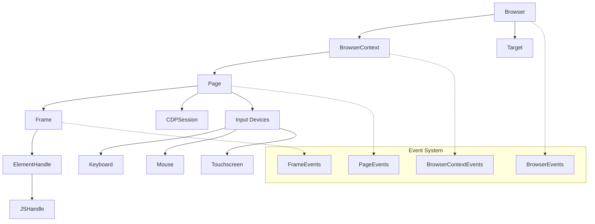
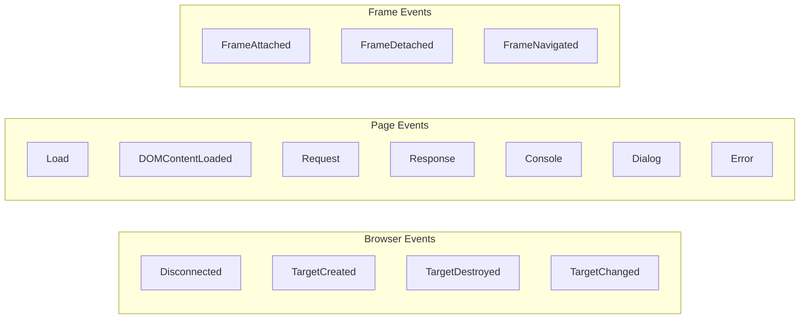

# Core API Module Documentation

## Overview

The Core API module forms the foundational layer of Puppeteer's browser automation framework, providing high-level abstractions for browser control, page manipulation, and DOM interaction. This module defines the primary interfaces and abstract classes that enable developers to programmatically control web browsers through the Chrome DevTools Protocol (CDP) and WebDriver BiDi.

## Architecture Overview

The Core API module follows a hierarchical architecture that mirrors the browser's structure, from browser instances down to individual DOM elements:



## Core Components

### Browser Management Layer

The browser management layer provides the top-level abstractions for controlling browser instances and contexts:

- **Browser**: The main browser instance that manages multiple browser contexts
- **BrowserContext**: Isolated browsing sessions with independent storage and cookies
- **Target**: Represents debuggable entities like pages, workers, or extensions

### Page Interaction Layer

The page interaction layer handles web page manipulation and content access:

- **Page**: Represents a single web page or tab within a browser context
- **Frame**: Represents individual frames within a page (including iframes)
- **ElementHandle**: Provides access to DOM elements with interaction capabilities
- **JSHandle**: Generic handle for JavaScript objects in the page context

### Input and Interaction

The input system provides programmatic control over user interactions:

- **Keyboard**: Simulates keyboard input and key combinations
- **Mouse**: Controls mouse movements, clicks, and drag operations
- **Touchscreen**: Handles touch-based interactions for mobile emulation

### Communication Layer

The communication layer manages the connection between Puppeteer and the browser:

- **CDPSession**: Direct interface to the Chrome DevTools Protocol
- **Target**: Represents debuggable browser targets

## Key Features

### 1. Browser Instance Management

The Browser class serves as the entry point for all browser operations:

```typescript
// Browser lifecycle management
const browser = await puppeteer.launch();
const context = await browser.createBrowserContext();
const page = await context.newPage();
await browser.close();
```

Key capabilities:
- Multiple browser context creation and management
- Page lifecycle control
- Extension installation and management
- Cookie and permission management
- Network condition emulation

### 2. Page Navigation and Content Manipulation

Pages provide comprehensive control over web page behavior:

```typescript
// Navigation and content
await page.goto('https://example.com');
await page.setContent('<html><body>Hello World</body></html>');
const content = await page.content();
```

Features include:
- Navigation with lifecycle event handling
- Content injection and extraction
- Screenshot and PDF generation
- Media emulation and viewport control
- JavaScript execution in page context

### 3. DOM Element Interaction

ElementHandle provides rich interaction capabilities with DOM elements:

```typescript
// Element interaction
const element = await page.$('button');
await element.click();
await element.type('Hello World');
const text = await element.evaluate(el => el.textContent);
```

Supported operations:
- Click, hover, and focus interactions
- Text input and form manipulation
- Drag and drop operations
- Element property access and modification
- Screenshot capture of specific elements

### 4. Event-Driven Architecture

All core components implement an event-driven architecture for reactive programming:

```typescript
// Event handling
page.on('request', request => console.log('Request:', request.url()));
page.on('response', response => console.log('Response:', response.status()));
browser.on('targetcreated', target => console.log('New target:', target.type()));
```

## Event System

The Core API implements a comprehensive event system that allows developers to react to browser and page events:



## Error Handling and Lifecycle Management

The Core API provides robust error handling and resource management:

- **Automatic Disposal**: Resources are automatically cleaned up when contexts are destroyed
- **Connection Management**: Handles network disconnections and reconnections gracefully
- **Timeout Controls**: Configurable timeouts for all operations
- **Error Propagation**: Comprehensive error reporting with context information

## Sub-Modules

The Core API module is organized into several specialized sub-modules, each handling specific aspects of browser automation:

### [Input and Interaction](input_and_interaction.md)
Provides comprehensive input device simulation and user interaction capabilities:
- **Keyboard**: Text input, key combinations, and special key handling
- **Mouse**: Click operations, drag and drop, hover interactions
- **Touchscreen**: Touch-based interactions for mobile device emulation
- **TouchHandle**: Individual touch point management
- **Dialog**: Browser dialog handling (alerts, confirms, prompts)

### [Network Handling](network_handling.md)
Manages HTTP communication and network-related operations:
- **HTTPRequest**: Request interception, modification, and analysis
- **HTTPResponse**: Response inspection and content access

### [Locators](locators.md)
Advanced element selection and waiting strategies:
- **Locator**: Base locator interface with retry and wait capabilities
- **NodeLocator**: DOM element-based locators with CSS/XPath support
- **FilteredLocator**: Conditional element filtering
- **MappedLocator**: Element transformation and mapping
- **FunctionLocator**: Custom function-based element location

## Integration Points

The Core API module integrates with several other modules in the Puppeteer ecosystem:

- **CDP Implementation**: Provides Chrome DevTools Protocol implementations
- **BiDi Implementation**: Offers WebDriver BiDi protocol support
- **Browser Management**: Browser installation and launching capabilities
- **Query Handlers**: Custom element selection strategies
- **Common Utilities**: Shared utilities and helper functions

## Usage Patterns

### Basic Browser Automation

```typescript
import puppeteer from 'puppeteer';

const browser = await puppeteer.launch();
const page = await browser.newPage();
await page.goto('https://example.com');
await page.screenshot({ path: 'example.png' });
await browser.close();
```

### Advanced Page Interaction

```typescript
// Wait for elements and interact
await page.waitForSelector('#submit-button');
await page.click('#submit-button');

// Handle dialogs
page.on('dialog', async dialog => {
  await dialog.accept();
});

// Evaluate JavaScript
const result = await page.evaluate(() => {
  return document.title;
});
```

### Multi-Context Operations

```typescript
// Create isolated contexts
const context1 = await browser.createBrowserContext();
const context2 = await browser.createBrowserContext();

const page1 = await context1.newPage();
const page2 = await context2.newPage();

// Each context has isolated storage
await context1.setCookie({ name: 'session', value: 'user1' });
await context2.setCookie({ name: 'session', value: 'user2' });
```

## Performance Considerations

The Core API is designed with performance in mind:

- **Lazy Loading**: Components are instantiated only when needed
- **Connection Pooling**: Efficient reuse of CDP connections
- **Event Batching**: Multiple events are batched for better performance
- **Memory Management**: Automatic cleanup of unused handles and resources

## API Reference

### Core Classes

#### Browser
The main browser instance that manages browser contexts and pages.

**Key Methods:**
- `createBrowserContext(options?)`: Creates a new isolated browser context
- `newPage()`: Creates a new page in the default context
- `pages()`: Returns all open pages across all contexts
- `targets()`: Returns all active targets
- `close()`: Closes the browser and all associated pages
- `disconnect()`: Disconnects from the browser without closing it

**Events:**
- `disconnected`: Browser connection lost
- `targetcreated`: New target (page/worker) created
- `targetdestroyed`: Target destroyed
- `targetchanged`: Target URL or properties changed

#### BrowserContext
Isolated browsing session with independent storage and settings.

**Key Methods:**
- `newPage()`: Creates a new page in this context
- `pages()`: Returns all pages in this context
- `cookies()`: Gets all cookies in the context
- `setCookie(...cookies)`: Sets cookies in the context
- `overridePermissions(origin, permissions)`: Grants permissions for an origin
- `close()`: Closes the context and all its pages

#### Page
Represents a single web page or tab.

**Key Methods:**
- `goto(url, options?)`: Navigates to a URL
- `$(selector)`: Finds first element matching selector
- `$$(selector)`: Finds all elements matching selector
- `evaluate(pageFunction, ...args)`: Executes JavaScript in page context
- `screenshot(options?)`: Takes a screenshot
- `pdf(options?)`: Generates a PDF
- `setViewport(viewport)`: Sets the page viewport
- `waitForSelector(selector, options?)`: Waits for element to appear

**Events:**
- `load`: Page finished loading
- `domcontentloaded`: DOM content loaded
- `request`: HTTP request made
- `response`: HTTP response received
- `console`: Console message logged
- `dialog`: JavaScript dialog appeared

#### Frame
Represents a frame within a page (including the main frame).

**Key Methods:**
- `$(selector)`: Finds element within frame
- `evaluate(pageFunction, ...args)`: Executes JavaScript in frame context
- `goto(url, options?)`: Navigates the frame
- `waitForSelector(selector, options?)`: Waits for element in frame
- `content()`: Gets the frame's HTML content
- `setContent(html, options?)`: Sets the frame's HTML content

#### ElementHandle
Provides access to DOM elements with interaction capabilities.

**Key Methods:**
- `click(options?)`: Clicks the element
- `type(text, options?)`: Types text into the element
- `press(key, options?)`: Presses a key
- `hover()`: Hovers over the element
- `focus()`: Focuses the element
- `screenshot(options?)`: Takes screenshot of element
- `boundingBox()`: Gets element's bounding box
- `evaluate(pageFunction, ...args)`: Executes function with element as argument

#### JSHandle
Generic handle for JavaScript objects in the page context.

**Key Methods:**
- `evaluate(pageFunction, ...args)`: Executes function with handle as argument
- `getProperty(propertyName)`: Gets a property of the object
- `getProperties()`: Gets all enumerable properties
- `jsonValue()`: Serializes the object to JSON
- `dispose()`: Releases the handle

### Configuration Options

#### BrowserContextOptions
```typescript
interface BrowserContextOptions {
  proxyServer?: string;
  proxyBypassList?: string[];
  downloadBehavior?: DownloadBehavior;
}
```

#### GoToOptions
```typescript
interface GoToOptions {
  timeout?: number;
  waitUntil?: 'load' | 'domcontentloaded' | 'networkidle0' | 'networkidle2';
  referer?: string;
  referrerPolicy?: string;
}
```

#### ScreenshotOptions
```typescript
interface ScreenshotOptions {
  type?: 'png' | 'jpeg' | 'webp';
  quality?: number;
  fullPage?: boolean;
  clip?: BoundingBox;
  omitBackground?: boolean;
  encoding?: 'base64' | 'binary';
  path?: string;
}
```

## Best Practices

1. **Resource Management**: Always dispose of handles and close browsers when done
2. **Error Handling**: Implement proper try-catch blocks for all async operations
3. **Event Listeners**: Remove event listeners when they're no longer needed
4. **Timeout Configuration**: Set appropriate timeouts for operations based on your use case
5. **Context Isolation**: Use separate browser contexts for independent test scenarios
6. **Performance**: Use `page.waitForSelector()` instead of polling with `page.$()`
7. **Memory**: Dispose of ElementHandles and JSHandles when no longer needed
8. **Debugging**: Use `page.on('console', msg => console.log(msg.text()))` for debugging

## Conclusion

The Core API module provides a comprehensive foundation for browser automation, offering both high-level convenience methods and low-level control when needed. Its event-driven architecture, robust error handling, and extensive feature set make it suitable for a wide range of automation scenarios, from simple web scraping to complex end-to-end testing.