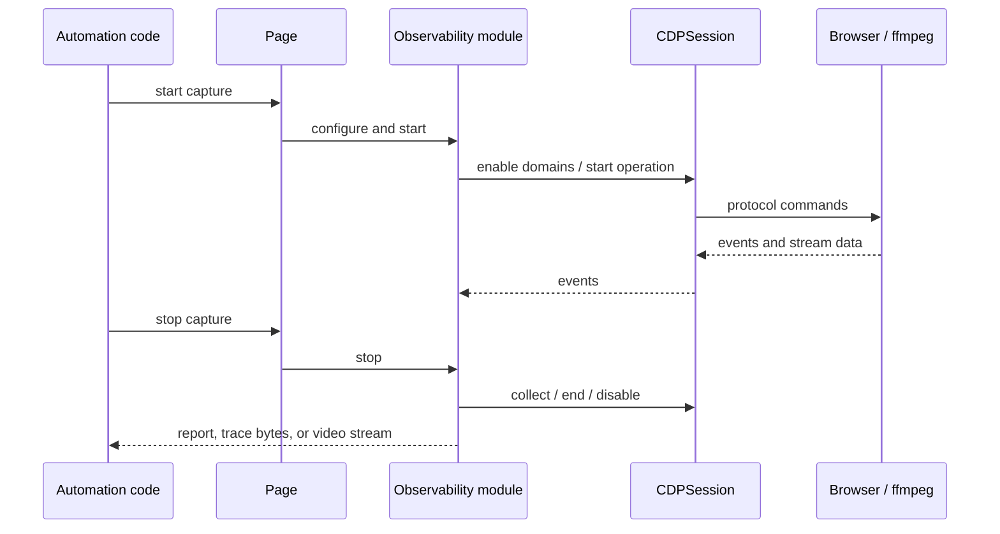

# Coverage, tracing, and recording

The `coverage_tracing_and_recording` module groups Puppeteer's CDP-backed observability and media-capture facilities. It reports JavaScript/CSS usage, exports browser performance traces, records page screencasts through ffmpeg, and exposes structured console diagnostics.

## Architecture overview

```mermaid
flowchart TB
  API[Page public API]
  API --> C[Coverage]
  API --> T[Tracing]
  API --> R[ScreenRecorder]
  API --> M[ConsoleMessage]
  C --> S[CDPSession]
  T --> S
  R --> S
  M --> F[Frame + JSHandle model]
  S --> CDP[Chrome DevTools Protocol]
  CDP --> COV[Profiler / Debugger / CSS / DOM]
  CDP --> TRACE[Tracing stream]
  CDP --> CAST[Page screencast frames]
  R --> FF[ffmpeg child process]
  C --> REPORT[CoverageEntry[]]
  T --> TRACEFILE[Uint8Array or trace path]
  FF --> VIDEO[WebM / GIF / MP4]
```

The module sits above the CDP transport/session layer and below the public page API. The CDP implementation owns browser/page targets and protocol clients; this module translates protocol events into consumer-oriented reports and streams. See [protocol transport and session infrastructure](protocol_transport_and_session_infrastructure.md) for the lower-level session lifecycle.

## Sub-modules

| Sub-module | Purpose |
| --- | --- |
| [Coverage collection](coverage_tracing_and_recording_coverage.md) | Collects JavaScript and CSS execution/rule usage and normalizes ranges. |
| [Tracing](coverage_tracing_and_recording_tracing.md) | Starts/stops CDP timeline tracing and consumes the resulting stream. |
| [Screen recording](coverage_tracing_and_recording_screen_recording.md) | Converts screencast frames to encoded video using ffmpeg. |
| [Console diagnostics](coverage_tracing_and_recording_console_diagnostics.md) | Represents console event type, text, arguments, and source locations. |

## Cross-cutting lifecycle



## Operational considerations

- Coverage and tracing are stateful and reject invalid start/stop sequences.
- Navigation can reset coverage maps when `resetOnNavigation` is enabled.
- Trace output may be held in memory or written through the configured path.
- Screen recording requires an executable ffmpeg and an available page screencast client; disconnects trigger cleanup.
- Reports and diagnostics retain source URLs and offsets where the browser provides them, while anonymous or injected resources may be intentionally filtered.
