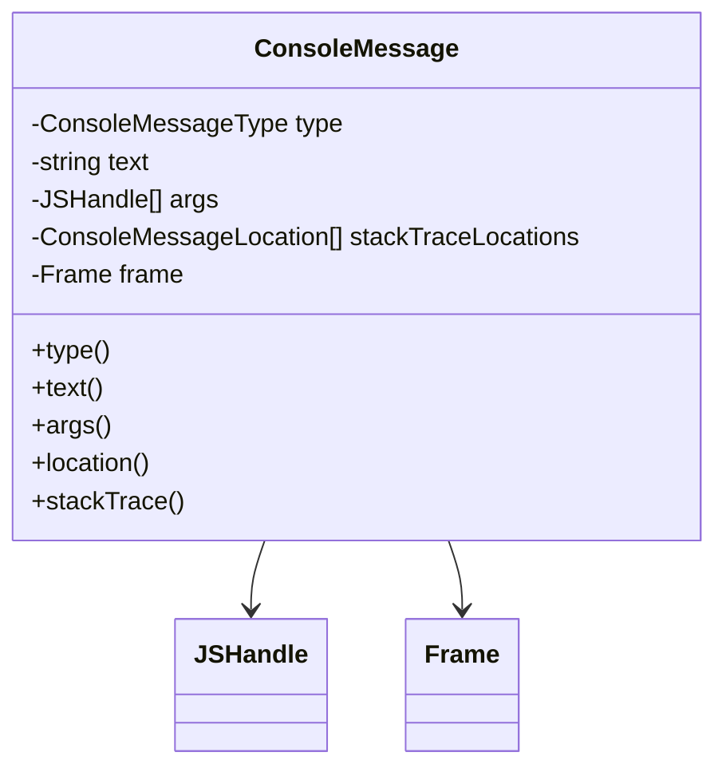

# Console diagnostics

`packages/puppeteer-core/src/common/ConsoleMessage.ts` is the immutable value object exposed through a page's `console` event. It preserves browser console semantics while keeping structured handles and source locations available to callers.

## Data model

- `type()` returns the console category, such as `log`, `warn`, `error`, `trace`, or `table`.
- `text()` returns the rendered message text.
- `args()` returns the original arguments as `JSHandle[]`, allowing structured inspection.
- `location()` returns the first stack location, or falls back to the owning frame URL.
- `stackTrace()` returns all recorded source locations.

The message model is shared by backend event translation and is independent of coverage/tracing capture. Handle behavior is documented in [handles, realms, and locators API](handles_realms_and_locators_api.md).
