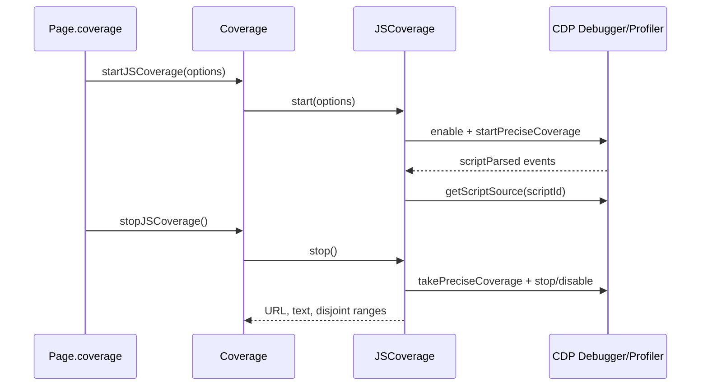

# Coverage collection

`packages/puppeteer-core/src/cdp/Coverage.ts` implements JavaScript and CSS usage coverage over a CDP session. It converts browser-native usage events and nested ranges into stable `CoverageEntry` records containing a resource URL, source text, and disjoint used byte ranges.

## Components

- `Coverage` is the page-facing coordinator. It owns one `JSCoverage` and one `CSSCoverage`, forwards CDP client replacement through `updateClient`, and exposes the four start/stop methods used by `Page.coverage`.
- `JSCoverage` enables `Profiler` and `Debugger`, captures script metadata and source on `Debugger.scriptParsed`, and produces ranges from `Profiler.takePreciseCoverage`.
- `CSSCoverage` enables `DOM` and `CSS`, captures stylesheet metadata/source on `CSS.styleSheetAdded`, and produces ranges from `CSS.stopRuleUsageTracking`.
- `convertToDisjointRanges` scans sorted range boundaries with a hit-count stack, intersecting nested ranges and merging adjacent used sections.

## JavaScript lifecycle

`resetOnNavigation` clears collected script maps when execution contexts are cleared. Puppeteer-injected URLs are excluded, anonymous scripts are excluded unless explicitly requested, and raw V8 entries are optionally preserved.

## CSS lifecycle

CSS collection follows the same start/stop contract, but tracks stylesheet IDs and rule usage. Stylesheets without a `sourceURL` are ignored. The final report aggregates rule ranges by stylesheet before normalizing them.

Coverage must not be started twice or stopped while disabled; both implementations enforce this with assertions. The CDP session is supplied by the backend's page/session integration described in [protocol transport and session infrastructure](protocol_transport_and_session_infrastructure.md).
