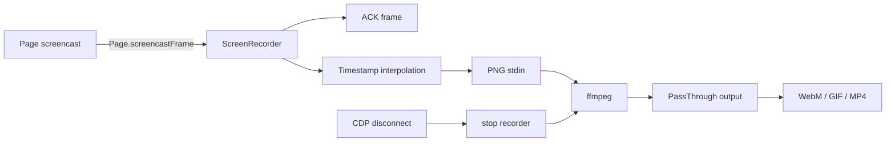

# Screen recording

`packages/puppeteer-core/src/node/ScreenRecorder.ts` turns a page screencast into a WebM, GIF, or MP4 stream by piping PNG frames to an external `ffmpeg` process.

## Components and flow

`ScreenRecorder` is a `PassThrough` stream. Its constructor verifies the configured ffmpeg executable, creates the output directory when needed, builds format and video-filter arguments, and spawns ffmpeg with PNG input on stdin and encoded output on stdout.

The page CDP client supplies `Page.screencastFrame` events. Frames are acknowledged immediately, timestamped frames are buffered in pairs, and the previous frame is repeated enough times to approximate the requested FPS. Filters support speed, crop, scale, and format-specific processing. `stop` stops the page screencast, flushes/repeats the final frame, closes ffmpeg stdin, and waits for process completion.

`ScreenRecorderOptions` controls ffmpeg path, FPS, looping, delay, quality, palette colors, scaling, cropping, overwrite behavior, and output path. The recorder is guarded against duplicate stop/write operations and supports async disposal.
