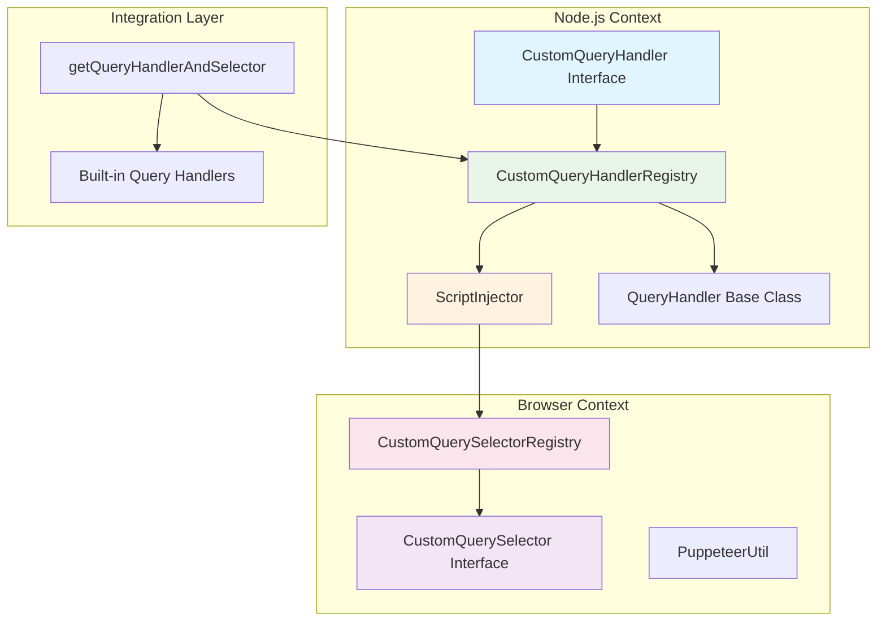
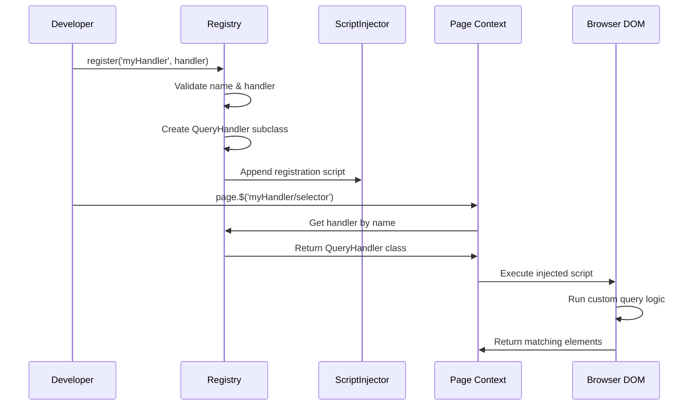
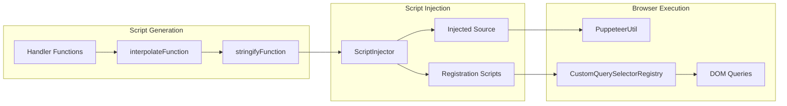
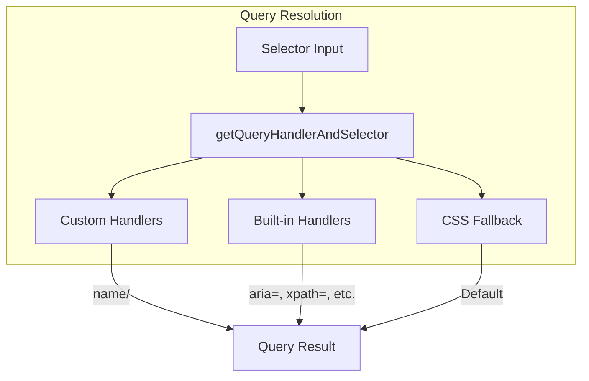

# Custom Query System

The Custom Query System is a powerful extensibility mechanism in Puppeteer that allows developers to register custom query handlers for element selection. This system enables the creation of domain-specific selectors that can be used alongside built-in query handlers like CSS, XPath, and ARIA selectors.

## Overview

The custom query system provides a framework for extending Puppeteer's element selection capabilities by allowing developers to define custom logic for finding elements in the DOM. Custom query handlers are registered with a unique name and can be invoked using the syntax `<name>/<selector>` in any Puppeteer method that accepts selectors.

## Architecture



## Core Components

### CustomQueryHandler Interface

The `CustomQueryHandler` interface defines the contract for custom query implementations:

```typescript
interface CustomQueryHandler {
  queryOne?: (node: Node, selector: string) => Node | null;
  queryAll?: (node: Node, selector: string) => Iterable<Node>;
}
```

**Key Features:**
- At least one of `queryOne` or `queryAll` must be implemented
- Functions are serialized and injected into the browser context
- Support for both synchronous and asynchronous operations

### CustomQueryHandlerRegistry

The registry manages the lifecycle of custom query handlers:

```typescript
class CustomQueryHandlerRegistry {
  register(name: string, handler: CustomQueryHandler): void
  unregister(name: string): void
  get(name: string): typeof QueryHandler | undefined
  names(): string[]
  clear(): void
}
```

**Registration Process:**
1. Validates handler name (only `[a-zA-Z]` characters allowed)
2. Ensures at least one query method is implemented
3. Creates a specialized `QueryHandler` subclass
4. Generates browser-side registration script
5. Injects script via `ScriptInjector`

## Data Flow



## Script Injection System

The custom query system relies on the `ScriptInjector` to manage browser-side code:



**Script Injection Process:**
1. Handler functions are serialized using `stringifyFunction`
2. Placeholders are replaced using `interpolateFunction`
3. Registration script is generated and stored
4. Script is appended to the injected source bundle
5. Browser context receives updated script on next injection

## Integration with Query System

The custom query system integrates seamlessly with Puppeteer's built-in query handlers:



**Query Resolution Priority:**
1. Custom query handlers (checked first)
2. Built-in query handlers (aria, pierce, xpath, text)
3. P-selector parsing attempt
4. CSS selector fallback

## Browser-Side Implementation

In the browser context, custom query handlers are managed by the `CustomQuerySelectorRegistry`:

```typescript
class CustomQuerySelectorRegistry {
  register(name: string, handler: CustomQueryHandler): void
  get(name: string): CustomQuerySelector | undefined
  unregister(name: string): void
  clear(): void
}
```

**Browser-Side Features:**
- Automatic method completion (if only one method is provided)
- Consistent interface with `querySelector` and `querySelectorAll`
- Integration with `PuppeteerUtil` for advanced DOM operations

## Usage Examples

### Basic Custom Handler

```typescript
// Register a custom handler for data attributes
Puppeteer.customQueryHandlers.register('data', {
  queryOne: (node, selector) => {
    return node.querySelector(`[data-testid="${selector}"]`);
  }
});

// Usage
const element = await page.$('data/submit-button');
```

### Advanced Handler with Both Methods

```typescript
// Register a handler for component selectors
Puppeteer.customQueryHandlers.register('component', {
  queryOne: (node, selector) => {
    return node.querySelector(`[data-component="${selector}"]`);
  },
  queryAll: (node, selector) => {
    return node.querySelectorAll(`[data-component="${selector}"]`);
  }
});

// Usage
const components = await page.$$('component/modal');
```

## Error Handling

The system includes comprehensive error handling:

- **Registration Errors**: Invalid names, missing methods, duplicate registrations
- **Runtime Errors**: Serialization failures, execution errors in browser context
- **Cleanup Errors**: Failed unregistration attempts

## Performance Considerations

- **Script Injection**: Handlers are injected once and reused across page navigations
- **Serialization**: Function serialization adds overhead during registration
- **Browser Execution**: Custom logic runs in the browser context for optimal performance

## Dependencies

The custom query system depends on several core modules:

- **[base_query_system](base_query_system.md)**: Provides the `QueryHandler` base class and core query infrastructure
- **[common_utilities](common_utilities.md)**: Utilizes function serialization utilities and assertion helpers
- **[core_api](core_api.md)**: Integrates with `Page`, `Frame`, and `ElementHandle` for element selection

## Security Considerations

- Function serialization requires careful validation to prevent code injection
- Custom handlers execute with full DOM access in the browser context
- Registration is limited to alphanumeric names to prevent selector conflicts

## Future Enhancements

The custom query system is designed for extensibility and may support:
- Async custom query handlers
- Handler composition and chaining
- Performance monitoring and optimization
- Enhanced debugging capabilities

---

*This documentation covers the custom query system's architecture, implementation, and usage patterns. For related query functionality, see [base_query_system](base_query_system.md) and [built_in_handlers](built_in_handlers.md).*