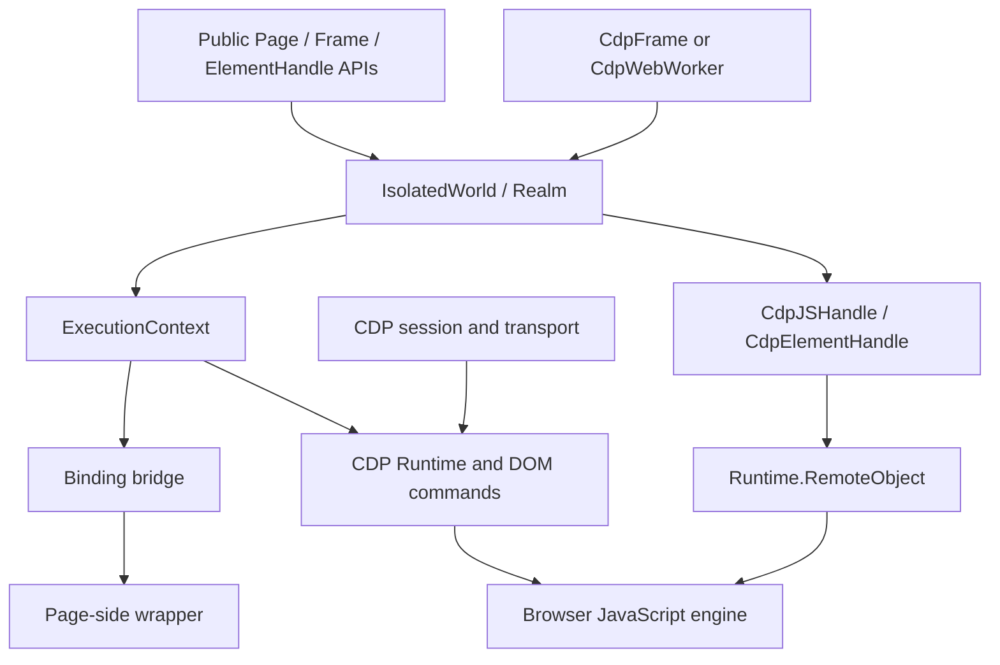
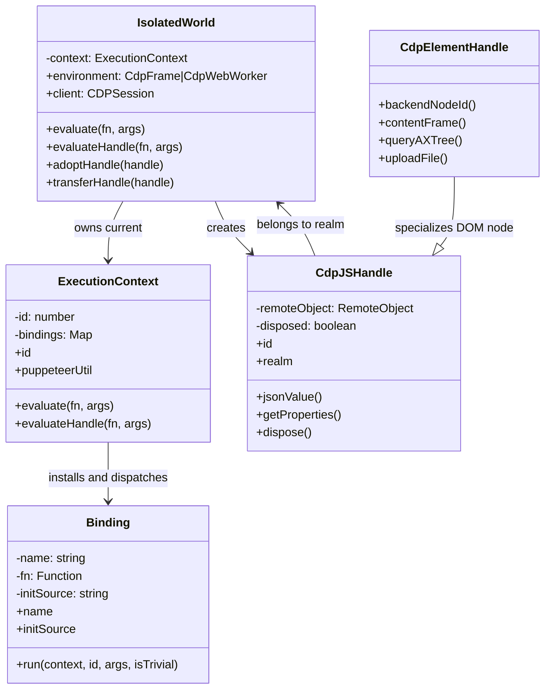
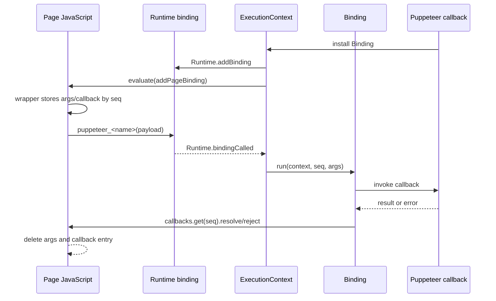
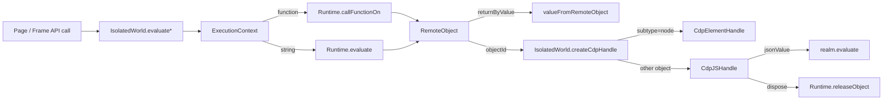
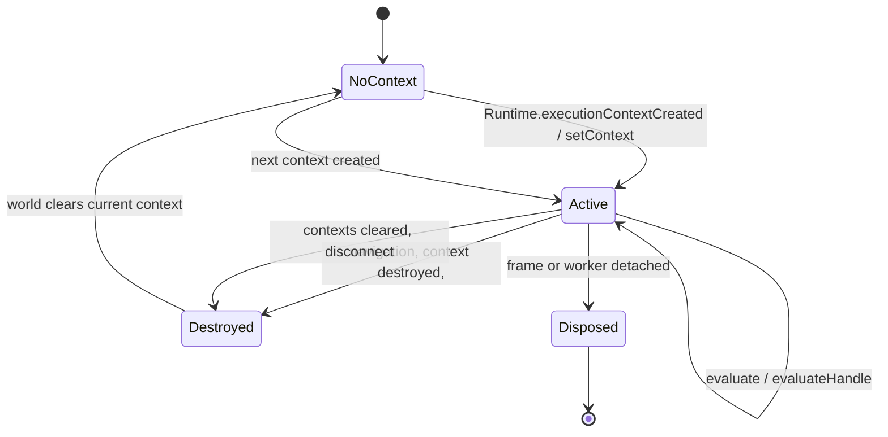

# Execution contexts and handles

## Purpose

The `execution_contexts_and_handles` module is Puppeteer’s CDP runtime bridge. It maps a browser-side JavaScript execution context to a Puppeteer `Realm`, evaluates functions and expressions through CDP, represents non-serializable values as `JSHandle`/`ElementHandle` objects, and manages the lifetime of those references as frames, documents, and workers change.

It is an implementation layer beneath the protocol-neutral automation API. Public page, frame, locator, and element APIs ultimately use these objects to run JavaScript, retain DOM nodes, pass values between realms, and expose Node.js functions to page code. See [handles, realms, and locators](handles_realms_and_locators_api_realms_and_js_handles.md) for the shared API abstractions and [page and frame lifecycle](page_and_frame_lifecycle_frames.md) for frame ownership and navigation.

## Position in the system



The transport/session layer supplies `CDPSession` and command/event delivery; it is documented in [protocol transport and session infrastructure](protocol_transport_and_session_infrastructure.md). Frame creation, navigation, and world assignment are owned by the CDP page/frame lifecycle; this module consumes those worlds rather than discovering frames itself.

## Component architecture



### IsolatedWorld

`IsolatedWorld` is the realm-facing owner for a frame or worker. It stores the current `ExecutionContext`, exposes the owning environment and CDP client, forwards context/console/binding events, and reruns registered wait tasks when a new context appears. It supports both the main world and Puppeteer’s utility world for frames; a worker uses its main realm.

Evaluation is deliberately context-aware: if a context is available, the call is scheduled immediately; otherwise the world waits for the next `context` event. This prevents callers from racing document creation while still allowing navigation to replace the context.

`adoptHandle` resolves a DOM backend node in the destination execution context and returns a new handle. `transferHandle` returns same-realm handles unchanged, passes primitive remote values through, or resolves and disposes a cross-realm DOM handle.

### ExecutionContext

`ExecutionContext` represents one CDP `Runtime.ExecutionContextDescription`. Its `id` is used in `Runtime.evaluate`, `Runtime.callFunctionOn`, `DOM.resolveNode`, and binding event filtering. The context listens for `Runtime.executionContextDestroyed`, `Runtime.executionContextsCleared`, console events, binding events, and session disconnection.

`evaluate` requests `returnByValue`; serializable values are converted from `RemoteObject`. `evaluateHandle` requests a retained remote object and delegates construction to the world, producing either a `CdpJSHandle` or a `CdpElementHandle` when the remote subtype is `node`. Function arguments are converted to CDP call arguments, including special values such as `bigint`, `-0`, `NaN`, and infinities. Handles must belong to the same world and must not already be disposed.

Navigation-related CDP errors are normalized to “Execution context was destroyed, most likely because of a navigation.” This gives callers and wait tasks a stable failure mode independent of the underlying CDP wording.

### Handles

`CdpJSHandle` retains a `Runtime.RemoteObject`. Primitive values have no `objectId` and can be converted locally; object handles use `Runtime.getProperties`, `Runtime.releaseObject`, or a follow-up evaluation. `jsonValue()` serializes a referenced object through the owning realm and fails if the object cannot be serialized.

`CdpElementHandle` wraps a `CdpJSHandle` whose remote subtype is `node`. In addition to inherited evaluation and disposal, it resolves `backendNodeId`, finds an iframe’s `CdpFrame`, adopts accessibility-tree nodes, uploads files through DOM commands, and invokes browser autofill. DOM operations are guarded against disposed handles and are tied to the handle’s frame/world.

### Bindings and injected utilities

`ExecutionContext.puppeteerUtil` lazily installs the internal ARIA query bindings and injects Puppeteer’s utility script. `addPageBinding` creates a page-side wrapper that stores arguments and callbacks by sequence number, calls the CDP-prefixed binding, and returns a promise.

When CDP reports `Runtime.bindingCalled`, `ExecutionContext` parses the payload and dispatches the matching `Binding`. Trivial arguments are already serializable. For non-trivial arguments, the binding retrieves the page-side argument handles, preserves node handles for the Node.js callback, disposes temporary handles, and resolves or rejects the page promise with the callback result/error.



## Evaluation and remote-object data flow



The important boundary is `returnByValue` versus retained reference. Returning by value is appropriate for serializable data. Returning a handle preserves identity and permits later property access or DOM interaction, but creates a remote resource that should be disposed.

## Context replacement and disposal



`setContext` disposes the previous context, subscribes to the new context, emits `context`, and reruns realm tasks. Context disposal clears the world’s current context and, for frames, clears the cached document handle. World disposal disposes its context, emits `disposed`, disposes the base `Realm`, and removes listeners. Handle release errors during navigation or browser closure are logged and swallowed because the remote object is already unreachable.

## Worker-specific path

`CdpWebWorker` creates an `IsolatedWorld` backed by the worker target and installs its first `ExecutionContext` from `Runtime.executionContextCreated`. Worker console events are converted to `CdpJSHandle` instances and forwarded to the owning target/page machinery. `mainRealm()` exposes the world to the public worker API.

Closing a dedicated worker evaluates `self.close()`. Service and shared workers instead require target closure followed by session detachment so the browser can stop the target cleanly. Session disconnection disposes the worker world.

```mermaid
flowchart TD
    Target[CdpWebWorker target] --> Session[Worker CDPSession]
    Session --> Created[Runtime.executionContextCreated]
    Created --> World[Worker IsolatedWorld]
    World --> EC[Worker ExecutionContext]
    EC --> Handles[CdpJSHandle / evaluate]
    Target --> Close{worker type}
    Close -->|dedicated| SelfClose[self.close()] --> Stop[worker stops]
    Close -->|service/shared| TargetClose[Target.closeTarget] --> Detach[Target.detachFromTarget]
```

## Operational guidance and invariants

- Keep handles scoped to their creating `IsolatedWorld`; passing a CDP handle into another context throws unless it is first adopted or transferred.
- Dispose handles that retain remote objects, including temporary property handles and utility handles. `Binding.run` demonstrates the required cleanup pattern.
- Treat navigation as a context replacement. A previously valid handle or `ExecutionContext` may become unusable even when the frame object remains valid.
- Prefer `evaluate` for serializable results and `evaluateHandle` for objects, nodes, maps, or values requiring follow-up operations.
- Do not use a disposed handle; operations that need a live DOM object are rejected by the element-handle disposal guard.
- ARIA query bindings and `puppeteerUtil` are lazy and installed once per execution context; a new context receives fresh bindings and injected utilities.

## Related modules

- [Handles, realms, and locators API](handles_realms_and_locators_api.md) — protocol-neutral handle, realm, and locator contracts.
- [Handles, realms, and locators: element handles](handles_realms_and_locators_api_element_handles.md) — public element operations built on these CDP handles.
- [Handles, realms, and locators: realms and JS handles](handles_realms_and_locators_api_realms_and_js_handles.md) — shared realm lifecycle, wait tasks, and handle semantics.
- [Page and frame lifecycle](page_and_frame_lifecycle.md) — frame/world creation, navigation, and detachment.
- [Page and frame lifecycle: frames](page_and_frame_lifecycle_frames.md) — CDP frame ownership and execution-world assignment.
- [Selector and waiting engine](selector_and_waiting_engine.md) — query handlers and waits that consume `puppeteerUtil` and realm evaluation.
- [Runtime lifecycle and scheduling](runtime_lifecycle_and_scheduling.md) — event emitters, task queues, deferred values, and disposal utilities.
- [Protocol transport and session infrastructure](protocol_transport_and_session_infrastructure.md) — CDP sessions and event/command delivery used by every component here.

## Source references

| Responsibility | Source |
| --- | --- |
| Context identity, evaluation, bindings, and disposal | `packages/puppeteer-core/src/cdp/ExecutionContext.ts` |
| Realm/world ownership and cross-context adoption | `packages/puppeteer-core/src/cdp/IsolatedWorld.ts` |
| Page-side binding wrapper and remote-value conversion | `packages/puppeteer-core/src/cdp/utils.ts` |
| Binding callback execution and cleanup | `packages/puppeteer-core/src/cdp/Binding.ts` |
| CDP JavaScript handles and remote-object release | `packages/puppeteer-core/src/cdp/JSHandle.ts` |
| DOM-node handles and backend-node operations | `packages/puppeteer-core/src/cdp/ElementHandle.ts` |
| Worker worlds, contexts, console forwarding, and close behavior | `packages/puppeteer-core/src/cdp/WebWorker.ts` |
