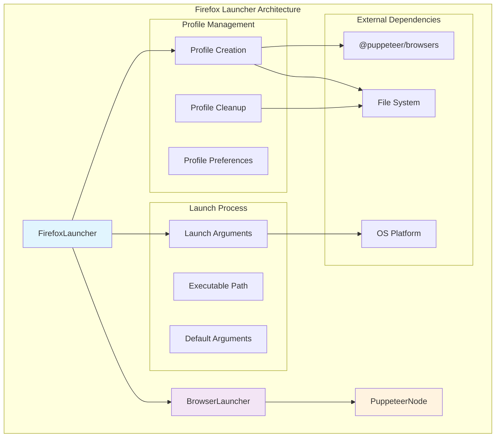
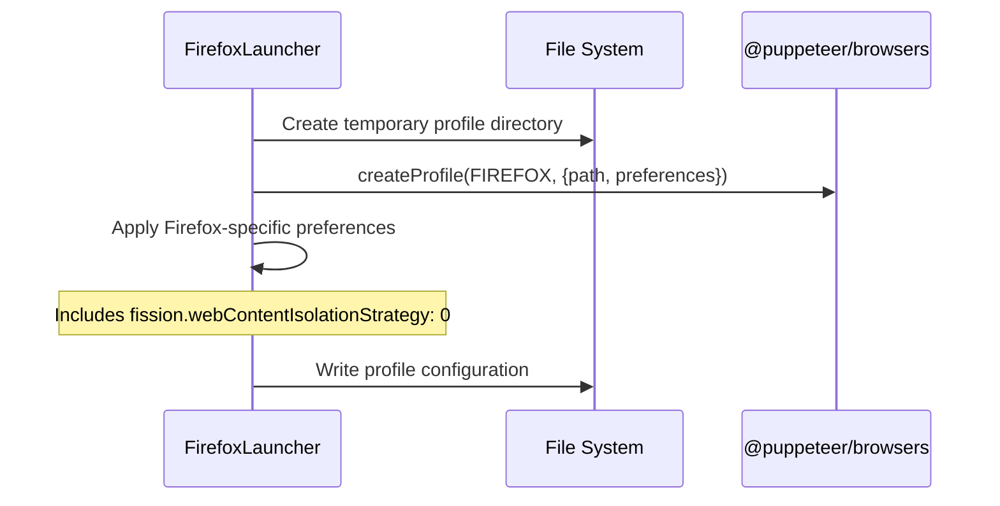
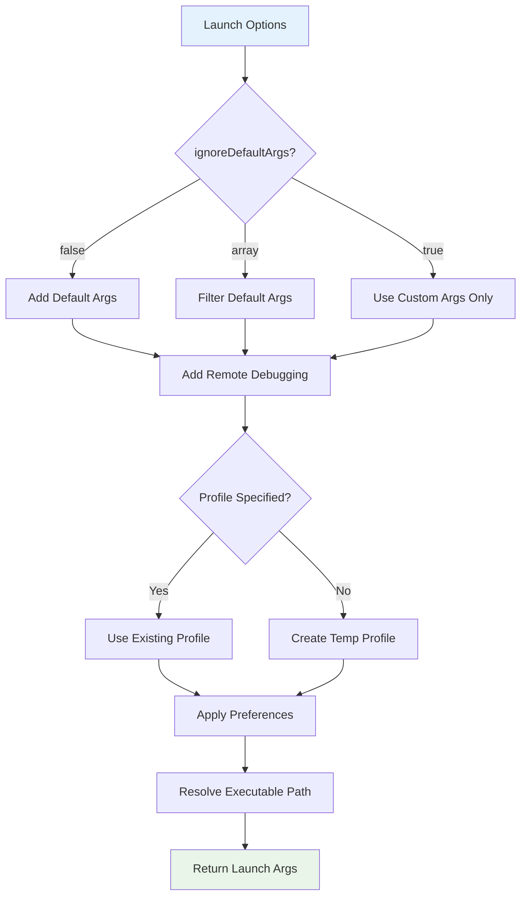
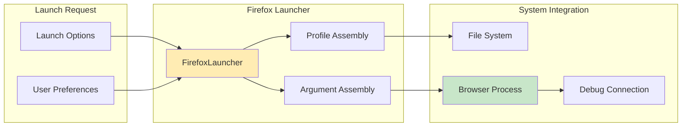
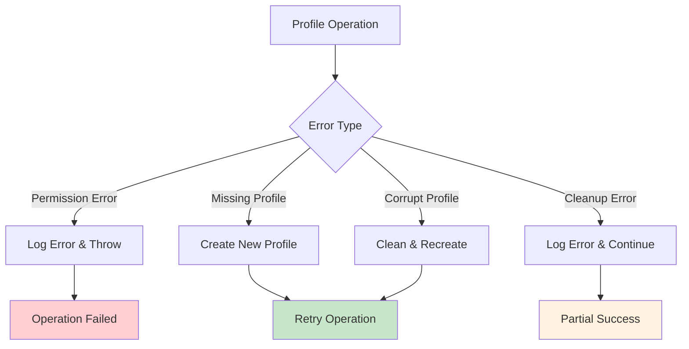
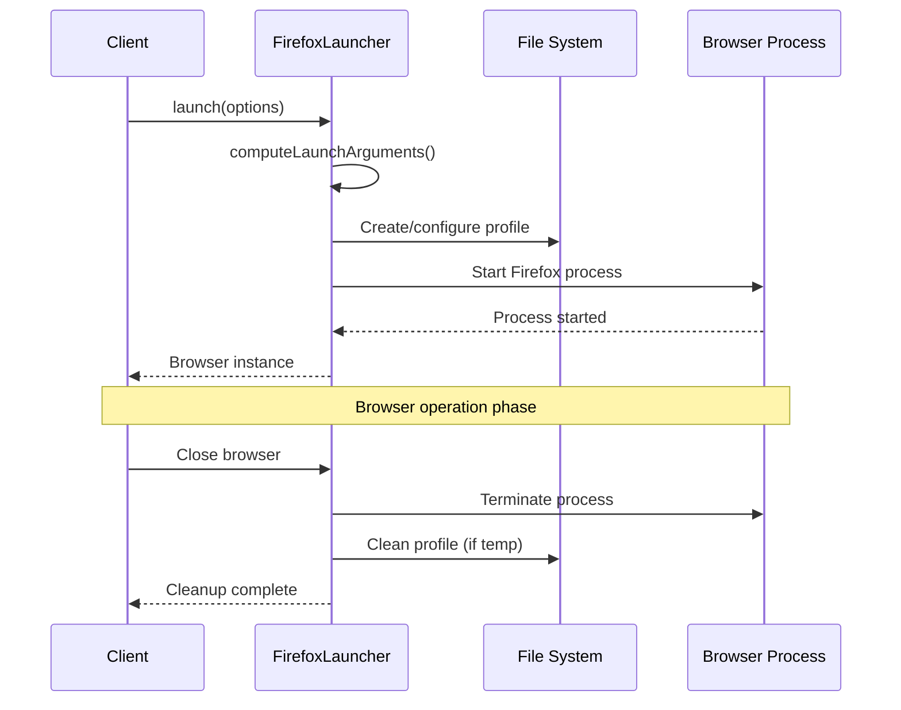

# Firefox Launcher Module

## Overview

The Firefox launcher module provides specialized browser launching capabilities for Mozilla Firefox within the Puppeteer ecosystem. As part of the broader [browser launching system](browser_launching.md), this module extends the base `BrowserLauncher` class to handle Firefox-specific configuration, profile management, and process lifecycle operations.

The `FirefoxLauncher` class serves as the primary interface for launching Firefox browser instances with custom preferences, profile configurations, and debugging capabilities. It integrates seamlessly with Puppeteer's automation framework while accommodating Firefox's unique architectural requirements and limitations.

## Architecture



## Core Components

### FirefoxLauncher Class

The main class responsible for Firefox browser lifecycle management:

```typescript
export class FirefoxLauncher extends BrowserLauncher {
  constructor(puppeteer: PuppeteerNode)
  static getPreferences(extraPrefsFirefox?: Record<string, unknown>): Record<string, unknown>
  computeLaunchArguments(options: LaunchOptions): Promise<ResolvedLaunchArgs>
  cleanUserDataDir(userDataDir: string, opts: {isTemp: boolean}): Promise<void>
  executablePath(_: unknown, validatePath?: boolean): string
  defaultArgs(options: LaunchOptions): string[]
}
```

## Key Features

### 1. Firefox Profile Management

The launcher handles Firefox profile creation and management with specialized preferences:



**Key Profile Features:**
- **Temporary Profile Creation**: Automatically creates isolated profiles for each browser instance
- **Custom Preferences**: Applies Firefox-specific preferences including content isolation settings
- **Profile Cleanup**: Handles both temporary and persistent profile cleanup with backup restoration

### 2. Launch Argument Resolution

The launcher constructs Firefox-specific command line arguments:



### 3. Platform-Specific Handling

Firefox launcher adapts to different operating system requirements:

| Platform | Specific Arguments | Purpose |
|----------|-------------------|---------|
| macOS | `--foreground` | Ensures proper window focus |
| Windows | `--wait-for-browser` | Synchronizes browser startup |
| Linux | Standard args | Default behavior |

### 4. Debugging and Development Support

The launcher provides comprehensive debugging capabilities:

- **Remote Debugging Port**: Configurable debugging port with automatic assignment
- **DevTools Integration**: Automatic DevTools panel opening when enabled
- **Headless Mode**: Support for headless operation with proper argument handling

## Integration Points

### Browser Launcher Base Class

The Firefox launcher extends the abstract `BrowserLauncher` class, inheriting:

- **Launch Process Management**: Browser process lifecycle handling
- **Connection Establishment**: WebSocket and pipe connection support
- **Error Handling**: Comprehensive error management and recovery
- **Timeout Management**: Configurable timeout handling for various operations

For detailed information about the base launcher functionality, see [Browser Launcher Core](browser_launcher_core.md).

### PuppeteerNode Integration

The launcher integrates with `PuppeteerNode` for:

- **Configuration Management**: Access to global Puppeteer configuration
- **Executable Path Resolution**: Browser binary location and validation
- **Version Management**: Browser version tracking and compatibility

For more details on PuppeteerNode integration, see [Puppeteer Node](puppeteer_node.md).

## Data Flow



## Configuration Options

### Launch Options

The Firefox launcher supports comprehensive launch configuration:

```typescript
interface FirefoxLaunchOptions extends LaunchOptions {
  extraPrefsFirefox?: Record<string, unknown>;  // Firefox-specific preferences
  debuggingPort?: number;                       // Remote debugging port
  userDataDir?: string;                         // Custom profile directory
  headless?: boolean;                           // Headless mode
  devtools?: boolean;                           // DevTools auto-open
  args?: string[];                              // Additional arguments
}
```

### Default Preferences

Firefox launcher applies these default preferences:

```typescript
{
  // Force single content process for mouse event compatibility
  'fission.webContentIsolationStrategy': 0,
  // Additional user preferences merged here
  ...extraPrefsFirefox
}
```

## Error Handling

### Profile Management Errors

The launcher handles various profile-related error scenarios:



### Executable Path Resolution

The launcher provides detailed error messages for executable path issues:

- **Missing Executable**: Clear guidance on installation requirements
- **Invalid Path**: Validation errors with configuration hints
- **Permission Issues**: File system permission error handling

## Process Lifecycle



## Performance Considerations

### Profile Management

- **Temporary Profiles**: Automatically cleaned up to prevent disk space issues
- **Profile Reuse**: Supports persistent profiles for faster subsequent launches
- **Preference Caching**: Efficient preference application and backup management

### Resource Management

- **Process Cleanup**: Proper browser process termination and resource cleanup
- **File System Operations**: Efficient profile creation and cleanup operations
- **Memory Usage**: Minimal memory footprint during profile management

## Dependencies

### External Dependencies

- **@puppeteer/browsers**: Profile creation and browser management utilities
- **Node.js File System**: Profile and temporary file management
- **Operating System**: Platform-specific argument and path handling

### Internal Dependencies

- **[Browser Launcher Core](browser_launcher_core.md)**: Base launcher functionality
- **[Common Utilities](common_utilities.md)**: Shared utility functions and error handling
- **[Transport Layer](transport_layer.md)**: Connection transport mechanisms

## Usage Examples

### Basic Firefox Launch

```typescript
const puppeteer = require('puppeteer');

const browser = await puppeteer.launch({
  browser: 'firefox',
  headless: true
});
```

### Custom Firefox Preferences

```typescript
const browser = await puppeteer.launch({
  browser: 'firefox',
  extraPrefsFirefox: {
    'network.cookie.cookieBehavior': 1,
    'privacy.trackingprotection.enabled': true
  }
});
```

### Development Mode with DevTools

```typescript
const browser = await puppeteer.launch({
  browser: 'firefox',
  devtools: true,
  headless: false,
  debuggingPort: 9222
});
```

## Limitations and Considerations

### Firefox-Specific Limitations

1. **CDP Protocol**: Firefox CDP support is deprecated; WebDriver BiDi is preferred
2. **Pipe Connections**: Not supported with Firefox and WebDriver BiDi
3. **Mouse Events**: Single content process required for proper mouse event handling
4. **Extension Support**: Limited compared to Chrome extension capabilities

### Platform Considerations

- **macOS**: Requires `--foreground` flag for proper window management
- **Windows**: Uses `--wait-for-browser` for synchronization
- **Linux**: Standard behavior with no special requirements

## Future Enhancements

### Planned Improvements

1. **WebDriver BiDi Integration**: Enhanced support for modern Firefox automation
2. **Profile Template System**: Reusable profile templates for common configurations
3. **Performance Optimization**: Faster profile creation and cleanup operations
4. **Enhanced Error Recovery**: More robust error handling and recovery mechanisms

### Migration Path

As Firefox transitions away from CDP support, the launcher is evolving to:

- Prioritize WebDriver BiDi connections
- Maintain backward compatibility where possible
- Provide clear migration guidance for existing implementations

## Related Documentation

- **[Browser Launching](browser_launching.md)**: Overall browser launching system
- **[Chrome Launcher](chrome_launcher.md)**: Chrome-specific launcher implementation
- **[Browser Launcher Core](browser_launcher_core.md)**: Base launcher functionality
- **[BiDi Implementation](bidi_implementation.md)**: WebDriver BiDi protocol support
- **[CDP Implementation](cdp_implementation.md)**: Chrome DevTools Protocol support