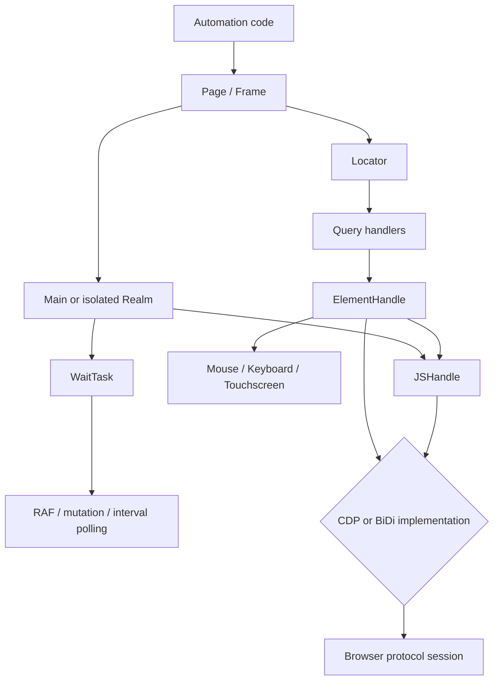
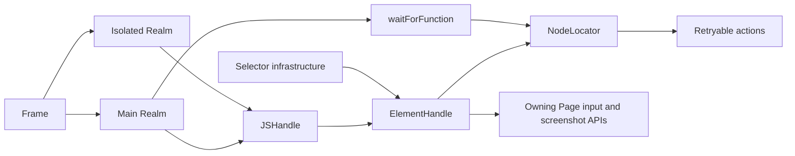
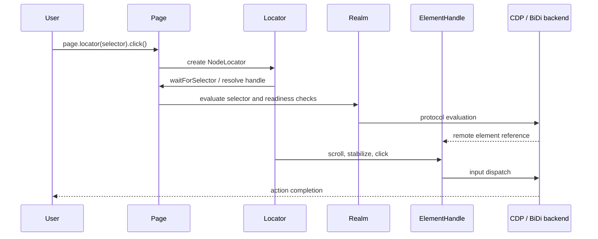

# Handles, realms, and locators API

## Introduction

The `handles_realms_and_locators_api` module is Puppeteer’s object-level automation layer. It represents remote JavaScript values and DOM nodes, executes code in frame and worker realms, waits for page-side conditions, resolves selectors, and provides reliable element actions through locators.

The module is protocol-neutral: CDP and WebDriver BiDi backends implement the abstract realm and handle operations, while this API layer defines shared semantics, typing, lifecycle rules, and action orchestration.

## Architecture overview

### Core relationships

## Sub-modules

The detailed responsibilities are separated as follows:

- [Element handles](handles_realms_and_locators_api_element_handles.md) — DOM references, querying, evaluation, geometry, visibility, input, screenshots, nested-frame coordinates, disposal, and conversion to locators.
- [Realms and JS handles](handles_realms_and_locators_api_realms_and_js_handles.md) — remote object references, property maps, evaluation, realm adoption/transfer, polling waits, and disposal on detachment.
- [Locators](handles_realms_and_locators_api_locators.md) — selector/function resolution, composition, readiness preconditions, retryable actions, cancellation, and locator races.

## Typical data flow

## Position in the system

This module sits above the shared selector/waiting runtime and below the public page/frame API. Its concrete operations are supplied by the [CDP backend automation implementation](cdp_backend_automation_implementation.md) and [WebDriver BiDi API adapters](webdriver_bidi_api_adapters.md), using the [protocol transport and session infrastructure](protocol_transport_and_session_infrastructure.md). Browser and frame ownership are described in [page_and_frame_api.md](page_and_frame_api.md).

## Lifecycle and correctness rules

- Handles retain remote objects and must be disposed when retained by application code.
- Navigation, frame detachment, or context destruction invalidates associated handles and terminates realm wait tasks.
- Isolated-realm execution is transparent to callers; returned handles are transferred back to the caller’s realm.
- Locator actions re-resolve and retry after stale or not-ready failures, subject to timeout and abort signal.
- Geometry-based actions account for visibility, viewport clipping, and nested iframe offsets.

