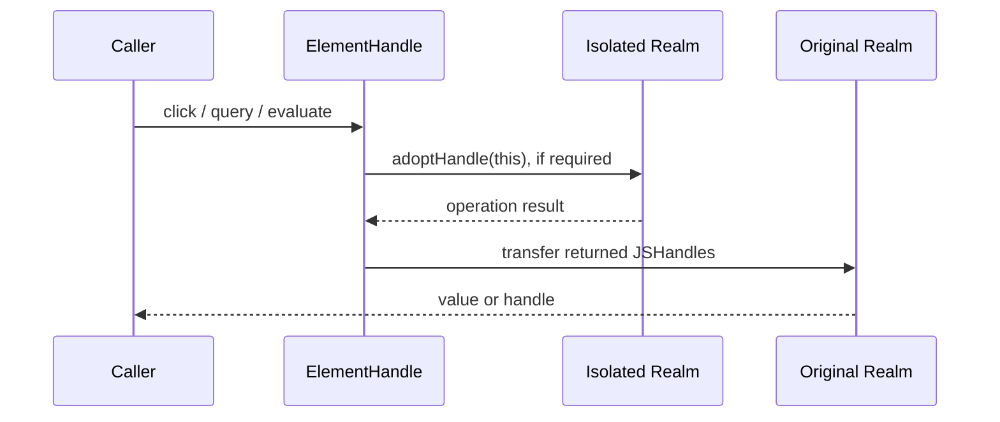
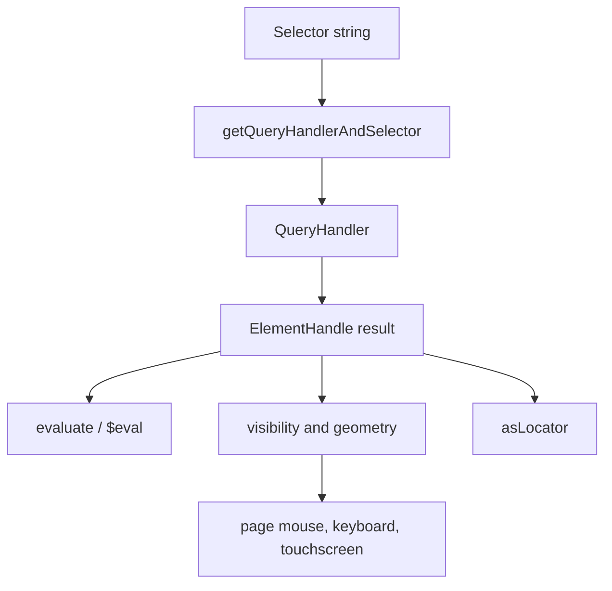
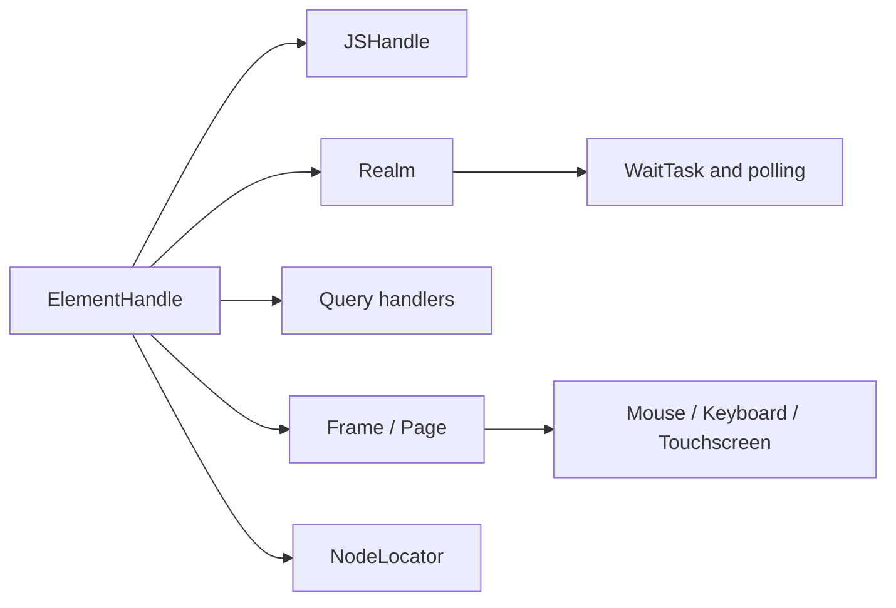

# Handles, realms, and locators: element handles

## Purpose

`ElementHandle` is Puppeteer’s protocol-neutral reference to a DOM node. It extends `JSHandle`, preserves the remote object across asynchronous calls, and exposes querying, evaluation, geometry, visibility, input, pointer, touch, screenshot, and frame-related operations.

The public class lives in `packages/puppeteer-core/src/api/ElementHandle.ts`; CDP and BiDi implementations provide protocol-specific operations such as upload, autofill, accessibility-tree queries, backend node IDs, and remote-object conversion.

## Responsibilities

| Area | Core behavior |
| --- | --- |
| Handle identity and lifetime | `id`, `disposed`, `dispose`, `asElement`, `remoteObject`, `toString`; handles are disposed on navigation or context destruction. |
| DOM querying | `$`, `$$`, `$eval`, `$$eval`, and `waitForSelector` delegate selector parsing to the shared query-handler infrastructure. |
| Evaluation | `evaluate`, `evaluateHandle`, `getProperty`, `getProperties`, and `jsonValue` operate on the referenced node. |
| Interaction | `click`, `hover`, `focus`, `type`, `press`, `select`, `tap`, touch methods, and drag/drop use the owning page’s input devices. |
| Geometry and viewport | `boundingBox`, `boxModel`, `clickablePoint`, `isIntersectingViewport`, `scrollIntoView`, and visibility checks normalize coordinates through nested frames. |
| Capture and forms | `screenshot`, `uploadFile`, `autofill`, and `contentFrame` support common element workflows. |
| Locator bridge | `asLocator` wraps the current handle in a locator while retaining the handle’s staleness semantics. |

## Realm isolation and handle transfer

Most methods are decorated with `bindIsolatedHandle`. If the handle belongs to the main realm, the method adopts it into the frame’s isolated realm, executes there, then transfers returned handles back to the original realm. The adopted handle is cached, preventing repeated adoption.

This arrangement keeps injected selector and utility code isolated from page scripts while preserving the API’s realm-neutral behavior. Disposal releases both the underlying handle and its cached isolated counterpart.

## Query and action flow

Selectors may be CSS, text, ARIA, XPath, piercing/shadow-root, or custom-handler syntax. `$$` collects the query handler’s async iterable. `$eval` disposes its temporary handle; `$$eval` disposes all queried handles after evaluating against the array.

## Geometry and nested frames

`boundingBox` and `boxModel` begin with coordinates in the element’s document, then add iframe offsets while walking parent frames. Clickability intersects rectangles with each document viewport and rejects elements with no non-empty visible rectangle. `click`, `hover`, `tap`, and screenshots therefore share a consistent “scroll, calculate point, dispatch” pipeline.

## Dependencies

See [handles_realms_and_locators_api_realms_and_js_handles.md](handles_realms_and_locators_api_realms_and_js_handles.md) for evaluation and lifecycle abstractions, and [handles_realms_and_locators_api_locators.md](handles_realms_and_locators_api_locators.md) for retryable locator behavior. Shared selector internals are described in [selector_and_waiting_engine.md](selector_and_waiting_engine.md).

