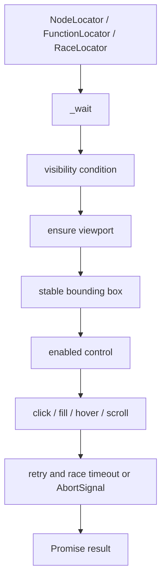
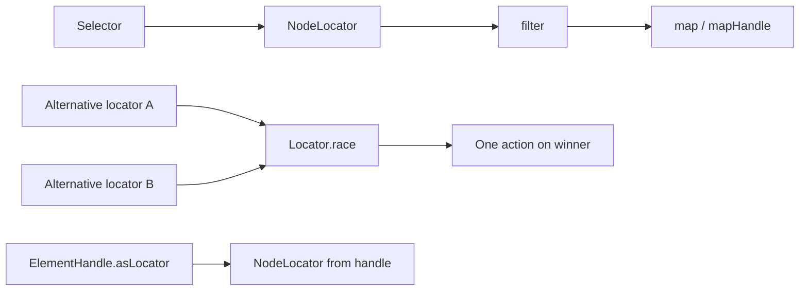

# Handles, realms, and locators: locators

## Purpose

The locator API describes how to find a value or element and how to perform a reliable action on it. Unlike a one-shot `ElementHandle`, a selector-backed locator can refresh its handle after transient failures, apply readiness preconditions, and retry until success, timeout, or cancellation.

## Locator model

`Locator<T>` is an abstract RxJS-backed operation pipeline. Its `_wait()` implementation yields a handle; public methods consume that stream. `waitHandle` returns a handle, `wait` serializes it, and `click`, `fill`, `hover`, and `scroll` add action-specific conditions and retry behavior.



## Locator types

| Type | Resolution strategy |
| --- | --- |
| `NodeLocator` | Waits for a selector or reuses an existing `ElementHandle`; optionally waits for visible/hidden state. |
| `FunctionLocator` | Repeatedly evaluates a function through a page or frame and yields its result handle. |
| `FilteredLocator` | Delegates to another locator and retains only handles satisfying a predicate. |
| `MappedLocator` | Delegates and transforms each resulting handle into another handle/value. |
| `RaceLocator` | Races multiple locator streams and applies the action to the single winner. |
| `DelegatedLocator` | Shared base that propagates timeout and readiness options to a wrapped locator. |

## Preconditions and retries

Actions can wait for visibility, enabled native form controls, viewport intersection, and two equal animation-frame bounding boxes. A failed action disposes the stale handle, then retries resolution after a short delay. The pipeline races retries against the configured timeout and optional `AbortSignal`.

`setTimeout`, `setVisibility`, `setWaitForEnabled`, `setEnsureElementIsInTheViewport`, and `setWaitForStableBoundingBox` clone the locator, making configuration immutable from the caller’s perspective. Cloning is propagated through delegated locators.

## Fill behavior

`fill` determines the runtime element kind. Selects use `select`; text-like inputs, textareas, and contenteditable elements use incremental typing; other inputs are assigned directly and receive `input` and `change` events. Unsupported elements fail the action and participate in the normal retry/error path.

```mermaid
flowchart LR
    Fill[Locator.fill(value)] --> Detect{Element kind?}
    Detect -->|select| Select[ElementHandle.select]
    Detect -->|text input / textarea / contenteditable| Type[clear or append + type]
    Detect -->|other input| Assign[focus + assign + dispatch events]
    Detect -->|unknown| Error[throw unsupported element error]
```

## Composition

`filter` adds a page-side predicate; `filterHandle` evaluates a predicate over handles. `map` maps serializable values, and `mapHandle` maps handles directly. `Locator.race` is useful when alternative selectors represent the same UI target and only one action must run.



Locators depend on `ElementHandle`, `Realm.waitForFunction`, shared query handlers, timeout settings, abort utilities, and RxJS operators. The public page/frame entry points are documented in [page_and_frame_api.md](page_and_frame_api.md).

