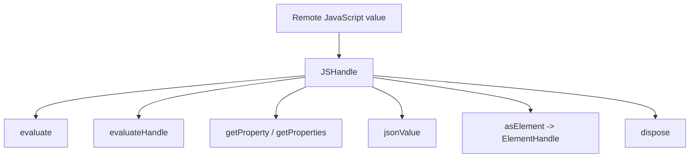
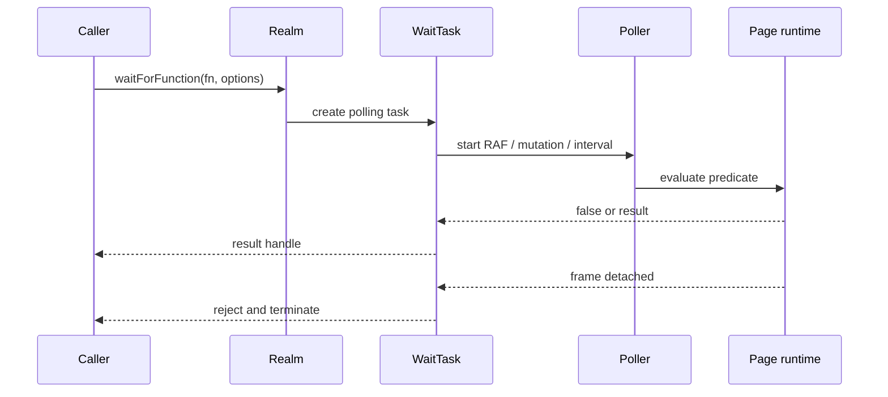
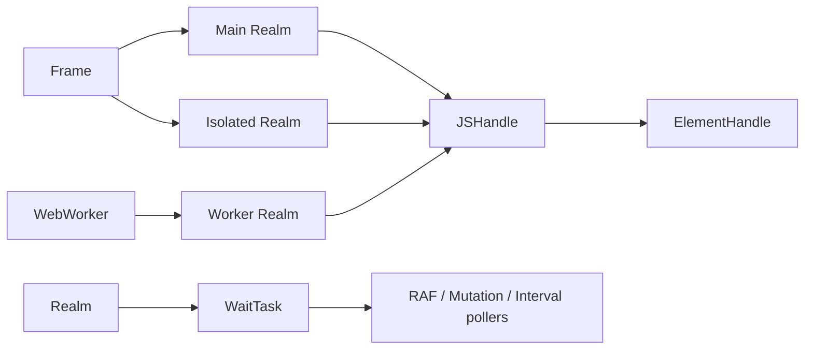

# Handles, realms, and locators: realms and JS handles

## Purpose

`JSHandle` and `Realm` model the boundary between user code and JavaScript objects living in a page, frame, worker, or isolated execution environment. They provide typed evaluation, remote-object retention, handle adoption/transfer, property inspection, disposal, and polling-based waits.

## JSHandle

`JSHandle<T>` is an abstract reference to a remote JavaScript value. `evaluate` and `evaluateHandle` pass the referenced object as the first function argument through the owning realm. `getProperty` evaluates a property access and returns another handle. `getProperties` first enumerates enumerable own properties, then resolves each property into a map of handles.

Handles deliberately prevent remote objects from being garbage-collected. Callers should dispose retained handles, preferably with JavaScript’s explicit resource-management syntax supported by the class’s disposable hooks. `ElementHandle` specializes `JSHandle` for DOM nodes.

## Realm

`Realm` is an internal abstract execution context owned by a frame or worker. Concrete CDP and BiDi realms implement evaluation and handle adoption; the shared base class owns timeout settings, wait-task registration, and disposal state.

`waitForFunction` creates a `WaitTask` with RAF, mutation, or interval polling. The task may be bounded by a timeout, an abort signal, and an optional root handle. When a frame is detached, `dispose()` terminates every registered task with a detachment error.

## Realm boundaries

An element handle can originate in a main realm but be used by selector utilities in an isolated realm. `adoptHandle` creates a usable reference in the destination realm; `transferHandle` moves a result back. This is essential for returning handles from isolated evaluation without exposing isolated execution details to callers.

## Relationships

The concrete implementations are documented in [execution_contexts_and_handles.md](execution_contexts_and_handles.md), while common waiting and scheduling support is covered by [selector_and_waiting_engine.md](selector_and_waiting_engine.md) and [runtime_lifecycle_and_scheduling.md](runtime_lifecycle_and_scheduling.md).

