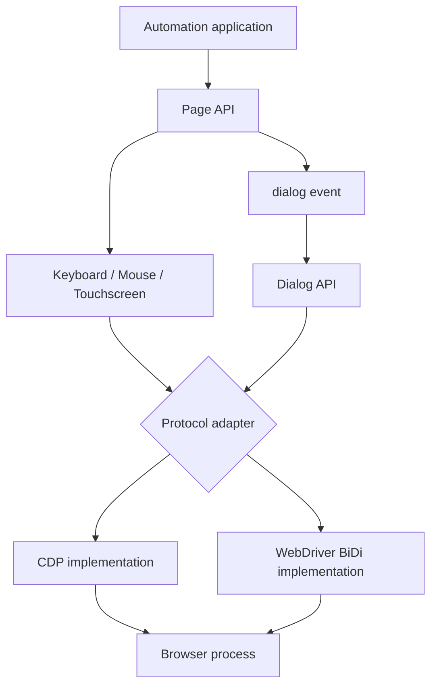
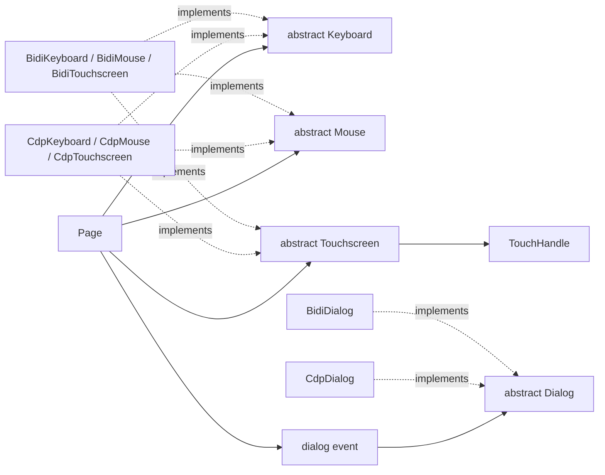
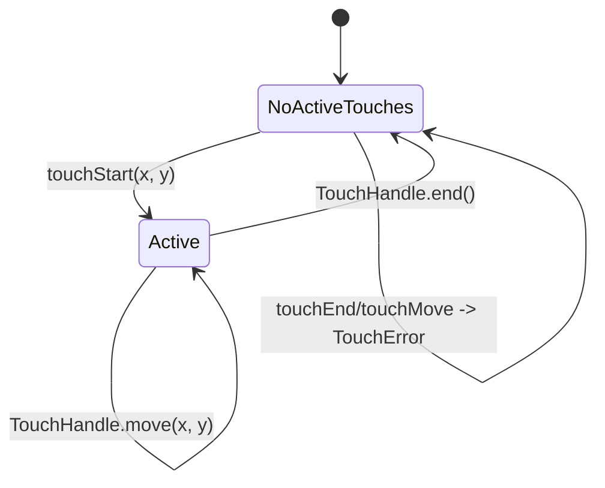
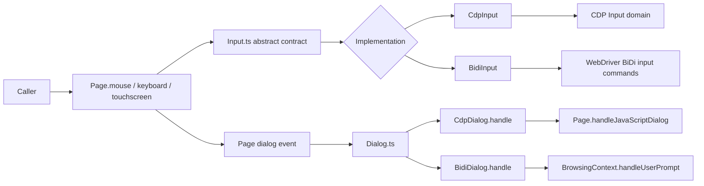
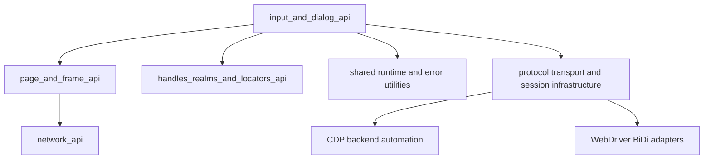

# Input and Dialog API

## Introduction

The `input_and_dialog_api` module defines Puppeteer’s protocol-neutral interfaces for two kinds of page interaction:

- synthetic user input through `Keyboard`, `Mouse`, and `Touchscreen`;
- browser JavaScript dialogs through `Dialog`.

The public classes live in `packages/puppeteer-core/src/api/`. They describe the contract used by `Page` and `ElementHandle`; concrete backends translate those operations into Chrome DevTools Protocol (CDP) or WebDriver BiDi commands. Page ownership, navigation, and event delivery are described in [page and frame API](page_and_frame_api.md), while remote handles and locator-driven interaction are covered by [handles, realms, and locators API](handles_realms_and_locators_api.md).

## Position in the system



Input methods are commands sent to the active page or browsing context. Dialogs reverse the direction: the browser emits a prompt event, Puppeteer wraps it as a `Dialog`, and application code must resolve it with `accept()` or `dismiss()`.

## Architecture



`Input.ts` owns the shared state machine for active touches and the convenience behavior of `Touchscreen.tap()`, `touchMove()`, and `touchEnd()`. It does not know how a protocol dispatches events. `Dialog.ts` owns dialog metadata and the single-handle guard; subclasses implement the protected `handle()` operation.

## Input contracts

### Keyboard

`Keyboard` models a virtual keyboard attached to a page. Its operations have distinct event semantics:

| Operation | Generated events and behavior |
| --- | --- |
| `down(key, options)` | Dispatches `keydown`; character keys may also generate `keypress`/`input`. Modifier state is retained until `up()`. Repeated `down()` calls mark the key as repeated. |
| `up(key)` | Dispatches `keyup` and releases the key/modifier state. |
| `sendCharacter(char)` | Dispatches `keypress` and `input` only. Modifier keys do not affect the character. |
| `type(text, {delay})` | Types every character with the keydown, character input, and keyup sequence. `delay` spaces the generated key events. |
| `press(key, options)` | Convenience operation equivalent to `down()` followed by `up()`, with optional delay. |

`KeyInput` names special keys such as `ArrowLeft`, `Control`, and `KeyA`. `KeyDownOptions.text` and `commands` remain in the type for compatibility but are deprecated. `Keyboard.type()` is for text; use `press()` for special keys and modifier-aware shortcuts.

### Mouse

`Mouse` operates in main-frame CSS pixels measured from the viewport’s top-left corner. The abstract contract includes reset, movement, button state, clicking, wheel events, and drag-and-drop primitives.

`MouseClickOptions` combines button selection, click count, and release delay. `MouseMoveOptions.steps` interpolates movement. Drag methods exchange `Protocol.Input.DragData`, allowing a backend to carry the browser’s drag payload through `dragenter`, `dragover`, and `drop`.

Mouse events are synthetic browser events. They are useful for page automation but do not reproduce every capability of a physical pointer—for example, browser-native text selection may require page evaluation and the Clipboard API.

### Touchscreen and touch handles

`Touchscreen` models active touch contacts. Each `touchStart()` returns a `TouchHandle`, which owns the lifetime of that contact:



The shared implementation keeps active handles in `touches` and assigns internal incremental identifiers through `idGenerator`. `removeHandle()` removes a completed handle without failing if it is already absent.

| Method | Behavior |
| --- | --- |
| `touchStart(x, y)` | Backend-specific operation that creates a contact and returns its handle. |
| `tap(x, y)` | Calls `touchStart()` and immediately calls `TouchHandle.end()`, producing a touchstart/touchend pair. |
| `touchMove(x, y)` | Moves the first active touch. Throws `TouchError('Must start a new Touch first')` when none exists. Browser throttling may coalesce the resulting `touchmove` events. |
| `touchEnd()` | Removes and ends the first active touch. Throws the same `TouchError` when none exists. |
| `TouchHandle.move()` | Moves one specific contact, independent of the active-touch array’s first entry. |
| `TouchHandle.end()` | Ends one specific contact and allows the backend to remove it. |

The first-touch behavior of `touchMove()` and `touchEnd()` is intentional convenience behavior; multi-touch callers should retain and operate on individual handles.

## Dialog contract

`Dialog` is an abstract representation of a JavaScript `alert`, `confirm`, `prompt`, or `beforeunload` dialog. A `Page` emits it through the `dialog` event. The object stores:

| Member | Meaning |
| --- | --- |
| `type()` | Protocol dialog type. |
| `message()` | Text displayed by the dialog. |
| `defaultValue()` | Prompt’s initial value, or `''` for non-prompt dialogs. |
| `accept(promptText?)` | Accepts the dialog; optional text is supplied to a prompt. |
| `dismiss()` | Dismisses the dialog. |

```mermaid
sequenceDiagram
    participant Page
    participant Browser
    participant Handler as Application handler
    participant D as Dialog
    Browser->>Page: JavaScript dialog opened
    Page->>D: create / emit dialog
    Page-->>Handler: dialog event
    Handler->>D: type() / message() / defaultValue()
    alt accept
        Handler->>D: accept(promptText?)
        D->>D: assert not handled; mark handled
        D->>Browser: handle(accept=true, text?)
    else dismiss
        Handler->>D: dismiss()
        D->>D: assert not handled; mark handled
        D->>Browser: handle(accept=false)
    end
    Browser-->>Page: dialog resolved
```

`accept()` and `dismiss()` are asynchronous and resolve after the backend handles the prompt. The protected `handled` flag prevents a dialog from being resolved twice; a second resolution attempt throws `Cannot accept dialog which is already handled!` or its dismiss equivalent. The base class deliberately does not implement protocol details: CDP uses `CdpDialog.handle`, while BiDi uses `BidiDialog.handle` and the WebDriver BiDi user-prompt model.

## Component interaction and backend mapping



The public API therefore remains stable across browser protocols. Backend differences—such as event throttling, supported drag operations, prompt behavior, and available input commands—belong in the CDP and BiDi adapters and should not be inferred from the abstract classes alone. Transport/session ownership is described in [launch and connect](launch_and_connect.md); browser and context lifetime is described in [browser and context API](browser_and_context_api.md).

## End-to-end process flows

### Text entry and touch interaction

```mermaid
flowchart TD
    Start[Focused page element] --> Choose{Interaction}
    Choose -->|text| Type[Keyboard.type(text, options)]
    Type --> Keys[Backend emits key events]
    Keys --> DOM[Page receives input]
    Choose -->|single touch| Tap[Touchscreen.tap(x, y)]
    Tap --> StartTouch[touchStart]
    StartTouch --> EndTouch[TouchHandle.end]
    EndTouch --> TouchDOM[Page receives touchstart/touchend]
    Choose -->|gesture| Gesture[touchStart -> move -> end]
    Gesture --> TouchDOM
```

### Dialog handling

```mermaid
flowchart TD
    Script[Page script calls alert/confirm/prompt] --> BrowserPrompt[Browser creates prompt]
    BrowserPrompt --> PageEvent[Page emits dialog]
    PageEvent --> Listener[Application listener]
    Listener --> Inspect[Read type/message/defaultValue]
    Inspect --> Decision{Decision}
    Decision --> Accept[accept(optional prompt text)]
    Decision --> Dismiss[dismiss()]
    Accept --> Resolved[Browser resumes script]
    Dismiss --> Resolved
    Listener -->|no resolution| Blocked[Page remains blocked by dialog]
```

Applications should install a `dialog` listener before triggering code that may open a prompt and should always resolve the dialog. A modal JavaScript dialog can block page progress until it is accepted or dismissed.

## Dependencies and integration points



- `Page` exposes the input devices and emits dialogs; `ElementHandle` and locator actions commonly delegate to them.
- `TouchError` is the input-specific failure for operations without an active touch.
- `Protocol.Input.MouseButton`, `Protocol.Input.DragData`, and `Protocol.Page.DialogType` preserve protocol vocabulary at the type boundary.
- The incremental ID generator supports backend touch-contact identity; callers should not depend on its internal values.
- Input commands execute through the active protocol session, so page closure or transport disconnection can reject pending operations.

## Usage examples

```ts
await page.keyboard.type('Hello', {delay: 25});
await page.keyboard.press('Enter');

await page.mouse.click(100, 120, {button: 'left', count: 2});
await page.touchscreen.tap(100, 120);

page.on('dialog', async dialog => {
  if (dialog.type() === 'prompt') {
    await dialog.accept('approved');
  } else {
    await dialog.dismiss();
  }
});
```

For selector-based actions such as `page.locator(...).click()` and `page.type()`, see [handles, realms, and locators API](handles_realms_and_locators_api.md). For page-level event and lifecycle behavior, see [page and frame API](page_and_frame_api.md).

## Operational considerations

1. Keep keyboard modifier lifetimes balanced: every `down()` for a modifier should eventually have a matching `up()`.
2. Use `Keyboard.type()` for literal text and `Keyboard.press()`/`down()`/`up()` for special keys and shortcuts.
3. Treat mouse coordinates as viewport CSS pixels, not device pixels or document coordinates.
4. Retain a `TouchHandle` when coordinating more than one active touch; the convenience methods operate on the first active touch.
5. Resolve each dialog once and await the returned promise so protocol failures are observable.
6. Expect browser-specific limitations for synthetic pointer events, touchmove throttling, and dialog timing.
