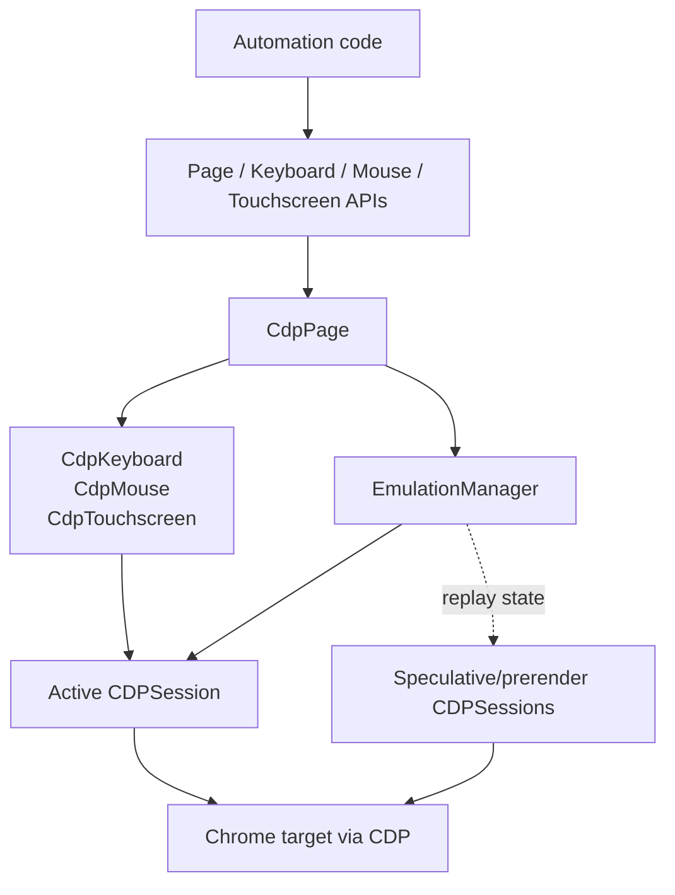
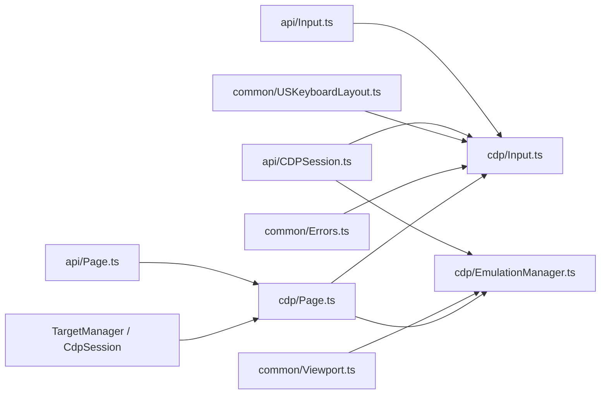
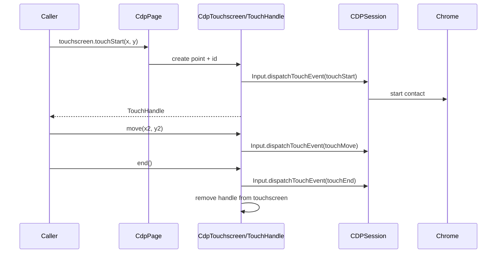
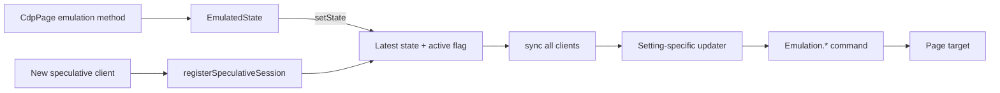
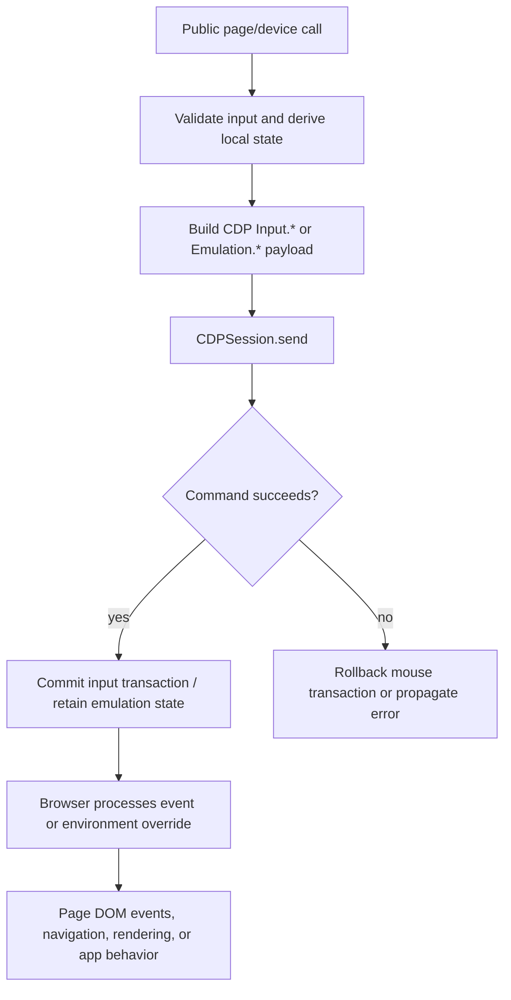
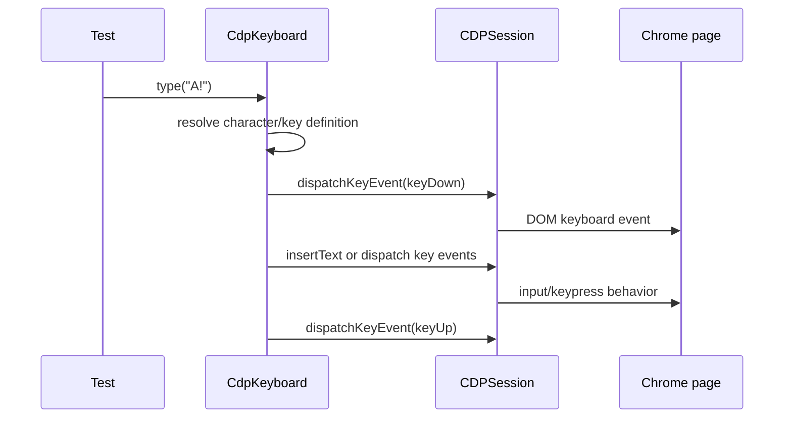
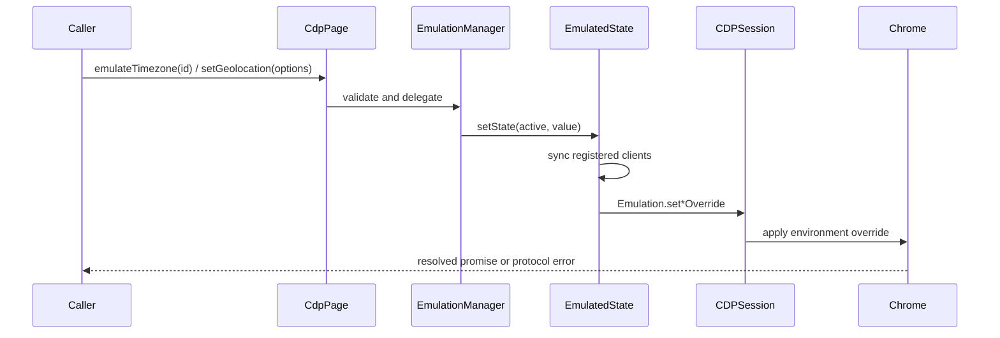

# Input and Emulation

The `input_and_emulation` module is the Chrome DevTools Protocol (CDP) backend
for Puppeteer's user-input and browser-environment controls. It translates the
public `Page` and input-device APIs into `Input.*` and `Emulation.*` CDP
commands, while maintaining enough local state to model held keys, pressed
mouse buttons, active touches, and emulation settings.

The module is consumed by `CdpPage`; it is not a standalone browser lifecycle
module. Browser creation, target attachment, and protocol-session ownership are
described in [page and frame lifecycle](page_and_frame_lifecycle.md) and
[protocol transport and sessions](protocol_transport_and_sessions.md).

## Scope and responsibilities

The module has two cooperating responsibilities:

- `CdpKeyboard`, `CdpMouse`, and `CdpTouchscreen` implement physical-like input
  against a page's current CDP target session.
- `EmulationManager` stores independently configurable emulation states and
  applies them to every relevant CDP client, including speculative prerender
  clients.

`CdpPage` exposes these implementations through `page.keyboard`, `page.mouse`,
`page.touchscreen`, and the page-level emulation methods. The protocol-neutral
contracts and user-facing semantics are documented in
[protocol-neutral public automation API](protocol_neutral_public_automation_api.md),
especially the Page and input API sections.

## Architecture

At construction time, `CdpPage` creates all three input devices with the
primary target session. The mouse and touchscreen also receive the keyboard so
that mouse/touch protocol events carry the keyboard's current modifier mask.
It creates one `EmulationManager` for the same session.

When the page's primary target is replaced during activation, `CdpPage` calls
`updateClient` on all three devices and on the emulation manager. Existing touch
handles are updated as well. This keeps the public device objects stable while
their protocol destination changes.

## Dependencies

The module relies on the public abstractions for method signatures and on
`CDPSession.send()` for transport. It does not open sockets or launch Chrome;
those concerns belong to [launch and connect](launch_and_connect.md) and
[protocol transport and session infrastructure](protocol_transport_and_session_infrastructure.md).

## Input implementation

### Keyboard

`CdpKeyboard` keeps a set of pressed physical key codes and a four-bit modifier
mask: Alt, Control, Meta, and Shift. A key is resolved through
`USKeyboardLayout` into its key, code, virtual key code, text, and location.

- `down` marks the key pressed, updates modifiers, detects auto-repeat, and
  sends `Input.dispatchKeyEvent` as `keyDown` when text exists or `rawKeyDown`
  otherwise.
- `up` clears the key and modifier bit, then sends `keyUp`.
- `sendCharacter` sends `Input.insertText` directly; it intentionally does not
  synthesize keydown/keyup events.
- `press` composes `down` and `up`, optionally waiting between them.
- `type` processes each character: known key tokens use `press`, while ordinary
  characters use `sendCharacter`, with an optional delay.

Text is suppressed when modifiers other than Shift are held. Shift can select
the shifted key definition and text. Unknown key names fail an assertion before
a protocol command is sent.

### Mouse

`CdpMouse` tracks the cursor position and a bitmask of pressed buttons. Mouse
operations use transactions: state is tentatively updated before the CDP
command and committed only when the command succeeds. Failed commands roll the
state back. The transaction list also allows concurrent mouse operations to
observe in-flight updates without corrupting the committed state.

`move` interpolates coordinates over `steps` events. `down` and `up` reject
unsupported buttons and invalid repeated transitions. `click` composes movement,
press/release events, click counts, and an optional delay. `wheel` sends the
current coordinates, buttons, modifiers, and deltas.

`reset` releases every tracked button and moves to `(0, 0)`. Dragging is a
multi-stage protocol flow: `drag` waits for `Input.dragIntercepted`, moves to
the start, presses, and moves to the target; `dragAndDrop` then sends
`dragEnter`, `dragOver`, `drop`, and the final release. Page-level drag
interception is enabled separately by `CdpPage.setDragInterception`, which
sends `Input.setInterceptDrags`.

### Touchscreen

`CdpTouchscreen.touchStart` creates a generated touch identifier and a touch
point with rounded coordinates, radius, and force values. `CdpTouchHandle`
represents that active contact:

A handle cannot be started twice. Moving updates and rounds its point. Ending
the handle removes it from the touchscreen's active-touch collection. On a
session swap, `CdpTouchscreen.updateClient` updates both the touchscreen and all
active handles.

## Emulation state model

`EmulationManager` uses one `EmulatedState<T>` per setting. Each state contains
the desired value and an `active` flag, plus an updater that translates the
state into CDP commands. Calling `setState` stores the value and synchronizes
all clients returned by `clients()`.

The tracked settings are viewport/device metrics, idle overrides, timezone,
vision deficiency, CPU throttling, media features, media type, geolocation,
default background color, and JavaScript execution. Updaters are guarded by
`invokeAtMostOnceForArguments` where appropriate to avoid repeating identical
commands for the same client and state arguments.

Important validation and behavior include:

- Viewport emulation applies device metrics and touch emulation. Changes to
  mobile or touch capability report that a reload is needed; `CdpPage.setViewport`
  performs that reload.
- CPU throttling accepts `null` or factors greater than or equal to `1`.
- Timezone errors from CDP are converted to an `Invalid timezone ID` error.
- Vision deficiency is restricted to the supported CDP values, including
  `none`, color-vision deficiencies, blurred vision, and reduced contrast.
- Media features are limited to the supported `prefers-*` and `color-gamut`
  names; media type is `screen`, `print`, or unset.
- Geolocation validates longitude, latitude, and non-negative accuracy before
  sending `Emulation.setGeolocationOverride`.
- JavaScript is enabled by default; disabling it sends
  `Emulation.setScriptExecutionDisabled` with the inverse boolean.
- Transparent screenshot/PDF backgrounds are temporary state changes managed by
  `CdpPage`, which resets the default background after capture.

The manager does not maintain separate semantic state for each secondary
session. Instead, it replays every registered state to a newly registered
speculative session. Disconnected secondary sessions are removed automatically.

## Data flow and lifecycle

The active session is changed by page target lifecycle events. On a session
swap, `CdpPage` updates input and emulation clients before swapping its frame
tree. For a prerender target, it registers the speculative session so all
emulation state is applied before the target resumes. This is coordinated with
the broader target/frame lifecycle described in
[page and frame lifecycle page](page_and_frame_lifecycle_page.md).

## Typical process flows

### Typing into a focused element

### Applying emulation

## Error handling and invariants

- Input protocol failures are surfaced to callers. Mouse state is restored when
  a state-changing mouse command fails.
- Invalid keys, buttons, media settings, vision deficiencies, throttling
  factors, and geolocation values fail before or during command dispatch with a
  descriptive error.
- Keyboard modifier state is shared conceptually with mouse and touch events;
  every relevant input payload includes the current modifier mask.
- `CdpPage` keeps device instances stable across CDP session swaps, so callers
  do not need to reacquire `page.keyboard`, `page.mouse`, or
  `page.touchscreen`.
- A touch handle is single-start and must be ended to be removed from active
  touch tracking.
- Emulation state remains authoritative in the manager and is replayed to new
  clients, which prevents prerender activation from losing configured browser
  behavior.

## Related modules

- [Input and dialog API](input_and_dialog_api.md) — protocol-neutral input and
  dialog contracts.
- [Page and frame API](page_and_frame_api.md) — public `Page` methods and
  lifecycle-facing API definitions.
- [Page and frame lifecycle](page_and_frame_lifecycle.md) — frame/page
  orchestration around the CDP backend.
- [Network stack](network_stack.md) — neighboring page-level controls for
  headers, interception, offline mode, and network emulation.
- [BiDi transport and CDP bridge](bidi_transport_and_cdp_bridge.md) — the
  alternative browser-protocol path and its relationship to CDP.
- [Protocol transport and sessions](protocol_transport_and_sessions.md) —
  session and command transport used by this module.

## Source map

| Concern | Primary source | Key components |
| --- | --- | --- |
| Keyboard, mouse, touch translation | `packages/puppeteer-core/src/cdp/Input.ts` | `CdpKeyboard`, `CdpMouse`, `CdpTouchscreen`, `CdpTouchHandle` |
| Persistent emulation state | `packages/puppeteer-core/src/cdp/EmulationManager.ts` | `EmulatedState`, `EmulationManager` |
| Public page integration | `packages/puppeteer-core/src/cdp/Page.ts` | device getters, emulation delegates, viewport/session handling |
| Protocol contract | `packages/puppeteer-core/src/api/Input.ts`, `api/Page.ts` | abstract input and page APIs |
| Command transport | `packages/puppeteer-core/src/api/CDPSession.ts` | `CDPSession.send`, session events |
