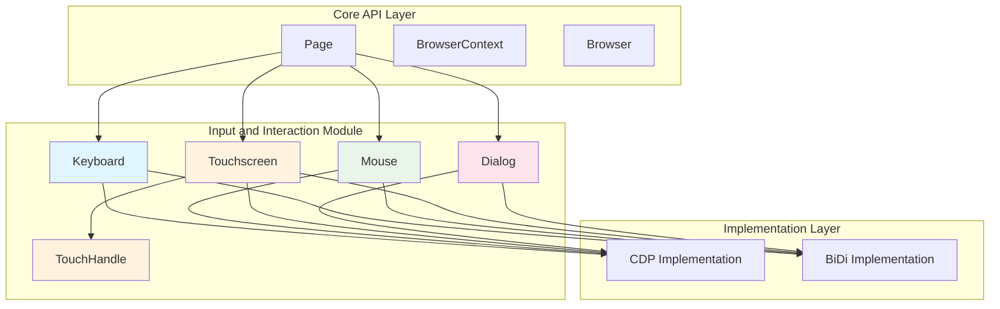
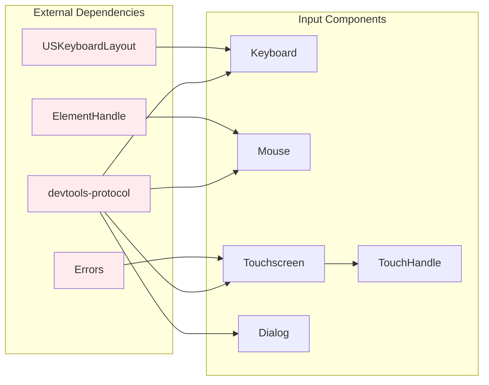
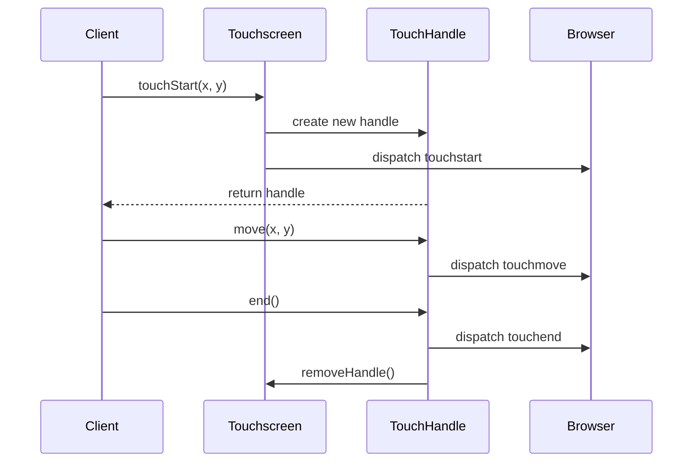
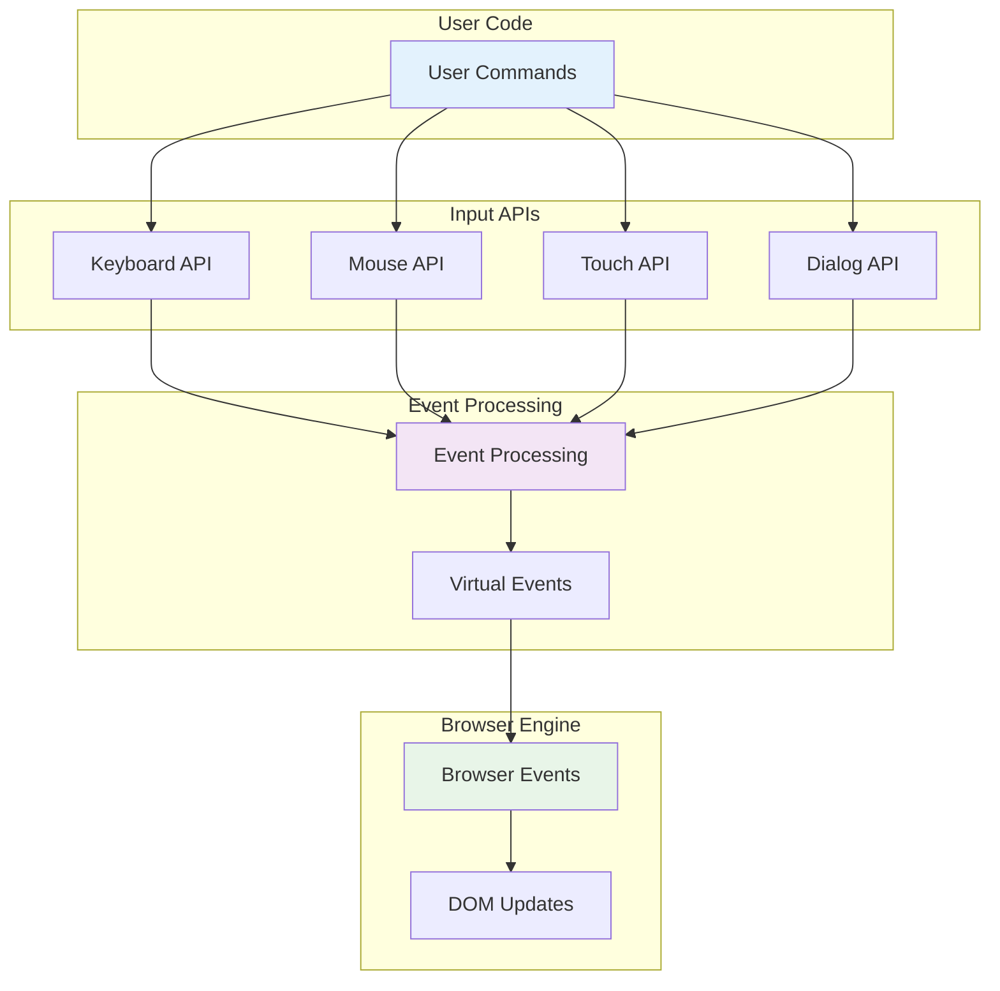
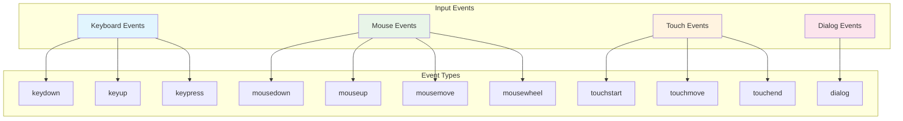

# Input and Interaction Module

The input_and_interaction module provides comprehensive APIs for simulating user interactions with web pages through keyboard, mouse, touch, and dialog handling capabilities. This module serves as the primary interface for automating user input events in Puppeteer's browser automation framework.

## Overview

This module contains five core components that enable different types of user interaction simulation:

- **Keyboard**: Virtual keyboard for text input and key combinations
- **Mouse**: Mouse operations including clicks, movements, and drag-and-drop
- **Touchscreen**: Touch events for mobile device simulation
- **TouchHandle**: Individual touch point management
- **Dialog**: Browser dialog handling (alerts, confirms, prompts)

## Architecture



## Component Dependencies



## Core Components

### Keyboard

The Keyboard class provides a comprehensive API for simulating keyboard input events.

**Key Features:**
- Individual key press/release events (`down()`, `up()`)
- Text typing with configurable delays (`type()`)
- Character input without key events (`sendCharacter()`)
- Combined key press operations (`press()`)
- Support for modifier keys and keyboard shortcuts

**Usage Patterns:**
```typescript
// Basic text input
await page.keyboard.type('Hello World!');

// Key combinations
await page.keyboard.down('Shift');
await page.keyboard.press('KeyA');
await page.keyboard.up('Shift');

// Controlled typing with delays
await page.keyboard.type('Slow typing', {delay: 100});
```

### Mouse

The Mouse class handles all mouse-related interactions in main-frame CSS pixels.

**Key Features:**
- Precise cursor movement with step control
- Click operations with button selection and count
- Mouse wheel scrolling
- Drag and drop operations
- Mouse state management (button press/release)

**Coordinate System:**
- Uses main-frame CSS pixels
- Relative to viewport's top-left corner
- Supports sub-pixel precision

### Touchscreen

The Touchscreen class enables touch event simulation for mobile device testing.

**Key Features:**
- Multi-touch support through TouchHandle instances
- Touch lifecycle management (start, move, end)
- Automatic touch ID generation
- Touch state tracking

**Touch Flow:**


### TouchHandle

Individual touch point interface for managing active touches.

**Capabilities:**
- Independent touch movement
- Touch termination
- Automatic cleanup on end

### Dialog

The Dialog class manages browser dialog interactions (alerts, confirms, prompts).

**Dialog Types:**
- `alert`: Information dialogs
- `confirm`: Yes/No confirmation dialogs  
- `prompt`: Text input dialogs
- `beforeunload`: Page unload confirmations

**State Management:**
- Single-use dialog handling
- Automatic state tracking
- Error prevention for double-handling

## Data Flow



## Integration Points

### Page Integration
All input components are accessible through the Page interface:
- `page.keyboard` - Keyboard instance
- `page.mouse` - Mouse instance  
- `page.touchscreen` - Touchscreen instance
- Dialog events via `page.on('dialog', handler)`

### Protocol Implementation
The module integrates with both CDP and BiDi protocols through:
- [CDP Implementation](cdp_implementation.md) - Chrome DevTools Protocol
- [BiDi Implementation](bidi_implementation.md) - WebDriver BiDi Protocol

### Element Interaction
Works closely with [Core API](core_api.md) components:
- ElementHandle for element-specific interactions
- Frame for context-aware input
- Page for global input management

## Event Handling



## Error Handling

The module implements robust error handling:

- **TouchError**: Thrown when touch operations are invalid
- **Dialog State Errors**: Prevents double-handling of dialogs
- **Input Validation**: Ensures valid coordinates and parameters
- **Protocol Errors**: Handles underlying protocol communication issues

## Performance Considerations

### Keyboard Performance
- Configurable typing delays for realistic simulation
- Efficient key state management
- Minimal protocol overhead for character input

### Mouse Performance  
- Optimized movement with step control
- Efficient coordinate calculations
- Batched event processing where possible

### Touch Performance
- Automatic touch ID management
- Efficient multi-touch tracking
- Optimized event throttling

## Usage Examples

### Complex Keyboard Interaction
```typescript
// Text selection and replacement
await page.keyboard.type('Hello World!');
await page.keyboard.press('ArrowLeft');

await page.keyboard.down('Shift');
for (let i = 0; i < ' World'.length; i++) {
  await page.keyboard.press('ArrowLeft');
}
await page.keyboard.up('Shift');

await page.keyboard.press('Backspace');
// Result: 'Hello!'
```

### Mouse Drag and Drop
```typescript
// Drag element from one location to another
const startPoint = {x: 100, y: 100};
const endPoint = {x: 200, y: 200};

await page.mouse.move(startPoint.x, startPoint.y);
await page.mouse.down();
await page.mouse.move(endPoint.x, endPoint.y);
await page.mouse.up();
```

### Multi-Touch Gestures
```typescript
// Pinch gesture simulation
const touch1 = await page.touchscreen.touchStart(100, 100);
const touch2 = await page.touchscreen.touchStart(200, 200);

// Pinch in
await touch1.move(150, 150);
await touch2.move(150, 150);

await touch1.end();
await touch2.end();
```

### Dialog Handling
```typescript
// Set up dialog handler
page.on('dialog', async dialog => {
  console.log(`Dialog type: ${dialog.type()}`);
  console.log(`Message: ${dialog.message()}`);
  
  if (dialog.type() === 'confirm') {
    await dialog.accept();
  } else {
    await dialog.dismiss();
  }
});

// Trigger dialog
await page.evaluate(() => confirm('Are you sure?'));
```

## Related Modules

- [Core API](core_api.md) - Base browser automation interfaces
- [Locators](locators.md) - Element location and selection
- [CDP Implementation](cdp_implementation.md) - Chrome DevTools Protocol implementation
- [BiDi Implementation](bidi_implementation.md) - WebDriver BiDi Protocol implementation

## Best Practices

1. **Realistic Timing**: Use delays in keyboard typing for more realistic user simulation
2. **Error Handling**: Always handle dialog events to prevent hanging operations
3. **Touch Cleanup**: Ensure all touches are properly ended to avoid state issues
4. **Coordinate Validation**: Verify coordinates are within viewport bounds
5. **Event Sequencing**: Follow proper event sequences (down → up for clicks)