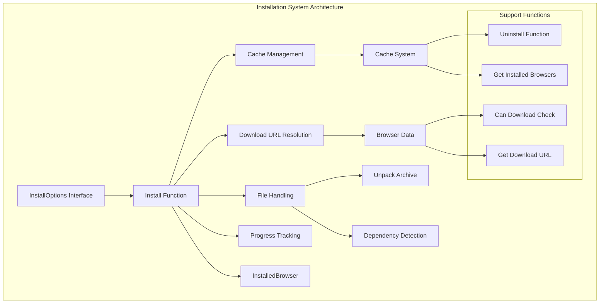
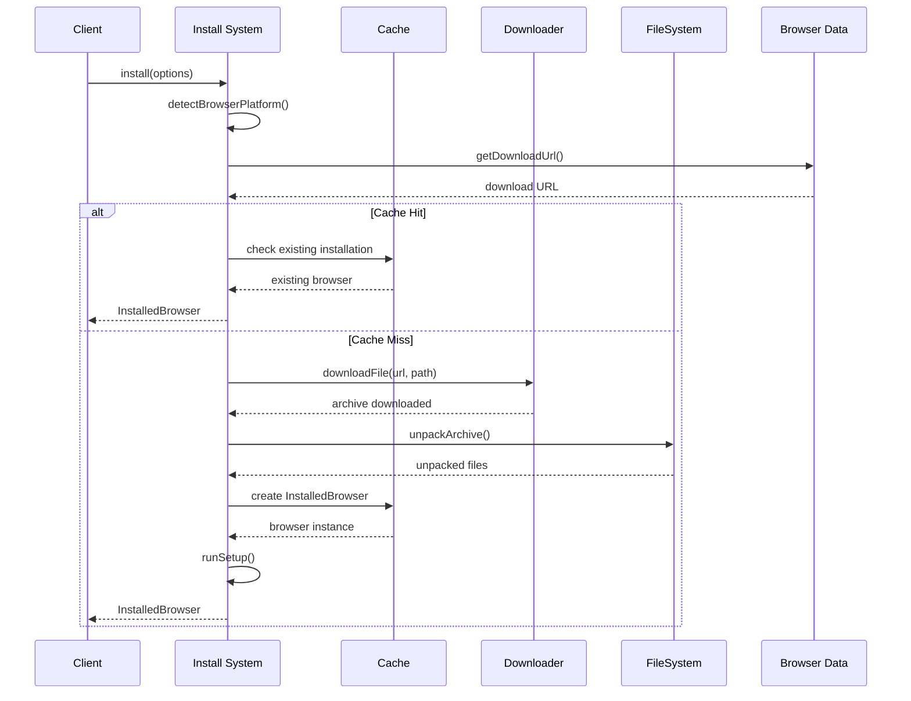
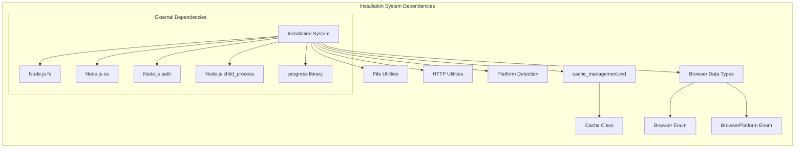
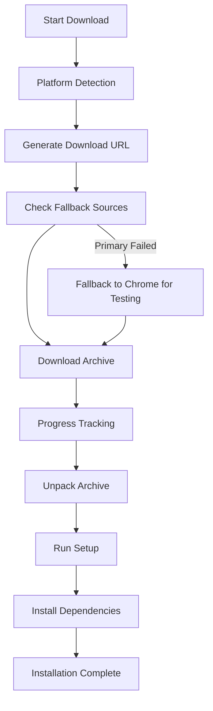
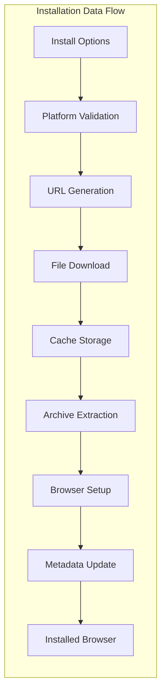
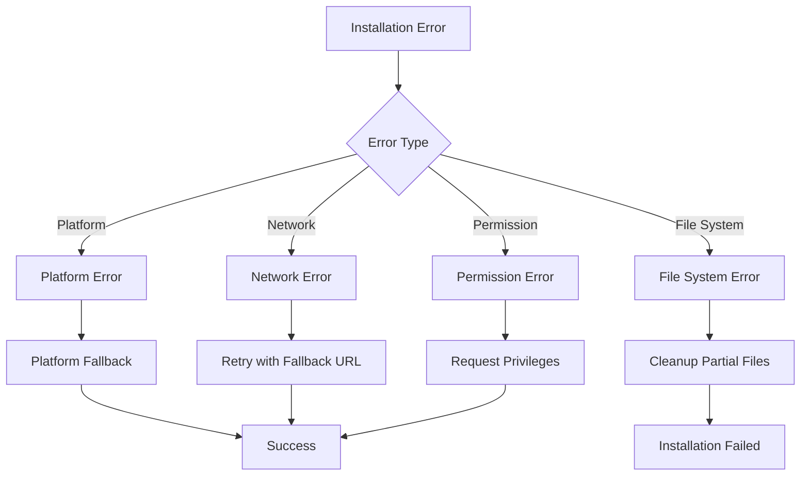

# Installation System Module

The installation_system module is a core component of the Puppeteer browser management system that handles the automated downloading, installation, and management of browser binaries. It provides a comprehensive solution for acquiring browser executables across different platforms and managing their lifecycle within the cache system.

## Overview

The installation_system module serves as the primary interface for browser binary acquisition and management. It abstracts the complexity of downloading browser archives from various sources, handling platform-specific requirements, and integrating with the cache management system. The module supports multiple browsers including Chrome, Chromium, Firefox, ChromeDriver, and Chrome Headless Shell across different operating systems and architectures.

## Architecture



## Core Components

### InstallOptions Interface

The `InstallOptions` interface defines the configuration parameters for browser installation:

```typescript
interface InstallOptions {
  cacheDir: string;                    // Target cache directory
  platform?: BrowserPlatform;         // Target platform (auto-detected)
  browser: Browser;                    // Browser type to install
  buildId: string;                     // Specific build identifier
  buildIdAlias?: string;               // Alias for the build
  downloadProgressCallback?: Function; // Progress tracking callback
  baseUrl?: string;                    // Custom download base URL
  unpack?: boolean;                    // Whether to unpack archives
  installDeps?: boolean;               // Install system dependencies
}
```

### Installation Process Flow



## Dependencies

The installation_system module integrates with several other system components:



## Key Features

### Multi-Browser Support

The system supports installation of various browser types:

- **Chrome**: Stable, Beta, Dev, and Canary channels
- **Chromium**: Open-source builds
- **Firefox**: Stable, Beta, Nightly, ESR, and DevEdition
- **ChromeDriver**: WebDriver for Chrome automation
- **Chrome Headless Shell**: Lightweight Chrome for headless operations

### Platform Detection and Support

Automatic platform detection with support for:

- Linux (x64, ARM)
- macOS (Intel, Apple Silicon)
- Windows (32-bit, 64-bit)

### Download Management



### System Dependencies

For Linux Chrome installations, the system can automatically install required system dependencies:

- Requires root privileges
- Uses `apt-get` for Debian-based systems
- Reads dependency information from `deb.deps` files
- Handles dependency resolution and installation

## Data Flow



## API Reference

### Primary Functions

#### `install(options: InstallOptions): Promise<InstalledBrowser | string>`

Downloads and installs a browser binary according to the specified options.

**Parameters:**
- `options`: Configuration object defining installation parameters

**Returns:**
- `InstalledBrowser` instance when `unpack: true` (default)
- Archive path string when `unpack: false`

#### `uninstall(options: UninstallOptions): Promise<void>`

Removes an installed browser from the cache.

#### `getInstalledBrowsers(options: GetInstalledBrowsersOptions): Promise<InstalledBrowser[]>`

Returns metadata about all browsers installed in the cache directory.

#### `canDownload(options: InstallOptions): Promise<boolean>`

Checks if a browser binary is available for download without actually downloading it.

#### `getDownloadUrl(browser, platform, buildId, baseUrl?): URL`

Generates the download URL for a specific browser binary.

### Utility Functions

#### `makeProgressCallback(browser, buildId): Function`

Creates a default progress callback that displays a progress bar during download.

## Error Handling

The installation system implements comprehensive error handling:



## Integration Points

### Cache Management Integration

The installation system works closely with the [cache_management](cache_management.md) module:

- Uses `Cache` class for directory management
- Maintains installation metadata
- Handles browser aliases and version resolution
- Manages cleanup and uninstallation

### Browser Launching Integration

Installed browsers are consumed by the [launch_system](launch_system.md) module:

- Provides executable paths for browser launching
- Maintains browser metadata for launch configuration
- Ensures browser availability before launch attempts

### CLI Integration

The installation system is exposed through the [cli_interface](cli_interface.md):

- Command-line installation commands
- Progress reporting and user feedback
- Error reporting and troubleshooting guidance

## Performance Considerations

### Download Optimization

- Parallel download support where possible
- Resume capability for interrupted downloads
- Compression-aware handling
- Bandwidth-efficient progress reporting

### Storage Efficiency

- Shared cache directory structure
- Automatic cleanup of temporary files
- Deduplication of identical browser versions
- Metadata-driven storage optimization

## Security Features

### Download Verification

- URL validation and sanitization
- Archive integrity checking
- Source verification for fallback URLs
- Secure temporary file handling

### System Integration

- Privilege escalation handling for dependency installation
- Secure execution of setup scripts
- Sandboxing configuration for Windows Chrome installations
- File permission management

## Troubleshooting

### Common Issues

1. **Platform Detection Failures**: Automatic fallback to manual platform specification
2. **Network Connectivity**: Retry mechanisms with exponential backoff
3. **Disk Space**: Pre-installation space verification
4. **Permissions**: Clear error messages for privilege requirements
5. **Corrupted Downloads**: Automatic cleanup and retry logic

### Debug Support

The module includes comprehensive debug logging:

```typescript
const debugInstall = debug('puppeteer:browsers:install');
```

Enable debug output with:
```bash
DEBUG=puppeteer:browsers:install node your-script.js
```

## Future Enhancements

### Planned Features

- Delta updates for browser versions
- Parallel installation support
- Enhanced progress reporting
- Custom mirror support
- Installation verification and health checks

### Extensibility

The modular design allows for:

- Custom download sources
- Additional browser support
- Platform-specific optimizations
- Enhanced dependency management
- Integration with package managers

## Related Documentation

- [cache_management.md](cache_management.md) - Cache system integration
- [launch_system.md](launch_system.md) - Browser launching capabilities
- [cli_interface.md](cli_interface.md) - Command-line interface
- [browser_management.md](browser_management.md) - Overall browser management system