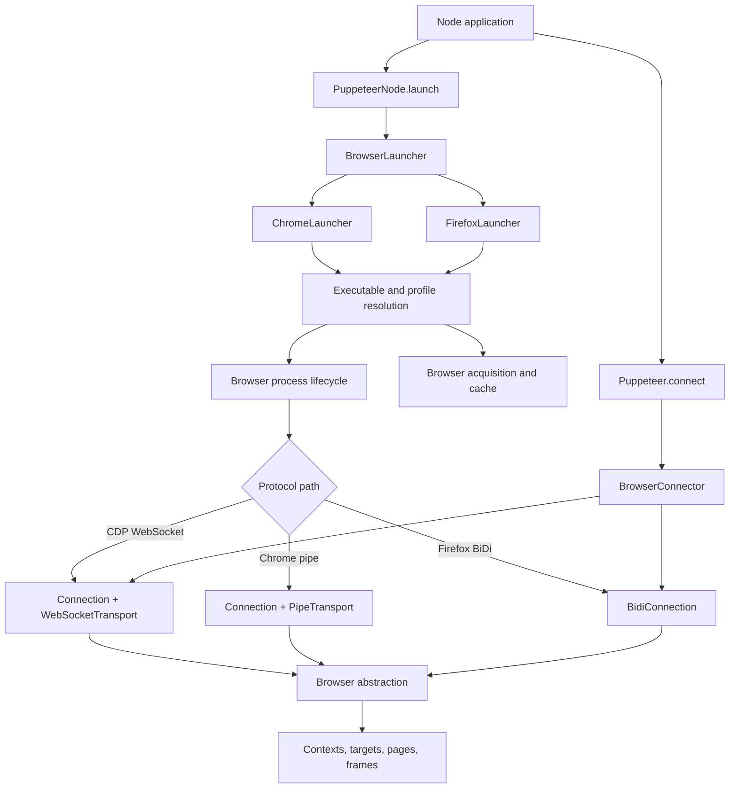
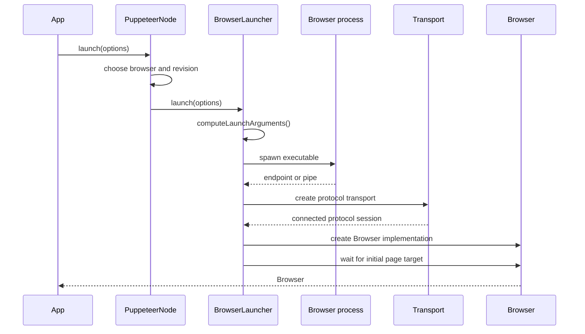
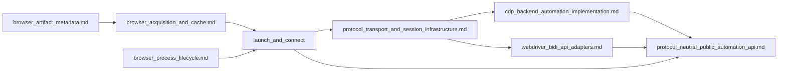

# Launch and connect

## Purpose

The `launch_and_connect` module is Puppeteer’s Node-side entry point for turning browser configuration into a connected `Browser` object. It supports two paths:

- launching a managed or user-specified Chrome/Firefox process;
- connecting to an already-running browser through the common `Puppeteer.connect()` API.

The module owns browser selection, executable resolution, launch-argument construction, protocol endpoint discovery, transport setup, initial-page readiness, and process cleanup. Browser downloads and artifact metadata are separate concerns.

## Architecture overview



The normal launch sequence is:



## Sub-modules

| Sub-module | Scope | Documentation |
| --- | --- | --- |
| Orchestration core | `Puppeteer.connect`, `PuppeteerNode`, `BrowserLauncher`, and `LaunchOptions`; common launch, connect, path, cache, protocol, and shutdown behavior. | [launch_and_connect_orchestration.md](launch_and_connect_orchestration.md) |
| Chrome launcher | Chrome defaults, release channels, debugging pipe/port selection, executable resolution, temporary profiles, and cleanup. | [launch_and_connect_chrome.md](launch_and_connect_chrome.md) |
| Firefox launcher | Firefox defaults, profile creation/preferences, WebDriver BiDi startup, executable resolution, and profile restoration. | [launch_and_connect_firefox.md](launch_and_connect_firefox.md) |

The detailed behavior is intentionally kept in these sub-module documents; this page provides the capability-level map.

## Module relationships



- [browser_acquisition_and_cache.md](browser_acquisition_and_cache.md) documents installation, cache enumeration, and managed browser artifacts used by executable resolution.
- [browser_artifact_metadata.md](browser_artifact_metadata.md) documents browser build IDs, download URLs, and executable layouts consumed by acquisition and path resolution.
- [browser_process_lifecycle.md](browser_process_lifecycle.md) documents child-process spawning, endpoint output, signal handling, and termination.
- [protocol_transport_and_session_infrastructure.md](protocol_transport_and_session_infrastructure.md) documents CDP, pipe, WebSocket, and BiDi connection mechanics.
- [cdp_backend_automation_implementation.md](cdp_backend_automation_implementation.md) and [webdriver_bidi_api_adapters.md](webdriver_bidi_api_adapters.md) implement the protocol-specific `Browser` objects created after launch/connect.
- [protocol_neutral_public_automation_api.md](protocol_neutral_public_automation_api.md) documents the browser, context, page, frame, target, and worker APIs returned to callers.

## Key design points

- `PuppeteerNode.launch()` selects Chrome or Firefox, updates the active revision, and delegates to a matching launcher.
- `BrowserLauncher.launch()` provides the shared pipeline: resolve arguments, verify the executable, spawn the process, connect through CDP or BiDi, optionally install extensions, wait for a page target, and register graceful/fallback cleanup.
- Chrome supports CDP over WebSocket or pipe and can expose BiDi over CDP. Firefox defaults to native WebDriver BiDi.
- `Puppeteer.connect()` attaches to an existing browser and does not spawn or own a browser process.
- Temporary user-data directories are removed on exit; custom profiles are preserved, with Firefox preferences restored when applicable.
- Launch failures are surfaced as actionable executable, protocol, timeout, or configuration errors, with shutdown attempted on partial startup.

## Typical usage

```ts
import puppeteer from 'puppeteer';

const browser = await puppeteer.launch({
  browser: 'chrome',
  headless: true,
});

const page = await browser.newPage();
await page.goto('https://example.com');
await browser.close();
```

For an existing browser, use `puppeteer.connect({browserWSEndpoint: ...})`; the connection details belong to the connector and transport documentation linked above.
