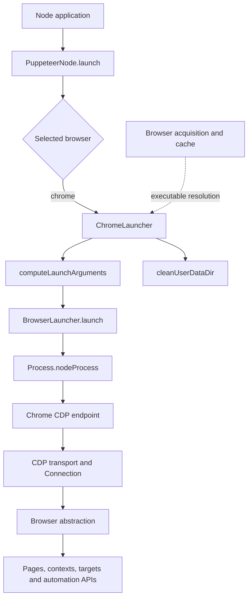
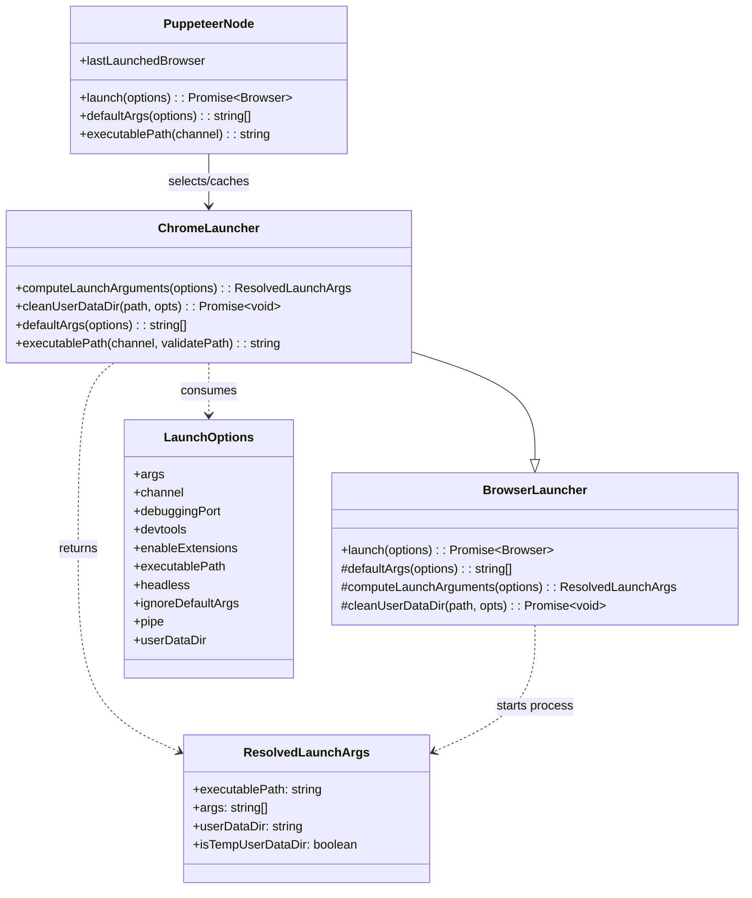
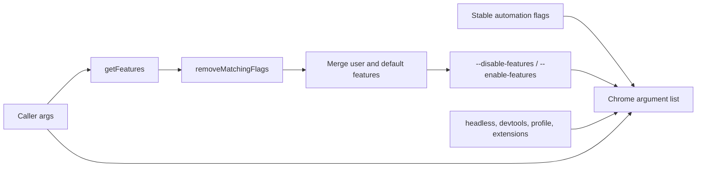
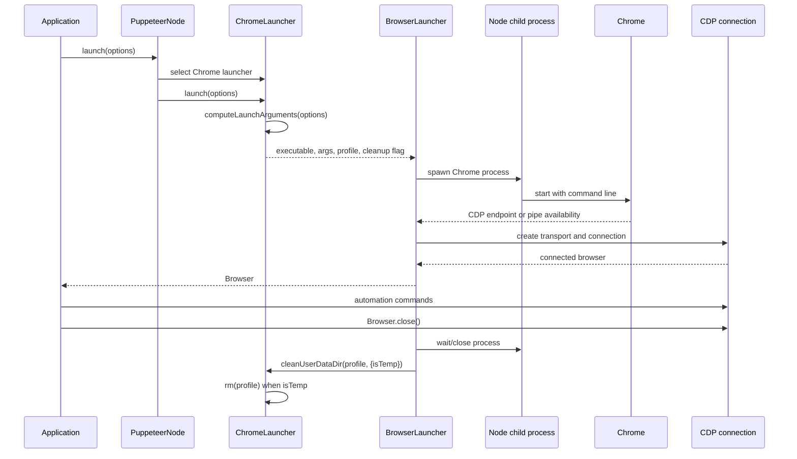
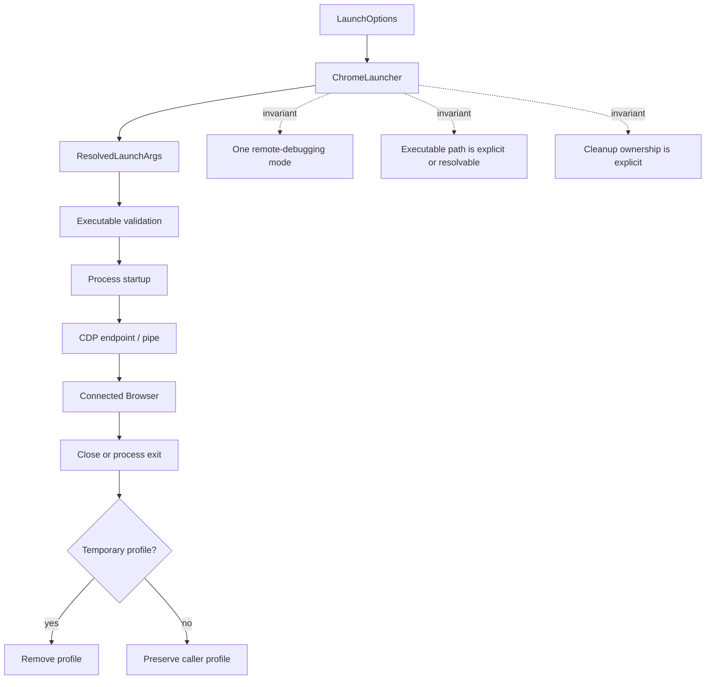

# Launch and connect Chrome

## Introduction

The `launch_and_connect_chrome` module adapts Puppeteer's shared Node launch pipeline to Google Chrome and Chrome for Testing. Its `ChromeLauncher` class converts `LaunchOptions` into a validated Chrome executable path, a complete command-line argument list, and a user-data directory policy. It also removes temporary profiles after the browser process exits.

This module does not own browser installation, cache layout, process spawning, CDP transport, or page automation. Those concerns are delegated to [browser acquisition and cache](browser_acquisition_and_cache.md), [browser process lifecycle](browser_process_lifecycle.md), [launch and connect orchestration](launch_and_connect_orchestration.md), and the protocol/API modules.

## Position in the system

`ChromeLauncher` is selected by `PuppeteerNode` when the requested browser is Chrome or when Chrome is the configured default. The common `BrowserLauncher.launch()` method invokes the two Chrome-specific hooks documented here, then continues with process startup and connection establishment.



The module is the Chrome-specific child of `launch_and_connect_orchestration`. Firefox uses an analogous child launcher with different flags, profile rules, and protocol behavior; see [launch and connect Firefox](launch_and_connect_firefox.md).

## Responsibilities

| Component | Responsibility |
| --- | --- |
| `ChromeLauncher.computeLaunchArguments()` | Merge defaults and caller arguments, choose pipe versus debugging-port mode, create or reuse a profile, and resolve the executable. |
| `ChromeLauncher.cleanUserDataDir()` | Remove a launcher-created temporary profile after shutdown or failed startup. |
| `ChromeLauncher.defaultArgs()` | Build Puppeteer's standard Chrome flags, including headless, DevTools, extension, feature, profile, and initial-page arguments. |
| `ChromeLauncher.executablePath()` | Resolve a system Chrome channel or a Puppeteer-managed executable. |
| `getFeatures()` | Extract comma-separated feature values from repeated `--enable-features` or `--disable-features` flags. |
| `removeMatchingFlags()` | Remove matching feature flags in-place before the values are merged with Puppeteer's defaults. |

The inherited orchestration remains responsible for validating the resulting executable, starting the child process, discovering the endpoint, constructing the browser connection, waiting for the initial page when configured, and closing the process. See [launch and connect orchestration](launch_and_connect_orchestration.md).

## Architecture and component relationships



### `computeLaunchArguments()`

This method is the main Chrome-specific launch contract.

1. It reads `ignoreDefaultArgs`, `args`, `pipe`, `debuggingPort`, `channel`, and `executablePath` from `LaunchOptions`.
2. Unless defaults are ignored, it starts with `defaultArgs(options)`. When `ignoreDefaultArgs` is an array, it removes only the listed defaults. When it is `true`, it uses the caller's arguments as-is.
3. It ensures that Chrome has exactly one launch mechanism for remote control when the caller did not supply a `--remote-debugging-*` flag:
   - `pipe: true` adds `--remote-debugging-pipe`;
   - otherwise it adds `--remote-debugging-port=<debuggingPort || 0>`.
4. It finds an existing `--user-data-dir` argument. If none exists, it creates a temporary directory below the launcher profile path using `mkdtemp()` and marks it as temporary.
5. It chooses the executable. An explicit `executablePath` wins. Otherwise, Puppeteer Core requires a `channel`; the full Puppeteer package may resolve the managed executable for the selected headless mode.
6. It returns the executable, final arguments, profile path, and cleanup ownership flag.

The method deliberately preserves a caller-supplied user-data directory. Only profiles created by this method are eligible for automatic deletion.

```mermaid
flowchart TD
    Start[LaunchOptions] --> Defaults{ignoreDefaultArgs?}
    Defaults -->|false| Base[defaultArgs(options)]
    Defaults -->|array| Filter[defaultArgs minus listed flags]
    Defaults -->|true| UserArgs[Caller args only]
    Base --> Debug{Remote debugging flag present?}
    Filter --> Debug
    UserArgs --> Debug
    Debug -->|no + pipe| Pipe[Add --remote-debugging-pipe]
    Debug -->|no + port| Port[Add --remote-debugging-port=port or 0]
    Debug -->|yes| Profile
    Pipe --> Profile{--user-data-dir present?}
    Port --> Profile
    Profile -->|no| Temp[mkdtemp profile; isTempUserDataDir=true]
    Profile -->|yes| Existing[Use supplied profile; isTempUserDataDir=false]
    Temp --> Executable
    Existing --> Executable
    Executable{Explicit executablePath?} -->|yes| Return[ResolvedLaunchArgs]
    Executable -->|no + channel| Channel[Resolve system Chrome channel]
    Executable -->|no, managed install| Managed[Resolve Puppeteer-managed executable]
    Channel --> Return
    Managed --> Return
```

### `defaultArgs()` and Chrome launch policy

`defaultArgs()` creates the baseline command line used by Chrome launches. The flags reduce environmental variability and disable browser behaviors that are not useful for automation, such as background networking, first-run prompts, sync, crash reporting, and popup blocking. It also enables automation-related behavior and tagged PDF output.

Feature flags receive special treatment. User values are extracted from repeated `--disable-features=...` and `--enable-features=...` arguments, the original matching arguments are removed from the caller array, and the values are merged into Puppeteer's defaults. The default disabled set includes `Translate`, `AcceptCHFrame`, `MediaRouter`, and `OptimizationHints`; additional isolation/process features are disabled unless the test environment variable `PUPPETEER_TEST_EXPERIMENTAL_CHROME_FEATURES` is `true`. `PdfOopif` is enabled by default.

Option-dependent flags are appended as follows:

| Option | Result |
| --- | --- |
| `userDataDir` | Adds an absolute `--user-data-dir` path. |
| `devtools` | Adds `--auto-open-devtools-for-tabs`. |
| `headless: true` | Adds `--headless=new`, `--hide-scrollbars`, and `--mute-audio`. |
| `headless: 'shell'` | Adds `--headless`, `--hide-scrollbars`, and `--mute-audio`. |
| `enableExtensions: true` | Adds `--enable-unsafe-extension-debugging`; otherwise extensions are disabled. |
| Arguments contain only flags | Adds `about:blank` so Chrome has an initial navigation target. |
| `args` contains a URL or other non-flag | Appends caller arguments without adding `about:blank`. |

The feature-merging helpers are intentionally small but important: they permit callers to extend the default feature lists without accidentally producing multiple competing values for the same Chrome flag.



### Executable resolution

`ChromeLauncher.executablePath(channel, validatePath)` has two paths:

- With a channel (`chrome`, `chrome-dev`, `chrome-beta`, or `chrome-canary`), it maps the Puppeteer channel to `@puppeteer/browsers`'s Chrome release channel and calls `computeSystemExecutablePath()`. This selects a locally installed system Chrome channel.
- Without a channel, it delegates to `resolveExecutablePath()`, which resolves the configured or downloaded browser from Puppeteer's cache and optionally validates the path.

`computeLaunchArguments()` applies an additional Core-specific rule: if no executable is supplied, `puppeteer-core` requires a channel. The full `puppeteer` package can resolve its managed executable, while Core intentionally does not assume that a browser was downloaded.

Browser downloads, revisions, cache locations, and installation failures are documented in [browser acquisition and cache](browser_acquisition_and_cache.md) and [browser artifact metadata](browser_artifact_metadata.md).

## Launch and cleanup process



`cleanUserDataDir(path, {isTemp})` is deliberately conditional. For a temporary profile, it calls the launcher's filesystem removal helper and logs the error through `debugError()` before rethrowing it. For a caller-owned profile, it performs no removal. The common launcher registers this cleanup with process shutdown handling, so it covers both normal browser exit and startup failures; see [browser process lifecycle](browser_process_lifecycle.md).

## Component interaction and invariants



Important invariants for maintainers:

- A caller-provided `--remote-debugging-*` flag is respected; otherwise the launcher supplies pipe or port mode.
- Pipe and `debuggingPort` are mutually exclusive. The assertion prevents an ambiguous startup configuration.
- Every launch has a user-data directory: either the caller's directory or a newly created temporary one.
- A temporary directory is deleted only when `isTempUserDataDir` is true.
- In `puppeteer-core`, an implicit managed executable is not assumed when no explicit path or channel is given.
- Feature values are normalized into one generated enable flag and one generated disable flag.

## Failure behavior and troubleshooting

| Symptom | Likely source | What to inspect |
| --- | --- | --- |
| Error about missing executable | No explicit path, invalid channel installation, or missing managed browser | `executablePath`, selected channel, and [browser acquisition and cache](browser_acquisition_and_cache.md) |
| Assertion about pipe and port | `pipe: true` combined with `debuggingPort` | Use one endpoint mode only. |
| Malformed `--user-data-dir` assertion | A manually supplied argument has no value after `=` | Pass `--user-data-dir=/absolute/path` or use `userDataDir`. |
| Chrome starts but no connection is made | Process/endpoint discovery or CDP transport issue | [browser process lifecycle](browser_process_lifecycle.md) and [launch and connect orchestration](launch_and_connect_orchestration.md) |
| Temporary profile remains | Cleanup failed during process shutdown | Enable warning/debug logging and inspect the cleanup error from `rm`. |
| Slow Chrome on Apple Silicon | x64 Node is launching on an Apple Silicon Mac | Run Puppeteer with an arm64 Node installation. |

On macOS, Chrome launches print a warning when Node is x64 on Apple Silicon and the configured log level is `warn`. The warning explains that Rosetta may translate the Chrome process and recommends an arm64 Node build.

## Maintenance guidance

Changes to shared startup, endpoint discovery, transport selection, or shutdown should be made in [launch and connect orchestration](launch_and_connect_orchestration.md). Changes to Chrome flags, feature defaults, channel mapping, executable selection, or temporary profile semantics belong in `ChromeLauncher`.

When changing a default flag, check its interaction with `ignoreDefaultArgs`, `getFeatures()`, and caller-provided `args`. When changing profile handling, preserve the ownership invariant so user data is never deleted unless the launcher created it. When changing endpoint flags, keep the pipe/port assertion aligned with the connection path implemented by the common launcher.

## Related modules

- [Launch and connect orchestration](launch_and_connect_orchestration.md) — shared launch, connection, initial-page, and shutdown pipeline.
- [Launch and connect Firefox](launch_and_connect_firefox.md) — sibling browser-specific launcher.
- [Browser acquisition and cache](browser_acquisition_and_cache.md) — downloads, installed browser paths, and cache management.
- [Browser artifact metadata](browser_artifact_metadata.md) — browser build IDs, download URLs, and executable layouts.
- [Browser process lifecycle](browser_process_lifecycle.md) — child-process startup, endpoint discovery, and exit handling.
- [Protocol transport and session infrastructure](protocol_transport_and_session_infrastructure.md) — CDP/BiDi transports and sessions used after Chrome starts.

