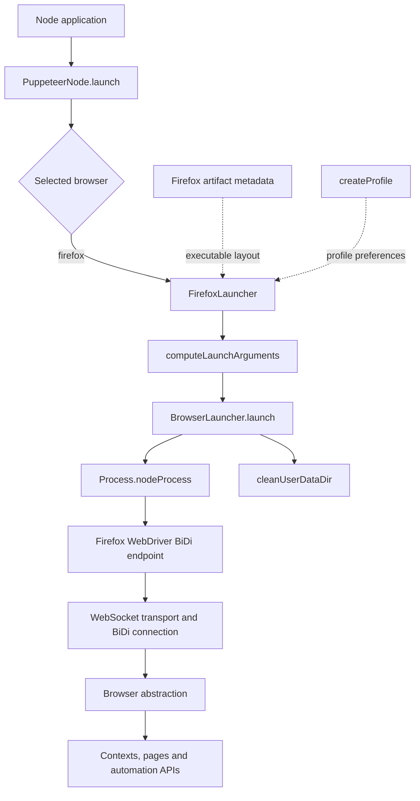
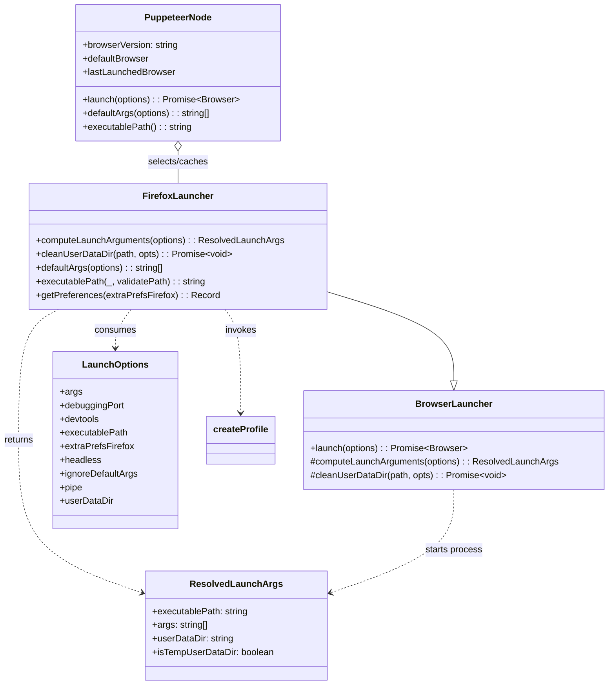
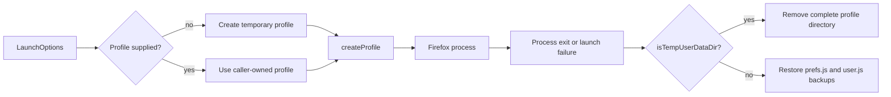
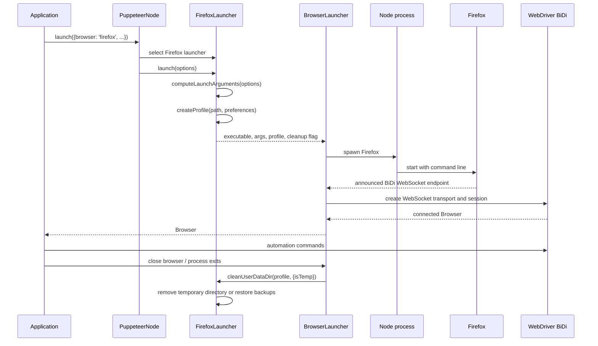

# Launch and connect Firefox

## Introduction

The `launch_and_connect_firefox` module is Puppeteer's Firefox-specific launch adapter. `FirefoxLauncher` translates `LaunchOptions` into Firefox command-line arguments, creates or prepares the browser profile, resolves the executable, and restores or removes profile data when the browser exits.

It is a focused child module of [launch and connect orchestration](launch_and_connect_orchestration.md). It does not download Firefox, define browser artifact metadata, spawn the operating-system process, discover the WebDriver BiDi endpoint, create protocol sessions, or expose page automation APIs. Those responsibilities remain in [browser acquisition and cache](browser_acquisition_and_cache.md), [browser artifact metadata](browser_artifact_metadata.md), [browser process lifecycle](browser_process_lifecycle.md), and [protocol transport and session infrastructure](protocol_transport_and_session_infrastructure.md).

## Position in the system

`PuppeteerNode` selects this launcher when `options.browser` or the configured default browser is Firefox. The shared `BrowserLauncher.launch()` method calls `computeLaunchArguments()`, starts Firefox, connects through the selected protocol path, and later invokes `cleanUserDataDir()`.



The sibling Chrome-specific behavior is documented in [launch and connect Chrome](launch_and_connect_chrome.md). Shared selection, launch, connection, initial-page waiting, and shutdown behavior is documented in [launch and connect orchestration](launch_and_connect_orchestration.md).

## Responsibilities

| Component | Responsibility |
| --- | --- |
| `FirefoxLauncher.computeLaunchArguments()` | Merge Firefox defaults and caller arguments, ensure a remote-debugging port, create or reuse a profile, apply Firefox preferences, and resolve the executable. |
| `FirefoxLauncher.getPreferences()` | Merge caller preferences and force `fission.webContentIsolationStrategy` to `0` for Puppeteer's Firefox launch path. |
| `FirefoxLauncher.defaultArgs()` | Produce platform-, profile-, headless-, DevTools-, and initial-page arguments. |
| `FirefoxLauncher.executablePath()` | Delegate executable resolution to the inherited launcher using Firefox's artifact rules. |
| `FirefoxLauncher.cleanUserDataDir()` | Delete launcher-created temporary profiles or restore backed-up preference files in caller-owned profiles. |
| `createProfile()` | Create the profile directory and persist deterministic Firefox preferences; its backup and preference semantics are described in [browser artifact metadata](browser_artifact_metadata.md). |

## Architecture and component relationships



## Launch argument computation

### `computeLaunchArguments(options)`

This method is the Firefox-specific launch contract:

1. Read `ignoreDefaultArgs`, `args`, `executablePath`, `pipe`, `extraPrefsFirefox`, and `debuggingPort`.
2. Build the initial argument list. Normally this is `defaultArgs(options)`. If `ignoreDefaultArgs` is an array, only those default entries are filtered out. If it is `true`, the caller's `args` are used directly.
3. If no argument starts with `--remote-debugging-`, add `--remote-debugging-port=<debuggingPort || 0>`.
4. If `pipe` is also enabled in this branch, assert that `debuggingPort` is `null`; Firefox's implementation still selects a debugging port rather than adding Chrome's `--remote-debugging-pipe` flag. Native Firefox BiDi uses the WebSocket endpoint path handled by the common launcher.
5. Locate `-profile` or `--profile`. A value is required after the flag. If no profile flag exists, create a temporary directory with `mkdtemp(this.getProfilePath())` and append the profile flag and path.
6. Call `createProfile()` with Firefox preferences. The forced fission preference is applied after caller preferences, so it cannot be overridden through `extraPrefsFirefox`.
7. Use an explicit `executablePath` for `puppeteer-core` and for all callers that provide one. Otherwise resolve Puppeteer's managed Firefox executable.
8. Return the executable, arguments, profile path, and whether the profile is temporary.

```mermaid
flowchart TD
    Start[LaunchOptions] --> Defaults{ignoreDefaultArgs}
    Defaults -->|false| Base[defaultArgs(options)]
    Defaults -->|array| Filter[Filter listed default arguments]
    Defaults -->|true| Caller[Use caller args]
    Base --> Debug{Remote-debugging flag exists?}
    Filter --> Debug
    Caller --> Debug
    Debug -->|yes| Profile{Profile flag exists?}
    Debug -->|no| Port[Add --remote-debugging-port=debuggingPort or 0]
    Port --> Profile
    Profile -->|yes| Existing[Use supplied profile; isTemp=false]
    Profile -->|no| Temp[mkdtemp profile; append --profile; isTemp=true]
    Existing --> Prefs[createProfile with Firefox preferences]
    Temp --> Prefs
    Prefs --> Executable{Core or explicit executablePath?}
    Executable -->|yes| Explicit[Require/use executablePath]
    Executable -->|no| Managed[Resolve managed Firefox executable]
    Explicit --> Return[ResolvedLaunchArgs]
    Managed --> Return
```

### Remote debugging behavior

Firefox receives a remote-debugging port whenever the caller has not already supplied an argument beginning with `--remote-debugging-`. A requested `debuggingPort` is used as-is; otherwise `0` requests an available ephemeral port. The common orchestration layer reads Firefox's announced WebSocket endpoint and creates the native BiDi connection. See [launch and connect orchestration](launch_and_connect_orchestration.md) for endpoint matching and transport construction.

The `pipe`/port assertion prevents contradictory options when the launcher is responsible for adding the debugging argument. It should not be interpreted as Firefox support for Chrome's remote-debugging-pipe protocol: Firefox's computed arguments contain a port flag, and native Firefox BiDi is connected over WebSocket.

### Default arguments

`defaultArgs()` constructs a small Firefox-specific baseline:

| Condition | Arguments |
| --- | --- |
| macOS | `--foreground` |
| Windows | `--wait-for-browser` |
| `userDataDir` supplied | `--profile <userDataDir>` |
| Headless mode (default unless `devtools` is true) | `--headless` |
| `devtools: true` | `--devtools` |
| Every caller argument starts with `-` | `about:blank` |
| Any caller arguments | Appended after the generated defaults |

The initial `about:blank` target is added only when the argument list contains flags exclusively. A caller-supplied URL or other non-flag argument therefore remains the initial navigation target. `devtools` changes the default for `headless` through `headless = !devtools`, but an explicitly supplied `headless` value still controls the result.

## Profile preparation and preference policy

`FirefoxLauncher.getPreferences()` starts with `extraPrefsFirefox` and then sets:

```text
fission.webContentIsolationStrategy = 0
```

The single-content-process setting is a compatibility workaround for Firefox mouse-event dispatch in the main-frame context. It is intentionally enforced by the launcher. Directory creation, preference-file writing, and backup creation are delegated to `createProfile()`; see [browser artifact metadata](browser_artifact_metadata.md) rather than duplicating those mechanics here.

Profile ownership is tracked by `isTempUserDataDir`:



## Cleanup behavior

### Temporary profiles

When `isTemp` is true, `cleanUserDataDir()` calls the launcher's `rm()` helper on the entire profile directory. Cleanup errors are passed to `debugError()` and rethrown, allowing the shared lifecycle code to report a genuine cleanup failure.

### Caller-owned profiles

When `isTemp` is false, the directory is preserved. For each of `prefs.js` and `user.js`, the launcher checks for a `.puppeteer` backup, removes the generated live file, and renames the backup back to its original name. The two restore operations run with `Promise.allSettled()`; a rejected operation is rethrown from the aggregate processing, then logged through `debugError()`.

This means Firefox cleanup has a different contract from Chrome cleanup: a temporary Firefox profile is deleted, while a supplied profile is repaired after Puppeteer's preference injection. The caller's profile directory itself is never removed.

## Launch and cleanup process



## Invariants and failure modes

Important invariants:

- Firefox always has a profile path by the time `computeLaunchArguments()` returns.
- A profile created by the launcher is the only profile eligible for recursive removal.
- A caller-owned profile is preserved and preference backups are restored when available.
- A remote-debugging argument is added only when the caller did not provide one.
- `--profile` without a following value fails before Firefox is spawned.
- `puppeteer-core` requires an explicit `executablePath`; the full Puppeteer package may resolve its managed Firefox executable.
- The fission preference is always set to `0` by `getPreferences()`.

| Symptom | Likely cause | What to inspect |
| --- | --- | --- |
| Missing `executablePath` error | `puppeteer-core` launch without an executable | Pass `executablePath` and verify it exists; see [browser acquisition and cache](browser_acquisition_and_cache.md). |
| `Missing value for profile command line argument` | `-profile` or `--profile` was supplied without a path | Supply the path as the next argument or use `userDataDir`. |
| Pipe and debugging-port assertion | `pipe: true` combined with a non-null `debuggingPort` while no remote-debugging flag was supplied | Use one endpoint configuration. |
| Firefox starts but connection times out | Endpoint output, process lifecycle, or BiDi transport problem | See [browser process lifecycle](browser_process_lifecycle.md) and [launch and connect orchestration](launch_and_connect_orchestration.md). |
| User profile changes remain after launch | Preference backup restoration failed or no backup existed | Inspect debug logging and the profile's `.puppeteer` backup files. |
| Temporary profile remains | Recursive cleanup failed during shutdown | Inspect the cleanup error reported through `debugError()`. |

## Maintenance guidance

Changes to browser selection, endpoint discovery, BiDi connection creation, initial-page waiting, or process shutdown belong in [launch and connect orchestration](launch_and_connect_orchestration.md). Changes to Firefox flags, profile detection, forced preferences, executable selection, or backup restoration belong in `FirefoxLauncher`.

When modifying profile handling, preserve the `isTempUserDataDir` ownership invariant. When changing preference generation, verify both newly created profiles and caller-owned profiles, including restoration after failed startup. When changing debugging options, keep the assertion and the common Firefox BiDi connection path consistent.

## Related modules

- [Launch and connect orchestration](launch_and_connect_orchestration.md) — shared launch, Firefox BiDi connection, initial-page, and shutdown pipeline.
- [Launch and connect Chrome](launch_and_connect_chrome.md) — sibling browser-specific launcher.
- [Browser acquisition and cache](browser_acquisition_and_cache.md) — Firefox downloads, cache locations, and installed executable lookup.
- [Browser artifact metadata](browser_artifact_metadata.md) — Firefox build IDs, download URLs, executable layout, and `createProfile()` behavior.
- [Browser process lifecycle](browser_process_lifecycle.md) — child-process startup, endpoint discovery, signals, and termination.
- [Protocol transport and session infrastructure](protocol_transport_and_session_infrastructure.md) — WebSocket, BiDi, CDP, and session mechanics used after Firefox starts.
- [Protocol-neutral public automation API](protocol_neutral_public_automation_api.md) — browser, context, page, frame, target, and worker APIs returned after connection.
