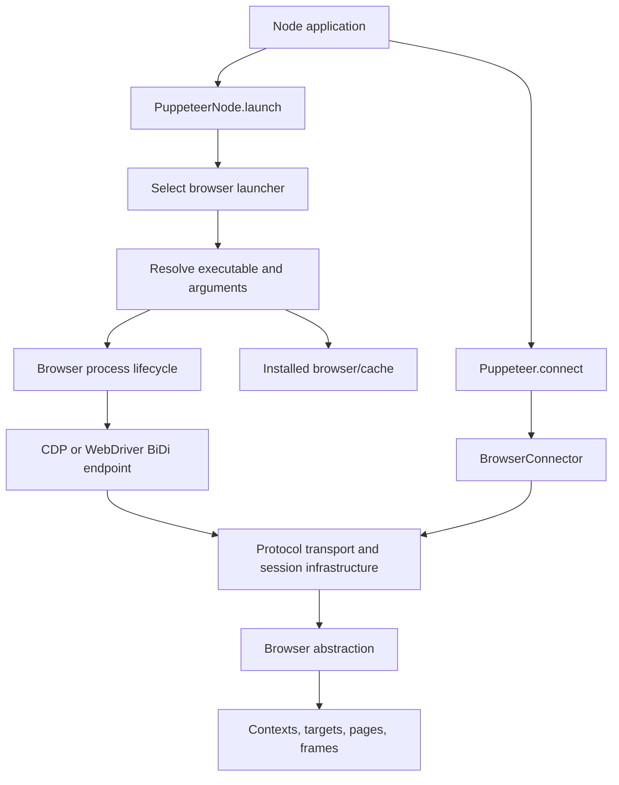
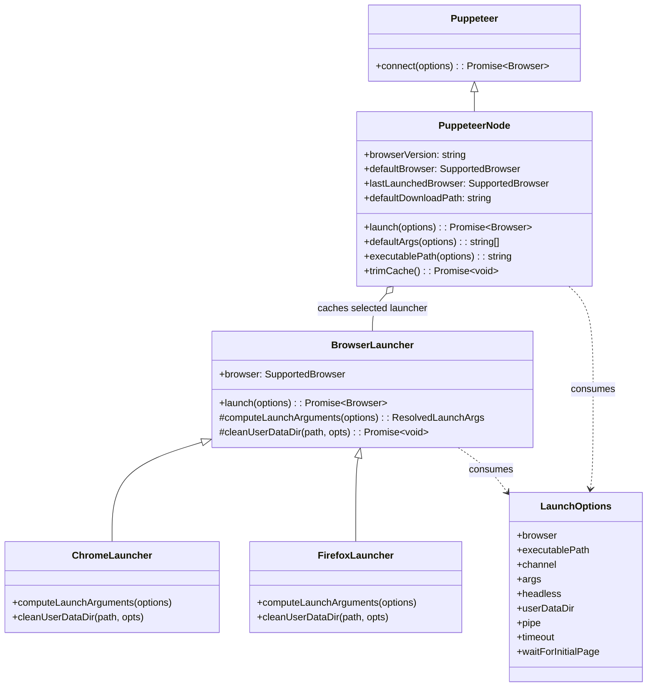
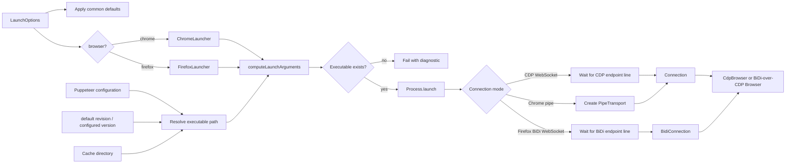
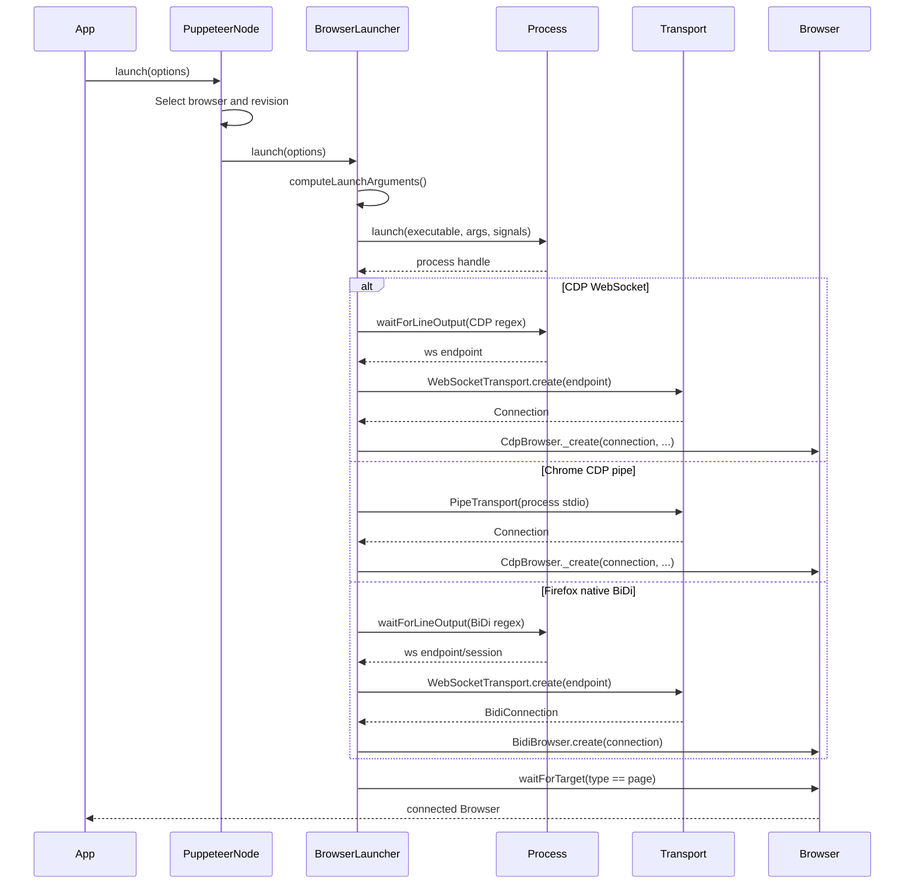
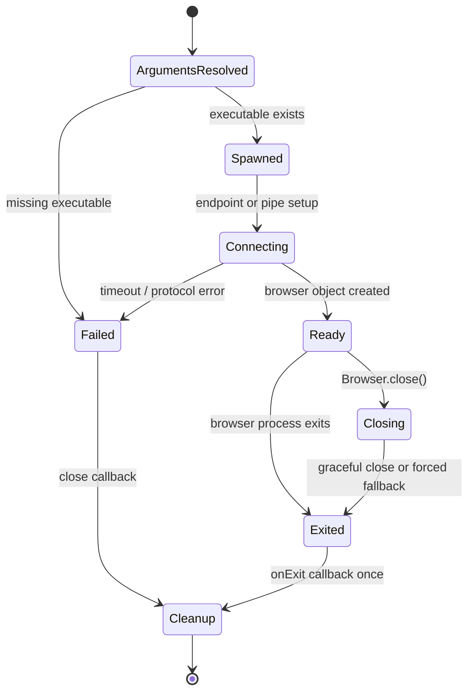

# Launch and connect orchestration

## Introduction

The `launch_and_connect_orchestration` module coordinates the transition from a Puppeteer launch or connect request to a usable `Browser` object. It is the Node-facing control plane for browser startup: it selects Chrome or Firefox, resolves the executable and launch arguments, delegates operating-system process management, discovers the selected automation endpoint, creates the appropriate protocol connection, and owns normal shutdown.

The module does not download browser artifacts, implement browser-specific metadata, or expose page automation APIs. Those responsibilities are delegated to [browser acquisition and cache](browser_acquisition_and_cache.md), [browser artifact metadata](browser_artifact_metadata.md), the browser-specific child pages [Chrome launch](launch_and_connect_chrome.md) and [Firefox launch](launch_and_connect_firefox.md), and the protocol/session modules.

## Position in the system



At a higher level, the module is a child of the `launch_and_connect` capability. It is consumed by the public automation API: once the returned `Browser` exists, page, context, target, network, input, and evaluation behavior belongs to the protocol-neutral API and its CDP/BiDi implementations.

## Responsibilities and boundaries

| Component | Responsibility | Delegates to |
| --- | --- | --- |
| `Puppeteer.connect(options)` | Attach to an already-running browser using connection options. | `BrowserConnector._connectToBrowser` and protocol transports |
| `PuppeteerNode.launch(options)` | Choose the browser, update browser revision state, cache/reuse a launcher, and start orchestration. | `ChromeLauncher` or `FirefoxLauncher` |
| `PuppeteerNode.defaultArgs()` | Return browser-specific default command-line arguments. | Selected `BrowserLauncher` |
| `PuppeteerNode.executablePath()` | Resolve a configured executable, release-channel executable, or cached executable. | Selected launcher and browser cache |
| `PuppeteerNode.browserVersion` | Select configured browser version or Puppeteer’s pinned revision. | Configuration and revisions |
| `PuppeteerNode.trimCache()` | Remove stale managed Chrome/Firefox builds while retaining current builds. | Browser cache enumeration and uninstall |
| `BrowserLauncher.launch()` | Execute the common launch pipeline and build a connected `Browser`. | Process lifecycle, transports, CDP/BiDi browser factories |
| `LaunchOptions` | Define browser selection, executable, protocol, process, profile, timeout, and startup behavior. | Chrome/Firefox launchers |

The launcher is intentionally the seam between policy and mechanism. `PuppeteerNode` decides which launcher and revision apply; the selected launcher computes browser-specific arguments; `BrowserLauncher` performs the protocol-independent orchestration; and `Process` performs the OS-level work.

## Architecture



### `PuppeteerNode` as the policy façade

`PuppeteerNode` extends the common `Puppeteer` class. Its constructor normalizes the configured default browser to Chrome unless Firefox is explicitly configured and binds the public methods for safe use as callbacks.

`launch()` chooses `options.browser` or `defaultBrowser`, records it as `lastLaunchedBrowser`, selects the corresponding pinned revision, obtains a matching launcher, and delegates to `BrowserLauncher.launch()`. Unknown browser names fail immediately. The launcher instance is reused only when its browser type matches; switching between Chrome and Firefox creates a new launcher.

Executable resolution follows this order:

1. A caller/configuration-provided `executablePath`, if present.
2. A system Chrome executable when a Chrome release `channel` is requested.
3. The cached browser executable computed from the browser type, cache directory, and `browserVersion`.

When validation is enabled, a missing executable produces an actionable error. The error distinguishes a missing configured path from a missing Puppeteer-managed Chrome or Firefox installation. Installation and cache layout are documented in [browser acquisition and cache](browser_acquisition_and_cache.md).

`defaultArgs()` is not a static global list: it delegates to the launcher selected by `options.browser` or `lastLaunchedBrowser`. `product` remains as a deprecated alias for `lastLaunchedBrowser`.

### `BrowserLauncher` as the common pipeline

`BrowserLauncher.launch()` applies common defaults, including a 30-second startup timeout, inherited environment, default viewport, signal handling, network enablement, and waiting for the initial page. Firefox defaults to WebDriver BiDi; explicitly requesting CDP for Firefox is rejected. Firefox WebDriver BiDi over a pipe is also rejected because that combination is unsupported.

The launcher then calls the browser-specific `computeLaunchArguments()`. The result contains:

```typescript
interface ResolvedLaunchArgs {
  isTempUserDataDir: boolean;
  userDataDir: string;
  executablePath: string;
  args: string[];
}
```

The executable must exist before the child process is started. Profile cleanup is registered as the process exit callback, so temporary user-data directories are removed when startup fails or the browser later exits.

## Launch data flow



The process layer supplies endpoint discovery and child-process state; see [browser process lifecycle](browser_process_lifecycle.md). The resulting transport and session objects are described in [protocol transport and session infrastructure](protocol_transport_and_session_infrastructure.md). Browser-specific argument construction and profile handling are intentionally kept in the child pages linked above.

## Protocol selection and connection behavior

There are two entry paths:

### Launching a new browser

After `Process.launch()` returns, the launcher chooses one of three connection paths:

- CDP over WebSocket: wait for the CDP WebSocket announcement, create `NodeWebSocketTransport`, then construct `Connection`.
- CDP over pipe: read the extra process stdio streams and construct `PipeTransport` and `Connection`.
- WebDriver BiDi: wait for the BiDi WebSocket announcement, append `/session`, create a WebSocket transport, and construct `BidiConnection`.

Chrome may also expose BiDi over an existing CDP connection. In that case the launcher creates a BiDi-over-CDP bridge and a `BidiBrowser` that retains the underlying CDP connection. Native Firefox BiDi creates its browser through the standalone BiDi connection.



### Connecting to an existing browser

`Puppeteer.connect(options)` does not select an executable or spawn a process. It forwards `ConnectOptions` to `_connectToBrowser`, which creates the appropriate connection from the caller’s endpoint/transport settings. Since there is no launcher-owned process, disconnect and close semantics are determined by the connector and the connected browser implementation rather than by `BrowserLauncher`.

## Process lifecycle and cleanup



The close callback guards against duplicate shutdown requests. With an active CDP connection, the launcher first asks the browser to close gracefully and waits for the process; if that fails, it force-closes the process. Without a CDP connection, it waits briefly for natural exit and then closes the process. Startup errors invoke the same callback so temporary profiles and process resources are not leaked.

If the initial page is required, `waitForPageTarget()` waits for a page target after the browser object is created. A timeout or other failure closes the browser before propagating the error. This makes a successful `launch()` mean more than “the executable spawned”: the selected protocol is connected and, by default, an initial page target is available.

## Configuration and observable state

| API/state | Meaning |
| --- | --- |
| `defaultBrowser` | Browser selected by configuration, otherwise Chrome. |
| `lastLaunchedBrowser` | Browser type used by the most recent launch, or the default before any launch. |
| `browserVersion` | Configured browser version or the pinned Puppeteer revision for the active browser. |
| `defaultDownloadPath` | Configured cache directory used for managed browser resolution. |
| `executablePath()` | Best-effort default path resolution; launcher-specific overloads support channels and launch options. |
| `defaultArgs()` | Browser-specific arguments after applying the selected launcher’s rules. |
| `trimCache()` | Removes non-current managed Chrome and Firefox builds from the configured cache. |

`trimCache()` resolves current build IDs before uninstalling stale installations and leaves browser types outside Puppeteer’s managed set untouched. It is therefore a cache maintenance operation, not part of every launch.

## Failure modes and diagnostics

| Failure point | Behavior |
| --- | --- |
| Unknown `browser` | `PuppeteerNode.launch()` throws before spawning. |
| Missing executable | Launch fails with the configured path or cache/install guidance. |
| Firefox with `protocol: 'cdp'` | Rejected because this orchestration path supports Firefox BiDi. |
| Firefox BiDi with `pipe: true` | Rejected because native BiDi requires WebSocket transport. |
| Endpoint timeout | Process timeout is translated into Puppeteer’s `TimeoutError`; shutdown is attempted. |
| Initial page timeout | Browser is closed and the target-wait error is propagated. |
| Extension paths with Chrome socket mode | Rejected; extension loading requires Chrome pipe mode. |
| Protocol construction failure | Close callback runs, then the original error is rethrown. |

For endpoint discovery, process output and signal handling, see [browser process lifecycle](browser_process_lifecycle.md). For missing artifacts and cache paths, see [browser acquisition and cache](browser_acquisition_and_cache.md). For artifact-specific build and executable rules, see [browser artifact metadata](browser_artifact_metadata.md).

## Related modules

- [browser acquisition and cache](browser_acquisition_and_cache.md): downloads, installation, cache layout, and executable lookup.
- [browser artifact metadata](browser_artifact_metadata.md): browser-specific build IDs, URLs, and relative executable paths.
- [browser process lifecycle](browser_process_lifecycle.md): child-process creation, endpoint output, signals, and termination.
- [launch and connect](launch_and_connect.md): the parent capability that groups public launch/connect behavior.
- [launch and connect — Chrome](launch_and_connect_chrome.md): Chrome arguments, channels, profiles, and cleanup.
- [launch and connect — Firefox](launch_and_connect_firefox.md): Firefox arguments, profiles, and cleanup.
- [protocol transport and session infrastructure](protocol_transport_and_session_infrastructure.md): CDP, pipe, WebSocket, and BiDi transport/session mechanics.
- [protocol-neutral public automation API](protocol_neutral_public_automation_api.md): the `Browser`, context, page, frame, target, and worker APIs returned after connection.
