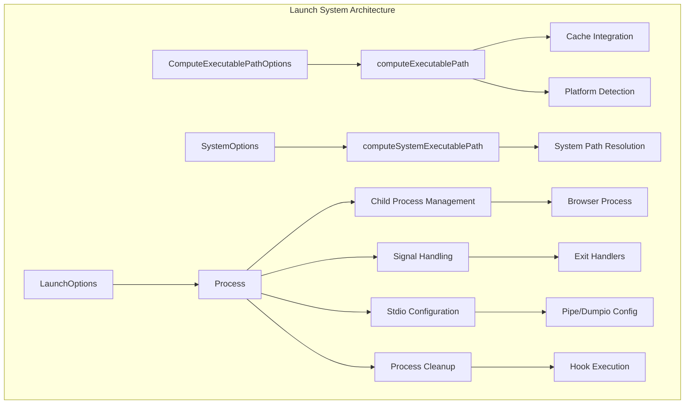
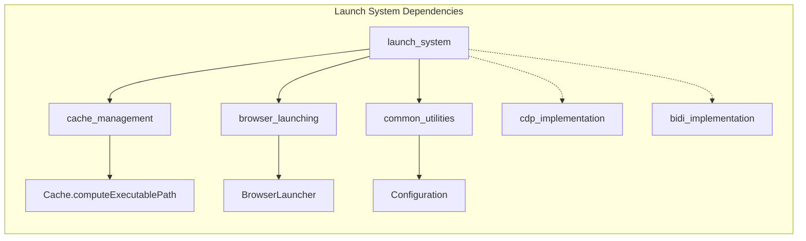
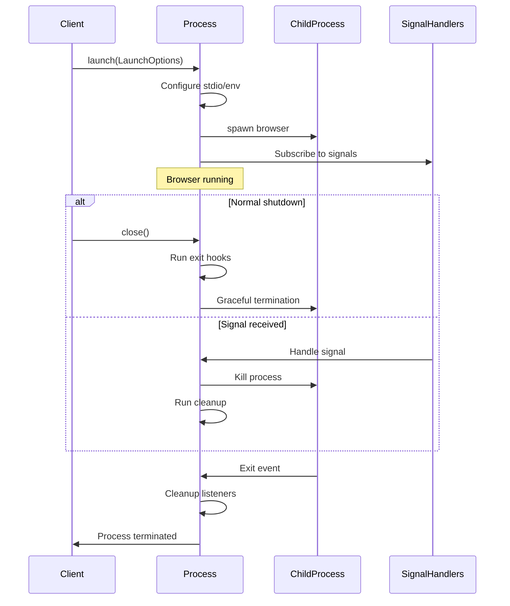
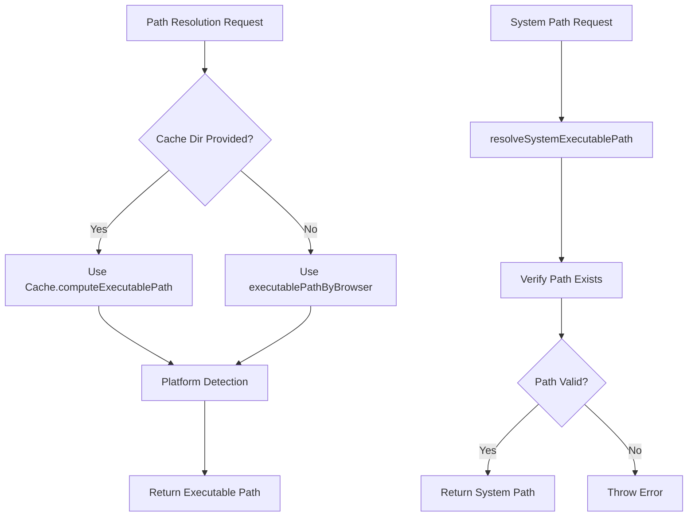

# Launch System Module

The launch_system module is a critical component of the Puppeteer browser management system, responsible for launching and managing browser processes with comprehensive configuration options and lifecycle management.

## Overview

The launch_system module provides the core functionality for:
- Computing executable paths for browsers
- Launching browser processes with configurable options
- Managing browser process lifecycle and cleanup
- Handling system signals and process termination
- Supporting both cached and system-wide browser installations

## Architecture



## Core Components

### LaunchOptions Interface

The primary configuration interface for browser launching:

```typescript
interface LaunchOptions {
  executablePath: string;      // Absolute path to browser executable
  pipe?: boolean;              // Use stdio streams for automation
  dumpio?: boolean;            // Forward browser stdout/stderr
  args?: string[];             // Additional launch arguments
  env?: Record<string, string | undefined>; // Environment variables
  handleSIGINT?: boolean;      // Handle SIGINT signals
  handleSIGTERM?: boolean;     // Handle SIGTERM signals
  handleSIGHUP?: boolean;      // Handle SIGHUP signals
  detached?: boolean;          // Spawn in detached mode
  onExit?: () => Promise<void>; // Exit callback hook
}
```

### Process Class

The main process management class that handles:
- Browser process spawning and lifecycle
- Signal handling and cleanup
- Stdio configuration
- WebSocket endpoint detection
- Process termination and cleanup hooks

## Component Relationships



## Process Lifecycle Management



## Key Features

### Executable Path Resolution

The module provides multiple strategies for resolving browser executable paths:

1. **Cache-based Resolution**: Uses the cache management system to locate downloaded browsers
2. **System-wide Resolution**: Locates system-installed browsers by channel
3. **Direct Path**: Uses explicitly provided executable paths



### Signal Handling

Comprehensive signal handling for graceful shutdown:

- **SIGINT**: Immediate termination with exit code 130
- **SIGTERM/SIGHUP**: Graceful closure
- **Process Exit**: Cleanup and hook execution

### Stdio Configuration

Flexible stdio configuration supporting:
- **Pipe Mode**: Additional streams for automation protocols
- **Dumpio Mode**: Forward browser output to Node.js process
- **Silent Mode**: Suppress browser output

## Integration Points

### With Cache Management
- Utilizes [cache_management](cache_management.md) for executable path resolution
- Supports both cached and direct executable paths

### With Browser Launching
- Integrates with [browser_launching](browser_launching.md) for browser-specific launch logic
- Provides the foundational process management for browser launchers

### With Protocol Implementations
- Supports WebSocket endpoint detection for CDP and BiDi protocols
- Provides process management for [cdp_implementation](cdp_implementation.md) and [bidi_implementation](bidi_implementation.md)

## WebSocket Endpoint Detection

The module includes regex patterns for detecting protocol endpoints:

```typescript
// CDP WebSocket endpoint detection
const CDP_WEBSOCKET_ENDPOINT_REGEX = /^DevTools listening on (ws:\/\/.*)$/;

// WebDriver BiDi endpoint detection  
const WEBDRIVER_BIDI_WEBSOCKET_ENDPOINT_REGEX = /^WebDriver BiDi listening on (ws:\/\/.*)$/;
```

## Error Handling

Comprehensive error handling for:
- Invalid executable paths
- Process launch failures
- Signal handling errors
- Timeout scenarios during endpoint detection

## Platform Support

Cross-platform support with platform-specific optimizations:
- **Windows**: Uses `taskkill` for process termination
- **Unix-like**: Uses process groups for clean termination
- **Detached Mode**: Platform-specific defaults for process isolation

## Usage Patterns

### Basic Browser Launch
```typescript
const process = launch({
  executablePath: '/path/to/browser',
  args: ['--no-sandbox', '--disable-dev-shm-usage']
});
```

### Advanced Configuration
```typescript
const process = launch({
  executablePath: computeExecutablePath({
    browser: Browser.CHROME,
    buildId: 'latest',
    cacheDir: './browsers'
  }),
  pipe: true,
  dumpio: true,
  handleSIGINT: true,
  onExit: async () => {
    console.log('Browser process exited');
  }
});
```

## Performance Considerations

- **Process Isolation**: Detached mode prevents zombie processes
- **Resource Cleanup**: Automatic cleanup of listeners and handles
- **Signal Propagation**: Efficient signal handling without polling
- **Stdio Management**: Configurable stdio to minimize overhead

The launch_system module serves as the foundation for browser process management in Puppeteer, providing robust, cross-platform process lifecycle management with comprehensive configuration options and error handling.