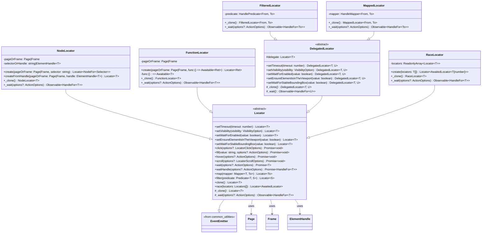
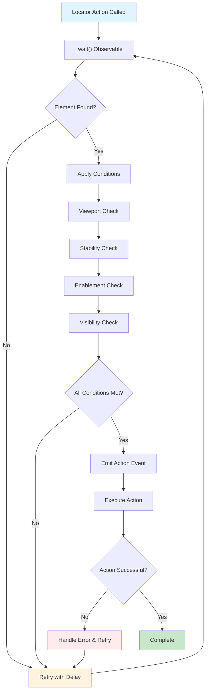
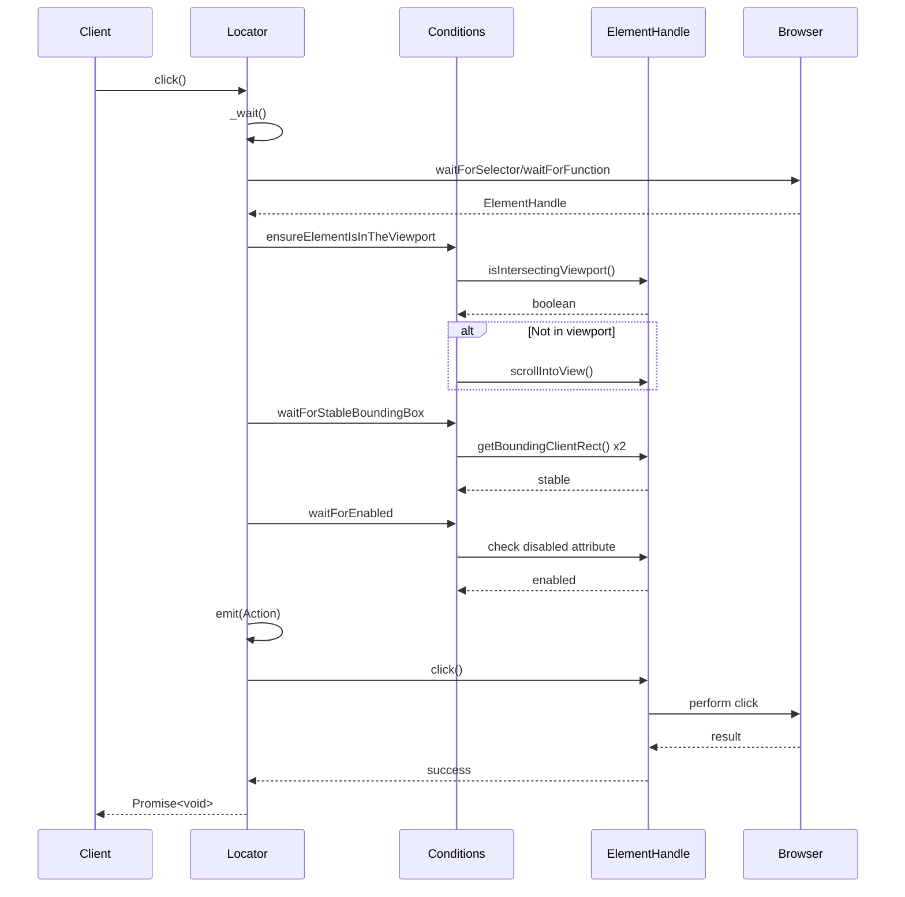

# Locators Module

The Locators module provides a powerful and flexible system for locating and interacting with DOM elements in Puppeteer. It implements a retry-based approach with automatic precondition checking, making web automation more reliable and robust.

## Overview

Locators describe strategies for finding elements and performing actions on them. Unlike traditional element selection methods, locators automatically retry operations when elements are not ready, handle various preconditions (visibility, stability, enablement), and provide a composable API for complex element interactions.

## Architecture



## Core Components

### Locator (Abstract Base Class)

The abstract `Locator<T>` class serves as the foundation for all locator implementations. It provides:

- **Retry Logic**: Automatic retry with configurable delays when operations fail
- **Precondition Checking**: Ensures elements meet requirements before actions
- **Event Emission**: Emits `LocatorEvent.Action` before performing actions
- **Fluent Configuration**: Chainable methods for setting behavior options
- **Action Methods**: High-level methods for common interactions (click, fill, hover, scroll)

#### Key Features

- **Timeout Management**: Configurable timeout with default of 30 seconds
- **Visibility Control**: Wait for elements to be visible, hidden, or ignore visibility
- **Viewport Handling**: Automatic scrolling to ensure elements are in viewport
- **Stability Checking**: Wait for stable bounding boxes between animation frames
- **Enablement Waiting**: Wait for form controls to become enabled

### NodeLocator

Concrete implementation for locating DOM elements using CSS selectors or existing element handles.

```typescript
// Create from selector
const buttonLocator = NodeLocator.create(page, 'button.submit');

// Create from existing handle
const inputLocator = NodeLocator.createFromHandle(page, inputHandle);
```

**Features:**
- Supports both string selectors and ElementHandle instances
- Integrates with Puppeteer's `waitForSelector` functionality
- Handles visibility requirements automatically

### FunctionLocator

Locates elements using custom JavaScript functions executed in the browser context.

```typescript
const customLocator = FunctionLocator.create(page, () => {
  return document.querySelector('.dynamic-element');
});
```

**Use Cases:**
- Complex element selection logic
- Dynamic content that requires custom waiting conditions
- Integration with application-specific element identification

### FilteredLocator

Applies predicates to filter located elements, ensuring they meet specific criteria.

```typescript
const enabledButton = baseLocator.filter(element => !element.disabled);
```

**Capabilities:**
- Value-based filtering using predicates
- Handle-based filtering for complex conditions
- Automatic retry when predicates fail

### MappedLocator

Transforms located elements using mapper functions, enabling element composition and data extraction.

```typescript
const textContent = elementLocator.map(element => element.textContent);
```

**Applications:**
- Data extraction from elements
- Element transformation and composition
- Creating derived locators from base elements

### RaceLocator

Coordinates multiple locators to find the first available element, useful for handling multiple possible element states.

```typescript
const anyButton = Locator.race([
  page.locator('.primary-button'),
  page.locator('.secondary-button'),
  page.locator('.fallback-button')
]);
```

## Data Flow



## Integration with Core API

The locators module integrates deeply with Puppeteer's core API components:

### Page and Frame Integration
- Locators work with both [Page](core_api.md#page) and [Frame](core_api.md#frame) contexts
- Inherit timeout settings from parent page/frame
- Utilize `waitForSelector` and `waitForFunction` capabilities

### ElementHandle Interaction
- Transform selectors into [ElementHandle](core_api.md#elementhandle) instances
- Perform actions through ElementHandle methods
- Handle element lifecycle and disposal

### Event System
- Extend [EventEmitter](common_utilities.md#eventemitter) for action notifications
- Emit events before performing actions for monitoring and debugging

## Action Execution Pipeline



## Configuration Options

### Timeout Configuration
```typescript
const locator = page.locator('.element')
  .setTimeout(5000); // 5 second timeout
```

### Visibility Options
```typescript
const visibleElement = page.locator('.element')
  .setVisibility('visible');

const hiddenElement = page.locator('.element')
  .setVisibility('hidden');

const anyElement = page.locator('.element')
  .setVisibility(null); // No visibility check
```

### Interaction Behavior
```typescript
const customLocator = page.locator('.element')
  .setWaitForEnabled(false)           // Don't wait for enablement
  .setEnsureElementIsInTheViewport(false)  // Don't auto-scroll
  .setWaitForStableBoundingBox(false);     // Don't wait for stability
```

## Error Handling and Retry Logic

The locators module implements sophisticated error handling:

### Retry Strategy
- **Automatic Retry**: Failed operations retry with 100ms delay
- **Timeout Handling**: Operations timeout after configured duration
- **Signal Support**: Respect AbortSignal for cancellation
- **Error Propagation**: Meaningful error messages with context

### Condition Failures
- **Visibility Timeout**: Element doesn't become visible/hidden
- **Stability Timeout**: Element bounding box keeps changing
- **Enablement Timeout**: Form control remains disabled
- **Selector Timeout**: Element not found in DOM

## Performance Considerations

### Optimization Strategies
- **Observable-based**: Efficient reactive programming with RxJS
- **Lazy Evaluation**: Conditions only checked when needed
- **Handle Disposal**: Automatic cleanup of ElementHandle resources
- **Minimal DOM Queries**: Efficient selector strategies

### Best Practices
- Use specific selectors to reduce search time
- Configure appropriate timeouts for different scenarios
- Leverage filtering and mapping for complex element requirements
- Consider using RaceLocator for multiple possible elements

## Usage Examples

### Basic Element Interaction
```typescript
// Simple click
await page.locator('button.submit').click();

// Fill form field
await page.locator('input[name="email"]').fill('user@example.com');

// Hover over element
await page.locator('.tooltip-trigger').hover();
```

### Advanced Locator Composition
```typescript
// Filter for enabled buttons
const enabledSubmit = page.locator('button.submit')
  .filter(btn => !btn.disabled);

// Map to text content
const buttonText = page.locator('button')
  .map(btn => btn.textContent);

// Race between multiple possible elements
const anyDialog = Locator.race([
  page.locator('.modal'),
  page.locator('.popup'),
  page.locator('.alert')
]);
```

### Custom Function Locators
```typescript
// Wait for dynamic content
const dynamicElement = FunctionLocator.create(page, () => {
  const elements = document.querySelectorAll('.item');
  return elements.length > 5 ? elements[5] : null;
});
```

## Related Modules

- **[Core API](core_api.md)**: Page, Frame, and ElementHandle integration
- **[Input and Interaction](input_and_interaction.md)**: Mouse, Keyboard, and Touch events
- **[Query Handlers](query_handlers.md)**: Custom selector strategies
- **[Common Utilities](common_utilities.md)**: EventEmitter and utility functions

## Type Definitions

### Core Types
```typescript
type VisibilityOption = 'hidden' | 'visible' | null;
type Predicate<From, To extends From = From> = 
  | ((value: From) => value is To)
  | ((value: From) => Awaitable<boolean>);
type Mapper<From, To> = (value: From) => Awaitable<To>;
```

### Action Options
```typescript
interface ActionOptions {
  signal?: AbortSignal;
}

interface LocatorClickOptions extends ClickOptions, ActionOptions {}

interface LocatorScrollOptions extends ActionOptions {
  scrollTop?: number;
  scrollLeft?: number;
}
```

### Events
```typescript
enum LocatorEvent {
  Action = 'action'
}

interface LocatorEvents extends Record<EventType, unknown> {
  [LocatorEvent.Action]: undefined;
}
```

The locators module represents a sophisticated approach to web element interaction, providing reliability, composability, and powerful automation capabilities for modern web applications.