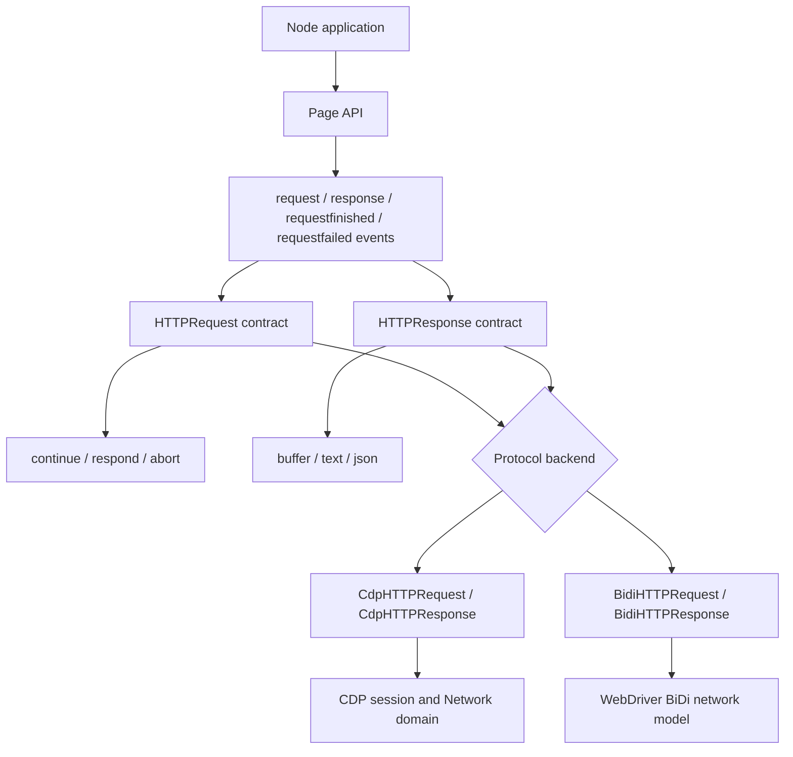
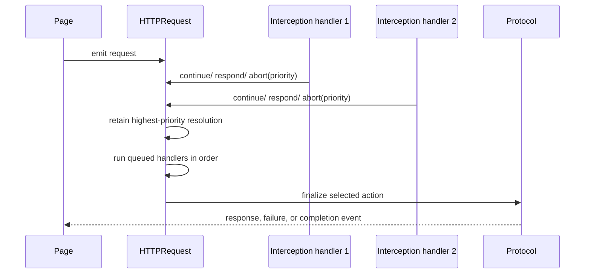
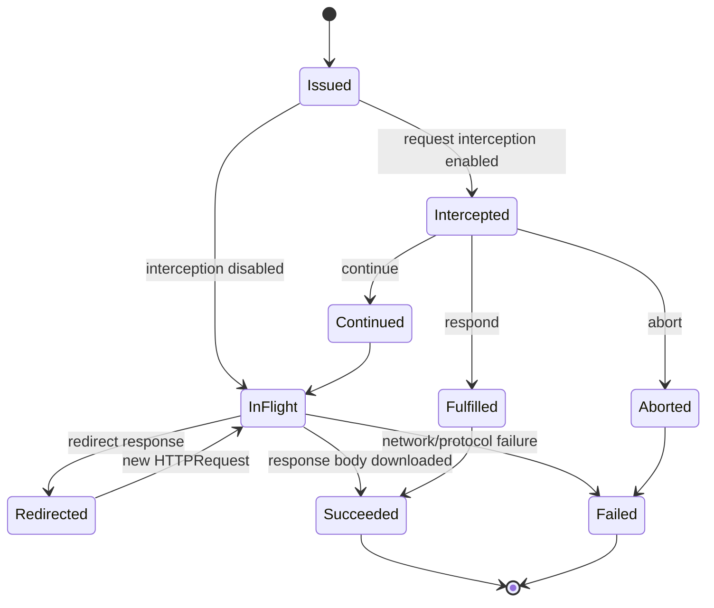
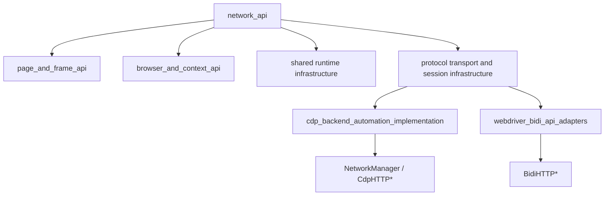

# Network API

## Introduction

The `network_api` module defines Puppeteer’s protocol-neutral representation of page network traffic. `HTTPRequest` describes an outgoing resource request and provides request interception controls; `HTTPResponse` describes the corresponding response and provides status, metadata, and body access. The API is consumed from `Page` request/response events and is implemented by both the CDP and WebDriver BiDi backends.

This document focuses on the public contracts in `packages/puppeteer-core/src/api/`. Browser connection and protocol transport are described in [launch and connect](launch_and_connect.md) and [protocol transport and session infrastructure](protocol_transport_and_session_infrastructure.md). Backend-specific behavior is documented in [the CDP backend](cdp_backend_automation_implementation.md) and [the WebDriver BiDi adapters](webdriver_bidi_api_adapters.md).

## Position in the system



The module is deliberately transport-independent. Callers receive the same request and response abstractions regardless of whether the page is backed by Chromium CDP, Firefox BiDi, or a BiDi-over-CDP bridge.

## Architecture

```mermaid
graph LR
    PageAPI[Page] -->|emits| RequestAPI[abstract HTTPRequest]
    PageAPI -->|emits| ResponseAPI[abstract HTTPResponse]
    RequestAPI -->|response()| ResponseAPI
    ResponseAPI -->|request()| RequestAPI
    RequestAPI --> FrameAPI[Frame]
    ResponseAPI --> FrameAPI
    RequestAPI --> Session[CDPSession / protocol client]
    CDPImpl[CdpHTTPRequest + CdpHTTPResponse] -. implements .-> RequestAPI
    CDPImpl -. implements .-> ResponseAPI
    BiDiImpl[BidiHTTPRequest + BidiHTTPResponse] -. implements .-> RequestAPI
    BiDiImpl -. implements .-> ResponseAPI
```

`HTTPRequest` and `HTTPResponse` are abstract base classes. Protocol implementations supply wire-level operations and browser-specific metadata, while the base classes centralize behavior that can be shared safely: interception state, cooperative priorities, success-status evaluation, and body conversion.

## `HTTPRequest`

### Request observation

An `HTTPRequest` represents one issued resource request. Its observable properties include:

| Capability | API | Purpose |
| --- | --- | --- |
| Identity | `url()`, `method()`, `resourceType()` | Identify the destination, verb, and rendering-engine resource category. |
| Payload | `postData()`, `hasPostData()`, `fetchPostData()` | Inspect decoded POST data, determine whether data exists, or fetch it from the browser when it is unavailable locally. |
| Context | `frame()`, `isNavigationRequest()`, `initiator()` | Associate the request with a frame and its navigation/initiator metadata. |
| Headers | `headers()` | Read lower-case request headers. |
| Outcome | `response()`, `failure()` | Read the matching response or failure information. |
| Redirects | `redirectChain()` | Inspect earlier requests in the same redirect chain. |

The request event is emitted when the request is issued. A completed HTTP exchange emits `requestfinished`, including HTTP error statuses such as 404; transport failures instead emit `requestfailed`. Redirects finish the current request and create a new request linked through `redirectChain()`.

### Interception model

Request interception must first be enabled with `Page.setRequestInterception(true)`, documented with the [page and frame API](page_and_frame_api.md). Once enabled, handlers can choose one of three outcomes:

```mermaid
flowchart TD
    Issued[Request issued] --> Eligible{Interceptable?}
    Eligible -->|data: URL or memory cache| Noop[Interception method is a no-op]
    Eligible -->|yes| Enabled{Interception enabled?}
    Enabled -->|no| Error[Assert / configuration error]
    Enabled -->|yes| Decision{Handler decision}
    Decision --> Continue[continue(overrides)]
    Decision --> Respond[respond(response)]
    Decision --> Abort[abort(errorCode)]
    Continue --> Browser[Protocol backend fulfills request]
    Respond --> Browser
    Abort --> Browser
```

`continue()` accepts optional URL, method, POST body, and header overrides. `respond()` fulfills the request with a status, headers, content type, and string or binary body. `abort()` maps Puppeteer error codes such as `timedout` or `namenotresolved` to protocol error reasons.

Calls without a priority resolve immediately through the abstract `_continue`, `_respond`, or `_abort` implementation. Calls with a priority use cooperative resolution. The highest priority wins; at equal priority, abort takes precedence over respond, and respond takes precedence over continue. `interceptResolutionState()` exposes the current action and priority, while `isInterceptResolutionHandled()` detects an already-finalized request.

Deferred handlers added by `enqueueInterceptAction()` are executed serially by `finalizeInterceptions()` before the selected action is sent to the browser. This permits multiple listeners or middleware layers to contribute to one final decision.



`continueRequestOverrides()` and `responseForRequest()` expose the pending cooperative values. They assert that interception is enabled. `HTTPRequest.getResponse()` converts text or `Uint8Array` bodies to byte length and base64 for protocol fulfillment; `headersArray()` expands array-valued headers into repeated name/value entries.

## `HTTPResponse`

An `HTTPResponse` is the response associated with an `HTTPRequest`. It exposes:

| Capability | API | Purpose |
| --- | --- | --- |
| Identity | `url()`, `status()`, `statusText()` | Inspect response location and HTTP status. |
| Headers and transport | `headers()`, `remoteAddress()`, `timing()` | Read response headers, peer address, and resource timing. |
| Security | `securityDetails()` | Read TLS/security information or `null`. |
| Body | `content()`, `buffer()`, `text()`, `json()` | Retrieve binary content or decode it as UTF-8 text/JSON. |
| Provenance | `fromCache()`, `fromServiceWorker()` | Determine whether the browser cache or a service worker supplied the response. |
| Relationship | `request()`, `frame()` | Navigate back to the originating request and frame. |

`ok()` returns `true` for status codes 200–299 and for status `0`, which is used by some browser/protocol responses. `buffer()` wraps the `Uint8Array` returned by `content()` in a Node `Buffer`; `text()` decodes UTF-8; `json()` parses that text and propagates parsing errors.

```mermaid
flowchart LR
    Response[HTTPResponse] --> Status[status / statusText / ok]
    Response --> Meta[headers / timing / remoteAddress / securityDetails]
    Response --> Origin[request / frame]
    Response --> Source[fromCache / fromServiceWorker]
    Response --> Content[content(): Uint8Array]
    Content --> Buffer[buffer(): Buffer]
    Content --> Text[text(): string]
    Text --> JSON[json(): parsed value]
```

Body bytes may be re-encoded by the browser based on HTTP headers or encoding heuristics. Consumers that require exact wire bytes should account for this protocol/browser behavior.

## Network lifecycle and relationships



The page-level network manager translates protocol events into these lifecycle objects. In the CDP implementation, `NetworkManager` coordinates interception, authentication, cache, headers, offline mode, and emulation; `CdpHTTPRequest` and `CdpHTTPResponse` adapt protocol payloads. The BiDi implementation provides equivalent adapters through `BidiHTTPRequest` and `BidiHTTPResponse`.

See [the CDP backend](cdp_backend_automation_implementation.md#network-stack) for CDP event and request handling, and [the BiDi network adapter](webdriver_bidi_api_adapters.md#bidi-network) for WebDriver BiDi-specific behavior. Shared event and timeout mechanics are covered by [shared automation runtime and query infrastructure](shared_automation_runtime_and_query_infrastructure.md).

## Dependencies and integration points



- `Page` emits the request and response lifecycle events and enables interception.
- `Frame` identifies the document context that initiated a request or response.
- `CDPSession` is an escape hatch exposed by implementations; direct use can break Puppeteer and is experimental.
- `Protocol.Network` supplies resource types, initiators, timing data, error reasons, and wire-level metadata.
- Common error handling and utilities normalize invalid-header failures while tolerating protocol errors caused by cancellation or page closure.

## Typical usage

```ts
await page.setRequestInterception(true);

page.on('request', request => {
  if (request.url().endsWith('/analytics')) {
    void request.abort('blockedbyclient');
  } else {
    void request.continue();
  }
});

page.on('response', async response => {
  if (response.ok()) {
    console.log(response.status(), response.url());
    const body = await response.text();
  }
});
```

Applications should handle interception exactly once unless deliberately using cooperative priorities, await or otherwise observe rejected interception promises, and avoid assuming that every request has a response (failed requests do not). For browser startup and connection prerequisites, see [launch and connect](launch_and_connect.md).
