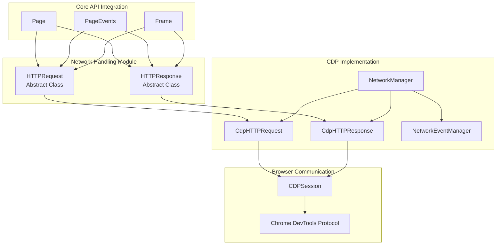
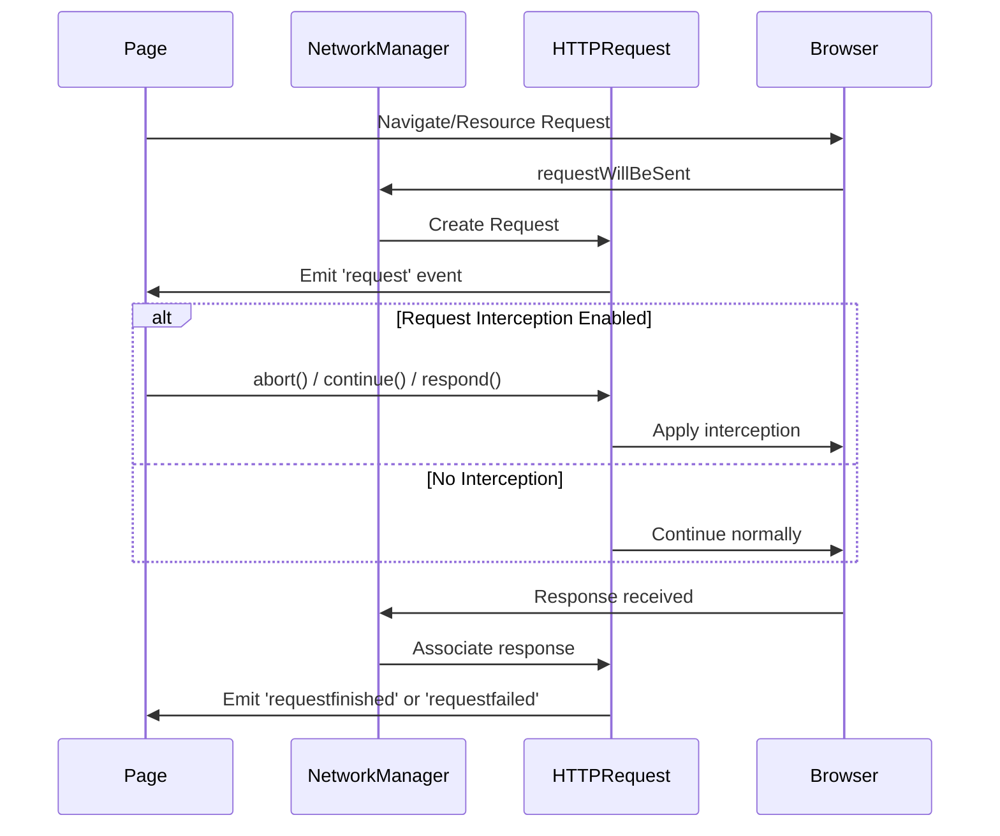
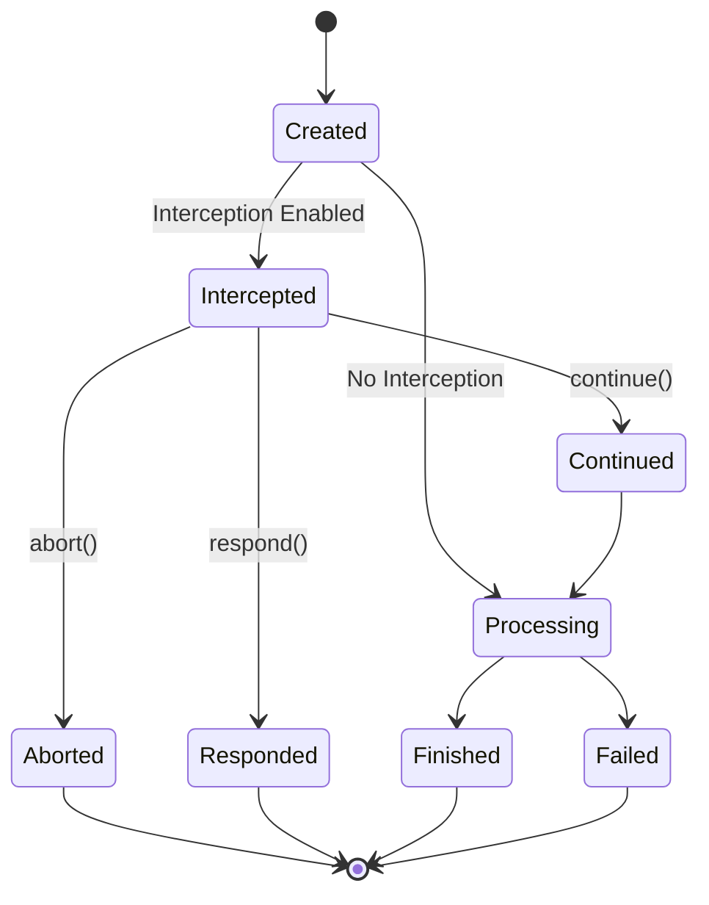
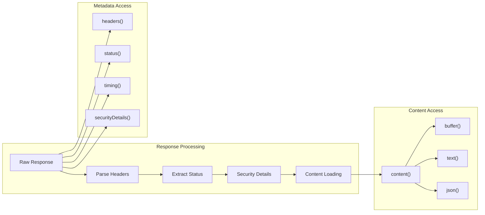
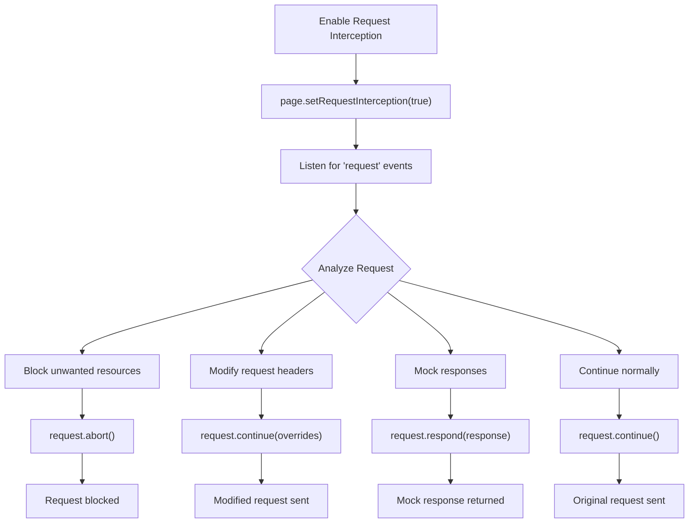
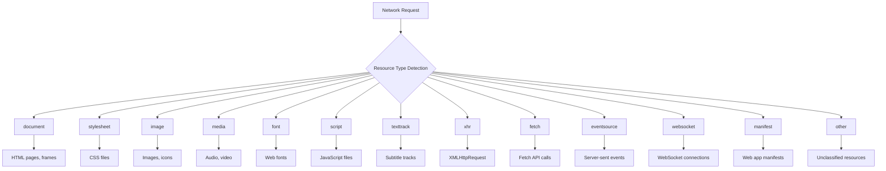
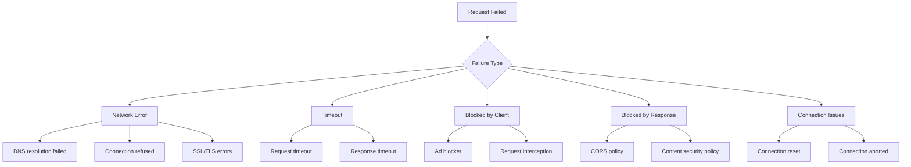
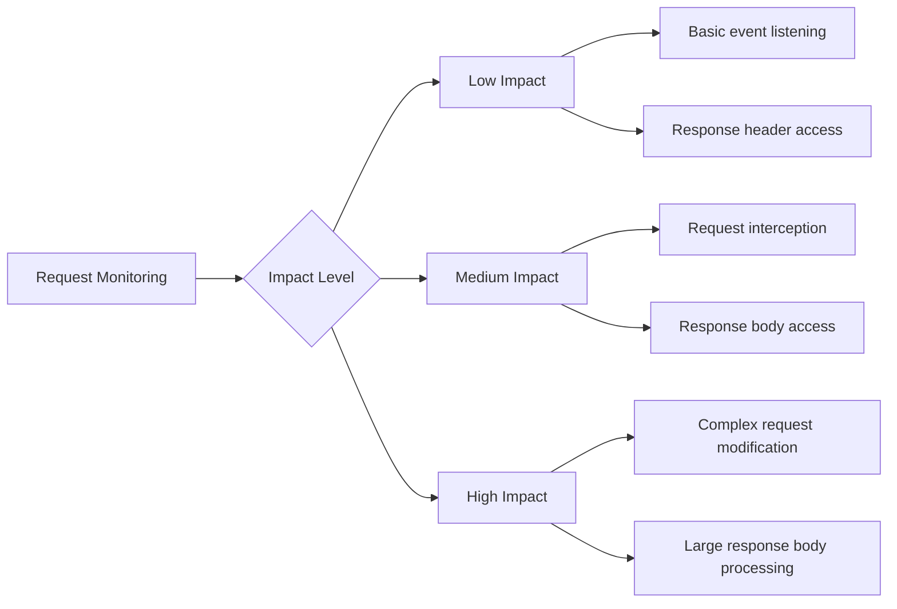

# Network Handling Module

The network_handling module provides comprehensive HTTP request and response management capabilities within the Puppeteer ecosystem. It serves as the primary interface for intercepting, monitoring, and manipulating network traffic in browser automation scenarios.

## Overview

This module consists of two core abstract classes that define the contract for HTTP communication:

- **HTTPRequest**: Represents outgoing HTTP requests with interception capabilities
- **HTTPResponse**: Represents incoming HTTP responses with content access methods

These abstractions are implemented by the [cdp_network_management](cdp_network_management.md) module for Chrome DevTools Protocol support and integrated throughout the [core_api](core_api.md) module for page-level network operations.

## Architecture



## Core Components

### HTTPRequest

The `HTTPRequest` class represents HTTP requests initiated by web pages and provides powerful interception capabilities.

#### Key Features

- **Request Interception**: Ability to abort, continue, or respond to requests
- **Cooperative Handling**: Priority-based request resolution for multiple handlers
- **Request Modification**: Override URL, method, headers, and post data
- **Redirect Chain Tracking**: Access to complete redirect history
- **Resource Type Detection**: Categorization of requests (document, image, script, etc.)

#### Request Lifecycle



#### Interception States



### HTTPResponse

The `HTTPResponse` class represents HTTP responses received from servers, providing access to response data and metadata.

#### Key Features

- **Content Access**: Multiple formats (text, JSON, binary buffer)
- **Header Inspection**: Complete response headers
- **Status Information**: HTTP status codes and text
- **Security Details**: SSL/TLS certificate information
- **Performance Timing**: Network timing data
- **Cache Information**: Whether served from cache or service worker

#### Response Data Flow



## Integration with Core API

### Page-Level Network Events

The network_handling module integrates deeply with the Page class to provide comprehensive network monitoring:

```typescript
// Request monitoring
page.on('request', (request: HTTPRequest) => {
  console.log('Request:', request.url(), request.method());
});

// Response monitoring  
page.on('response', (response: HTTPResponse) => {
  console.log('Response:', response.url(), response.status());
});

// Request completion
page.on('requestfinished', (request: HTTPRequest) => {
  console.log('Finished:', request.url());
});

// Request failure
page.on('requestfailed', (request: HTTPRequest) => {
  console.log('Failed:', request.url(), request.failure()?.errorText);
});
```

### Request Interception Workflow



## Network Conditions and Control

The module supports various network manipulation capabilities:

### Network Emulation

```typescript
// Offline mode
await page.setOfflineMode(true);

// Network throttling
await page.emulateNetworkConditions({
  offline: false,
  downloadThroughput: 500 * 1024, // 500kb/s
  uploadThroughput: 500 * 1024,   // 500kb/s
  latency: 20 // 20ms
});

// Disable cache
await page.setCacheEnabled(false);
```

### Authentication Handling

```typescript
// HTTP authentication
await page.authenticate({
  username: 'user',
  password: 'pass'
});

// Custom headers
await page.setExtraHTTPHeaders({
  'Authorization': 'Bearer token',
  'Custom-Header': 'value'
});
```

## Resource Type Classification

The module categorizes network requests into specific resource types:



## Error Handling and Debugging

### Request Failure Analysis



### Common Error Codes

| Error Code | Description | Common Causes |
|------------|-------------|---------------|
| `failed` | Generic failure | Network connectivity issues |
| `aborted` | Request aborted | User cancellation, navigation |
| `timedout` | Request timeout | Slow server response |
| `accessdenied` | Access denied | Authentication required |
| `connectionrefused` | Connection refused | Server not responding |
| `connectionreset` | Connection reset | Network interruption |
| `internetdisconnected` | No internet | Network connectivity lost |
| `namenotresolved` | DNS failure | Invalid domain name |
| `blockedbyclient` | Blocked by client | Ad blocker, request interception |
| `blockedbyresponse` | Blocked by response | CORS, CSP violations |

## Performance Considerations

### Request Monitoring Impact



### Optimization Strategies

1. **Selective Interception**: Only intercept requests when necessary
2. **Efficient Filtering**: Use URL patterns and resource types for filtering
3. **Lazy Content Loading**: Access response content only when needed
4. **Memory Management**: Properly dispose of request/response objects
5. **Batch Operations**: Group multiple network operations when possible

## Security Considerations

### Request Interception Security

- **Data Exposure**: Intercepted requests may contain sensitive data
- **Response Modification**: Ensure mock responses don't introduce vulnerabilities
- **Authentication Handling**: Secure storage and transmission of credentials
- **SSL/TLS Validation**: Proper certificate verification in security details

### Best Practices

1. **Validate Intercepted Data**: Sanitize and validate all intercepted content
2. **Secure Credential Storage**: Use secure methods for authentication data
3. **Audit Network Modifications**: Log and monitor all network modifications
4. **Respect Privacy**: Handle user data according to privacy requirements

## Related Modules

- **[cdp_network_management](cdp_network_management.md)**: CDP-specific implementation of network handling
- **[core_api](core_api.md)**: Page and Frame classes that integrate network functionality
- **[input_and_interaction](input_and_interaction.md)**: User interactions that may trigger network requests
- **[common_utilities](common_utilities.md)**: Shared utilities for event handling and configuration

## Usage Examples

### Basic Request Monitoring

```typescript
import puppeteer from 'puppeteer';

const browser = await puppeteer.launch();
const page = await browser.newPage();

// Monitor all requests
page.on('request', request => {
  console.log(`${request.method()} ${request.url()}`);
});

// Monitor responses
page.on('response', response => {
  console.log(`${response.status()} ${response.url()}`);
});

await page.goto('https://example.com');
await browser.close();
```

### Request Interception

```typescript
// Enable request interception
await page.setRequestInterception(true);

page.on('request', async request => {
  // Block images
  if (request.resourceType() === 'image') {
    await request.abort();
    return;
  }
  
  // Modify headers
  if (request.url().includes('api.example.com')) {
    await request.continue({
      headers: {
        ...request.headers(),
        'Authorization': 'Bearer token'
      }
    });
    return;
  }
  
  // Continue normally
  await request.continue();
});
```

### Response Analysis

```typescript
page.on('response', async response => {
  if (response.url().includes('api/data')) {
    try {
      const data = await response.json();
      console.log('API Response:', data);
    } catch (error) {
      console.error('Failed to parse JSON:', error);
    }
  }
});
```

### Network Performance Monitoring

```typescript
page.on('response', response => {
  const timing = response.timing();
  if (timing) {
    const totalTime = timing.receiveHeadersEnd - timing.requestTime;
    console.log(`${response.url()}: ${totalTime}ms`);
  }
});
```

The network_handling module provides the foundation for all network-related operations in Puppeteer, enabling sophisticated request/response manipulation, monitoring, and analysis capabilities essential for modern web automation and testing scenarios.