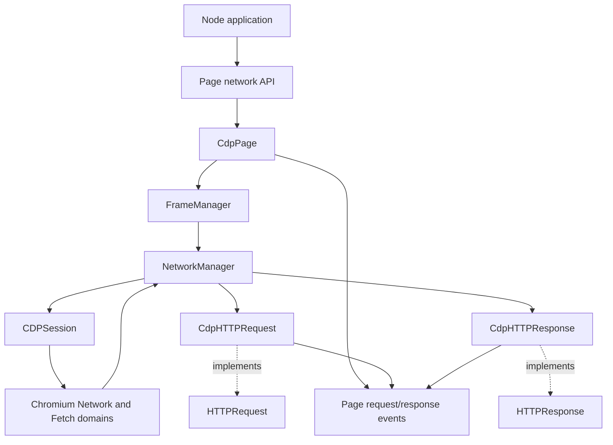
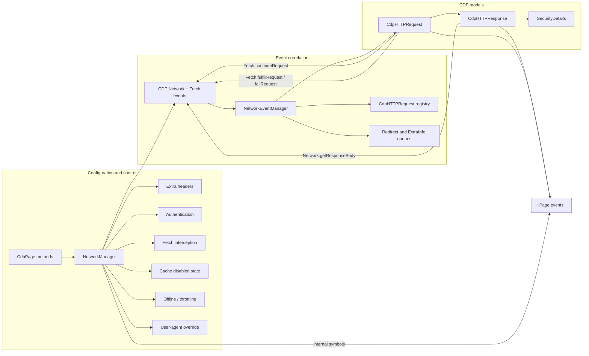
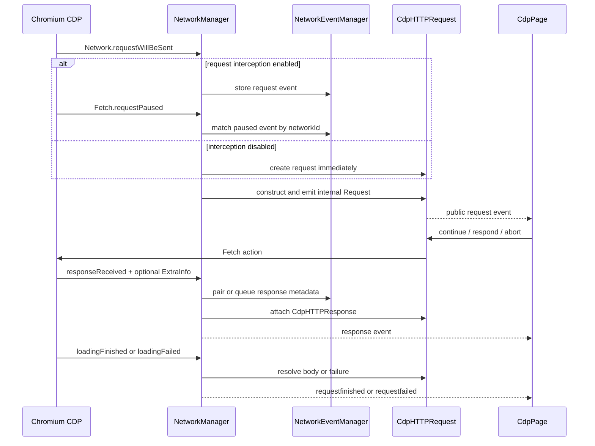
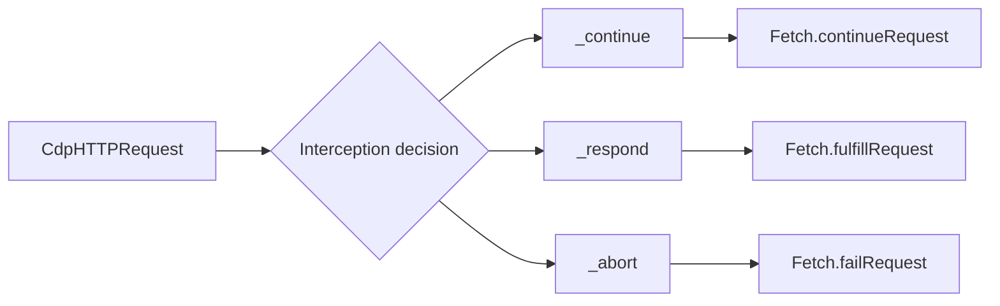
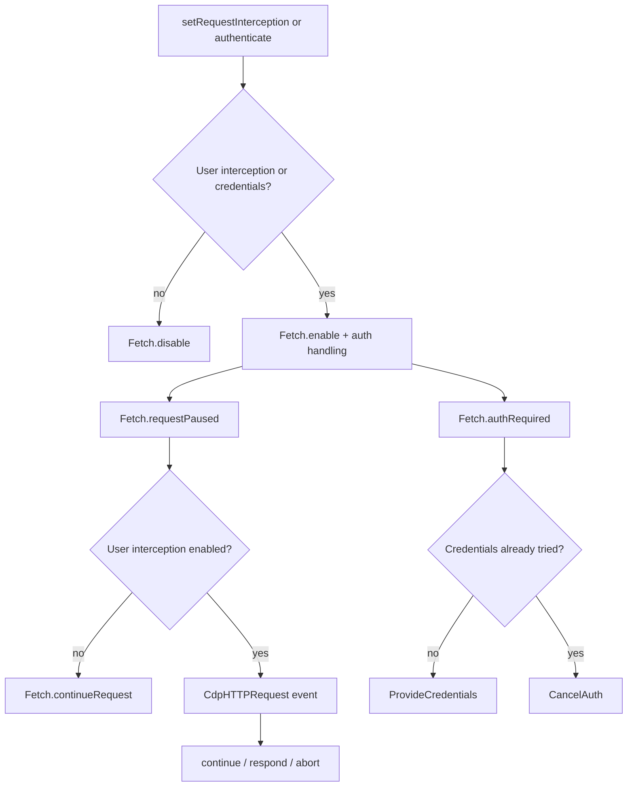
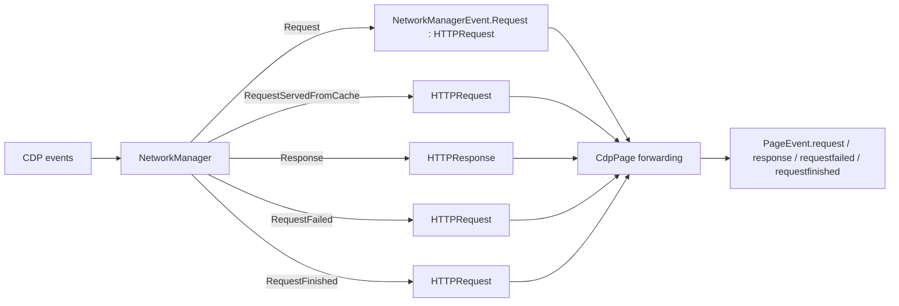
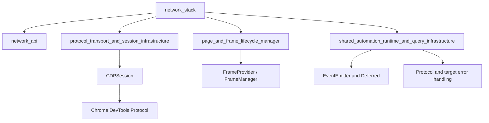

# Network Stack

## Introduction

The `network_stack` module is Puppeteer’s Chromium CDP network backend. It converts asynchronous `Network` and `Fetch` protocol events into the protocol-neutral `HTTPRequest` and `HTTPResponse` objects exposed by `Page`, while also applying browser-wide network controls such as interception, authentication, cache behavior, headers, user-agent overrides, offline mode, and throughput/latency emulation.

The public request and response contracts are documented in [network API](network_api.md). This document describes the CDP-specific coordination and lifecycle machinery. Page/frame ownership is covered in [page and frame lifecycle](page_and_frame_lifecycle_manager.md), and CDP sessions and transports are described in [protocol transport and session infrastructure](protocol_transport_and_session_infrastructure.md).

## Position in the system

`CdpPage` is the user-facing entry point for network configuration. Its `FrameManager` owns one `NetworkManager`, which can subscribe to multiple CDP sessions belonging to the page, child frames, workers, or OOPIFs. `NetworkManager` owns event correlation and emits internal symbol-based events; `CdpPage` forwards those events as public page events.

## Architecture

### Responsibilities

| Component | Responsibility |
| --- | --- |
| `NetworkManager` | Enables CDP network domains, applies configuration to every attached client, translates protocol events, and emits request lifecycle events. |
| `NetworkEventManager` | Stores out-of-order request, pause, response-extra-info, redirect, and completion state keyed by protocol request IDs. |
| `CdpHTTPRequest` | Adapts request metadata and implements CDP interception actions (`continue`, `respond`, and `abort`). |
| `CdpHTTPResponse` | Adapts response metadata, waits for body completion, retrieves response bytes, and exposes cache, service-worker, timing, and TLS information. |
| `NetworkManagerEvent` | Defines private symbol events for request, cache-hit, response, failure, and completion notifications. |
| `SecurityDetails` | Provides a protocol-neutral view of certificate subject, issuer, validity, protocol, and SANs. |
| `CdpPage` | Delegates public network controls to the frame manager’s network manager and forwards internal events to `PageEvent` notifications. |

## Event correlation and lifecycle

CDP does not guarantee a single ordering for `Network.requestWillBeSent` and `Fetch.requestPaused`. Redirects also reuse the same CDP `requestId`, and `Network.responseReceivedExtraInfo` may arrive before or after the corresponding response. `NetworkEventManager` therefore maintains several maps and queues rather than treating one protocol event as one complete request.

### Request state

`NetworkEventManager` stores:

- `requestWillBeSentMap`: the `Network.requestWillBeSent` payload needed to build a request.
- `requestPausedMap`: an early `Fetch.requestPaused` payload, including its interception ID.
- `httpRequestsMap`: active `CdpHTTPRequest` objects and their associated response.
- `responseReceivedExtraInfoMap`: extra response metadata waiting to be paired.
- `queuedRedirectInfoMap`: redirect requests waiting for extra-info metadata.
- `queuedEventGroupMap`: response and loading events waiting for extra-info metadata.

Once a request finishes or fails, its active object and correlation state are forgotten. `inFlightRequestsCount()` counts active request objects without a response; `printState()` emits a JSON-friendly diagnostic snapshot of the internal maps.

### Completion and failure

On `loadingFinished`, the manager resolves the response body gate, forgets the active request, and emits `RequestFinished`. On `loadingFailed`, it records the protocol error text, resolves any response body waiter, forgets the request, and emits `RequestFailed`. Requests without a matching `requestWillBeSent` are ignored for normal completion because CDP can produce terminal events for identifiers Puppeteer never observed.

For redirects, the previous request receives a response whose body is deliberately rejected as unavailable, then emits response and finished events before the next request is created. The new request retains the previous requests in its redirect chain.

## Request and response adapters

### `CdpHTTPRequest`

`CdpHTTPRequest` captures URL (including the URL fragment), lower-case headers, method, resource type, POST data, initiator, frame, navigation status, and redirect chain. `fetchPostData()` retrieves data lazily through `Network.getRequestPostData` when it was not present in the initial event.

When interception is active, the request holds a CDP Fetch interception ID:

`_continue` optionally overrides URL, method, POST data, and headers; POST data is base64 encoded and headers are converted to CDP’s repeated name/value array. `_respond` builds a synthetic status, status text, headers, content type, content length, and base64 body. `_abort` maps the selected network error reason to `Fetch.failRequest`. Failed protocol actions reset the interception handled state where appropriate so the caller can observe the error.

### `CdpHTTPResponse`

`CdpHTTPResponse` is created from `Network.Response` plus, when available, `ResponseReceivedExtraInfo`. Extra-info status codes and headers take precedence. The response records:

- status and status text;
- normalized headers;
- remote IP and port;
- resource timing;
- disk/memory-cache and service-worker provenance;
- TLS certificate details through [`SecurityDetails`](network_api.md#httpresponse).

`content()` waits for `loadingFinished` or `loadingFailed` to resolve the body gate, then calls `Network.getResponseBody` using the request’s current CDP client. This is important for OOPIF and worker requests whose terminal event may arrive on a different session; `NetworkManager` adopts that client before body retrieval. Redirect bodies are rejected because CDP does not expose them as normal response bodies.

## Network controls

`CdpPage` delegates the following public operations to `NetworkManager`:

| Page operation | CDP behavior |
| --- | --- |
| `setExtraHTTPHeaders` | Validates string values, lower-cases names, and applies `Network.setExtraHTTPHeaders`. |
| `setUserAgent` | Applies `Network.setUserAgentOverride`, including optional user-agent metadata. |
| `setCacheEnabled` | Tracks the user preference and applies `Network.setCacheDisabled`. |
| `setRequestInterception` | Enables or disables `Fetch` interception for all clients. |
| `authenticate` | Enables Fetch interception when credentials exist and answers auth challenges once per request. A repeated challenge is cancelled. |
| `setOfflineMode` | Updates the offline flag and applies `Network.emulateNetworkConditions`. |
| `emulateNetworkConditions` | Applies upload/download throughput and latency; `null` restores unlimited throughput and zero latency. |
| `inFlightRequestsCount` | Returns active requests that do not yet have a response. |

Configuration is retained in `NetworkManager` fields and replayed when a new CDP client is added. All attached clients are updated concurrently. Errors caused by a closed target or unsupported protocol command are treated as ignorable; other protocol errors propagate to the caller.

### Interception and authentication flow

Authentication can activate protocol interception even when the user has not requested request interception. In that mode, paused requests are automatically continued while auth challenges are handled internally.

## Network event contract and page integration

`NetworkManagerEvent` uses symbols intentionally: these events are internal and are not meant to become externally-discoverable network manager events. The payloads remain the public `HTTPRequest` and `HTTPResponse` abstractions:

This separation keeps CDP event ordering and protocol identifiers private while allowing the public API to remain shared with the WebDriver BiDi backend. See [network API](network_api.md) for the consumer-facing semantics and [page and frame API](page_and_frame_api.md) for the public event surface.

## Dependencies and integration points

- `FrameProvider` resolves frame IDs so request and response objects can report their document context.
- `CDPSession` carries Network, Fetch, and Emulation commands and events; session replacement is handled for OOPIFs, workers, and target swaps.
- `EventEmitter`, `Deferred`, disposable subscriptions, and shared error utilities provide lifecycle and cleanup behavior.
- `devtools-protocol` supplies the event payloads and command types; no wire-level protocol details are duplicated in the public network API.

## Operational considerations

- Request IDs are not globally unique across all protocol concepts; correlation must use the CDP network ID and, for interception, the Fetch request ID.
- Redirect chains and response-extra-info ordering are normal protocol behavior, not exceptional cases.
- Memory-cache requests cannot be intercepted. They are marked with `_fromMemoryCache`, and their response reports `fromCache()` as true.
- Response bodies should be read after the response lifecycle has made them available. `CdpHTTPResponse.content()` performs this synchronization internally.
- A request may move between CDP sessions when a document belongs to an OOPIF or worker. The manager updates the request client before terminal processing.
- Enabling credentials implicitly enables protocol interception, but does not expose every paused request to user handlers.

## Related modules

- [Network API](network_api.md) — protocol-neutral `HTTPRequest`/`HTTPResponse` behavior and public semantics.
- [Page and frame lifecycle manager](page_and_frame_lifecycle_manager.md) — frame ownership, session swaps, and the `FrameManager` boundary used by this stack.
- [Page and frame API](page_and_frame_api.md) — public page methods and events that reach this implementation.
- [Protocol transport and session infrastructure](protocol_transport_and_session_infrastructure.md) — CDP connections, sessions, and transports used to send network commands.
- The WebDriver BiDi network adapter is the alternative implementation of the same public contracts; its source is under `packages/puppeteer-core/src/bidi/`.
