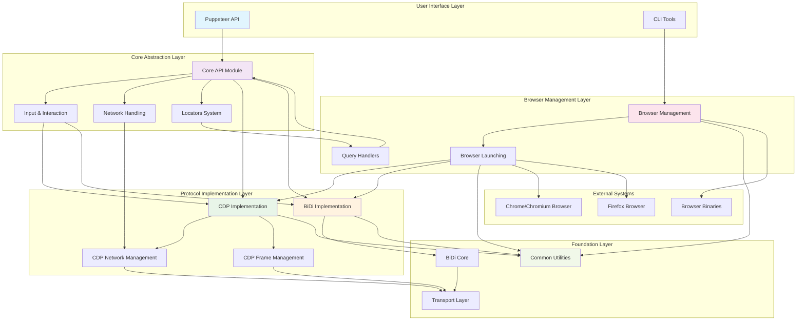

# Puppeteer Repository Overview

## Purpose

The `puppeteer--puppeteer` repository is a comprehensive Node.js library that provides a high-level API for controlling web browsers programmatically. It serves as the primary interface for browser automation, web scraping, testing, and performance monitoring by implementing both the Chrome DevTools Protocol (CDP) and the emerging WebDriver BiDi standard.

Puppeteer enables developers to:
- **Automate Browser Interactions**: Navigate pages, click elements, fill forms, and simulate user actions
- **Generate Screenshots and PDFs**: Capture visual content and create documents from web pages
- **Performance Testing**: Monitor page load times, network activity, and runtime performance
- **Web Scraping**: Extract data from websites with full JavaScript execution support
- **End-to-End Testing**: Create robust test suites for web applications
- **Cross-Browser Automation**: Support for Chrome, Chromium, and Firefox browsers

## End-to-End Architecture

The Puppeteer repository follows a layered architecture that abstracts browser automation complexity through well-defined modules and interfaces:

### Architecture Flow

1. **User Interface Layer**: Provides the main Puppeteer API and command-line tools for browser management
2. **Core Abstraction Layer**: Defines browser-agnostic interfaces for pages, elements, network, and user interactions
3. **Protocol Implementation Layer**: Implements browser-specific protocols (CDP for Chrome, BiDi for cross-browser support)
4. **Browser Management Layer**: Handles browser installation, launching, and element querying strategies
5. **Foundation Layer**: Provides shared utilities, configuration, event handling, and transport mechanisms
6. **External Systems**: Interfaces with actual browser processes and binary management

## Core Modules Documentation

### High-Level API Modules

#### [Core API Module](core_api.md)
The foundational abstraction layer that defines browser automation interfaces including Browser, Page, Frame, ElementHandle, and JSHandle. Provides event-driven architecture and consistent API contracts across different browser implementations.

#### [Input and Interaction Module](input_and_interaction.md)
Comprehensive user interaction simulation including keyboard input, mouse operations, touch events, and dialog handling. Enables realistic user behavior simulation for testing and automation scenarios.

#### [Network Handling Module](network_handling.md)
Abstract interfaces for HTTP request/response management, network interception, and traffic monitoring. Provides the foundation for network-related automation tasks.

#### [Locators Module](locators.md)
Advanced element selection system with retry logic, automatic precondition checking, and composable query strategies. Offers reliable element interaction with built-in waiting and stability mechanisms.

### Protocol Implementation Modules

#### [CDP Implementation Module](cdp_implementation.md)
Complete Chrome DevTools Protocol implementation providing concrete browser automation capabilities for Chrome and Chromium browsers. Includes specialized sub-modules for network and frame management.

#### [BiDi Implementation Module](bidi_implementation.md)
WebDriver BiDi protocol implementation enabling cross-browser automation with standardized interfaces. Supports modern browser features while maintaining compatibility across different browser vendors.

#### [BiDi Core Module](bidi_core.md)
Foundational BiDi protocol components including session management, browser control, browsing context handling, and JavaScript execution realm management.

### Browser Management Modules

#### [Browser Management Module](browser_management.md)
Comprehensive browser binary management system handling installation, caching, version management, and cross-platform support for multiple browser types.

#### [Browser Launching Module](browser_launching.md)
Browser process lifecycle management with support for different browsers, connection protocols, and launch configurations. Provides unified launching interface across Chrome and Firefox.

#### [Query Handlers Module](query_handlers.md)
Extensible element selection system supporting CSS selectors, XPath, text-based queries, and custom query strategies with performance optimization and polling mechanisms.

### Foundation Modules

#### [Common Utilities Module](common_utilities.md)
Shared infrastructure including the main Puppeteer class, event system, configuration management, transport abstractions, and timeout handling used across all other modules.

#### [Transport Layer Module](transport_layer.md)
Communication infrastructure providing WebSocket and pipe-based transport mechanisms for browser protocol communication in both browser and Node.js environments.

### Specialized Implementation Modules

#### [CDP Network Management Module](cdp_network_management.md)
CDP-specific network operations including request interception, response handling, network condition emulation, and authentication management.

#### [CDP Frame Management Module](cdp_frame_management.md)
Frame hierarchy management, execution context handling, isolated world management, and frame lifecycle tracking for CDP-based browser automation.

## Module Interdependencies

The modules are designed with clear dependency relationships:

- **Foundation Modules** (Common Utilities, Transport Layer) provide shared infrastructure
- **Core API Module** defines abstract interfaces implemented by protocol-specific modules
- **Protocol Implementation Modules** (CDP, BiDi) provide concrete browser automation capabilities
- **Browser Management Modules** handle browser lifecycle and element selection
- **Specialized Modules** extend protocol implementations with specific functionality

This architecture ensures maintainability, testability, and extensibility while providing a consistent developer experience across different browser automation scenarios.