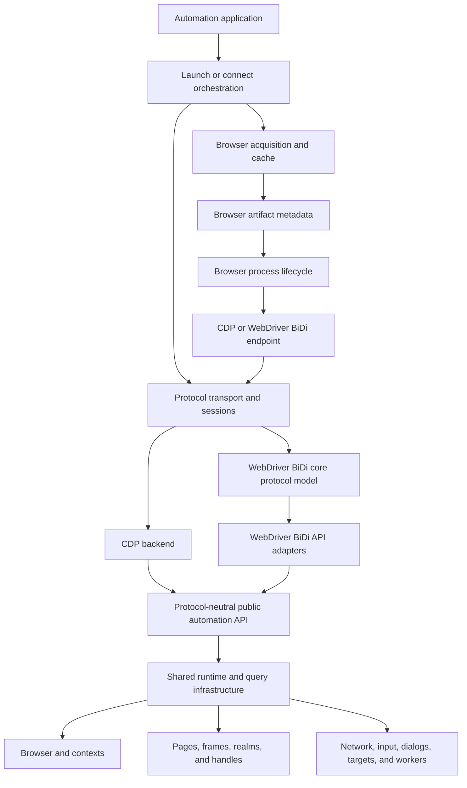
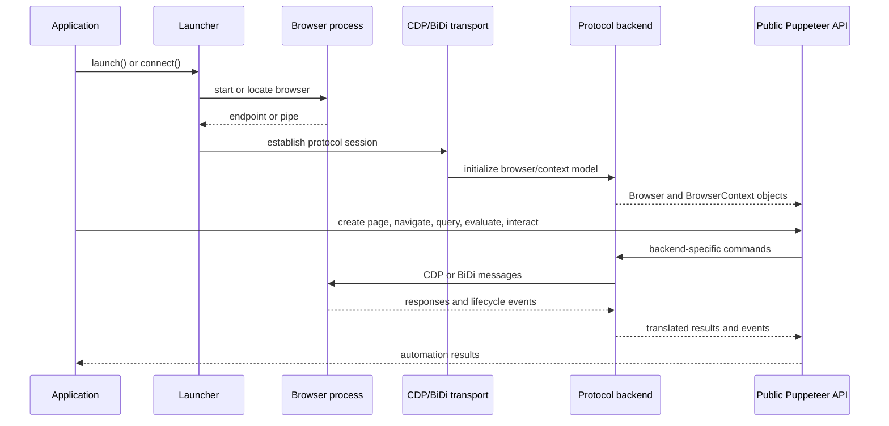

# Puppeteer Repository Overview

Puppeteer is a Node.js browser automation framework. It provisions and launches browsers, connects through Chrome DevTools Protocol (CDP) or WebDriver BiDi, and exposes a protocol-neutral API for automating pages, frames, browser contexts, JavaScript execution, network traffic, input, dialogs, targets, and workers.

## End-to-end architecture

```mermaid
flowchart TD
    App[Automation application] --> Launch[Launch or connect orchestration]

    Launch --> Provision[Browser acquisition and cache]
    Provision --> Metadata[Browser artifact metadata]
    Metadata --> Process[Browser process lifecycle]
    Process --> Endpoint[CDP or WebDriver BiDi endpoint]

    Launch --> Transport[Protocol transport and sessions]
    Endpoint --> Transport

    Transport --> CDP[CDP backend]
    Transport --> BiDiCore[WebDriver BiDi core protocol model]
    BiDiCore --> BiDiAdapters[WebDriver BiDi API adapters]

    CDP --> PublicAPI[Protocol-neutral public automation API]
    BiDiAdapters --> PublicAPI

    PublicAPI --> Runtime[Shared runtime and query infrastructure]
    Runtime --> Browser[Browser and contexts]
    Runtime --> Pages[Pages, frames, realms, and handles]
    Runtime --> Network[Network, input, dialogs, targets, and workers]
```

```mermaid
sequenceDiagram
    participant App as Application
    participant Launcher as Launcher
    participant Browser as Browser process
    participant Transport as CDP/BiDi transport
    participant Backend as Protocol backend
    participant API as Public Puppeteer API

    App->>Launcher: launch() or connect()
    Launcher->>Browser: start or locate browser
    Browser-->>Launcher: endpoint or pipe
    Launcher->>Transport: establish protocol session
    Transport->>Backend: initialize browser/context model
    Backend-->>API: Browser and BrowserContext objects
    App->>API: create page, navigate, query, evaluate, interact
    API->>Backend: backend-specific commands
    Backend->>Browser: CDP or BiDi messages
    Browser-->>Backend: responses and lifecycle events
    Backend-->>API: translated results and events
    API-->>App: automation results
```

## Repository structure

- `packages/browsers`: browser artifact metadata, downloads, caching, executable lookup, process spawning, and cleanup.
- `packages/puppeteer-core/src`: the core launch/connect logic, public API, runtime utilities, transports, and protocol backends.
- `packages/puppeteer-core/src/api`: protocol-neutral browser automation contracts.
- `packages/puppeteer-core/src/cdp`: Chromium/CDP implementations.
- `packages/puppeteer-core/src/bidi`: WebDriver BiDi transports, core models, and API adapters.
- `packages/puppeteer-core/src/bidi/core`: lifecycle-aware BiDi sessions, contexts, navigations, requests, realms, workers, and prompts.

## Core module documentation

- [Browser provisioning and launch orchestration](/home/anhnh/CodeWiki-journal/results/generation/puppeteer/browser_provisioning_and_launch_orchestration.md)
- [Protocol-neutral public automation API](/home/anhnh/CodeWiki-journal/results/generation/puppeteer/protocol_neutral_public_automation_api.md)
- [Shared automation runtime and query infrastructure](/home/anhnh/CodeWiki-journal/results/generation/puppeteer/shared_automation_runtime_and_query_infrastructure.md)
- [Protocol transport and session infrastructure](/home/anhnh/CodeWiki-journal/results/generation/puppeteer/protocol_transport_and_session_infrastructure.md)
- [CDP backend automation implementation](/home/anhnh/CodeWiki-journal/results/generation/puppeteer/cdp_backend_automation_implementation.md)
- [WebDriver BiDi API adapters](/home/anhnh/CodeWiki-journal/results/generation/puppeteer/webdriver_bidi_api_adapters.md)
- [WebDriver BiDi core protocol model](/home/anhnh/CodeWiki-journal/results/generation/puppeteer/webdriver_bidi_core_protocol_model.md)