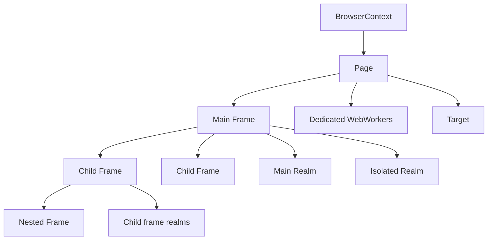
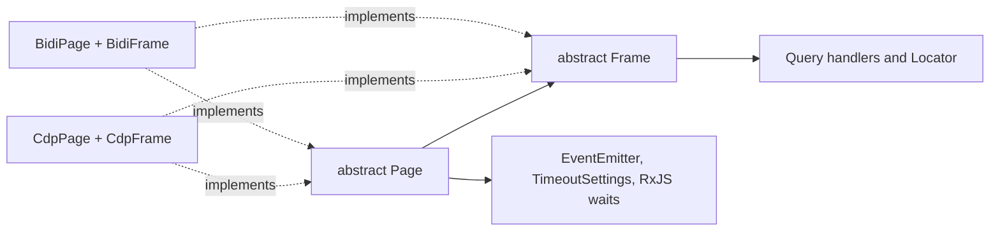
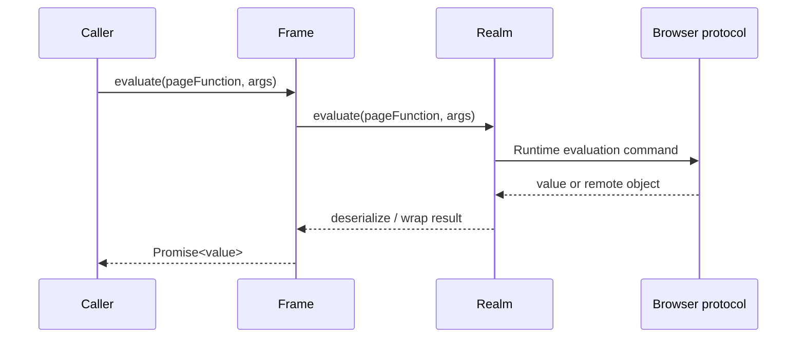
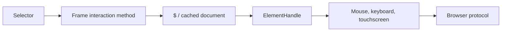
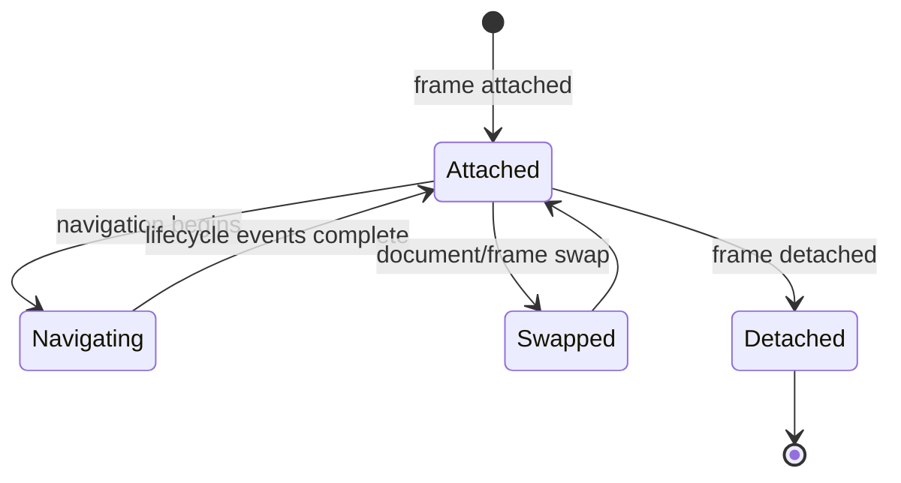
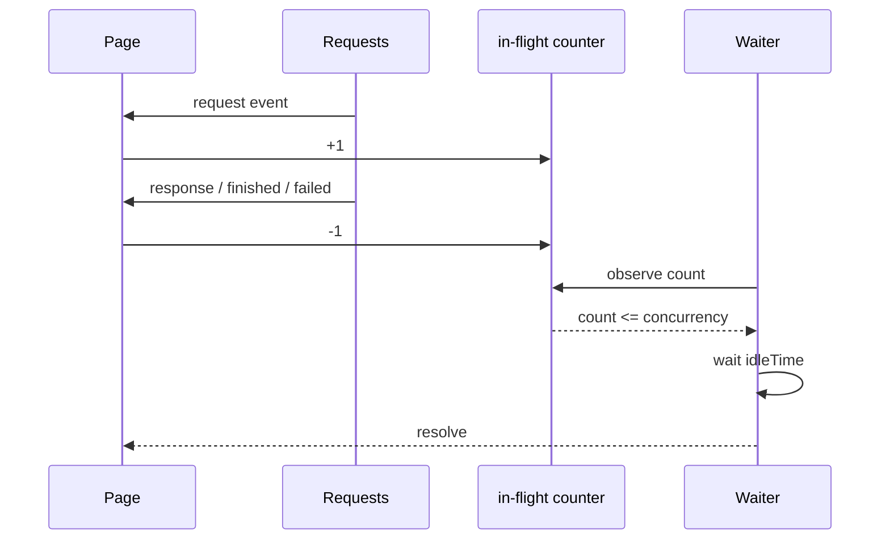
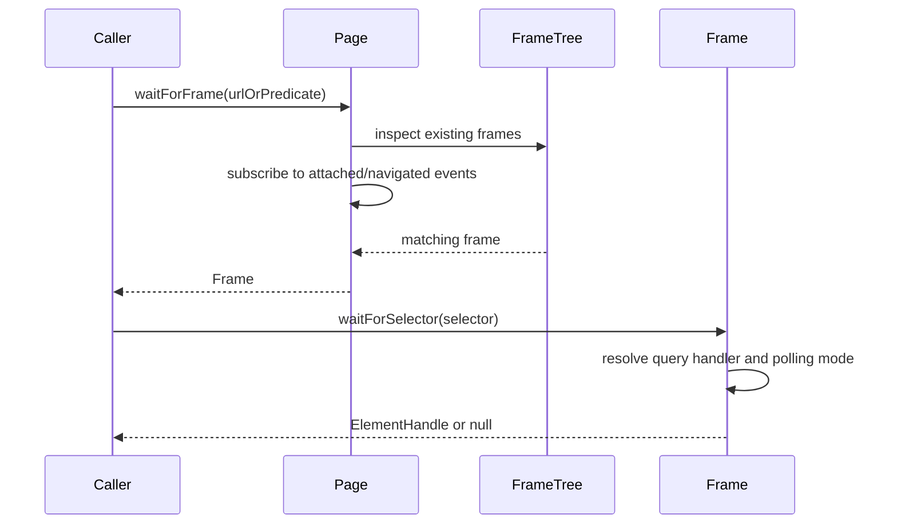
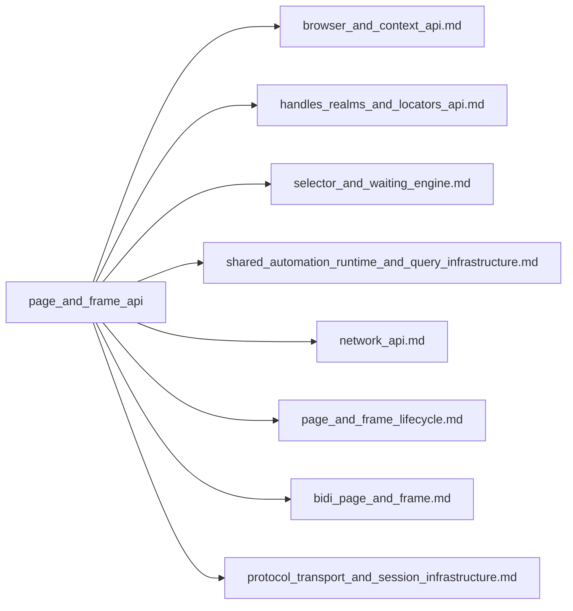

# Page and frame API

## Introduction

The `page_and_frame_api` module is Puppeteer’s protocol-neutral surface for automating a browser tab and the documents loaded inside it. `Page` models a tab (or extension background page); `Frame` models a document, including nested `<iframe>` and `<frame>` documents. The API combines navigation, DOM querying, JavaScript evaluation, user interaction, waiting, emulation, screenshots, and lifecycle events behind abstract contracts implemented by the CDP and WebDriver BiDi backends.

Pages are owned by browser contexts. Browser creation and context ownership are documented in [browser and context API](browser_and_context_api.md). Browser startup is covered by [launch and connect](launch_and_connect.md), while protocol sessions are described in [protocol transport and session infrastructure](protocol_transport_and_session_infrastructure.md).

## Position in the system

```mermaid
flowchart TD
    App[Automation application] --> Browser[Browser / BrowserContext]
    Browser --> Page[Page contract]
    Page --> Main[mainFrame()]
    Main --> Frames[Frame tree]
    Page --> Events[Page events]
    Page --> Session[CDP or WebDriver BiDi session]
    Frame --> Realm[Main and isolated realms]
    Frame --> Query[Selectors and locators]
    Query --> Handles[ElementHandle / JSHandle]
    Session --> Backend{Concrete adapter}
    Backend --> CDP[CdpPage / CdpFrame]
    Backend --> Bidi[BidiPage / BidiFrame]
```

The public classes do not encode a browser protocol. Their abstract methods are implemented by [page and frame lifecycle](page_and_frame_lifecycle.md) for CDP and [BiDi page and frame](bidi_page_and_frame.md) for WebDriver BiDi. The shared query and waiting machinery is documented in [shared automation runtime and query infrastructure](shared_automation_runtime_and_query_infrastructure.md).

## Architecture

### Page, frame, and document ownership



* `Page.mainFrame()` is the root of the current frame tree; `Page.frames()` returns all attached frames.
* `Frame.parentFrame()` and `Frame.childFrames()` expose the DOM/document hierarchy. `Frame.frameElement()` finds the owning iframe element in the parent frame.
* A frame has separate `mainRealm()` and `isolatedRealm()` execution environments. Public frame evaluation uses the main realm; selector infrastructure may use an isolated realm to avoid polluting page JavaScript.
* `ElementHandle` and `JSHandle` represent remote objects. Handles are produced by querying or evaluation and must be disposed when retained beyond a short operation; see [handles, realms, and locators API](handles_realms_and_locators_api.md).

### Contract and implementation split



The base classes provide protocol-independent shortcuts and orchestration. For example, `Page.goto()` delegates to `mainFrame().goto()`, and `Page.click()` delegates to `mainFrame().click()`. Backend classes supply navigation, protocol commands, input dispatch, screenshot capture, and frame discovery.

## `Frame` API

`Frame` is the primary document-scoped automation abstraction. It extends the common typed `EventEmitter` and guards most operations with `throwIfDetached`, so calls against a removed browsing context fail with a frame-specific error.

### Navigation and document state

| Member | Purpose |
| --- | --- |
| `goto(url, options)` | Navigates the frame and resolves with the final main-resource response, or `null` for navigation without a response such as `about:blank`. |
| `waitForNavigation(options)` | Waits for an indirect navigation, including History API URL changes. |
| `setContent(html, options)` | Replaces the document and waits according to `WaitForOptions`. |
| `content()` | Serializes the complete document, including the DOCTYPE. |
| `url()` / `title()` | Reads current document metadata. |
| `parentFrame()` / `childFrames()` | Traverses the frame tree. |
| `detached` | Indicates whether the frame is no longer usable. |

`WaitForOptions` centralizes timeout, lifecycle (`load`, `domcontentloaded`, or related events), and cancellation behavior. Defaults are controlled by the owning page’s navigation timeout settings.

### Evaluation and DOM queries

`evaluate()` runs a function or expression in the frame’s main realm and returns its serialized result. `evaluateHandle()` keeps the result as a remote handle, which is required for DOM nodes and other object references.



The query methods are built on a cached document handle:

* `$` returns the first matching `ElementHandle` or `null`.
* `$$` returns all matching handles and supports `QueryOptions.isolate`.
* `$eval` evaluates against the first matching element and throws if none exists.
* `$$eval` evaluates against the complete matching-element array.
* `waitForSelector` waits for presence, visibility, or hidden state and can survive navigations.
* `locator` creates a selector- or function-backed `Locator` with retryable actions.

Selectors are resolved through the shared query handler registry. CSS, text, ARIA, XPath, piercing/shadow-root, and custom query handlers are therefore shared with other page-interaction APIs; see [selector and waiting engine](selector_and_waiting_engine.md).

### Interaction shortcuts

`click`, `focus`, `hover`, `select`, `tap`, and `type` follow a common pattern: query the first matching element, assert that it exists, then delegate to `ElementHandle`. This keeps selector lookup and low-level pointer/keyboard behavior in the handle and input modules.



`addScriptTag` and `addStyleTag` inject content, a local file, or a URL into the document head. They require exactly one source and return a handle to the created element. The implementation evaluates in the isolated realm and transfers the handle into the main realm.

### Frame lifecycle events

`FrameEvents` is internal and uses symbols to prevent external listeners from depending on implementation details. Events represent navigation, lifecycle milestones, swaps, and detachment. Public consumers observe the corresponding page events:

| Public event | Meaning |
| --- | --- |
| `PageEvent.FrameAttached` | A frame was added to the page. |
| `PageEvent.FrameNavigated` | A frame reached a new document or URL. |
| `PageEvent.FrameDetached` | A frame was removed. |



After detachment, cached document handles are cleared and guarded methods reject. Frame identity is maintained through an internal frame id; the optional name is captured at creation time and is not dynamically updated.

## `Page` API

`Page` represents one tab and extends `EventEmitter<PageEvents>`. It exposes tab-level behavior and delegates document-centric operations to the main frame.

### Main-frame delegation

```mermaid
flowchart TD
    Caller --> PageMethod{Page shortcut}
    PageMethod --> Main[Page.mainFrame()]
    Main --> FrameMethod[Frame method]
    FrameMethod --> RealmOrHandle[Realm / ElementHandle]
    RealmOrHandle --> Protocol[CDP or BiDi]
```

The following methods are direct main-frame shortcuts: `$`, `$$`, `$eval`, `$$eval`, `evaluate`, `evaluateHandle`, `waitForSelector`, `waitForFunction`, `content`, `setContent`, `goto`, `waitForNavigation`, `addScriptTag`, `addStyleTag`, `click`, `focus`, `hover`, `select`, `tap`, `type`, `title`, and `url`. Use `Frame` directly when the operation must target a child document.

### Page lifecycle, events, and ownership

`Page` exposes `browser()`, `browserContext()`, `target()`, `close()`, and `isClosed()`. It also exposes `frames()`, `mainFrame()`, and `workers()` for browsing-context and worker inspection.

Important event groups include:

* lifecycle: `close`, `domcontentloaded`, `load`, `error`, `pageerror`;
* frames and targets: `frameattached`, `framenavigated`, `framedetached`, `popup`, `workercreated`, `workerdestroyed`;
* network: `request`, `requestservedfromcache`, `requestfailed`, `requestfinished`, `response`;
* diagnostics: `console`, `dialog`, and `metrics`.

Request listeners receive cooperative interception wrappers. When interception is enabled, every request must eventually be continued, responded to, aborted, or completed by cache. Network behavior is covered in [network API](network_api.md).

### Waiting and network-idle tracking

The page maintains an internal reactive count of in-flight requests. A request increments the count; its response, failure, or completion decrements it. `waitForNetworkIdle()` waits until the count is at or below the configured concurrency for at least `idleTime` (500 ms by default).



`waitForRequest`, `waitForResponse`, and `waitForFrame` merge event streams with existing state where applicable, apply synchronous or asynchronous predicates, and race the result against timeout, abort signal, and page closure. `TargetCloseError` is used when the page closes before a match.

### Emulation and page configuration

Page-level configuration includes:

* network: request interception, cache, offline mode, service-worker bypass, extra headers, authentication, user agent, and network conditions;
* runtime: JavaScript enablement, CSP bypass, default timeouts, and preload scripts via `evaluateOnNewDocument`;
* device and rendering: viewport, geolocation, media type/features, timezone, CPU throttling, idle state, vision deficiency, and `emulate(device)`;
* input and diagnostics: keyboard, mouse, touchscreen, accessibility, coverage, tracing, metrics, and device/file prompts.

`emulate(device)` concurrently applies the device user agent and viewport. Settings that affect document initialization—such as JavaScript, CSP, viewport mobile mode, or preload scripts—should generally be configured before navigation.

### Screenshots, PDF, and screencasts

`Page.screenshot()` validates and normalizes clip rectangles, format/quality, full-page behavior, encoding, and output paths. Screenshot operations are serialized through the browser context to prevent concurrent capture and page close/new-page races. It returns bytes by default or base64 when requested.

`pdf()` and `createPDFStream()` are backend operations exposed by the page contract. PDF output uses print media by default; call `emulateMediaType('screen')` first when screen styling is required.

`screencast()` starts a PNG frame stream through the page protocol session and hands frames to `ScreenRecorder`, which requires FFmpeg for final video encoding. Multiple recorder consumers share one underlying screencast session; the protocol stream stops when the final consumer ends.

## End-to-end process flows

### Navigate and interact

```mermaid
flowchart TD
    Start[Page created] --> Configure[Configure viewport, headers, timeouts]
    Configure --> Navigate[page.goto(url)]
    Navigate --> Main[mainFrame.goto]
    Main --> Lifecycle[Wait for requested lifecycle events]
    Lifecycle --> Query[waitForSelector / locator]
    Query --> Action[click, type, evaluate, or select]
    Action --> MaybeNav{Action navigates?}
    MaybeNav -->|Yes| Wait[page.waitForNavigation in Promise.all]
    MaybeNav -->|No| Result[Read result or continue]
    Wait --> Result
```

When an action can trigger navigation, register the navigation wait before performing the action (usually with `Promise.all`) to avoid missing the navigation event.

### Wait for a frame and query it



## Dependencies and related modules



Key source components are:

* `packages/puppeteer-core/src/api/Page.ts`: page contract, event types, main-frame shortcuts, network-idle accounting, waits, emulation, screenshots, and disposal.
* `packages/puppeteer-core/src/api/Frame.ts`: frame contract, frame tree, navigation, evaluation, document queries, locators, injection, and selector interactions.
* `packages/puppeteer-core/src/cdp/Page.ts` and `Frame.ts`: CDP command execution and lifecycle integration.
* `packages/puppeteer-core/src/bidi/Page.ts` and `Frame.ts`: WebDriver BiDi command execution and adapter behavior.
* `packages/puppeteer-core/src/api/ElementHandle.ts`, `JSHandle.ts`, and `Realm.ts`: remote values and execution contexts returned by this module.
* `packages/puppeteer-core/src/api/HTTPRequest.ts` and `HTTPResponse.ts`: network objects used by page events and navigation results.

## Operational considerations

* Always scope child-document work to the appropriate `Frame`; page shortcuts target only `mainFrame()`.
* Treat frames as ephemeral. Navigation and detachment can invalidate handles and cached documents; reacquire them after lifecycle changes.
* Use explicit timeouts or abort signals for waits that depend on external state.
* Coordinate action/navigation pairs with `Promise.all`.
* Dispose retained handles and close pages or contexts through their owning browser lifecycle.
* Prefer context-level cookie APIs; page cookie methods are deprecated and delegate to browser/context APIs. See [browser and context API](browser_and_context_api.md).
