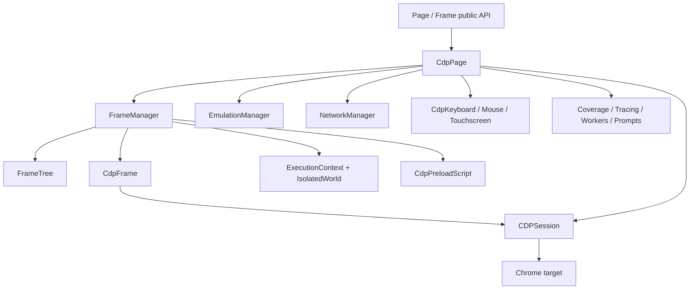
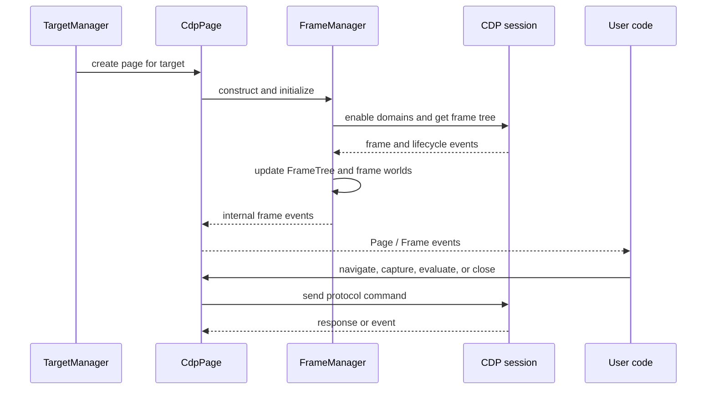

# Page and frame lifecycle

## Purpose

`page_and_frame_lifecycle` is the CDP implementation behind Puppeteer’s page and frame automation model. It turns browser protocol events and commands into stable `Page` and `Frame` objects, maintains the frame hierarchy across navigation and out-of-process iframe changes, and coordinates navigation, emulation, dialogs, file choosers, workers, screenshots, PDF generation, cookies, and exposed functions.

The public contracts are defined by [`page_and_frame_api.md`](page_and_frame_api.md). This module supplies the Chromium/CDP implementation; transport/session details are described in [`protocol_transport_and_session_infrastructure.md`](protocol_transport_and_session_infrastructure.md), while browser and target ownership is covered by [`browser_context_and_target_lifecycle.md`](browser_context_and_target_lifecycle.md).

## Architecture overview

`CdpPage` is the façade and event adapter. `FrameManager` synchronizes CDP page/runtime events. `FrameTree` provides the in-memory hierarchy, and each `CdpFrame` owns two execution worlds and navigation watchers.

## Main lifecycle

## Submodules

- [`page_and_frame_lifecycle_page.md`](page_and_frame_lifecycle_page.md) — `CdpPage` construction, protocol event translation, page operations, and close semantics.
- [`page_and_frame_lifecycle_frames.md`](page_and_frame_lifecycle_frames.md) — `CdpFrame` navigation, execution worlds, frame attachment/detachment, and frame-level prompts.
- [`page_and_frame_lifecycle_manager.md`](page_and_frame_lifecycle_manager.md) — `FrameManager`, `FrameTree`, event ordering, OOPIF swaps, preload scripts, and bindings.
- [`page_and_frame_lifecycle_prompts_and_output.md`](page_and_frame_lifecycle_prompts_and_output.md) — dialogs, device prompts, file choosers, screenshots, PDFs, metrics, and related helpers.

## Relationship to neighboring modules

Page creation and target ownership originate in [`browser_context_and_target_lifecycle.md`](browser_context_and_target_lifecycle.md). CDP sessions and transports come from [`protocol_transport_and_session_infrastructure.md`](protocol_transport_and_session_infrastructure.md). Evaluation contexts, handles, and isolated realms are implemented in [`handles_realms_and_locators_api.md`](handles_realms_and_locators_api.md). Network abstractions are shared with [`network_api.md`](network_api.md). Public method contracts are documented in [`page_and_frame_api.md`](page_and_frame_api.md).

## Key invariants

1. A `CdpPage` keeps a current primary target session; prerender activation can replace it, requiring session-bound helpers and the frame tree to update.
2. Frame objects are retained where possible across main-frame replacement, preserving caller-visible identity.
3. Frame identifiers and the tree are eventually consistent; frame-dependent operations use waiters and detached guards.
4. Navigation completion is lifecycle-driven through `LifecycleWatcher`, which is disposed on every completion path.
5. Preload scripts and exposed bindings are registered centrally, then installed per frame/session as needed.

