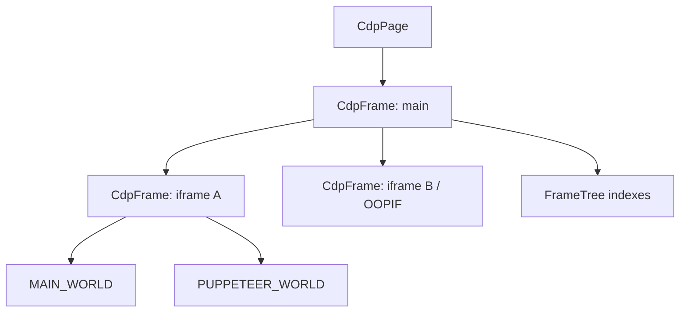

# CdpFrame and frame navigation

Sources: `packages/puppeteer-core/src/cdp/Frame.ts`, `packages/puppeteer-core/src/cdp/FrameTree.ts`

## Responsibility

`CdpFrame` is the CDP implementation of a Puppeteer frame. It retains its frame ID, parent relationship, URL, client session, lifecycle state, and two isolated worlds. `FrameTree` stores those frames and parent/child indexes; it is intentionally eventually consistent because CDP events and target swaps can arrive in different orders.

## Navigation

`goto` sends `Page.navigate`, then races navigation progress against `LifecycleWatcher` termination. `waitForNavigation` handles same-document and new-document navigation; `setContent` writes document content and waits for requested lifecycle events. Detached frames are rejected by `throwIfDetached`.

An `init` lifecycle event resets the loader and lifecycle set. Loading start/stop events update frame state, with stopped loading synthesizing DOMContentLoaded and load markers.

## Execution worlds and bindings

Each frame has a main world and Puppeteer utility world. Runtime execution contexts are assigned by frame ID, session, and world metadata. Frame-level preload scripts use `Page.addScriptToEvaluateOnNewDocument`; exposed functions install a CDP runtime binding plus a page wrapper. Console and binding events are forwarded to `FrameManager`.

## Detachment and OOPIF behavior

`disposeSymbol` marks a frame detached and disposes both worlds. Child frames are removed recursively by `FrameManager`. A CDP `swap` detachment is represented as a frame swap rather than immediate removal, allowing a new session to update the frame while preserving object identity. `frameElement` resolves an owning iframe through `DOM.getFrameOwner` and adopts its backend node in the parent main realm.

