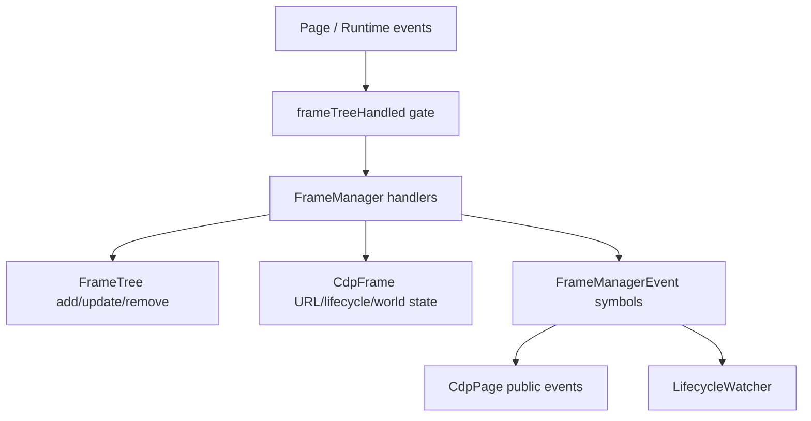

# FrameManager, FrameTree, and preload coordination

Sources: `packages/puppeteer-core/src/cdp/FrameManager.ts`, `packages/puppeteer-core/src/cdp/FrameManagerEvents.ts`, `packages/puppeteer-core/src/cdp/FrameTree.ts`, `packages/puppeteer-core/src/cdp/CdpPreloadScript.ts`

## Responsibility

`FrameManager` is the synchronization boundary between a page and CDP frame/runtime events. It owns the `FrameTree`, `NetworkManager`, timeout settings, preload scripts, exposed bindings, isolated-world setup, and per-session device prompt managers.

Initialization enables Page and Runtime domains, obtains the initial frame tree, enables lifecycle events, creates the utility world, and reinstalls registered scripts/bindings when a session is replaced. The frame-tree deferred prevents incremental events from racing initial `Page.getFrameTree` processing.

## Tree management and swaps

`FrameTree` indexes frames by ID, parent ID, and child IDs, tracks the current main frame, and resolves waiters when a frame appears. `FrameManager` creates frames on attachment/navigation, removes descendants before replacing a navigated frame, and recursively disposes frames on actual removal.

When a primary client disconnects, the manager waits briefly for activation. If no swap occurs, it removes the affected frames. `swapFrameTree` updates the main frame’s ID and client, reinitializes protocol domains, adds the new network client, and emits `FrameSwappedByActivation`. Prerender sessions are registered speculatively with network infrastructure before activation.

## Scripts, bindings, and events

`CdpPreloadScript` exposes the user-visible main-frame identifier while storing per-frame CDP identifiers in a weak map. `evaluateOnNewDocument` and binding registration fan out to all current frames. Symbol-based internal events cover attachment, navigation, detachment, swaps, lifecycle changes, same-document navigation, console calls, and binding calls; `CdpPage` maps them to public events.

