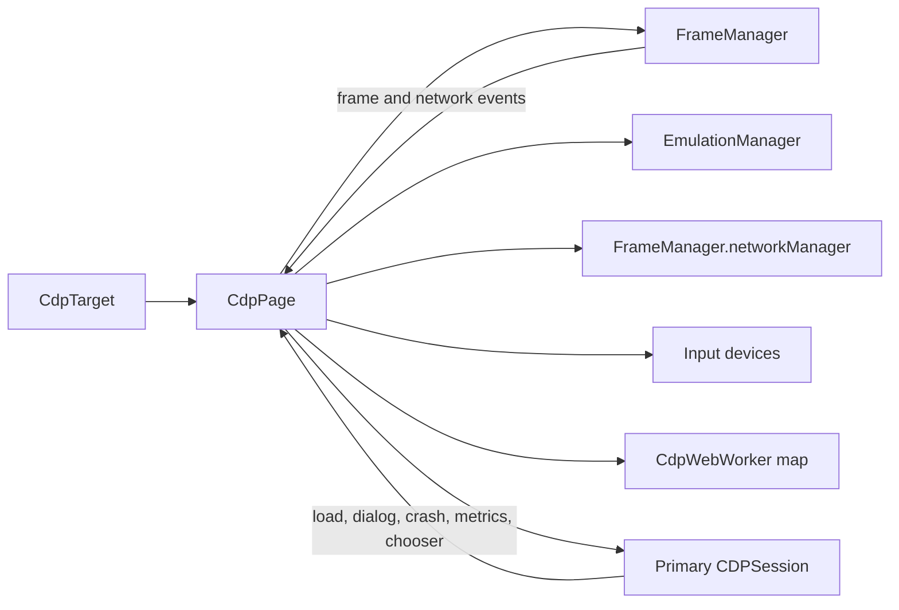

# CdpPage

Source: `packages/puppeteer-core/src/cdp/Page.ts`

## Responsibility

`CdpPage` implements the protocol-neutral `Page` API for a CDP target. It owns page-scoped helpers and translates CDP notifications into Puppeteer events. Construction wires the target’s primary session, tab session, `FrameManager`, emulation, input, coverage, tracing, and worker tracking; `_create` initializes the frame tree and applies the default viewport.

## Component interactions

## Lifecycle and event translation

`#setupPrimaryTargetListeners` handles DOM content loaded, load, JavaScript dialogs, runtime exceptions, crashes, performance metrics, log entries, and file chooser events. `FrameManager` events are re-emitted as public page events. Attached worker targets become `CdpWebWorker` instances and are removed when their target disappears.

The primary session may be swapped during prerender activation. `#onActivation` updates session-bound input, emulation, tracing, and coverage helpers, swaps the frame tree through `FrameManager.swapFrameTree`, and reinstalls listeners.

## Operations

- Navigation: `reload`, `goBack`, and `goForward` pair CDP commands with `waitForNavigation`.
- Runtime and bindings: `evaluateOnNewDocument`, `exposeFunction`, and removal delegate to `FrameManager`.
- Network and policy: cookies, authentication, headers, user agent, interception, cache, offline mode, service-worker bypass, and CSP settings use CDP or `NetworkManager`.
- Presentation: viewport/emulation changes use `EmulationManager`; screenshots use `Page.captureScreenshot`; PDFs use `Page.printToPDF` streams.
- Shutdown: `close` either sends `Page.close` with before-unload handling or closes the target directly, then waits for target closure.

## Cleanup

Closed-target errors during startup are tolerated where the target can legitimately disappear. Page closure emits `PageEvent.Close` and marks the page closed. Screenshot operations use an async disposable guard to restore temporary transparent-background state.

