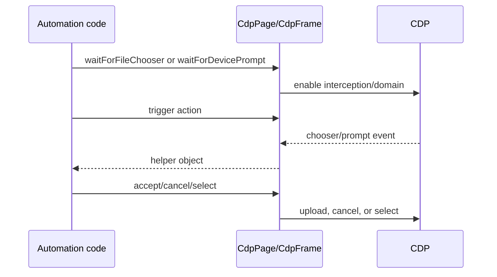

# Prompts, capture, and lifecycle-sensitive helpers

Sources: `packages/puppeteer-core/src/cdp/Dialog.ts`, `packages/puppeteer-core/src/cdp/DeviceRequestPrompt.ts`, `packages/puppeteer-core/src/common/FileChooser.ts`, `packages/puppeteer-core/src/common/PDFOptions.ts`, and relevant methods in `packages/puppeteer-core/src/cdp/Page.ts`.

`CdpDialog` handles JavaScript dialogs with `Page.handleJavaScriptDialog`. `DeviceRequestPromptManager` arms `DeviceAccess`, resolves waiters, accumulates devices, and enforces one-shot select/cancel semantics. `FileChooser` wraps the input element adopted from the chooser event; accepting uploads paths, while canceling dispatches the cancellation event.

`CdpPage._screenshot` optionally makes the background transparent, intersects clips with the visual viewport when constrained, and calls `Page.captureScreenshot`, restoring state through disposal cleanup. PDF generation parses paper format, dimensions, margins, headers, ranges, tagging, outlines, and font-wait options, then requests `Page.printToPDF` as a protocol stream. `pdf` consumes that stream into bytes and may save the configured path. Metrics are filtered to supported performance names before return or emission.

