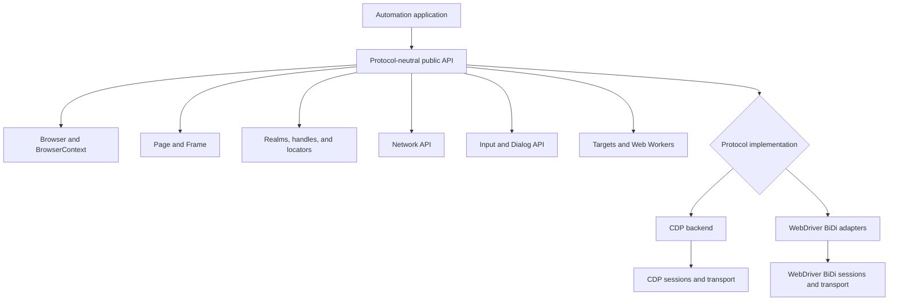
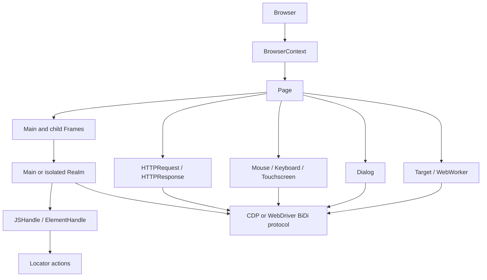
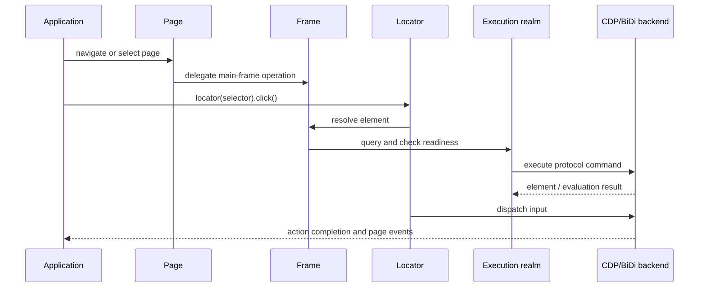

# Protocol-Neutral Public Automation API

## Purpose

The `protocol_neutral_public_automation_api` module, located at `packages/puppeteer-core/src/api`, defines Puppeteer’s public automation contracts independently of the underlying browser protocol.

It provides abstractions for:

- Browser and isolated browser-context ownership
- Pages, frames, navigation, querying, and lifecycle events
- JavaScript realms, remote handles, and retryable locators
- Network requests, responses, and interception
- Keyboard, mouse, touchscreen, and JavaScript-dialog interaction
- Browser targets and Web Workers

Concrete implementations are supplied by the Chrome DevTools Protocol (CDP) backend and WebDriver BiDi adapters.

## Architecture

### Public API and protocol implementations

The API layer owns shared contracts, lifecycle semantics, convenience methods, event models, validation, timeout behavior, and cross-component orchestration. Protocol-specific command execution and browser event translation remain below this layer.

### Object ownership and automation flow

Browser contexts isolate profile state such as cookies and storage. Pages contain frame trees and workers; frames execute code through realms; handles and locators provide DOM-level interaction. Network, input, dialog, target, and worker objects expose related browser events through stable public abstractions.

### Typical interaction sequence

## Core component documentation

- [Browser and context API](browser_and_context_api.md) — browser sessions, isolated contexts, pages, cookies, permissions, targets, and disposal.
- [Page and frame API](page_and_frame_api.md) — navigation, frame hierarchies, DOM querying, evaluation, waiting, emulation, screenshots, and page events.
- [Handles, realms, and locators API](handles_realms_and_locators_api.md) — remote values, DOM handles, execution realms, selector resolution, waits, and retryable actions.
- [Network API](network_api.md) — request/response objects, interception, redirects, response bodies, and network lifecycle.
- [Input and Dialog API](input_and_dialog_api.md) — keyboard, mouse, touchscreen, touch handles, and JavaScript dialogs.
- [Targets and workers API](targets_and_workers_api.md) — target discovery, page/worker capability conversion, worker evaluation, and target ownership.

These components depend on shared runtime and selector infrastructure for event emitters, timeouts, waits, mutexes, query handlers, and disposal. Their concrete behavior is implemented by the CDP backend and WebDriver BiDi adapters, using the protocol transport and session infrastructure.