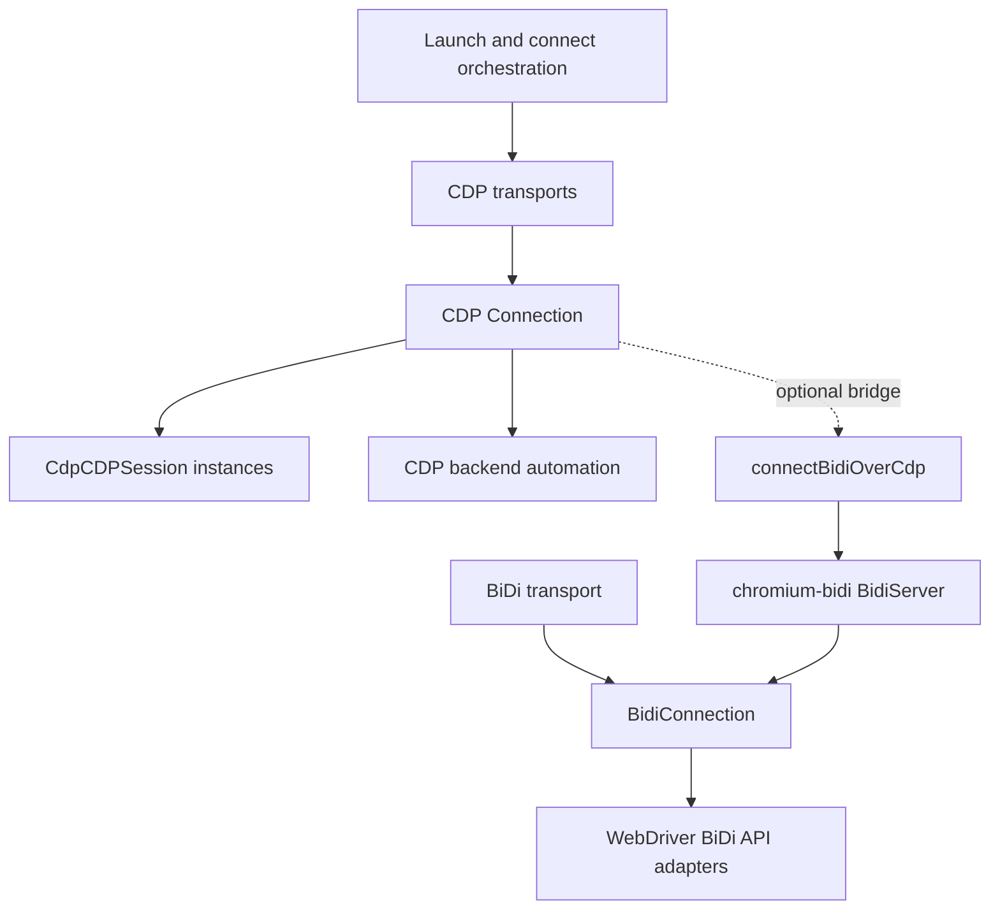
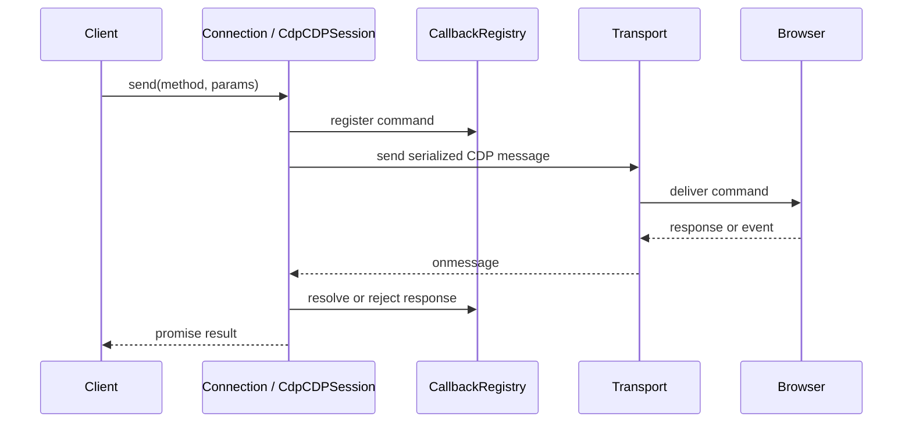

# Protocol Transport and Session Infrastructure

## Purpose

The `protocol_transport_and_session_infrastructure` module provides Puppeteer’s low-level browser communication layer. It transports serialized protocol messages, correlates commands with asynchronous responses, routes events, manages target-scoped sessions, and handles connection, timeout, detachment, and shutdown behavior.

It supports both:

- Native Chrome DevTools Protocol (CDP) connections over WebSocket, pipes, or extension debugging.
- WebDriver BiDi connections, including BiDi translated over an existing CDP connection.

## Architecture

### CDP transport and session flow

`Connection` owns the physical transport and routes browser-level messages and session messages. `CdpCDPSession` provides a target-scoped view using its session ID. `CallbackRegistry` manages command IDs, promises, timeouts, errors, and cleanup.

### BiDi-over-CDP flow

```mermaid
flowchart LR
    Caller --> BidiConnection
    BidiConnection --> NoOpTransport
    NoOpTransport --> BidiServer[chromium-bidi BidiServer]
    BidiServer --> CdpAdapter[CdpConnectionAdapter]
    CdpAdapter --> CdpConnection[Existing CDP Connection]
    CdpConnection --> Browser
    Browser --> CdpConnection
    CdpConnection --> CdpAdapter
    CdpAdapter --> BidiServer
    BidiServer --> NoOpTransport
    NoOpTransport --> BidiConnection
    BidiConnection --> Caller
```

`BidiConnection` handles BiDi command serialization, response correlation, event dispatch, and lifecycle. `connectBidiOverCdp` creates an in-process bridge where `chromium-bidi` translates BiDi operations into CDP commands. `BidiCdpSession` exposes CDP commands and events for BiDi-backed frames when CDP support is available.

## Core components

- `Connection` — browser-level CDP router and session registry.
- `CdpCDPSession` — target-scoped CDP command and event channel.
- `ConnectionTransport` implementations — WebSocket, pipe, and extension transports.
- `BidiConnection` — BiDi command, response, event, and lifecycle manager.
- `BidiCdpSession` — CDP session facade for BiDi-backed frames.
- `CdpConnectionAdapter` and `CDPClientAdapter` — adapt Puppeteer CDP clients to `chromium-bidi`.
- `CallbackRegistry` — shared request ID, timeout, promise, and cleanup infrastructure.

## References

- [Protocol transport and sessions](protocol_transport_and_sessions.md) — native CDP transports, connection routing, sessions, and lifecycle.
- [BiDi transport and CDP bridge](bidi_transport_and_cdp_bridge.md) — BiDi connections, BiDi-over-CDP translation, and BiDi CDP sessions.
- [Launch and connect orchestration](launch_and_connect_orchestration.md) — selects and constructs browser transports.
- [CDP backend automation implementation](cdp_backend_automation_implementation.md) — consumes CDP connections and sessions.
- [WebDriver BiDi API adapters](webdriver_bidi_api_adapters.md) — builds browser and page behavior on BiDi connections.
- [WebDriver BiDi core protocol model](webdriver_bidi_core_protocol_model.md) — defines BiDi protocol-facing model objects.
- [Runtime lifecycle and scheduling](runtime_lifecycle_and_scheduling.md) — provides event, deferred, timeout, and disposal utilities.
- [Targets and workers API](targets_and_workers_api.md) — exposes target-derived objects to API consumers.

## Source references

| Component | Source |
| --- | --- |
| CDP connection and routing | `packages/puppeteer-core/src/cdp/Connection.ts` |
| CDP sessions | `packages/puppeteer-core/src/cdp/CdpSession.ts` |
| Node WebSocket transport | `packages/puppeteer-core/src/node/NodeWebSocketTransport.ts` |
| Pipe transport | `packages/puppeteer-core/src/node/PipeTransport.ts` |
| Browser WebSocket transport | `packages/puppeteer-core/src/common/BrowserWebSocketTransport.ts` |
| Extension transport | `packages/puppeteer-core/src/cdp/ExtensionTransport.ts` |
| BiDi connection | `packages/puppeteer-core/src/bidi/Connection.ts` |
| BiDi-over-CDP bridge | `packages/puppeteer-core/src/bidi/BidiOverCdp.ts` |
| BiDi CDP sessions | `packages/puppeteer-core/src/bidi/CDPSession.ts` |
| Callback correlation | `packages/puppeteer-core/src/common/CallbackRegistry.ts` |