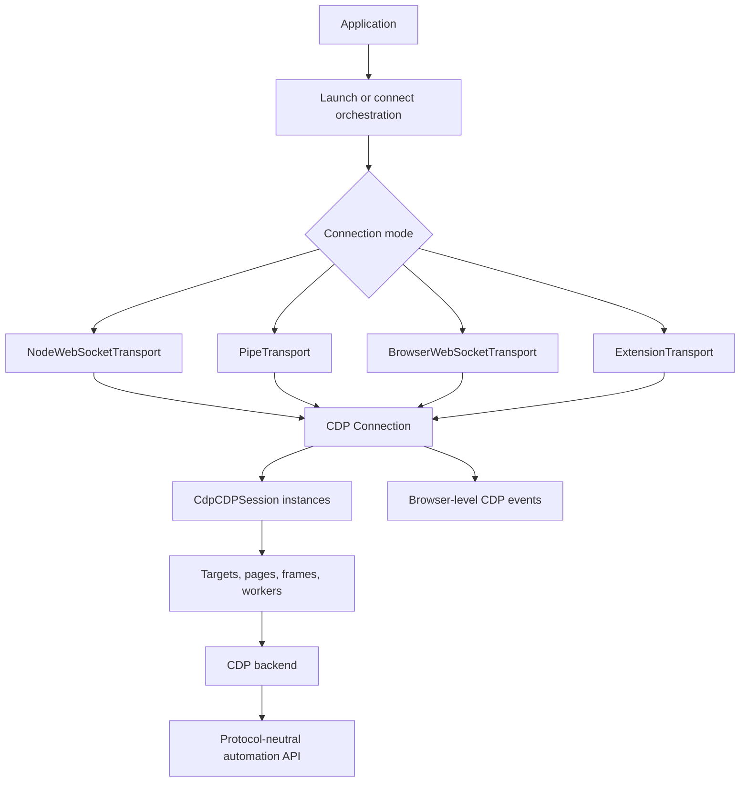
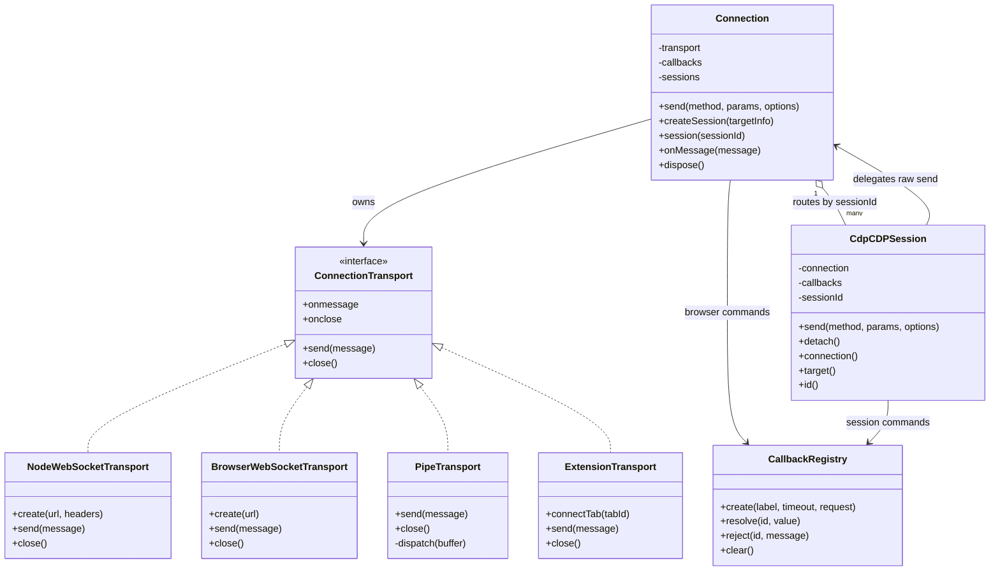
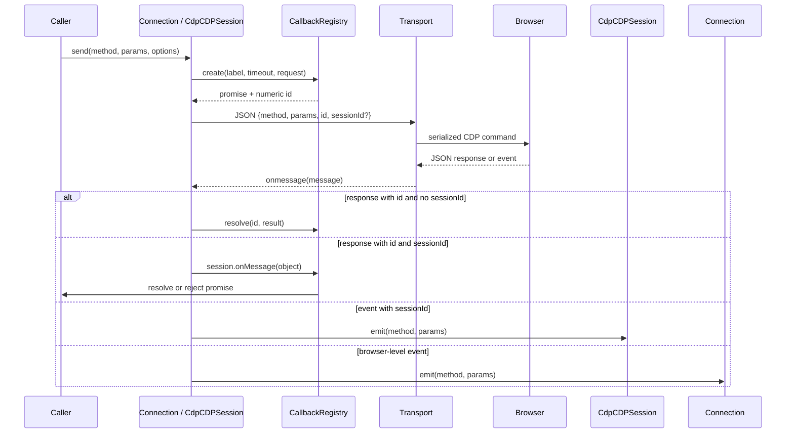
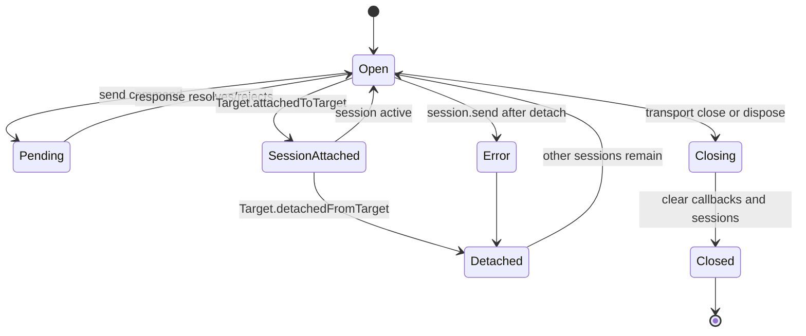

# Protocol transport and sessions

## Introduction

The `protocol_transport_and_sessions` module is Puppeteer’s CDP messaging layer. It turns a byte- or message-oriented connection to a browser into typed, promise-based protocol commands and event streams. `Connection` owns the browser-level CDP channel, `CdpCDPSession` represents target-scoped channels, transport implementations move serialized JSON, and `CallbackRegistry` correlates command IDs with results, errors, timeouts, and teardown.

This module is a child of the broader protocol transport and session infrastructure. That parent also includes the WebDriver BiDi connection and CDP bridge; those are intentionally not duplicated here. The module is consumed by [launch and connect orchestration](launch_and_connect_orchestration.md), then by the CDP backend automation implementation and public APIs such as [browser and context API](browser_and_context_api.md) and [page and frame API](page_and_frame_api.md).

## Position in the system



The boundary is deliberately narrow:

| Concern | Owner |
| --- | --- |
| Choosing an executable, starting a process, and discovering an endpoint | [Launch and connect orchestration](launch_and_connect_orchestration.md) |
| WebSocket, pipe, or debugger transport mechanics | This module |
| JSON CDP command routing and event delivery | `Connection` and `CdpCDPSession` |
| Promise correlation, timeout, and rejection | `CallbackRegistry` |
| Target/page/network/evaluation behavior | CDP backend automation implementation |
| WebDriver BiDi-native transport and CDP bridge | The broader protocol transport and session infrastructure |

## Architecture



### Transport implementations

All transports implement the small `ConnectionTransport` contract: `send(string)`, `close()`, and optional `onmessage`/`onclose` callbacks. The protocol layer therefore does not depend on the physical channel.

- `NodeWebSocketTransport` uses the `ws` package for Node connections. It follows redirects, disables per-message compression, permits large messages up to 256 MiB, and adds a Puppeteer `User-Agent` plus caller headers.
- `BrowserWebSocketTransport` uses the browser’s native `WebSocket` API. Creation resolves after `open`; message and close events are forwarded to the callbacks.
- `PipeTransport` frames messages with a NUL byte. It handles partial buffers and multiple messages in one read, dispatching each complete message asynchronously with `setImmediate`. A `DisposableStack` removes stream subscriptions during close.
- `ExtensionTransport` adapts `chrome.debugger` for extension contexts. It synthesizes the restricted target/browser commands needed for Puppeteer’s target model, forwards other commands through `chrome.debugger.sendCommand`, and converts debugger events and failures back into CDP-shaped JSON.

Transport errors are observed but not generally surfaced as independent protocol events: WebSocket errors are ignored after creation, while the close callback drives connection teardown. Pipe stream errors are sent to debug logging. Command-level errors arrive as CDP response objects and are handled by `Connection` or a session.

### Connection and session ownership

`Connection` stores the endpoint URL, transport, protocol delay, command timeout, browser-level callback registry, and a map from session IDs to `CdpCDPSession` objects. It binds transport callbacks in its constructor, making the connection the sole protocol message router.

`CdpCDPSession` is a scoped view over the same transport. Its commands carry `sessionId`, while its own callback registry keeps responses local to that target. A session optionally records a parent session and a `CdpTarget`; `target()` is only valid after backend target initialization. `detached` becomes true when either the session is explicitly detached or the owning connection closes.

## Command and response data flow



`Connection.send()` calls `_rawSend()` with the connection registry and no session ID. A session calls the same `_rawSend()` with its own registry and session ID. The registry allocates a process-wide incremental ID, starts the timeout, invokes the transport synchronously, and removes the callback when the promise settles.

The CDP protocol mapping supplies compile-time method, parameter, and return-value types. Runtime messages remain JSON, so `onMessage()` parses the payload and uses the presence of `sessionId`, `id`, `error`, and `method` to classify it.

## Session attachment and target routing

```mermaid
flowchart LR
    Target[Target.attachToTarget] --> Attach[Target.attachedToTarget event]
    Attach --> Construct[Construct CdpCDPSession]
    Construct --> Store[Connection.sessions.set(sessionId)]
    Store --> Notify[Emit SessionAttached]
    Notify --> Parent[Also notify parent session when present]
    Store --> Route[Route later messages by object.sessionId]
    Detach[Target.detachedFromTarget] --> CloseSession[session.onClosed]
    CloseSession --> Remove[Remove from sessions map]
    Remove --> DetachedEvent[Emit SessionDetached]
```

`createSession(targetInfo)` sends `Target.attachToTarget` with `flatten: true`, then waits for the corresponding attachment event to populate the session map. Manual attachment is tracked so the target manager can distinguish sessions created by explicit user/API requests from auto-attach behavior. If the attachment response has no matching session, creation fails with `CDPSession creation failed.`

When a `Target.attachedToTarget` event arrives, `Connection` creates the session with target type, session ID, optional parent session ID, and raw-error policy. It emits `SessionAttached` globally and forwards the event to the parent session when one exists. Detachment clears pending session callbacks, marks the session detached, removes it from the map, and emits both global and parent notifications.

## Lifecycle and failure behavior



`Connection.dispose()` closes the connection idempotently: it marks the connection closed, unhooks transport callbacks, rejects all browser-level pending callbacks through `CallbackRegistry.clear()`, calls `onClosed()` on every session, clears the session map, emits `Disconnected`, and closes the physical transport. A closed connection rejects future commands with `ConnectionClosedError`.

`CdpCDPSession.detach()` sends `Target.detachFromTarget` and then marks the session detached. Sending after detachment rejects with `TargetCloseError` describing the target type. Connection teardown uses the same `onClosed()` path, which clears session callbacks and emits the session’s `Disconnected` event.

Callback failures follow three paths:

1. A normal CDP error is converted into a protocol error containing the command label and original browser message.
2. `rawErrors` preserves the browser’s raw error object for callers that request that behavior.
3. Timeout rejects with guidance to increase `protocolTimeout`; clearing a registry rejects pending operations as target-closed.

Late responses are ignored when their callback ID is no longer present. This is important during shutdown and target detachment, where the browser can race with local cleanup.

## Extension transport behavior

The extension adapter is the only transport that implements protocol semantics in addition to message movement. `connectTab(tabId)` attaches at CDP version `1.3`. It reports synthetic tab and page targets because extension debugger access does not expose the complete target domain in the same way as a normal browser endpoint.

For ordinary commands, the adapter removes its synthetic page session ID before calling `chrome.debugger.sendCommand`, then restores the protocol-shaped session ID in the response. Rejections become `{id, sessionId, error}` messages, allowing the normal `Connection` error path to remain unchanged. `close()` unregisters the debugger event listener and detaches from the tab.

## Integration with neighboring modules

- [Launch and connect orchestration](launch_and_connect_orchestration.md) selects and constructs the transport for a launched or existing browser.
- The CDP backend automation implementation creates browser, target, page, frame, network, input, emulation, coverage, and tracing objects on top of connections and sessions.
- WebDriver BiDi adapters provide the protocol-neutral counterparts for browsers connected through BiDi. The shared parent module describes the BiDi connection and CDP bridge.
- [Runtime lifecycle and scheduling](runtime_lifecycle_and_scheduling.md) supplies event emission, deferred completion, timeout-related helpers, and disposal primitives used around this layer.
- [Targets and workers API](targets_and_workers_api.md) exposes target/session-derived objects to callers without exposing transport details.

## Source map

| Source | Role |
| --- | --- |
| `packages/puppeteer-core/src/cdp/Connection.ts` | Browser-level CDP router, session registry, lifecycle, and command dispatch |
| `packages/puppeteer-core/src/cdp/CdpSession.ts` | Target-scoped CDP session and detachment behavior |
| `packages/puppeteer-core/src/common/BrowserWebSocketTransport.ts` | Browser-runtime WebSocket transport |
| `packages/puppeteer-core/src/node/NodeWebSocketTransport.ts` | Node WebSocket transport |
| `packages/puppeteer-core/src/node/PipeTransport.ts` | NUL-delimited process-pipe transport |
| `packages/puppeteer-core/src/cdp/ExtensionTransport.ts` | Chrome extension debugger transport |
| `packages/puppeteer-core/src/common/CallbackRegistry.ts` | Request IDs, promises, timeout, resolution, rejection, and cleanup |
