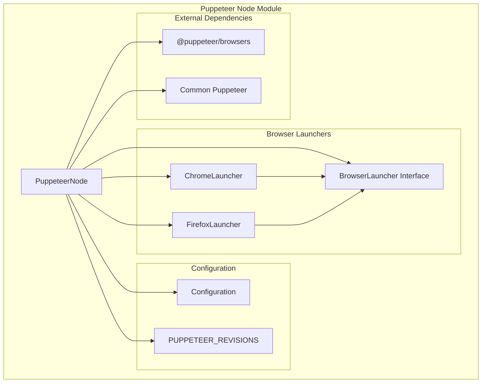
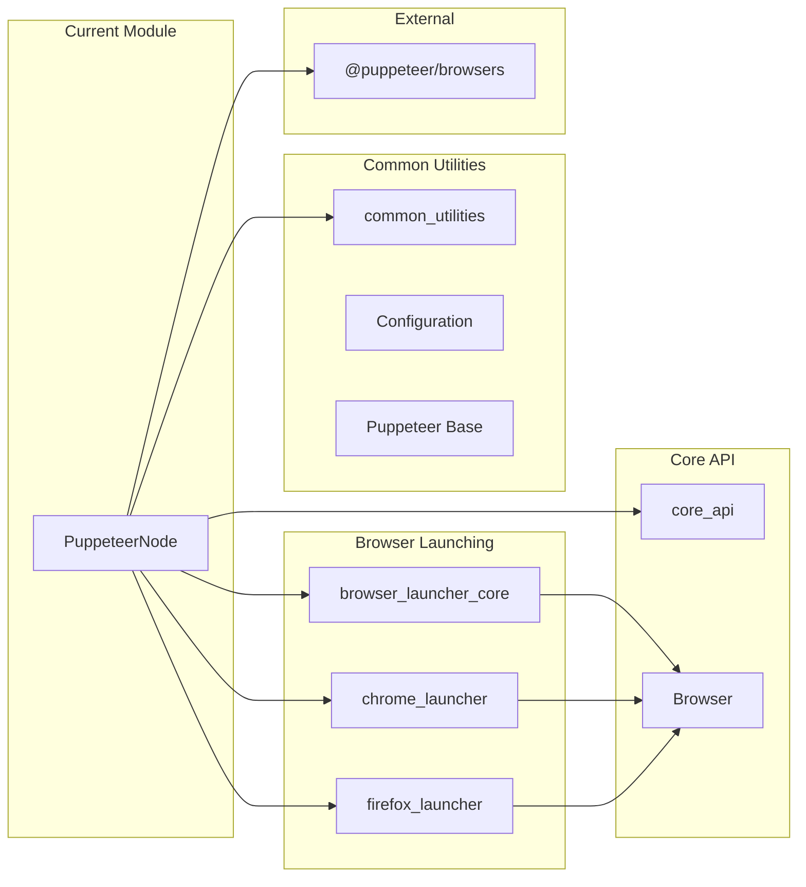
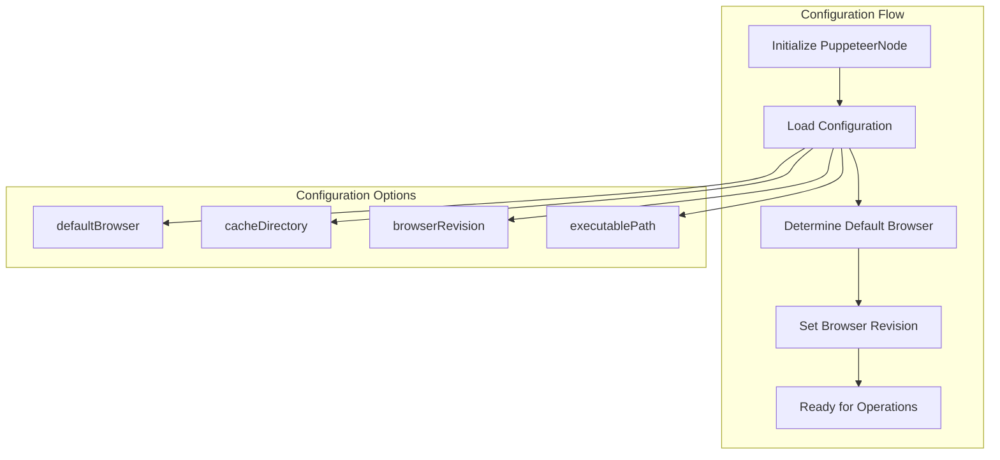
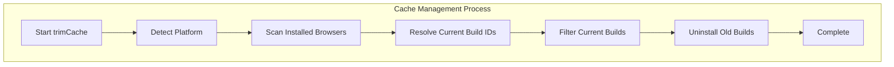
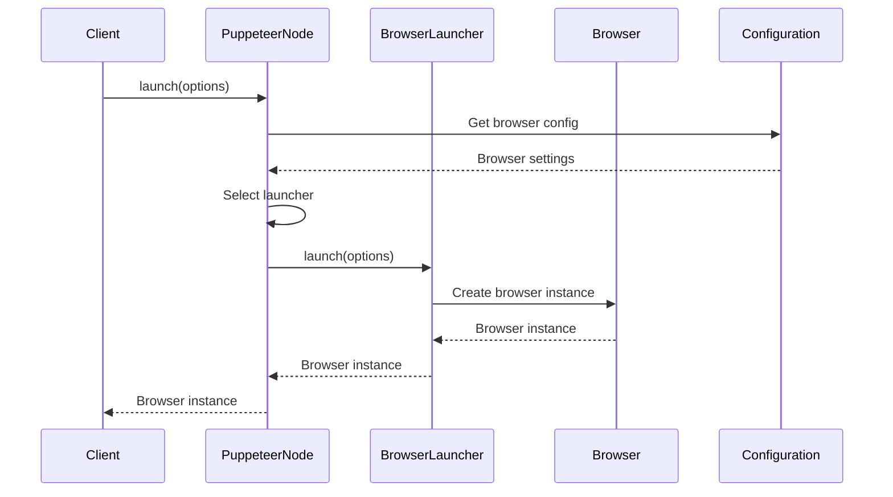

# Puppeteer Node Module

## Overview

The `puppeteer_node` module provides the Node.js-specific implementation of Puppeteer, extending the base Puppeteer class with Node.js environment capabilities for browser management, launching, and automation. This module serves as the primary entry point for Puppeteer in Node.js environments and handles browser lifecycle management, executable path resolution, and cache management.

## Core Components

### PuppeteerNode Class

The `PuppeteerNode` class is the main component that extends the base `Puppeteer` class with Node.js-specific functionality:

- **Browser Launching**: Manages the launching of Chrome and Firefox browsers
- **Configuration Management**: Handles Puppeteer configuration and browser settings
- **Executable Path Resolution**: Resolves browser executable paths across different platforms
- **Cache Management**: Provides cache trimming and browser binary management
- **Connection Management**: Facilitates connections to existing browser instances

## Architecture



## Dependencies



## Key Features

### 1. Browser Management

The `PuppeteerNode` class provides comprehensive browser management capabilities:

- **Multi-browser Support**: Supports both Chrome and Firefox browsers
- **Dynamic Launcher Selection**: Automatically selects appropriate launcher based on browser type
- **Browser Lifecycle**: Manages browser launching, connection, and termination

### 2. Configuration System



### 3. Executable Path Resolution

The module provides flexible executable path resolution:

- **Channel-based Resolution**: Supports Chrome release channels (stable, beta, dev, canary)
- **Options-based Resolution**: Resolves paths based on launch options
- **Default Path Resolution**: Provides default executable paths for supported browsers
- **Platform Detection**: Automatically detects and handles platform-specific paths

### 4. Cache Management



## Component Interactions



## Usage Patterns

### Basic Browser Launching

```typescript
import puppeteer from 'puppeteer';

const browser = await puppeteer.launch({
  headless: true,
  browser: 'chrome'
});
```

### Configuration-based Setup

```typescript
const puppeteer = new PuppeteerNode({
  configuration: {
    defaultBrowser: 'firefox',
    cacheDirectory: '/custom/cache/path'
  }
});
```

### Executable Path Resolution

```typescript
// Get default executable path
const defaultPath = puppeteer.executablePath();

// Get path for specific channel
const betaPath = puppeteer.executablePath('beta');

// Get path with options
const customPath = puppeteer.executablePath({
  browser: 'firefox',
  headless: false
});
```

## Integration Points

### With Browser Launchers

The module integrates closely with browser launcher components:

- **[Chrome Launcher](chrome_launcher.md)**: Handles Chrome-specific launching logic
- **[Firefox Launcher](firefox_launcher.md)**: Manages Firefox browser launching
- **[Browser Launcher Core](browser_launcher_core.md)**: Provides base launcher interface

### With Core API

Connects to core Puppeteer API components:

- **[Core API](core_api.md)**: Provides browser, page, and element handling interfaces
- **[Common Utilities](common_utilities.md)**: Utilizes shared configuration and event handling

### With Browser Management

Leverages browser management infrastructure:

- **[Browser Management](browser_management.md)**: Uses cache, installation, and launch systems
- **[Transport Layer](transport_layer.md)**: Utilizes WebSocket and pipe transports for communication

## Error Handling

The module implements comprehensive error handling:

- **Platform Detection**: Validates platform support before operations
- **Browser Validation**: Ensures supported browser types
- **Path Validation**: Validates executable paths and accessibility
- **Configuration Validation**: Checks configuration completeness and validity

## Performance Considerations

### Browser Instance Management

- **Launcher Caching**: Reuses launcher instances for the same browser type
- **Configuration Caching**: Caches configuration to avoid repeated parsing
- **Executable Path Caching**: Caches resolved paths to improve performance

### Cache Optimization

- **Selective Cleanup**: Only removes outdated browser binaries
- **Platform-aware Operations**: Optimizes operations based on detected platform
- **Concurrent Operations**: Supports concurrent browser management operations

## Security Considerations

- **Executable Validation**: Validates browser executable paths before launching
- **Configuration Sanitization**: Sanitizes configuration inputs
- **Process Isolation**: Ensures proper process isolation for launched browsers
- **Resource Cleanup**: Properly cleans up resources and processes

## Future Extensibility

The module is designed for extensibility:

- **Plugin Architecture**: Supports additional browser launchers
- **Configuration Extensions**: Allows custom configuration providers
- **Transport Extensions**: Supports additional transport mechanisms
- **Platform Extensions**: Enables support for additional platforms

## Related Documentation

- **[Browser Launcher Core](browser_launcher_core.md)**: Base launcher functionality
- **[Chrome Launcher](chrome_launcher.md)**: Chrome-specific launching
- **[Firefox Launcher](firefox_launcher.md)**: Firefox-specific launching
- **[Core API](core_api.md)**: Core Puppeteer API interfaces
- **[Common Utilities](common_utilities.md)**: Shared utilities and configuration
- **[Browser Management](browser_management.md)**: Browser installation and management