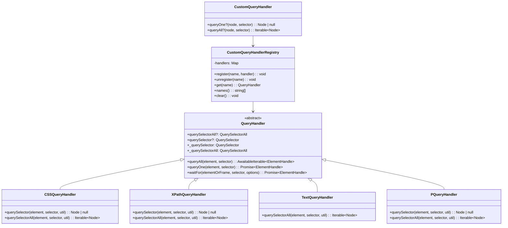
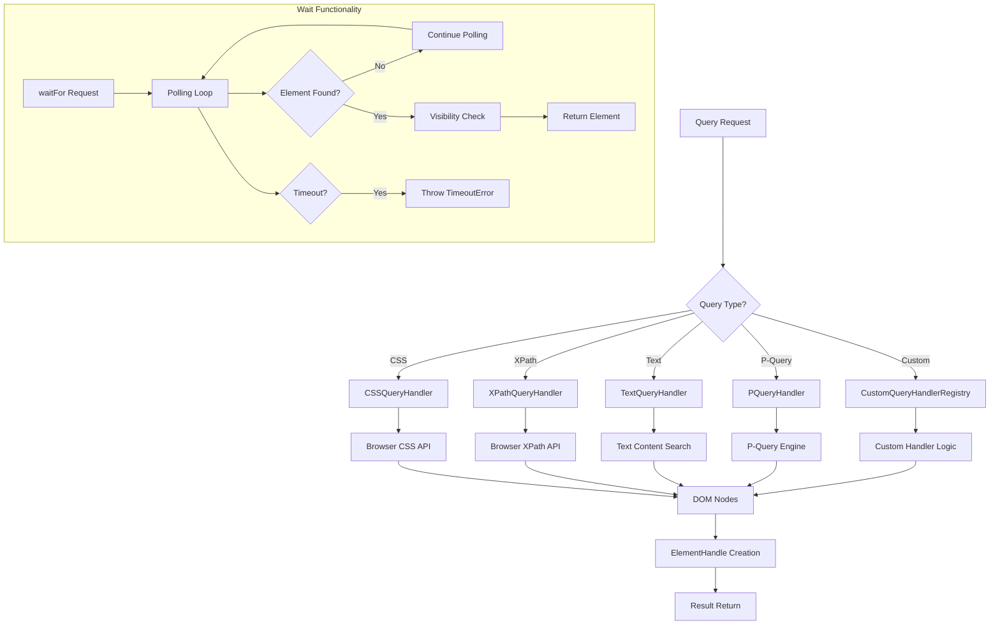

# Query Handlers Module

## Overview

The Query Handlers module is a core component of Puppeteer that provides a flexible and extensible system for element selection and querying within web pages. This module implements various query strategies including CSS selectors, XPath expressions, text-based queries, and custom query handlers, enabling developers to locate and interact with DOM elements using different selection methodologies.

## Purpose

The module serves as the foundation for Puppeteer's element selection capabilities, providing:

- **Unified Query Interface**: A consistent API for different query strategies
- **Extensible Architecture**: Support for custom query handlers
- **Performance Optimization**: Efficient querying with polling and waiting mechanisms
- **Cross-Protocol Support**: Compatible with both CDP and BiDi implementations

## Architecture Overview

The Query Handlers module follows a hierarchical class-based architecture with a base `QueryHandler` class that defines the core querying interface, and specialized implementations for different query types.



## Sub-Modules

The Query Handlers module is organized into three main sub-modules, each handling specific aspects of the query system:

### Base Query System
The foundational query infrastructure that provides the core interfaces and common functionality for all query implementations. This includes the abstract `QueryHandler` class with its querying methods, waiting mechanisms, and lazy evaluation system.

**📖 Detailed Documentation**: [Base Query System](base_query_system.md)

### Built-in Handlers
A collection of pre-implemented query handlers that support standard web selection methods including CSS selectors, XPath expressions, text-based queries, and Puppeteer-specific P-Query syntax.

**📖 Detailed Documentation**: [Built-in Handlers](built_in_handlers.md)

### Custom Query System
An extensible framework that allows developers to register and manage custom query handlers at runtime, providing script injection capabilities and namespace management for specialized selection needs.

**📖 Detailed Documentation**: [Custom Query System](custom_query_system.md)

## Data Flow



## Integration Points

The Query Handlers module integrates with several other Puppeteer modules:

### Core API Integration
- **ElementHandle**: Works with [core_api](core_api.md) ElementHandle for element operations
- **Frame**: Integrates with Frame API for context-aware querying
- **Page**: Supports page-level element selection operations

### CDP Implementation
- **CDP Elements**: Compatible with [cdp_implementation](cdp_implementation.md) element handling
- **CDP Sessions**: Uses CDP sessions for browser communication
- **Execution Context**: Leverages execution contexts for script evaluation

### BiDi Implementation
- **BiDi Elements**: Supports [bidi_implementation](bidi_implementation.md) element operations
- **BiDi Context**: Works within BiDi browsing contexts

## Key Features

### Polling and Waiting
- **RAF Polling**: RequestAnimationFrame-based polling for visibility checks
- **Mutation Polling**: DOM mutation-based polling for dynamic content
- **Timeout Handling**: Configurable timeouts with proper error handling
- **Signal Support**: AbortSignal integration for cancellation

### Performance Optimizations
- **Lazy Evaluation**: Deferred context creation and evaluation
- **Handle Management**: Efficient handle lifecycle management
- **Script Caching**: Cached query function compilation
- **Batch Operations**: Optimized batch querying capabilities

### Error Handling
- **Timeout Errors**: Specific timeout error types with context
- **Validation**: Input validation and error reporting
- **Graceful Degradation**: Fallback mechanisms for unsupported features

## Usage Patterns

### Basic Element Selection
```typescript
// CSS selector
const element = await page.$('.my-class');

// XPath selector
const element = await page.$('xpath//div[@class="my-class"]');

// Text-based selection
const element = await page.$('text/Click me');
```

### Custom Query Handlers
```typescript
// Register custom handler
Puppeteer.customQueryHandlers.register('myHandler', {
  queryOne: (node, selector) => { /* custom logic */ },
  queryAll: (node, selector) => { /* custom logic */ }
});

// Use custom handler
const element = await page.$('myHandler/custom-selector');
```

### Waiting for Elements
```typescript
// Wait with options
const element = await page.waitForSelector('.dynamic-content', {
  visible: true,
  timeout: 5000,
  polling: 'raf'
});
```

## Configuration and Extensibility

The module supports various configuration options:

- **Polling Strategies**: RAF or mutation-based polling
- **Timeout Settings**: Configurable wait timeouts
- **Visibility Checks**: Optional visibility validation
- **Custom Handlers**: Runtime handler registration

## Dependencies

The Query Handlers module depends on:

- **Injected Scripts**: Browser-side utility functions
- **Element Handles**: Element wrapper objects
- **Execution Contexts**: JavaScript execution environments
- **Transport Layer**: Communication with browser instances

This module serves as a critical foundation for Puppeteer's element interaction capabilities, providing the flexibility and performance needed for modern web automation tasks.