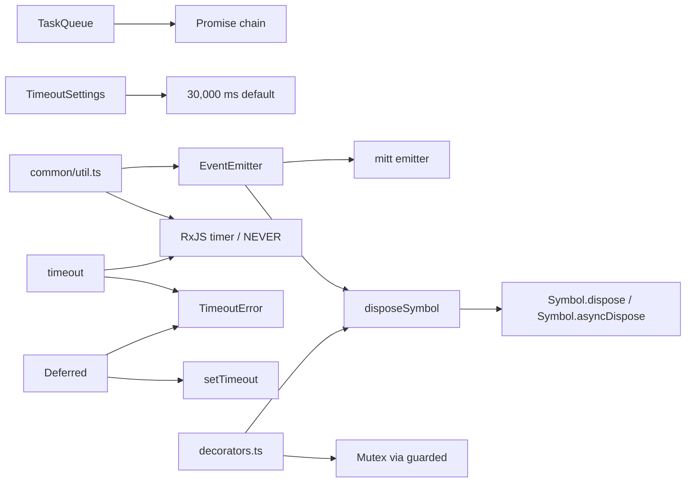
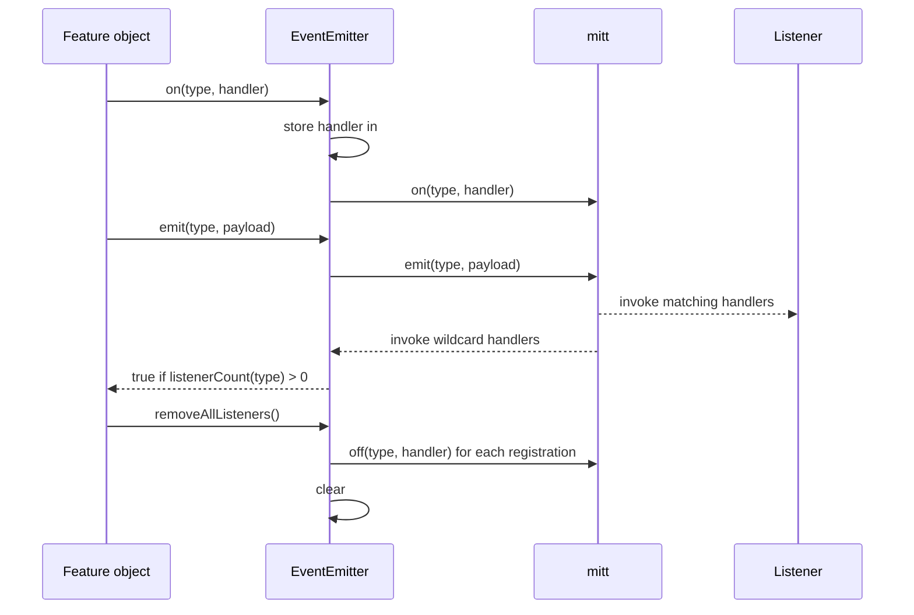
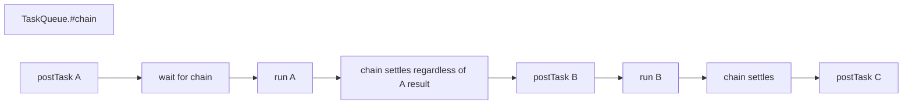
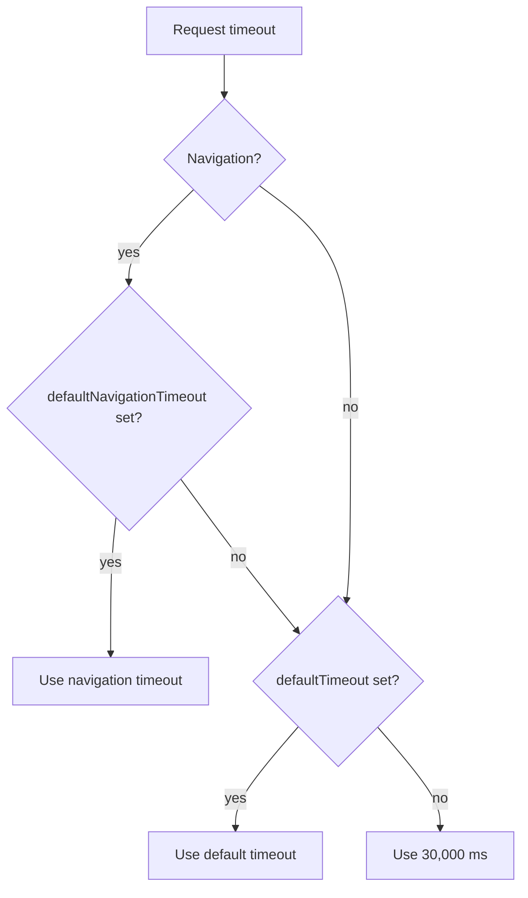
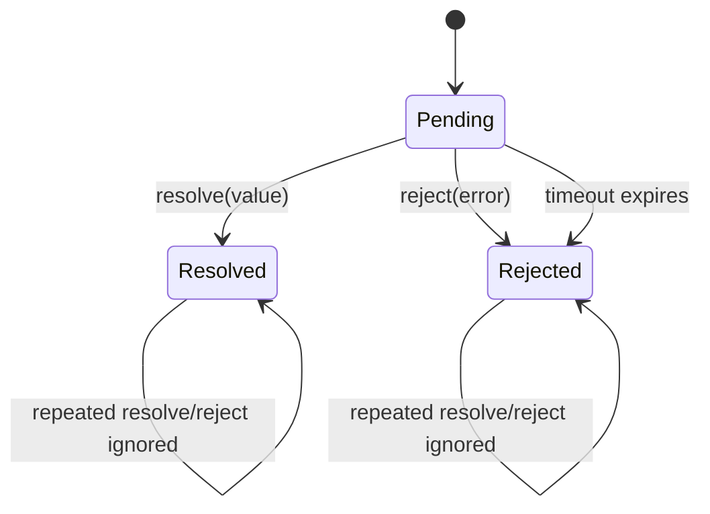
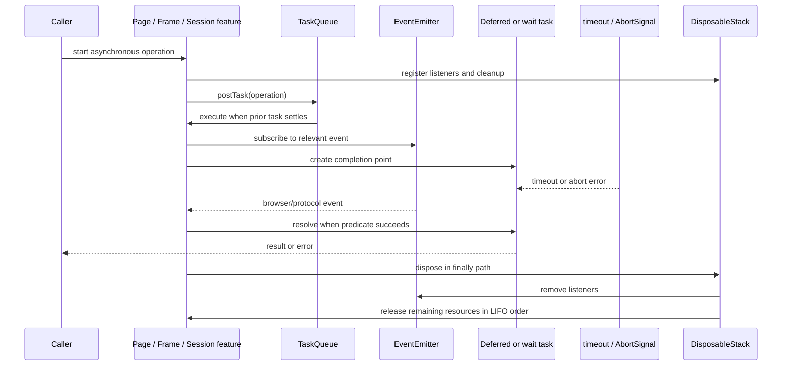

# Runtime Lifecycle and Scheduling

The `runtime_lifecycle_and_scheduling` module is Puppeteer’s internal coordination layer. It provides the small, reusable primitives that control event delivery, sequential asynchronous work, time limits, deferred completion, resource ownership, and safe behavior after disposal. Higher-level browser, page, frame, network, selector, and protocol implementations use these primitives to make asynchronous operations predictable without exposing their implementation details as a public API.

This module is consumed most directly by the selector and waiting infrastructure, protocol/session implementations, and the CDP and WebDriver BiDi backends. See [selector_and_waiting_engine.md](selector_and_waiting_engine.md), [protocol_neutral_public_automation_api.md](protocol_neutral_public_automation_api.md), and [launch_and_connect.md](launch_and_connect.md) for the surrounding layers.

## Responsibilities

The module groups several related concerns:

| Concern | Core implementation | Role |
| --- | --- | --- |
| Event lifecycle | `EventEmitter` | Typed listeners, wildcard propagation, one-shot listeners, and listener cleanup |
| Sequential scheduling | `TaskQueue` | FIFO execution of asynchronous tasks, with later tasks continuing after failures |
| Timeout policy | `TimeoutSettings`, `timeout` | Default operation/navigation timeouts and RxJS timeout observables |
| Deferred completion | `Deferred` | Explicitly resolved/rejected promises with optional timeout and race support |
| Lazy execution | `LazyArg` | Defers argument computation until a target execution context is available |
| Async collection | `AsyncIterableUtil` | Ordered map/flat-map, collection, and first-item operations |
| Lifecycle guards | `inertIfDisposed`, `moveable`, `invokeAtMostOnceForArguments` | Prevents invalid work, supports ownership transfer, and suppresses duplicate initialization |
| Resource ownership | `DisposableStack`, `AsyncDisposableStack` | LIFO cleanup, adoption/deferred cleanup, ownership transfer, and aggregated errors |
| Runtime helpers | `PuppeteerURL`, `fromEmitterEvent`, `fromAbortSignal`, `timeout` | Diagnostics, event-to-observable conversion, cancellation, and timeout signaling |

## Architecture

The module is intentionally lower-level than the public automation API. Public objects such as `Page`, `Frame`, `Browser`, and `Target` own these primitives or use them indirectly while protocol backends translate browser events into Puppeteer events.

```mermaid
flowchart TB
    API[Public automation API\nBrowser / Page / Frame / Target]
    BACKENDS[Protocol implementations\nCDP and WebDriver BiDi]
    WAIT[Selector and waiting engine]
    TRANSPORT[Transport and session layer]
    RUNTIME[Runtime lifecycle and scheduling]
    EVENTS[EventEmitter\nlistener registry + wildcard]
    SCHED[TaskQueue\nFIFO promise chain]
    TIME[TimeoutSettings + timeout()\ndefaults and timeout signals]
    DEFER[Deferred + LazyArg\ncompletion and delayed values]
    LIFE[Decorators + disposable stacks\nguards and ownership]
    ITER[AsyncIterableUtil\nordered async transforms]

    API --> BACKENDS
    BACKENDS --> TRANSPORT
    API --> WAIT
    BACKENDS --> RUNTIME
    WAIT --> RUNTIME
    TRANSPORT --> RUNTIME
    RUNTIME --> EVENTS
    RUNTIME --> SCHED
    RUNTIME --> TIME
    RUNTIME --> DEFER
    RUNTIME --> LIFE
    RUNTIME --> ITER
```

### Dependency relationships



The dependency graph is deliberately one-directional at runtime: lifecycle primitives depend on generic platform facilities and shared errors, while feature layers depend on them. `EventEmitter` is the notable bridge between synchronous browser/protocol notifications and asynchronous RxJS waiting flows.

## Event lifecycle

`EventEmitter<Events>` wraps `mitt` while maintaining its own handler map. The map makes listener counts and complete cleanup deterministic, and the generic `Events` parameter preserves event payload types at call sites.

### Listener semantics

- `on(type, handler)` registers a handler and returns the emitter for chaining.
- `off(type, handler)` removes the most recently registered matching handler. `off(type)` removes every handler for that event.
- `once(type, handler)` installs a wrapper that removes itself after its first invocation.
- `emit(type, payload)` forwards to the wrapped emitter and reports whether listeners were registered.
- The wildcard event (`'*'`) receives emitted event type and payload through the underlying emitter, enabling the `bubble` decorator to forward child events.
- `removeAllListeners()` invokes the disposal hook and clears every handler; event-specific removal only affects the selected event.



Event cleanup is part of object disposal. This prevents event listeners from retaining objects after a browser, page, session, or child resource has ended. Event streams created by `fromEmitterEvent` follow the same rule: subscribing attaches a listener and unsubscribing removes exactly that listener.

## Scheduling and timeout policy

### `TaskQueue`

`TaskQueue` serializes tasks with a private promise chain. `postTask` schedules each task after the previous task settles, preserving insertion order. The queue’s continuation converts both fulfillment and rejection into a resolved `undefined` chain state, so one failed task does not prevent later tasks from running. The promise returned to the caller still preserves the individual task’s result or rejection.



This is suitable for operations that must not overlap, such as ordered protocol setup or teardown. It is not a cancellation mechanism and does not limit concurrency across separate `TaskQueue` instances.

### `TimeoutSettings`

Each settings object stores independent default and navigation timeout values. Both begin unset:

1. General operations use the configured default timeout, otherwise 30 seconds.
2. Navigation operations prefer the configured navigation timeout.
3. If no navigation timeout exists, navigation falls back to the general timeout.
4. If neither is set, navigation also uses 30 seconds.



The effective value is passed to waiting, navigation, and protocol coordination code; the settings class itself does not create timers.

### Timeout and cancellation observables

`timeout(ms, cause)` returns an RxJS observable that emits no values and throws `TimeoutError` after `ms`. A zero duration returns `NEVER`, intentionally disabling the timeout. `fromAbortSignal` converts an abort into an observable error, preserving an existing `Error` reason and attaching the supplied cause. These observables can be composed with event streams and wait tasks.

## Deferred completion and lazy values

`Deferred<T>` separates creation of a completion point from the code that resolves or rejects it. `resolve` and `reject` are idempotent, and `valueOrThrow()` lazily creates the promise that waits for the internal completion signal. Optional positive timeouts reject the deferred with `TimeoutError`; `Deferred.race` accepts both promises and deferreds and clears participating deferred timers in a `finally` block.



`LazyArg<T>` uses the same delayed-execution idea for values rather than completion. `LazyArg.create` hides the wrapper from the type system, while `get(context)` evaluates the callback only when a context—typically one containing `puppeteerUtil`—is available. This avoids creating handles or serialized values against the wrong execution realm.

## Lifecycle guards and ownership

### Decorators

- `inertIfDisposed` turns a method into a no-op after the receiver reports `disposed`. It is appropriate for cleanup or event paths where late calls are harmless.
- `throwIfDisposed` (defined alongside the supplied core components) is the strict counterpart: it raises an error for invalid use after disposal.
- `invokeAtMostOnceForArguments` memoizes object-identity argument tuples in nested `WeakMap`s. A repeated tuple is ignored; changing the argument count is an error. It is intended for one-time initialization keyed by stable object arguments, not for primitive-value memoization.
- `guarded` serializes an async method through a per-key `Mutex`, preventing concurrent critical sections for the same receiver or derived key.
- `moveable` lets an object transfer disposal responsibility. The first disposal after `move()` only marks the moved instance as no longer moved; the actual cleanup remains with the returned owner.
- `bubble` attaches a wildcard listener to a child emitter and re-emits selected or all child events on the owner. Replacing the child detaches the old listener first.

### Disposable stacks

`DisposableStack` and `AsyncDisposableStack` provide structured cleanup for synchronous and asynchronous resources. `use` registers an already-disposable value, `adopt` pairs an arbitrary value with a cleanup callback, and `defer` registers a callback without a resource value. Cleanup runs in last-in-first-out order, matching dependency acquisition order.

```mermaid
flowchart TD
    Acquire[Acquire resource A] --> PushA[stack.use/adopt A]
    PushA --> AcquireB[Acquire resource B]
    AcquireB --> PushB[stack.use/adopt B]
    PushB --> Transfer{Ownership escapes scope?}
    Transfer -- yes --> Move[stack.move()\nnew owner receives resources]
    Transfer -- no --> Dispose[dispose stack]
    Move --> Later[owner disposes later]
    Dispose --> CleanB[Dispose B]
    CleanB --> CleanA[Dispose A]
    CleanA --> Errors[Aggregate disposal errors if needed]
```

Calling `move()` marks the original stack disposed and transfers its internal list to a new stack. Disposal is idempotent. If multiple cleanup callbacks fail, the implementation preserves the first failure and chains subsequent failures through `SuppressedError`; this makes cleanup failures observable without abandoning remaining cleanup work.

`EventEmitter` participates in this model through `disposeSymbol`, so listener cleanup can be registered alongside protocol sessions, streams, and temporary execution resources.

## Async iterable utilities

`AsyncIterableUtil` preserves async iteration order:

- `map` awaits one mapped result before yielding it.
- `flatMap` yields each nested iterable before advancing to the next source item.
- `collect` drains an iterable into an array.
- `first` returns the first item and stops iteration, or `undefined` for an empty source.

These helpers are useful for target, frame, request, and event collections where producers may be synchronous, asynchronous, or both. They do not add parallelism; callers that need concurrent mapping must implement that policy separately.

## Diagnostics and shared utility behavior

`PuppeteerURL` encodes a function name and call-site string in an internal `pptr:` URL. It is used to retain source provenance for generated or deferred operations. `fromCallSite`, `parse`, `isPuppeteerURL`, and `toString` provide the round-trip representation; `functionName` and `siteString` expose the decoded parts.

The same utility file also hosts cross-cutting adapters such as `fromEmitterEvent`, `fromAbortSignal`, and `timeout`. Other helpers in that file—stream conversion, evaluation-string generation, PDF option parsing, and protocol stream reading—are documented with the feature modules that consume them rather than duplicated here.

## End-to-end coordination flow

The following flow shows how a typical wait or protocol operation combines the primitives. Exact ownership varies by backend; the sequence describes the shared runtime pattern.



## Failure and edge-case behavior

- A task rejection is returned to that task’s caller, but does not poison the queue for subsequent tasks.
- Timeout `0` disables the RxJS timeout observable; `TimeoutSettings` itself still returns `0` if explicitly configured.
- Deferred timeout timers are cleared on resolution, rejection, and `Deferred.race` cleanup.
- Disposed emitters ignore further listener cleanup work safely; repeated disposal is harmless.
- `inertIfDisposed` suppresses calls, while strict lifecycle APIs should use a throwing guard when silent loss would hide a programming error.
- Disposal attempts all resources even when one or more cleanup callbacks throw.
- Event handler identity matters: callers must retain the original handler when using `off(type, handler)`.

## Maintenance guidance

When changing this module, preserve the following invariants:

1. Listener registration and internal handler bookkeeping must remain in sync.
2. Queue continuation must always settle so an individual task cannot block later tasks.
3. Every timer introduced by a deferred or wait operation must be cleared on every terminal path.
4. Resource cleanup must remain idempotent and LIFO unless a feature explicitly documents another ownership model.
5. Event bubbling and disposal must detach listeners from replaced or disposed child objects.
6. Scheduling primitives should remain generic; browser/protocol-specific policy belongs in the consuming modules.

## Related modules

- [selector_and_waiting_engine.md](selector_and_waiting_engine.md) — query handlers, wait tasks, pollers, and custom selectors that consume timeout, event, and deferred-completion primitives.
- [protocol_neutral_public_automation_api.md](protocol_neutral_public_automation_api.md) — public Browser, Page, Frame, network, input, and target contracts.
- [browser_and_context_api.md](browser_and_context_api.md) and [page_and_frame_api.md](page_and_frame_api.md) — lifecycle owners that expose browser/page behavior.
- [browser_process_lifecycle.md](browser_process_lifecycle.md) — browser process ownership and termination.
- [launch_and_connect.md](launch_and_connect.md) — creation of browser connections that ultimately rely on runtime cleanup and event coordination.
- [network_api.md](network_api.md) and [targets_and_workers_api.md](targets_and_workers_api.md) — event-driven consumers of the shared runtime layer.
