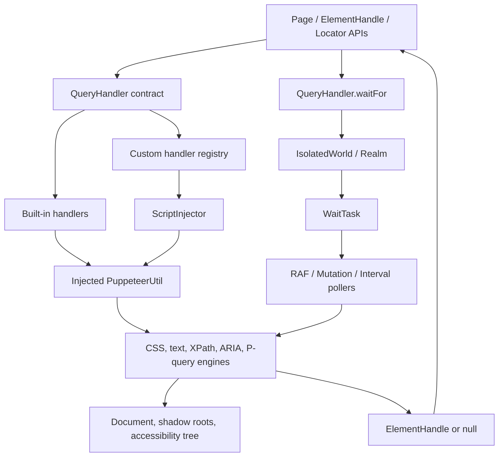
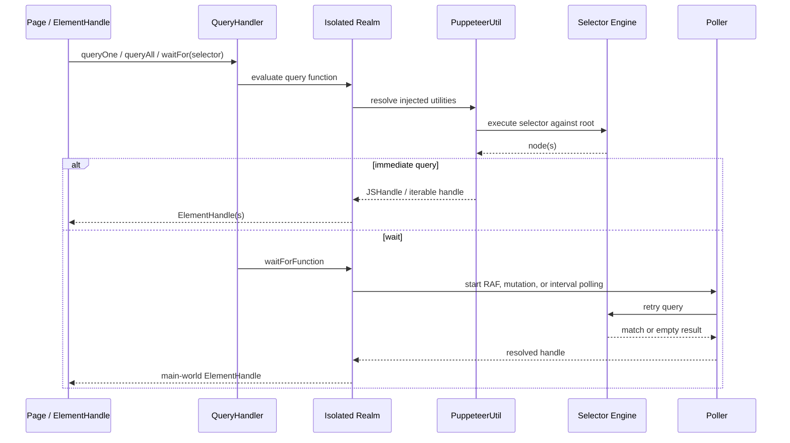
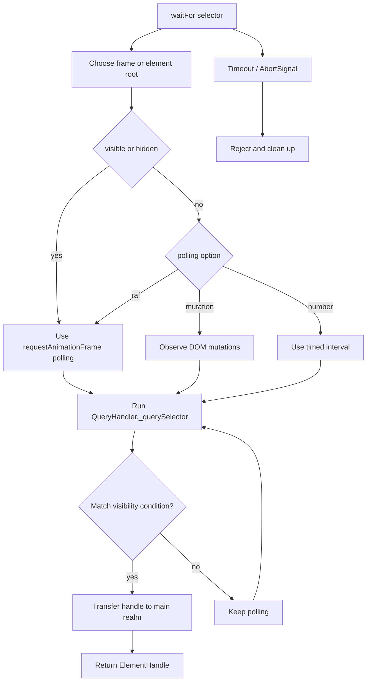

# Selector and Waiting Engine

## Purpose

The `selector_and_waiting_engine` module is Puppeteer’s selector-resolution and asynchronous waiting layer. It converts selector strings into DOM queries, supports CSS, XPath, text, ARIA, piercing, P-query, and user-defined selector syntaxes, and waits for matching nodes to appear or reach a visibility state.

The module sits between the public page/element APIs and browser-specific execution realms. Public APIs such as `Page.$`, `Page.waitForSelector`, `ElementHandle.waitForSelector`, and locator operations ultimately rely on the query-handler contract described here. See [page_and_frame_api](page_and_frame_api.md) and [handles_realms_and_locators_api_locators](handles_realms_and_locators_api_locators.md) for those consumers.

## Architecture overview

The common-side classes define callable query functions and handle migration. The injected-side classes run inside the page context, where DOM APIs, shadow roots, accessibility data, and browser scheduling primitives are available.

## Submodules

The module is split into the following generated documents; links use the final filenames reported by the documentation generator.

- [selector_and_waiting_engine_query_handlers](selector_and_waiting_engine_query_handlers.md) — Defines the common `QueryHandler` abstraction and adapters for CSS, text, XPath, ARIA, piercing, and P-query selectors.
- [selector_and_waiting_engine_injected_selector_engine](selector_and_waiting_engine_injected_selector_engine.md) — Parses and executes composite P-selectors, traverses shadow DOM, deduplicates and DOM-sorts results, and provides visibility helpers.
- [selector_and_waiting_engine_custom_handlers](selector_and_waiting_engine_custom_handlers.md) — Registers custom selector implementations, mirrors them into the injected runtime, and injects registration scripts into new execution contexts.
- [selector_and_waiting_engine_waiting](selector_and_waiting_engine_waiting.md) — Coordinates asynchronous selector waits, polling strategies, timeout/abort behavior, cleanup, and reruns after execution-context changes.

## Query and wait data flow

## Selector families

| Syntax/family | Execution strategy | Main implementation |
|---|---|---|
| CSS | Native `querySelector` / `querySelectorAll` | [CSSQueryHandler](selector_and_waiting_engine_query_handlers.md) |
| Text | Injected text matching | [TextQueryHandler](selector_and_waiting_engine_query_handlers.md) |
| XPath | Injected XPath iterator | [XPathQueryHandler](selector_and_waiting_engine_query_handlers.md) |
| ARIA | Accessibility-tree query by name and role | [ARIAQueryHandler](selector_and_waiting_engine_query_handlers.md) |
| Pierce | Traverses open shadow roots | [PierceQueryHandler](selector_and_waiting_engine_query_handlers.md) |
| P-query | Composite selectors and deep combinators | [PQueryHandler](selector_and_waiting_engine_injected_selector_engine.md) |
| Custom | User-registered handler under a name prefix | [custom handlers](selector_and_waiting_engine_custom_handlers.md) |

## Waiting process

## Integration boundaries

- **Public automation API:** delegates selector syntax and waiting semantics to this module; see [protocol_neutral_public_automation_api](protocol_neutral_public_automation_api.md).
- **Realms and handles:** query functions execute in an isolated Puppeteer world and successful results are transferred to the main world; see [handles_realms_and_locators_api_realms_and_js_handles](handles_realms_and_locators_api_realms_and_js_handles.md).
- **CDP and BiDi backends:** provide the `Realm`, execution-context, and target lifecycle that can invalidate waits; these boundaries are implemented by the CDP and WebDriver BiDi backend modules in the supplied module tree.
- **Runtime scheduling:** `WaitTask` uses deferred results, task management, timeout settings, and disposal helpers from the shared runtime and scheduling infrastructure.

## Operational considerations

- Query handlers may implement only one of `querySelector` or `querySelectorAll`; the base class synthesizes the missing operation.
- Custom handlers must be registered before the injected script is created for a context; `ScriptInjector` tracks amendments and rebuilds the injected utility bundle when needed.
- Visibility checks use computed visibility and non-empty layout bounds, not merely DOM presence.
- Navigation can destroy an execution context. Wait tasks classify those errors as rerunnable, while detached-frame failures terminate the wait.
- P-query results are deduplicated and sorted in document order after traversing selector branches.

## Source map

- `packages/puppeteer-core/src/common/QueryHandler.ts`
- `packages/puppeteer-core/src/common/CustomQueryHandler.ts`
- `packages/puppeteer-core/src/common/ScriptInjector.ts`
- `packages/puppeteer-core/src/common/WaitTask.ts`
- `packages/puppeteer-core/src/injected/PQuerySelector.ts`
- `packages/puppeteer-core/src/injected/CustomQuerySelector.ts`
- `packages/puppeteer-core/src/injected/Poller.ts`
- `packages/puppeteer-core/src/injected/util.ts`
