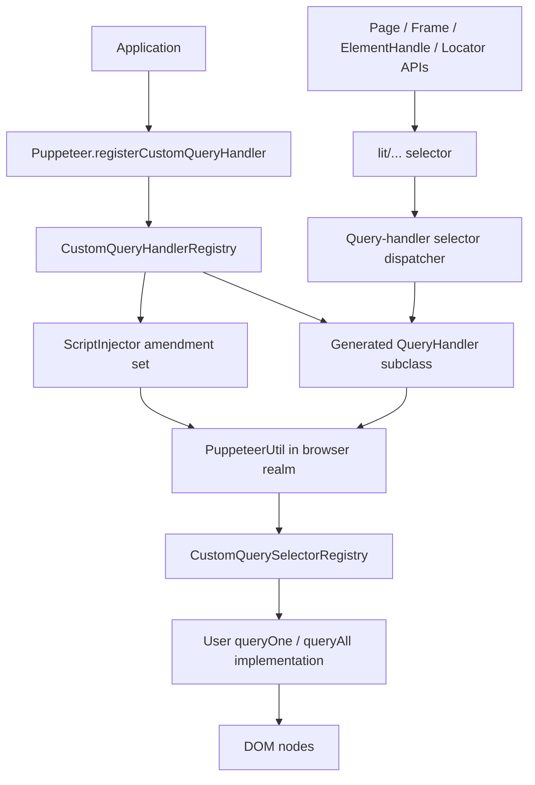
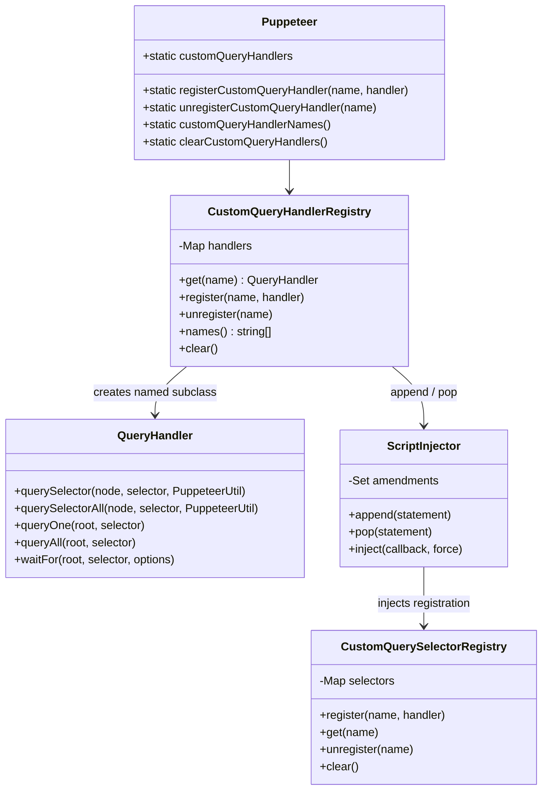
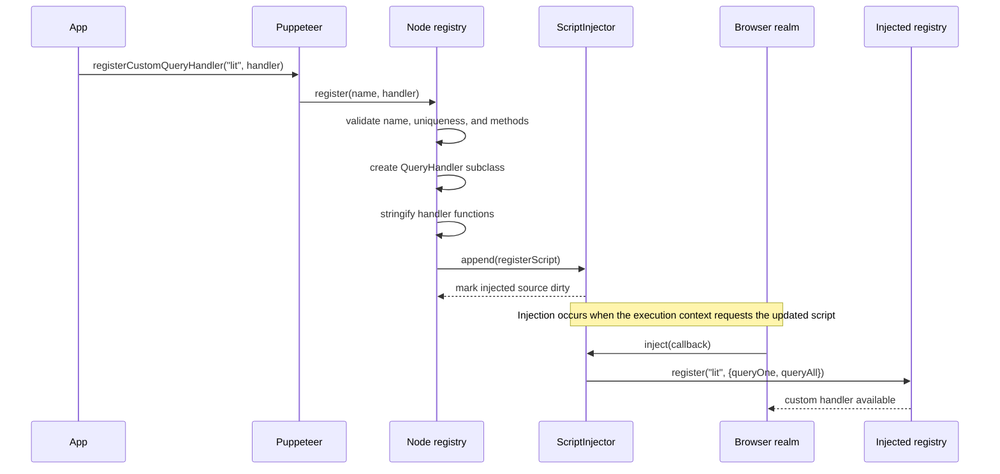
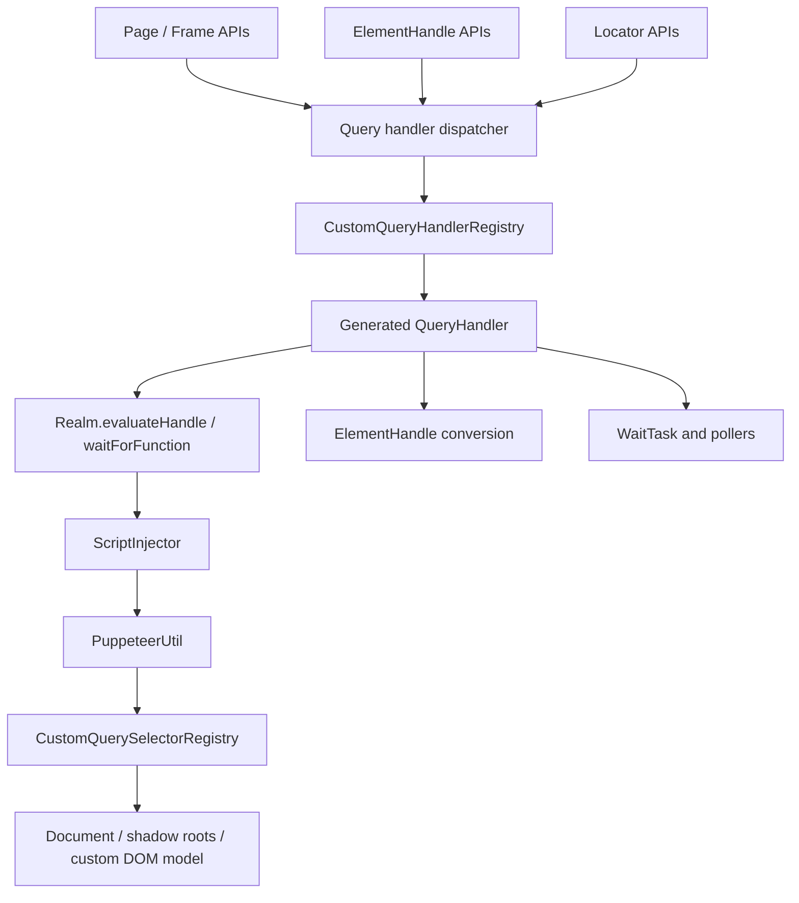
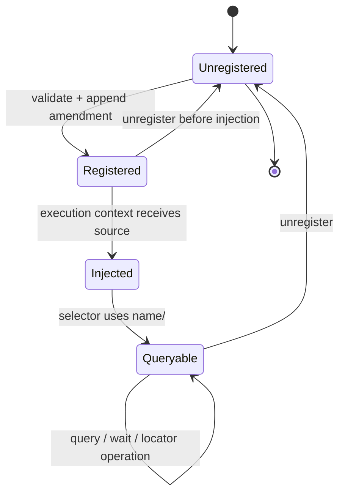

# Selector and waiting engine: custom handlers

## Introduction

The `selector_and_waiting_engine_custom_handlers` module lets applications extend Puppeteer’s selector syntax with named query handlers. A handler registered under a name such as `lit` can be used anywhere Puppeteer accepts a selector by prefixing it with `lit/`.

The module maintains a Node-side registry, mirrors handler implementations into the browser’s injected `PuppeteerUtil`, and exposes the registered handler as a `QueryHandler` so normal query and waiting operations can consume it. Selector adaptation and waiting behavior remain separate concerns; see [selector and waiting engine: query handlers](selector_and_waiting_engine_query_handlers.md) and [selector and waiting engine: waiting](selector_and_waiting_engine_waiting.md).

## Position in the system

Custom handlers are a child module of [shared automation runtime and query infrastructure](shared_automation_runtime_and_query_infrastructure.md). The public static API is on `Puppeteer`; page, frame, element-handle, and locator APIs ultimately select and invoke the resulting `QueryHandler`.



## Responsibilities and boundaries

| Component | Runtime | Responsibility |
| --- | --- | --- |
| `Puppeteer.registerCustomQueryHandler` | Node.js | Public convenience entry point; delegates registration to the shared registry. |
| `CustomQueryHandlerRegistry` | Node.js | Validates names and implementations, stores handlers, creates selector adapters, and manages lifecycle. |
| Generated `QueryHandler` subclass | Node.js plus serialized browser function | Bridges `QueryHandler`’s standard `querySelector`/`querySelectorAll` contract to a named injected handler. |
| `ScriptInjector` | Node.js | Rebuilds the injected utility script when amendments change and applies all active registration statements. |
| `CustomQuerySelectorRegistry` | Injected browser utility | Stores browser-executable query functions and normalizes one-sided implementations into both query operations. |

The module does not implement DOM matching itself, manage browser connections, or define polling. Its handlers are called by the generic query and waiting infrastructure. Browser connection and execution-context details are covered by [protocol transport and sessions](protocol_transport_and_sessions.md), [execution contexts and handles](execution_contexts_and_handles.md), and [CDP backend automation implementation](cdp_backend_automation_implementation.md) where those documents are available.

## Architecture



### Node-side registry

`CustomQueryHandlerRegistry` stores each name as a tuple:

```text
name -> [registration script, generated QueryHandler class]
```

`get(name)` returns the generated class for selector dispatch. `names()` exposes the current names. The exported `customQueryHandlers` singleton is installed as `Puppeteer.customQueryHandlers`, while the convenience methods on `Puppeteer` delegate to it.

### Handler contract

`CustomQueryHandler` may define either or both methods:

| Method | Input | Result |
| --- | --- | --- |
| `queryOne(node, selector)` | DOM root and handler-specific selector | One `Node` or `null`. |
| `queryAll(node, selector)` | DOM root and handler-specific selector | An iterable of `Node` values. |

At least one method is required. The injected registry supplies the missing operation: `queryOne` returns the first result from `queryAll`, while `queryAll` wraps a non-null `queryOne` result in a one-item array.

Both methods may be synchronous in the supplied public type. The injected registry’s internal contract is awaitable, so serialized handlers can participate in asynchronous browser-side query implementations.

## Registration lifecycle

Registration is deliberately split into local lookup metadata and browser execution code.



### Validation

Registration fails before state is changed when:

- the name is already registered;
- the name contains anything other than ASCII letters (`[a-zA-Z]+`); or
- neither `queryOne` nor `queryAll` is supplied.

Names are therefore stable selector prefixes, not arbitrary strings. Registration also does not overwrite an existing handler; callers must unregister first.

### Generated adapter

The registry creates an anonymous class extending `QueryHandler`. Its static methods do not directly call the user’s Node-side function. Instead, they resolve the named entry from `PuppeteerUtil.customQuerySelectors` inside the browser:

```text
generated QueryHandler.querySelector*()
    -> PuppeteerUtil.customQuerySelectors.get(name)
    -> injected querySelector/querySelectorAll
    -> user handler function
```

The handler functions and the name are converted to source text with `stringifyFunction` and `interpolateFunction`. This serialization is necessary because the function executes in a browser execution context rather than in the Node.js process.

## Script injection and synchronization

`ScriptInjector` owns the complete injected utility source. It starts with the generated `PuppeteerUtil` source and appends one registration statement for each active custom handler.

```mermaid
flowchart LR
    Register[Registry.register] --> Append[ScriptInjector.append(statement)]
    Unregister[Registry.unregister] --> Pop[ScriptInjector.pop(statement)]
    Append --> Dirty[updated = true]
    Pop --> Dirty
    Dirty --> Inject[ScriptInjector.inject(callback)]
    Inject --> Source[generated injected source + amendments]
    Source --> Evaluate[Evaluate in target execution context]
    Evaluate --> Mirror[Injected custom selector registry]
```

The amendment collection is a `Set`, so identical registration statements are retained only once. `append` and `pop` mark the source dirty. `inject` evaluates the rebuilt source only when it has changed, unless `force` is true; after the callback, the dirty flag is reset. This supports execution-context recreation after navigation while avoiding unnecessary reinjection when no registration has changed.

Unregistering removes the exact stored registration statement from the injector and deletes the local registry entry. It throws when the name is unknown. `clear()` removes every amendment and clears the local map; the next injection therefore recreates `PuppeteerUtil` without those handlers.

## Selector resolution and data flow

Once registered, `lit/...` is handled by the normal selector-dispatch path. The prefix identifies the generated class; the portion after `/` is passed unchanged as the handler-specific selector.

```mermaid
flowchart LR
    Input["page.$('lit/item')"] --> Parse[Parse handler prefix]
    Parse --> Lookup[Node registry.get('lit')]
    Lookup --> Adapter[Generated QueryHandler]
    Adapter --> Eval[Evaluate serialized query function]
    Eval --> Util[PuppeteerUtil.customQuerySelectors]
    Util --> Get[Get 'lit' browser handler]
    Get --> User[queryOne / queryAll(root, 'item')]
    User --> Result[Node / iterable of Nodes]
    Result --> Convert[Generic QueryHandler handle conversion]
    Convert --> Caller[ElementHandle or iterable]
```

Waiting uses the same adapter. `QueryHandler.waitFor` supplies the generated query function to `WaitTask`; polling, visibility checks, timeout, and abort behavior belong to [selector and waiting engine: waiting](selector_and_waiting_engine_waiting.md). The custom handler only determines whether the root currently produces matching nodes.

## Component interaction



The key ownership rule is that the Node registry is authoritative for names and lifecycle, while the injected registry is authoritative for browser-side execution. They are synchronized through serialized registration amendments rather than shared memory.

## Operational process flows

### Register and query



### Unregister and clear

1. `unregister(name)` looks up the tuple in the Node registry.
2. If absent, it throws `Cannot unregister unknown handler: <name>`.
3. If present, it removes the saved registration statement from `ScriptInjector` and deletes the local entry.
4. `clear()` repeats the amendment removal for all entries and clears the map.
5. Existing browser execution contexts are updated when the injector runs again; callers should not assume a previously injected context changes synchronously at the moment of `unregister`.

## Usage example

```ts
Puppeteer.registerCustomQueryHandler('data', {
  queryOne(root, selector) {
    return root.querySelector(`[data-test="${selector}"]`);
  },
});

const button = await page.$('data/submit');
await page.waitForSelector('data/submit');

Puppeteer.unregisterCustomQueryHandler('data');
```

The example supplies only `queryOne`; the injected registry derives `queryAll`, so the handler can be used by both single- and multi-node APIs.

## Related modules

- [selector and waiting engine: query handlers](selector_and_waiting_engine_query_handlers.md) — common query-handler contract, built-in handlers, handle conversion, and selector waiting integration.
- [selector and waiting engine: waiting](selector_and_waiting_engine_waiting.md) — `WaitTask` and browser-side pollers used by `waitForSelector` and locator waits.
- [selector and waiting engine: injected selector engine](selector_and_waiting_engine_injected_selector_engine.md) — injected selector execution and composed query behavior.
- [handles, realms, and locators API](handles_realms_and_locators_api.md) — public consumers that expose `$`, `$$`, locators, and handle operations.
- [protocol-neutral public automation API](protocol_neutral_public_automation_api.md) — public `Page`, `Frame`, and related API surfaces.
