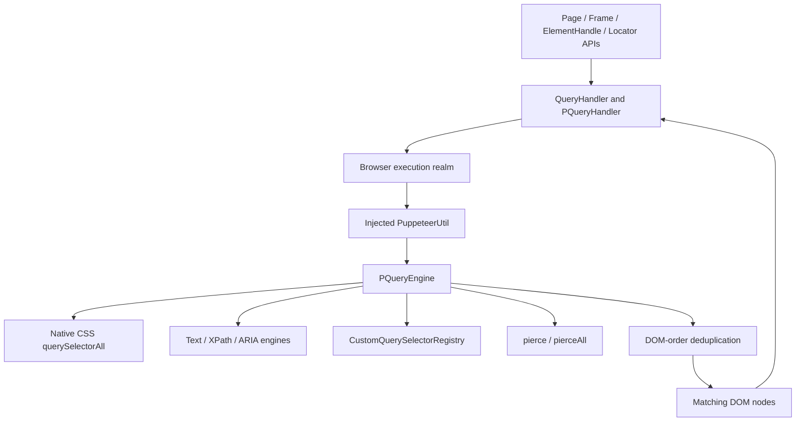
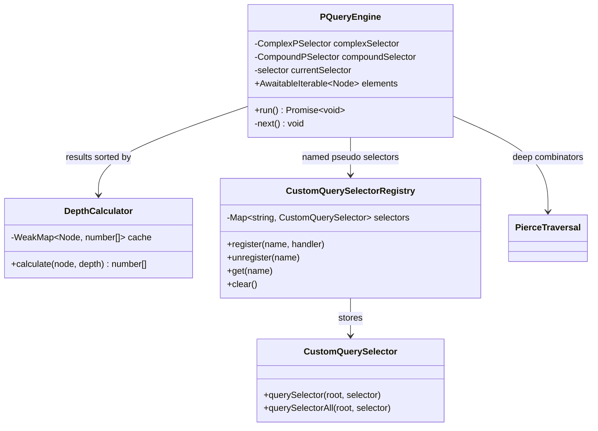
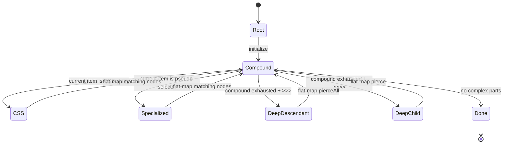
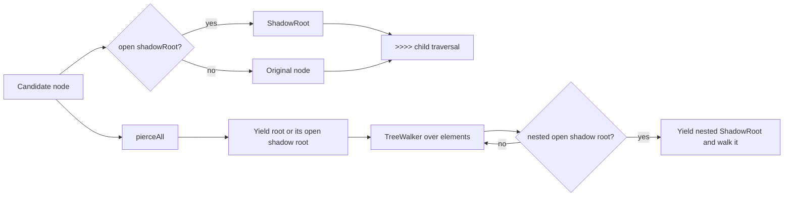
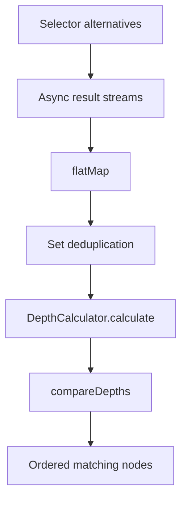
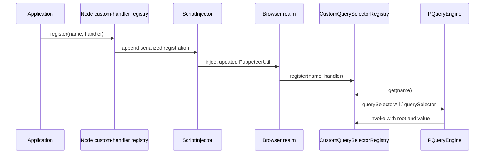
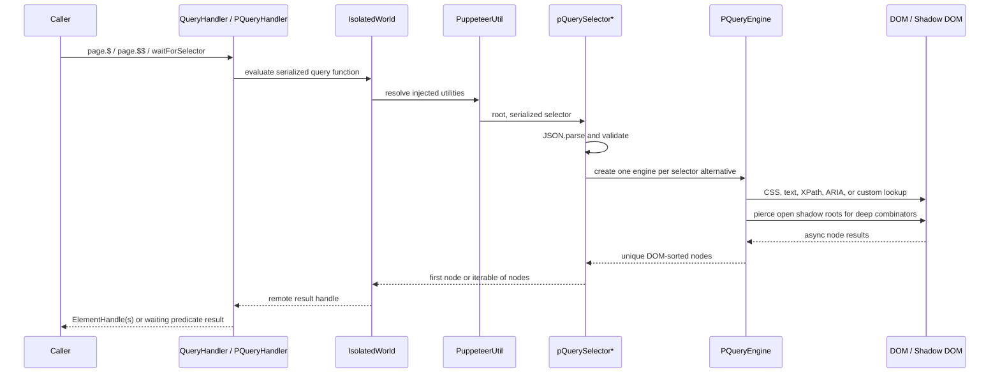

# Selector and waiting engine: injected selector engine

## Introduction

The `selector_and_waiting_engine_injected_selector_engine` module is Puppeteer’s browser-side composed-selector runtime. It executes the extended P-query language inside the page’s injected utility context, traverses ordinary DOM and open shadow roots, dispatches selector pseudo-types to specialized engines, and exposes registered custom selectors.

The module is intentionally small and protocol-independent. It receives a DOM `Node` and a serialized selector, then yields matching nodes as an `AwaitableIterable<Node>`. Node-side query adaptation, handle conversion, and selector waiting are owned by the sibling [selector and waiting engine query handlers](selector_and_waiting_engine_query_handlers.md) and [selector and waiting engine waiting](selector_and_waiting_engine_waiting.md).

## Position in the system

This module is a child of the shared automation runtime and query infrastructure. Public `$`, `$$`, `waitForSelector`, element-handle, and locator operations reach it through `PQueryHandler` and the injected `PuppeteerUtil` object.



### Responsibilities and boundaries

| Component | Runtime | Responsibility |
| --- | --- | --- |
| `PQueryEngine` | Injected browser context | Incrementally evaluates one parsed complex selector against an async stream of candidate nodes. |
| `PQueryEngine.run` | Injected browser context | Applies CSS compounds, pseudo-selector engines, and deep combinators. |
| `pQuerySelectorAll` / `pQuerySelector` | Injected browser context | Parses serialized selector data, validates deep-combinator structure, sorts results, and exposes all/first lookup. |
| `DepthCalculator` | Injected browser context | Builds comparable DOM depth paths for deterministic document-order sorting. |
| `pierce` | Injected browser context | Moves from a node to its open shadow root, when present. |
| `pierceAll` | Injected browser context | Enumerates a root and all reachable open shadow roots. |
| `CustomQuerySelectorRegistry` | Injected browser context | Stores custom query functions and derives a missing one-node or many-node operation. |

The engine does not launch browsers, send CDP/WebDriver commands, create `ElementHandle` objects, or implement timeout polling. Those concerns are documented in [browser provisioning and launch orchestration](browser_provisioning_and_launch_orchestration.md), [selector and waiting engine query handlers](selector_and_waiting_engine_query_handlers.md), and [selector and waiting engine waiting](selector_and_waiting_engine_waiting.md).

## Architecture



### Selector representation

`pQuerySelectorAll` receives a JSON string encoding a `ComplexPSelectorList`:

```text
ComplexPSelectorList = ComplexPSelector[]
ComplexPSelector     = CompoundPSelector[] mixed with combinators
CompoundPSelector    = CSSSelector | PPseudoSelector []
PPseudoSelector      = { name: string, value: string }
PCombinator           = '>>>' | '>>>>'
```

The parser for this representation lives outside this injected module. This file consumes the already-tokenized form produced by selector handling. A list represents selector alternatives; each alternative is evaluated independently and the union is deduplicated and sorted.

`>>>` is the descendant/deep combinator and `>>>>` is the child/deep combinator. Both can cross open shadow-root boundaries. A selector string inside a compound is delegated to native CSS matching, while an object selects a named injected engine.

## P-query evaluation

### `PQueryEngine` state machine

The constructor starts `elements` with the supplied root and immediately advances to the first selector part. `#next()` is the state transition function:

1. Consume the next item from the current compound.
2. If the compound is exhausted, consume the next complex-selector item.
3. For `>>>`, replace the stream with `pierceAll` results.
4. For `>>>>`, replace the stream with `pierce` results.
5. For a compound, begin applying its selectors to the current stream.
6. Mark the stream complete when no selector parts remain.



`run()` is asynchronous because the stream is an `AwaitableIterable`. It does not eagerly materialize every intermediate result. Each stage is represented by an `AsyncIterableUtil.flatMap`, allowing selector engines and custom handlers to yield asynchronously while preserving the pipeline shape.

### CSS selector handling

CSS strings are split into two execution paths:

* If the first character matches `IDENT_TOKEN_START`, the engine treats the string as a type or universal selector and calls `element.querySelectorAll(selector)` directly.
* Otherwise, the selector is applied to the current element itself by querying its parent with `:scope>:nth-child(index)${selector}`. This preserves element-relative selectors such as class, child, pseudo-class, and other selectors that native `querySelectorAll` would otherwise apply only to descendants.

Nodes without `querySelectorAll` are skipped. When a node has no parent, element-relative matching falls back to querying the node itself if it is queryable.

### Pseudo-selector dispatch

Object selector parts are dispatched by `name`:

| Name | Injected implementation | Semantics |
| --- | --- | --- |
| `text` | `textQuerySelectorAll` | Text-based matching. |
| `xpath` | `xpathQuerySelectorAll` | XPath evaluation. |
| `aria` | `ariaQuerySelectorAll` | Accessible-name/role matching. |
| any registered name | `customQuerySelectors.get(name)` | Application-defined query behavior. |

An unknown name throws `Unknown selector type: <name>`. The specialized engines are not duplicated here; their Node-side adapters and public selector syntax are documented in [selector and waiting engine query handlers](selector_and_waiting_engine_query_handlers.md).

## Shadow-root traversal

`pierce` and `pierceAll` only use open shadow roots because the DOM exposes no `shadowRoot` reference for closed roots.



`pierce(root)` yields exactly one value: the root’s open shadow root when present, otherwise the root. It is used by `>>>>` to cross one boundary at a time.

`pierceAll(root)` yields the initial pierced root and then walks every reachable element tree. When an element has an open shadow root, that shadow root is yielded and a new `TreeWalker` is added for it. This makes `>>>` a deep descendant operation over the composed tree, including nested open shadow roots.

## Result ordering and uniqueness

Each alternative in a selector list is evaluated into an async stream. `domSort` then:

1. Collects results into a `Set<Node>`, removing duplicates by object identity.
2. Calculates a depth path for every unique node.
3. Sorts by the depth paths.
4. Yields the nodes in document/tree order.



`DepthCalculator` represents a node by the sequence of previous-sibling counts from the root. Shadow roots are normalized to their host before calculating the path, so nodes across open shadow boundaries can participate in one ordering. Results are cached in a `WeakMap`; cached paths are copied before appending additional depth to avoid mutating shared arrays.

## Public injected entry points

### `pQuerySelectorAll(root, selector)`

This function parses the serialized selector list, rejects illegal deep-combinator sequences, evaluates each alternative, and returns the deduplicated, DOM-sorted async iterable.

The validation rule rejects an empty compound created by contiguous combinators or a combinator at either end. For example, `>>> >>>>` is rejected with `Multiple deep combinators found in sequence.` This keeps malformed deep selectors from silently producing surprising traversal behavior.

### `pQuerySelector(root, selector)`

This function consumes `pQuerySelectorAll` and returns the first yielded node, or `null` if the iterable is empty. It deliberately shares the all-results implementation, so selector semantics, validation, deduplication, and ordering remain consistent between `$` and `$$` operations.

## Custom selector registry

`CustomQuerySelectorRegistry` is the browser-side mirror of the Node-side custom-handler registry. It is populated by the injected script system described in [selector and waiting engine custom handlers](selector_and_waiting_engine_custom_handlers.md).



Registration normalizes one-sided handlers:

* If only `queryAll` exists, `querySelector` returns its first result or `null`.
* If only `queryOne` exists, `querySelectorAll` returns a one-item iterable or an empty iterable.
* If neither exists, registration throws `At least one query method must be defined.`

The registry stores only the browser-callable pair under the selector name. `unregister` deletes one entry; `clear` removes all entries; `get` returns `undefined` for unknown names. The registry does not itself manage injection timing or Node-side handler names.

## End-to-end data flow



For waiting, the query predicate is rerun by the generic wait engine until a node exists and any requested visibility condition is satisfied. Polling, timeouts, abort signals, realm replacement, and handle transfer belong to [selector and waiting engine waiting](selector_and_waiting_engine_waiting.md); this module only supplies the browser-side lookup behavior.

## Operational guidance and edge cases

* Use normal public selector APIs; these injected exports are internal implementation details.
* Deep combinators cross open shadow roots, not closed roots.
* Selector alternatives may return the same node; `domSort` removes duplicates.
* `$` and `$$` share the same matching and ordering rules because the one-node operation consumes the all-node operation.
* Custom selector names must already be injected into the current execution context before a query can resolve them.
* Unknown pseudo-selector names fail during evaluation rather than being treated as CSS.
* Nodes that are not queryable are skipped by native CSS stages.
* DOM sorting uses sibling position and shadow-host normalization, so result order is based on tree position rather than discovery order.
* Visibility is not decided here. A matching node may still be rejected by `waitForSelector({visible: true})` through the waiting/query-handler layer.

## Related documentation

- [selector and waiting engine query handlers](selector_and_waiting_engine_query_handlers.md) — Node-side handler contract, built-in adapters, handle conversion, and selector waiting integration.
- [selector and waiting engine waiting](selector_and_waiting_engine_waiting.md) — `WaitTask` and injected pollers.
- [selector and waiting engine custom handlers](selector_and_waiting_engine_custom_handlers.md) — Node-side registration and script injection of custom selectors.
- [protocol-neutral public automation API](protocol_neutral_public_automation_api.md) — public `Page`, `Frame`, browser, and handle entry points.
- [handles, realms, and locators API](handles_realms_and_locators_api.md) — evaluation realms, handles, and locator consumers.
- [selector and waiting engine query handlers](selector_and_waiting_engine_query_handlers.md) — parent-facing selector adaptation and waiting integration.
