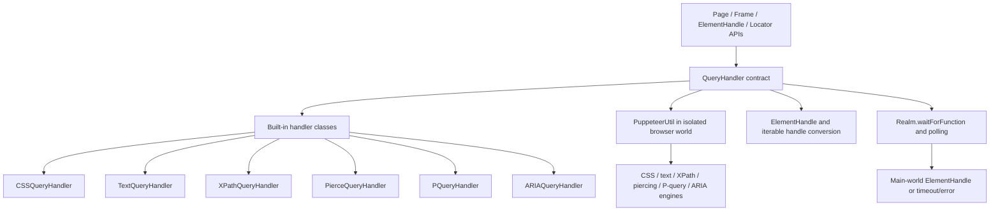
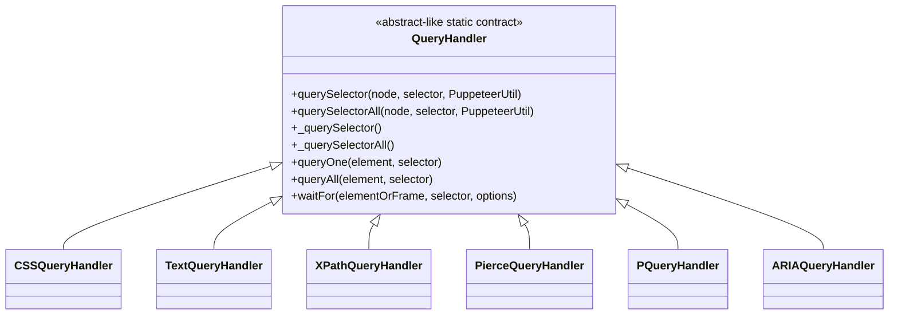
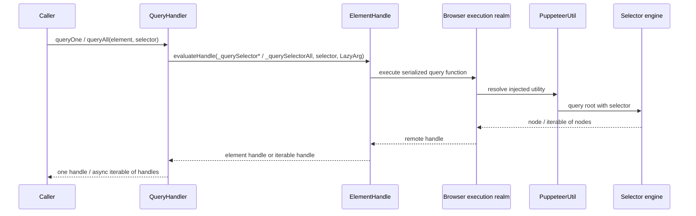
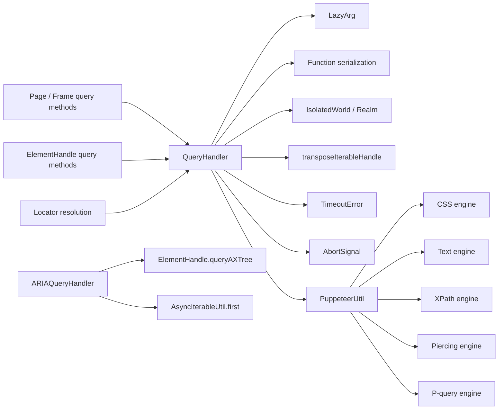
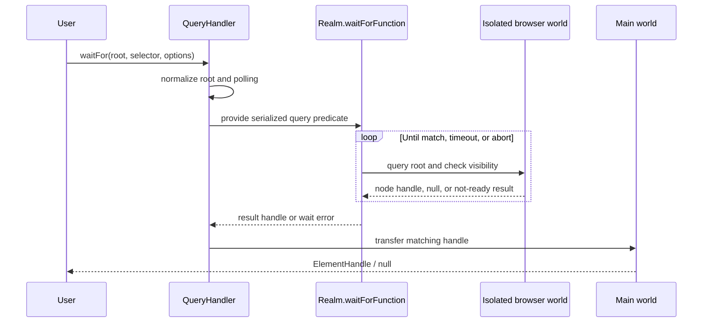

# Selector and waiting engine: query handlers

## Introduction

The `selector_and_waiting_engine_query_handlers` module is Puppeteer’s selector-adaptation layer. It gives the browser-side query engines a common contract, exposes one-node and many-node operations, and supplies the selector-specific implementations used by page, frame, element-handle, and locator APIs.

The module is intentionally protocol-neutral at its boundary. A handler receives a DOM `Node`, a selector string, and the injected `PuppeteerUtil` object; it returns either one node or an iterable of nodes. `QueryHandler` then turns those nodes into Puppeteer handles and coordinates selector waiting. The public entry points that consume this machinery are described in [page and frame API](page_and_frame_api.md) and [handles, realms, and locators API](handles_realms_and_locators_api.md).

## Position in the system



The module is a child of the broader [shared automation runtime and query infrastructure](shared_automation_runtime_and_query_infrastructure.md). Waiting mechanics, custom-handler registration, and the injected P-query engine are separate concerns and are documented by their corresponding module documents when available:

- [selector and waiting engine waiting](selector_and_waiting_engine_waiting.md)
- [selector and waiting engine custom handlers](selector_and_waiting_engine_custom_handlers.md)
- [selector and waiting engine injected selector engine](selector_and_waiting_engine_injected_selector_engine.md)

## Architecture

### The common query contract

`QueryHandler` defines two optional static operations:

| Contract | Input | Output | Primary use |
| --- | --- | --- | --- |
| `querySelector` | root node, selector, `PuppeteerUtil` | `Node \| null` or a promise | First matching node |
| `querySelectorAll` | root node, selector, `PuppeteerUtil` | `AwaitableIterable<Node>` | All matching nodes |

A concrete handler must implement at least one operation. The complementary private accessor is synthesized lazily when absent:

* `_querySelector` returns the first value yielded by `querySelectorAll`, or `null` for an empty result.
* `_querySelectorAll` invokes `querySelector` once and yields the node only when it is non-null.

The synthesized functions are serialized with `stringifyFunction` and reconstructed with `interpolateFunction`. This matters because the function is passed into the browser execution context; it cannot rely on the original Node.js class closure.



### Built-in handlers

| Handler | Selector semantics | Implementation detail |
| --- | --- | --- |
| `CSSQueryHandler` | Standard CSS selectors | Delegates both operations to `PuppeteerUtil.cssQuerySelector` and `cssQuerySelectorAll`. |
| `TextQueryHandler` | Text-based matching | Implements all-node lookup through `PuppeteerUtil.textQuerySelectorAll`; the base class derives first-node lookup. |
| `XPathQueryHandler` | XPath expressions | Uses `xpathQuerySelectorAll`; first-node lookup asks the engine for a single result and returns the first yielded node. |
| `PierceQueryHandler` | Queries that cross shadow-root boundaries | Delegates to `pierceQuerySelector` and `pierceQuerySelectorAll`. |
| `PQueryHandler` | Puppeteer’s extended query syntax | Delegates to `pQuerySelector` and `pQuerySelectorAll`, including composed selector behavior handled by the injected P-query engine. |
| `ARIAQueryHandler` | Accessible name with optional `name` and `role` filters | Uses the accessibility tree for `queryAll`/`queryOne`; single-node lookup in the browser context uses `ariaQuerySelector`. |

The handler classes contain very little DOM logic themselves. Keeping the engines in `PuppeteerUtil` lets the same browser-injected implementation be used from serialized functions and keeps Node.js orchestration separate from page execution.

## Query operations

### `queryOne`

`QueryHandler.queryOne(element, selector)` evaluates `_querySelector` against the supplied element. It obtains `PuppeteerUtil` lazily from the execution context, preserving the correct injected utility instance. The result is returned as an `ElementHandle` only if the remote result is an element handle; otherwise the method returns `null`. A successful handle is moved out of the temporary `using` scope so ownership transfers to the caller.

### `queryAll`

`QueryHandler.queryAll(element, selector)` evaluates `_querySelectorAll`, then converts the returned iterable handle into an async iterable of `ElementHandle<Node>` through `transposeIterableHandle`. This supports synchronous iterables, generators, and awaitable iterables without forcing every selector engine to materialize an array.



### `ARIAQueryHandler` specialization

ARIA lookup is different from ordinary DOM selector lookup. Its `queryAll` parses the selector and calls `element.queryAXTree(name, role)`, allowing accessible names and roles to be matched in the accessibility tree. Supported syntax is:

```text
title[role="heading"]
[role="image"]
label
[name=""][role="button"]
```

Only `name` and `role` attributes are accepted. Selectors longer than 10,000 characters are rejected, and unknown attributes cause an assertion failure. `queryOne` uses `AsyncIterableUtil.first` over the accessibility-tree result.

## Waiting for a selector

`QueryHandler.waitFor(elementOrFrame, selector, options)` is the bridge between selector lookup and the generic realm waiting engine. It accepts either an `ElementHandle<Node>` root or a `Frame` whose document is the root.

The operation follows this lifecycle:

```mermaid
flowchart TD
    Start[waitFor(root, selector, options)] --> Root{ElementHandle or Frame?}
    Root -->|ElementHandle| Adopt[Adopt into frame isolated realm]
    Root -->|Frame| Document[Use document as root]
    Adopt --> Configure[Read visible / hidden / timeout / signal / polling]
    Document --> Configure
    Configure --> Visibility{visible or hidden requested?}
    Visibility -->|yes| RAF[Force RAF polling]
    Visibility -->|no| Poll[Use requested/default polling]
    RAF --> Evaluate[Repeatedly run _querySelector]
    Poll --> Evaluate
    Evaluate --> Check[checkVisibility(node, requested state)]
    Check -->|not ready| Repeat[Poll again]
    Repeat --> Evaluate
    Check -->|ready| Transfer[Transfer handle to main realm]
    Check -->|timeout / abort| Error[Wrap or rethrow error]
    Transfer --> Done[ElementHandle or null]
```

### Root and realm handling

When the input is an element handle, it is adopted into the frame’s isolated realm before polling. The query therefore runs in Puppeteer’s controlled world and can use the injected utilities without exposing implementation details to page scripts. A matching handle is later transferred into the frame’s main realm, which is the world expected by callers.

When the input is a frame, the root is omitted and the browser-side function queries `document`. This makes `waitFor` useful both for frame-level `waitForSelector` and for descendant queries rooted at an element.

### Polling and visibility

The `visible` and `hidden` options force `PollingOptions.RAF`. Otherwise, the caller’s polling option is passed to `Realm.waitForFunction`; the waiting infrastructure can select mutation- or interval-based polling as appropriate. The browser-side predicate first queries and then calls `PuppeteerUtil.checkVisibility`:

* no visibility option: a matching node is sufficient;
* `visible: true`: a matching node must be visible;
* `hidden: true`: the node must be absent or hidden.

The `signal` is checked before waiting and again after a successful wait. An abort is propagated as an `AbortError` rather than being converted into a selector timeout.

### Errors and ownership

Timeouts are converted into a new `TimeoutError` with the stable message `Waiting for selector \`<selector>\` failed`; the original error is attached as `cause`. Other error-like failures receive the same contextual wrapper, while non-error-like thrown values are rethrown unchanged. Temporary handles are managed with explicit disposal scopes, and only the transferred result escapes the method.

## Component interaction and dependencies



The most important dependency boundaries are:

1. Public APIs select or instantiate a handler; this module does not own page/frame lifecycle.
2. `Realm` executes serialized functions and supplies `PuppeteerUtil`; this module does not implement protocol commands.
3. Injected engines perform DOM/accessibility-tree matching; this module adapts their results to Puppeteer handles.
4. The waiting module owns poller implementations. `QueryHandler` supplies the query predicate, root, timeout, and cancellation options.
5. Custom query registration extends the handler registry and injection path; see [selector and waiting engine custom handlers](selector_and_waiting_engine_custom_handlers.md).

## End-to-end process flows

### One-shot query

```mermaid
flowchart LR
    Selector[Selector prefix / handler selection] --> H[Concrete QueryHandler]
    H --> Q[QueryHandler.queryOne or queryAll]
    Q --> Serialize[Serialize query function]
    Serialize --> Browser[Evaluate in isolated realm]
    Browser --> Match[Injected engine matches nodes]
    Match --> Remote[Remote node handle]
    Remote --> Convert[ElementHandle conversion]
    Convert --> Consumer[Caller]
```



### Wait-for-selector process



## Operational guidance

Use the public `$`, `$$`, `waitForSelector`, and locator methods rather than invoking these internal classes directly. Choose the selector form that matches the target semantics: CSS for DOM structure, text or ARIA for user-visible meaning, XPath for XPath expressions, piercing selectors for shadow-root traversal, and P-query syntax for composed Puppeteer selectors.

For dynamic pages, prefer `waitForSelector` or a locator when the element may be replaced during rendering. Configure visibility and timeout explicitly when readiness matters, and use an `AbortSignal` when the surrounding operation has its own cancellation lifecycle. A selector timeout usually means either that the selected handler cannot match the target’s tree (DOM versus accessibility tree) or that the requested visibility state never became true.

## Related documentation

- [Page and frame API](page_and_frame_api.md) — public query and waiting entry points.
- [Handles, realms, and locators API](handles_realms_and_locators_api.md) — handle ownership, realm evaluation, and retryable locator behavior.
- [Selector and waiting engine](selector_and_waiting_engine.md) — parent module overview.
- [Selector and waiting engine waiting](selector_and_waiting_engine_waiting.md) — `WaitTask` and poller implementations.
- [Selector and waiting engine custom handlers](selector_and_waiting_engine_custom_handlers.md) — registration, injection, and lifecycle of custom selectors.
- [Selector and waiting engine injected selector engine](selector_and_waiting_engine_injected_selector_engine.md) — P-query traversal and injected selector behavior.
