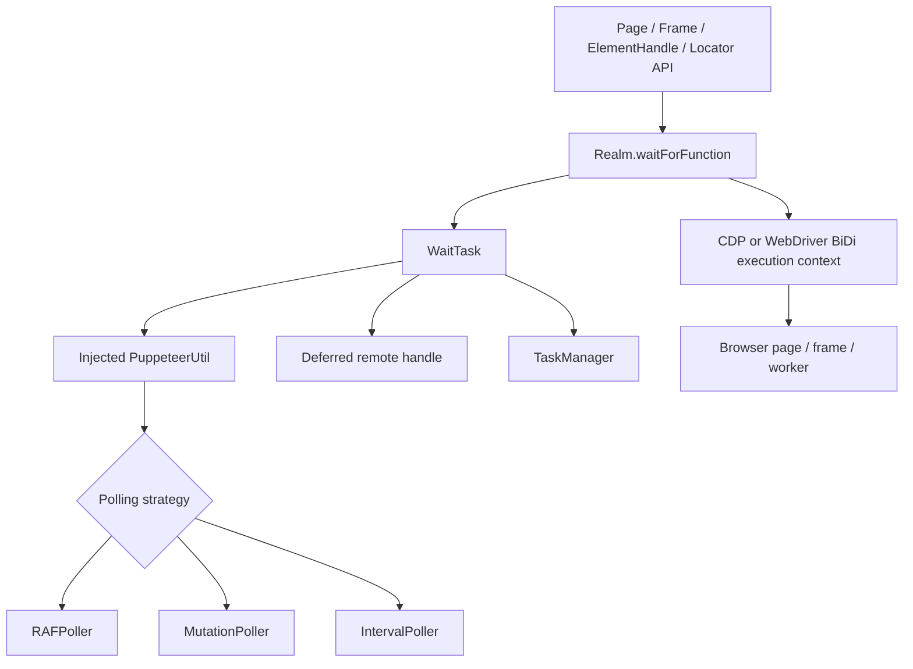
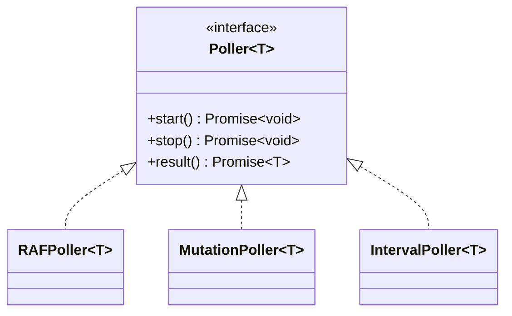
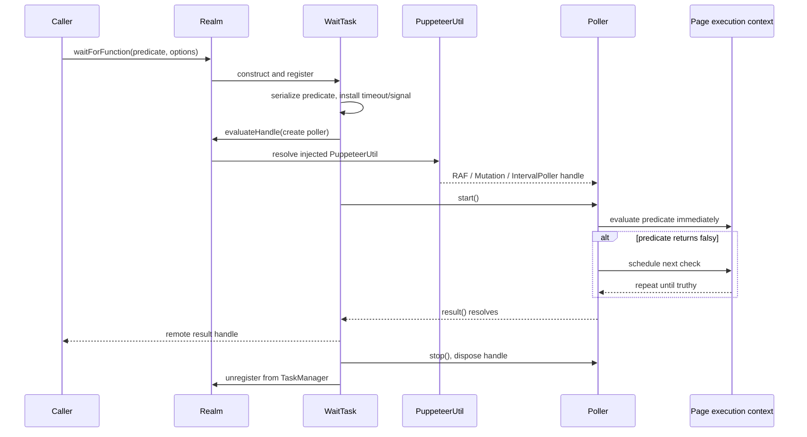
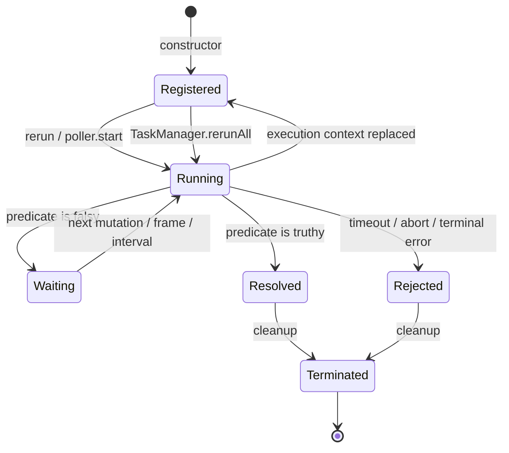
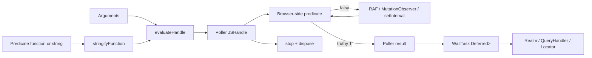
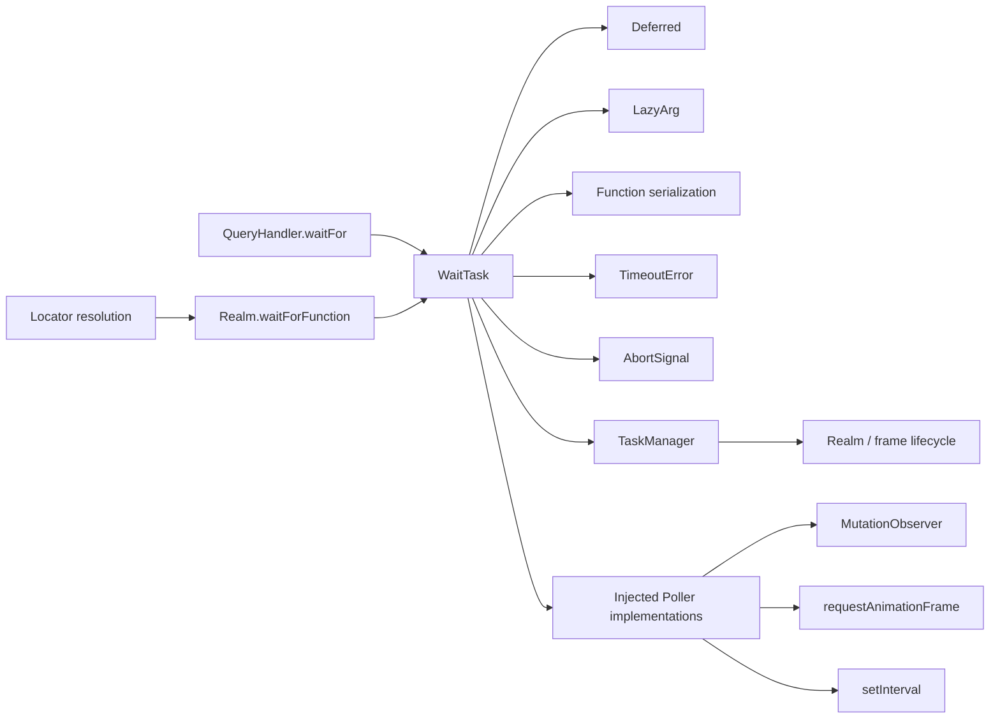

# Selector and waiting engine: waiting

## Introduction

The `selector_and_waiting_engine_waiting` module implements Puppeteer’s internal, retryable waiting primitive. It coordinates a predicate running in a browser `Realm` with an injected poller, a timeout, cancellation, execution-context replacement, and deterministic cleanup.

`WaitTask` is the Node.js-side orchestrator. `IntervalPoller`, `MutationPoller`, and `RAFPoller` are browser-side implementations of the polling contract. Together they power selector waits and function waits exposed through `Page`, `Frame`, `ElementHandle`, `Realm`, and locator APIs. Selector parsing and node lookup are intentionally delegated to the sibling [selector and waiting engine query handlers](selector_and_waiting_engine_query_handlers.md); public entry points are described in [page and frame API](page_and_frame_api.md) and [handles, realms, and locators API](handles_realms_and_locators_api.md).

## Position in the system

This module sits between protocol-neutral realm abstractions and page-facing waiting APIs. It does not know how CDP or WebDriver BiDi evaluates JavaScript; it asks the supplied `Realm` to create and evaluate handles. The concrete execution and protocol implementations are documented in [execution contexts and handles](execution_contexts_and_handles.md) and [webdriver bidi adapters](webdriver_bidi_api_adapters.md).

## Architecture

### `WaitTask`

`WaitTask<T>` owns one asynchronous wait. Its constructor receives:

| Input | Role |
| --- | --- |
| `Realm` | Execution world in which the predicate and poller run. |
| `polling` | `'raf'`, `'mutation'`, or a numeric interval in milliseconds. |
| `root` | Optional DOM node used by mutation polling; otherwise the document is used. |
| `timeout` | Maximum wait duration; zero disables the timer. |
| `signal` | Optional `AbortSignal` used to terminate the task. |
| predicate and arguments | Function or expression to serialize and execute repeatedly. |

The constructor serializes a function with `stringifyFunction`, wraps a string expression as an arrow function, registers the task with the realm’s `TaskManager`, installs the timeout and abort listener, and starts `rerun()` asynchronously.

The `result` getter exposes the task’s `Deferred<HandleFor<T>>` as a promise. It resolves with a remote handle, not necessarily a JSON value, so callers can transfer or convert DOM results after the wait completes.

### `TaskManager`

`TaskManager` tracks active waits for a realm. It supports three lifecycle operations:

* `add` registers a new task.
* `delete` removes a completed or terminated task.
* `terminateAll` rejects and cleans up every task, typically when a realm or frame is disposed.
* `rerunAll` restarts all active tasks after a navigation creates a replacement execution context.

The manager is the key reason waits can survive navigation without leaking tasks into the old context. Realm lifecycle and timeout ownership are covered in [handles, realms, and locators: realms and JS handles](handles_realms_and_locators_api_realms_and_js_handles.md).

### `Poller<T>` contract

The browser-side pollers implement the same internal interface:

Each poller executes the predicate immediately once. If the result is falsy, it waits according to its strategy and evaluates again. A truthy result resolves its deferred value and stops future polling. `result()` asserts that `start()` has already been called and then returns the deferred promise.

## Polling strategies

| Strategy | Trigger after an unsuccessful first check | Typical use |
| --- | --- | --- |
| `raf` | `window.requestAnimationFrame` | Visibility and layout-sensitive waits; tracks rendered frames. |
| `mutation` | `MutationObserver` on the root, including subtree and attribute changes | DOM presence/state changes. |
| number | `setInterval` using the supplied milliseconds | Arbitrary predicates and explicit polling cadence. |

`MutationPoller` observes `childList`, `subtree`, and `attributes`. It accepts a caller-provided root, allowing a selector wait to react only to changes below an element. `RAFPoller` schedules another animation-frame callback only while its deferred is unresolved. `IntervalPoller` owns and clears a Node.js-style interval handle from the injected runtime.

All three pollers use `Deferred<T>` for one-shot completion. Calling `stop()` rejects an unfinished poll with `Polling stopped`; `WaitTask.terminate()` treats this as cleanup and prevents it from replacing the task’s meaningful result, timeout, or abort error.

## Wait lifecycle

### Start and rerun

`rerun()` first aborts controllers belonging to earlier runs. This prevents an old evaluation from racing the replacement run. It then creates the selected poller in the realm using `evaluateHandle` and a lazy reference to `context.puppeteerUtil`. The predicate and arguments are passed into the browser context rather than executed in Node.js.

After `start()`, `WaitTask` awaits `poller.result()`, resolves its own result deferred with the returned handle, and terminates. A rerun is therefore a replacement of the active browser-side poller, not a second consumer of the same poller.

### Navigation and execution-context replacement

Navigation can destroy the JavaScript execution context while a predicate is pending. `getBadError()` classifies these failures:

* `Execution context was destroyed`, `Cannot find context with specified id`, and BiDi `DiscardedBrowsingContextError` are transient; the task remains registered so the realm can rerun it in the new context.
* A detached-frame error is terminal and becomes `Waiting failed: Frame detached`.
* Other error-like failures become `Waiting failed` with the original error as `cause`.
* Non-error-like thrown values become an `Error` whose cause is the original value.

### Completion, timeout, and cancellation

`terminate(error?)` is idempotent in effect: it unregisters the task, removes the abort listener, clears the timeout, rejects the task result only if it is unfinished, and stops/disposes the poller handle. Low-level cleanup failures are ignored because the task’s outcome has already been determined.

When the timeout expires, the task is terminated with `TimeoutError("Waiting failed: <timeout>ms exceeded")`. An abort signal terminates with `signal.reason`; if no reason is supplied, the signal’s platform-defined reason is used. Callers such as query handlers may add domain-specific context around these errors.

## Data flow and ownership

The poller handle is owned by `WaitTask` and must not escape. The resolved result handle is intentionally transferred to the caller’s ownership boundary. This separation prevents the implementation poller from remaining alive after a successful wait while preserving DOM/object results for callers.

## Component dependencies and integration

The main integration points are:

1. [Selector and waiting engine query handlers](selector_and_waiting_engine_query_handlers.md) supplies selector predicates, roots, visibility checks, and selector-specific timeout context.
2. [Selector and waiting engine injected selector engine](selector_and_waiting_engine_injected_selector_engine.md) supplies browser-side selector behavior used by predicates.
3. [Runtime lifecycle and scheduling](runtime_lifecycle_and_scheduling.md) owns common timeout, task, event, and disposal utilities used around this module.
4. [Protocol transport and session infrastructure](protocol_transport_and_session_infrastructure.md) carries evaluation commands to the selected browser backend.
5. [Page and frame lifecycle](page_and_frame_lifecycle.md) and [BiDi page and frame](bidi_page_and_frame.md) provide the concrete realms whose navigation and detachment events cause task reruns or termination.

## Operational considerations

* Prefer mutation polling for DOM changes and RAF polling when visibility or rendering state matters; numeric polling is appropriate when the predicate depends on external state not represented by DOM mutations.
* A wait predicate should return a falsy value until its condition is satisfied and a truthy value containing the desired result afterward.
* A task that encounters navigation-related context errors is expected to retry. Persistent failures, frame detachment, timeout, or cancellation terminate it.
* Pollers perform an immediate check before scheduling work, so conditions already satisfied do not wait for the first interval, mutation, or animation frame.
* Cleanup is part of the normal success path: resolving a wait does not leave its observer, interval, animation loop, or remote poller handle active.

