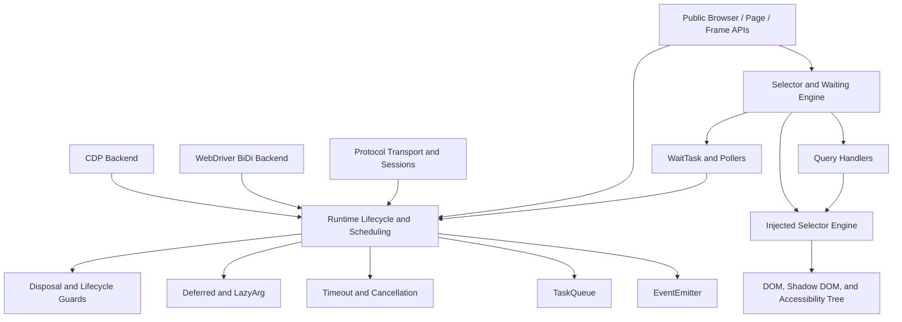
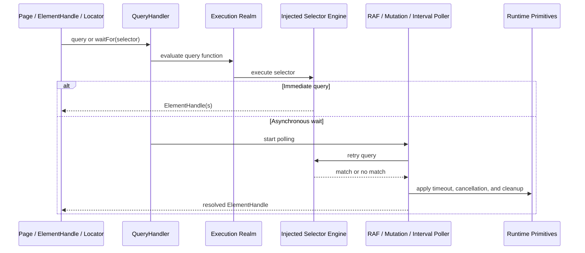

# Shared Automation Runtime and Query Infrastructure

## Purpose

The `shared_automation_runtime_and_query_infrastructure` module provides reusable infrastructure beneath Puppeteer’s public automation APIs and protocol backends.

It combines:

- Selector parsing and execution for CSS, XPath, text, ARIA, piercing, P-query, and custom selectors.
- Asynchronous waiting with visibility checks, polling strategies, timeouts, cancellation, and execution-context recovery.
- Runtime primitives for events, task sequencing, deferred completion, timeout policies, lazy evaluation, lifecycle guards, and deterministic resource disposal.

Together, these components make browser automation operations consistent across CDP and WebDriver BiDi implementations.

## Architecture

The selector subsystem performs queries inside execution realms using injected Puppeteer utilities. The runtime subsystem supplies the scheduling, timeout, event, and cleanup primitives required by selector waits, protocol sessions, and backend lifecycle operations.

## Selector and Waiting Flow

## Core Component Documentation

- [Selector and Waiting Engine](selector_and_waiting_engine.md) — Selector handlers, injected selector engines, custom handlers, wait tasks, polling, visibility checks, and execution-context recovery.
- [Runtime Lifecycle and Scheduling](runtime_lifecycle_and_scheduling.md) — Event delivery, task queues, timeout settings, deferred promises, lazy arguments, lifecycle guards, disposable stacks, and asynchronous collection utilities.

## Source Boundaries

The module is primarily implemented under `packages/puppeteer-core/src`, especially:

- `common/QueryHandler.ts`
- `common/CustomQueryHandler.ts`
- `common/ScriptInjector.ts`
- `common/WaitTask.ts`
- `injected/PQuerySelector.ts`
- `injected/Poller.ts`
- `injected/util.ts`
- Shared runtime utilities such as event, timeout, deferred, scheduling, and disposal helpers.