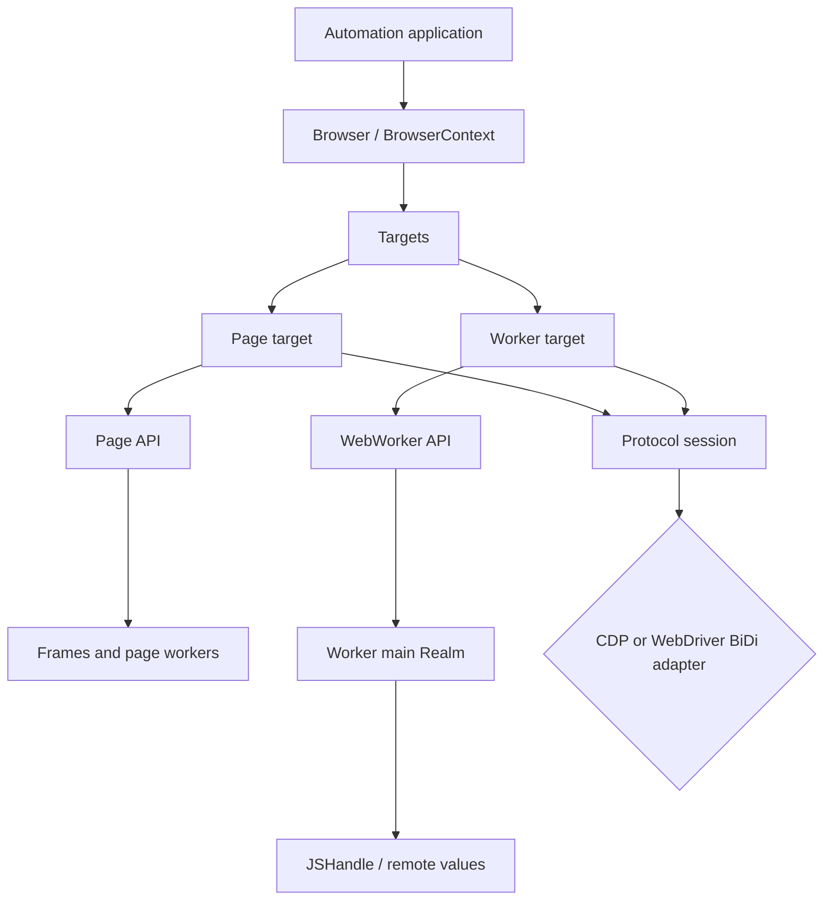
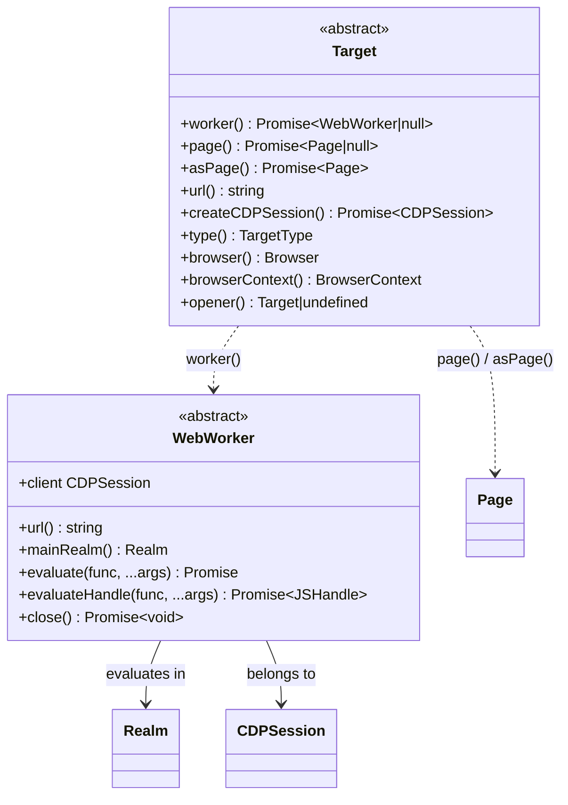
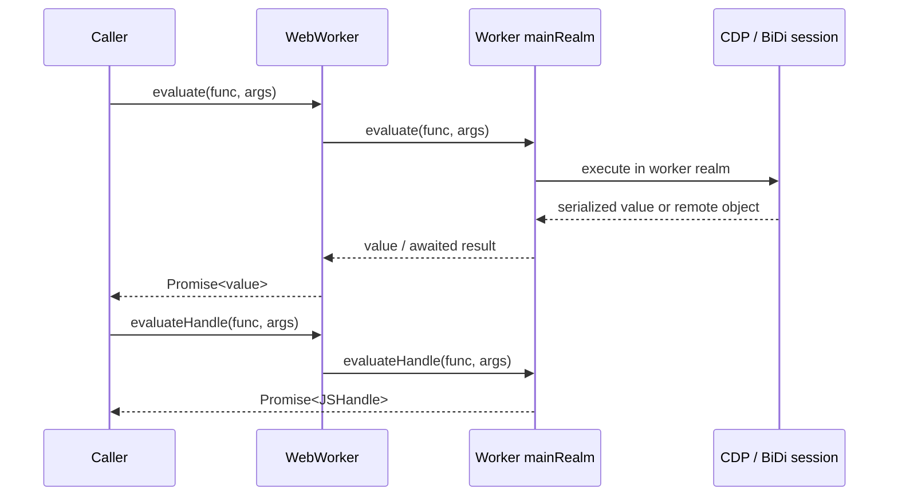
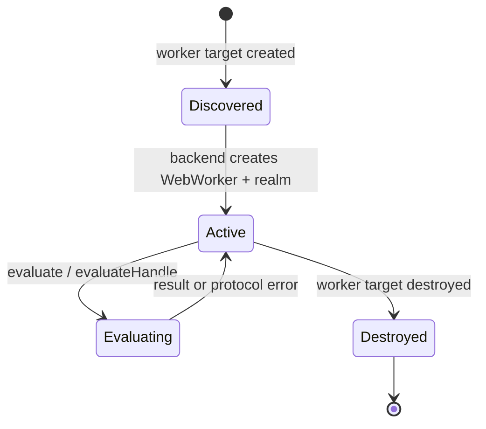
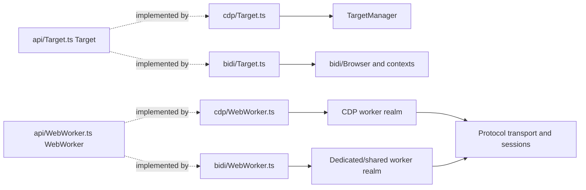

# Targets and workers API

## Introduction

The `targets_and_workers_api` module is Puppeteer’s protocol-neutral API for discovering and addressing browser-debuggable entities and for automating JavaScript Web Workers. A `Target` is the ownership and identity boundary for pages, frames, workers, browser targets, extension pages, and other DevTools targets. A `WebWorker` is the executable surface for service workers and shared workers, providing URL inspection and JavaScript evaluation.

The module is intentionally small at the public layer. Browser- and context-level target discovery is owned by the backend lifecycle implementations; protocol transport and sessions carry commands; realms perform evaluation. See [browser and context API](browser_and_context_api.md), [page and frame API](page_and_frame_api.md), [protocol transport and session infrastructure](protocol_transport_and_session_infrastructure.md), and [handles, realms, and locators API](handles_realms_and_locators_api.md) for those surrounding concerns.

## Position in the system



Targets connect the public object model to backend target managers. The CDP path is implemented by [browser context and target lifecycle](browser_context_and_target_lifecycle.md), including `CdpTarget`, `PageTarget`, and `WorkerTarget`. The BiDi path is implemented by [BiDi targets and workers](bidi_targets_and_workers.md), including the corresponding browser, page, frame, and worker target adapters.

## Architecture

### Public object model



`Target` is abstract and has no protocol-specific state in the supplied public contract. Concrete adapters implement identity, ownership, conversion, and session attachment. The base `page()` and `worker()` methods return `null`; concrete implementations override them when the target type supports the requested view.

`WebWorker` extends the shared event-emitter abstraction and stores its URL at construction time. It owns timeout settings and requires a backend-specific `mainRealm()` and `client`. It does not expose a general worker shutdown operation: `close()` rejects with `UnsupportedOperation`.

### Target types

`TargetType` classifies targets using the following values:

| Type | Typical meaning | `Target.page()` | `Target.worker()` |
| --- | --- | --- | --- |
| `page` | Normal browser tab | Supported | Not supported |
| `webview` | Embedded webview target | Supported | Not supported |
| `background_page` | Extension background page | Supported | Not supported |
| `service_worker` | Service worker execution target | Not supported | Supported |
| `shared_worker` | Shared worker execution target | Not supported | Supported |
| `browser` | Browser-level target | Not supported | Not supported |
| `other` | Backend-specific or unclassified target | Usually no | Usually no |
| `tab` | Internal compatibility target | Backend-dependent | Backend-dependent |

`TAB` is marked internal. Consumers should generally branch on the documented public target types and use `asPage()` only when they deliberately want to treat an arbitrary target as a page.

## `Target` API

### View conversion and identity

| Member | Behavior |
| --- | --- |
| `page()` | Returns a `Page` for `page`, `webview`, or `background_page`; otherwise `null`. |
| `worker()` | Returns a `WebWorker` for `service_worker` or `shared_worker`; otherwise `null`. |
| `asPage()` | Forcefully creates a page view for any target. Prefer `page()` for regular page-like targets. |
| `url()` | Returns the target’s current URL or target URL representation. |
| `type()` | Returns the `TargetType` classification. |
| `browser()` | Returns the owning `Browser`. |
| `browserContext()` | Returns the owning `BrowserContext`. |
| `opener()` | Returns the target that opened this target, or `undefined` for top-level targets. |
| `createCDPSession()` | Attaches a CDP session to the target. Despite the name, backend adapters may provide the corresponding session abstraction where supported. |

The `opener()` relationship is useful for popup and extension flows. It is not a parent-child DOM relationship: frames and nested documents are modeled by `Frame`, while target ownership is modeled by browser/context and target lifecycle components.

### Safe capability checks

```mermaid
flowchart TD
    T[Target] --> Kind{type()}
    Kind -->|page / webview / background_page| P[await target.page()]
    Kind -->|service_worker / shared_worker| W[await target.worker()]
    Kind -->|browser / other| N[No specialized view]
    P --> Page[Page operations]
    W --> Worker[WebWorker operations]
```

Use the nullable conversion methods when the target type is not known in advance. This avoids assuming that every target is a page. Use `asPage()` only for an intentional backend-specific adaptation, such as inspecting an `other` target with page-like APIs.

## `WebWorker` API

### URL and protocol access

`url()` returns the worker URL captured by the implementation. `client` exposes the CDP session client associated with the worker, and `mainRealm()` supplies the execution environment used by both evaluation methods. The worker is therefore a lightweight facade: lifecycle and transport belong to the owning page/backend, while execution belongs to the worker realm.

### Evaluation

`evaluate(func, ...args)` executes a function or string in the worker’s main realm and returns the awaited, deserialized result. Promise-returning functions are awaited. Complex browser objects may not survive protocol serialization; use `evaluateHandle()` when a mutable remote object or non-JSON result is required.

`evaluateHandle(func, ...args)` runs the same kind of function but returns a handle to the remote result. Handle lifecycle and serialization semantics are shared with [handles, realms, and locators API](handles_realms_and_locators_api.md).



Before delegation, both methods annotate the supplied function with Puppeteer source metadata when no source URL is already present. This improves diagnostics without changing the function’s behavior or arguments.

### Worker lifecycle and events

Worker lifecycle is observed through the owning `Page`: `workercreated` signals that a worker target became available, and `workerdestroyed` signals that it disappeared. `Page.workers()` returns the currently known workers. Page-level lifecycle and event semantics are documented in [page and frame API](page_and_frame_api.md).



`WebWorker.close()` is deliberately unsupported. To end a worker, use the browser mechanism that owns it (for example, close its page/context or let the worker terminate according to browser JavaScript rules). A worker instance should be treated as invalid after its destruction event; subsequent protocol operations can fail because its session or realm is gone.

## Backend relationships



The public API does not decide how targets are discovered. CDP implementations receive target lifecycle events from `TargetManager`; BiDi implementations map browsing contexts and worker realms from the WebDriver BiDi model. Both backends must preserve the same observable contracts: nullable page/worker conversion, URL and type reporting, browser/context ownership, opener relationships where available, and evaluation through a worker realm.

## Common process flows

### Discover and inspect a worker

```mermaid
flowchart TD
    Start[Page is active] --> Event[workercreated event]
    Event --> List[page.workers()]
    List --> Select[Select worker by url()]
    Select --> Run[worker.evaluate(...)]
    Run --> Result[Serialized result]
    Result --> Continue[Continue page automation]
    Destroy[workerdestroyed event] --> Stop[Drop worker reference]
```

### Inspect an arbitrary target

```mermaid
flowchart TD
    Start[Target obtained from browser/context] --> Type[Read target.type()]
    Type --> PageCheck[await target.page()]
    PageCheck -->|Page|null| PageBranch{Page available?}
    PageBranch -->|Yes| Automate[Use Page API]
    PageBranch -->|No| WorkerCheck[await target.worker()]
    WorkerCheck --> WorkerBranch{Worker available?}
    WorkerBranch -->|Yes| Evaluate[Use WebWorker API]
    WorkerBranch -->|No| Session[Use target session or ignore target]
```

## Dependencies and boundaries

| Dependency | Role in this module | Reference |
| --- | --- | --- |
| `Browser`, `BrowserContext` | Ownership and lifecycle scope | [browser and context API](browser_and_context_api.md) |
| `Page`, `Frame` | Page view and document hierarchy | [page and frame API](page_and_frame_api.md) |
| `Realm`, `JSHandle` | Worker execution and remote values | [handles, realms, and locators API](handles_realms_and_locators_api.md) |
| `CDPSession` / BiDi session | Protocol command transport | [protocol transport and session infrastructure](protocol_transport_and_session_infrastructure.md) |
| `EventEmitter`, `TimeoutSettings` | Worker events and evaluation timeouts | [shared automation runtime and query infrastructure](shared_automation_runtime_and_query_infrastructure.md) |
| CDP target manager | CDP target discovery and concrete adapters | [browser context and target lifecycle](browser_context_and_target_lifecycle.md) |
| BiDi target adapters | WebDriver BiDi target and worker mapping | [BiDi targets and workers](bidi_targets_and_workers.md) |

The module does not own browser startup, browser download/cache management, page navigation, selector resolution, or transport implementation. Keeping those responsibilities in their respective modules lets target and worker objects remain stable across CDP and WebDriver BiDi.

## Operational guidance

* Treat `page()` and `worker()` as capability queries and handle `null` explicitly.
* Prefer `evaluate()` for JSON-compatible values and `evaluateHandle()` for objects that must remain remote or mutable.
* Listen for `workercreated` and `workerdestroyed` when maintaining a worker registry; do not assume a worker remains available for the lifetime of its page.
* Use `browserContext()` and `browser()` to recover ownership and coordinate cleanup.
* Do not call `WebWorker.close()` as a cleanup strategy; it intentionally throws `UnsupportedOperation`.
* Use `createCDPSession()` for protocol-level diagnostics or commands only when the target/backend supports them; ordinary worker code should use the worker evaluation API.

