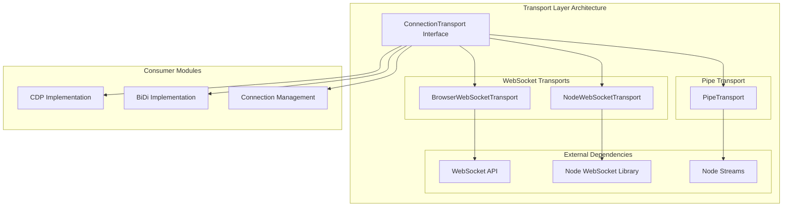
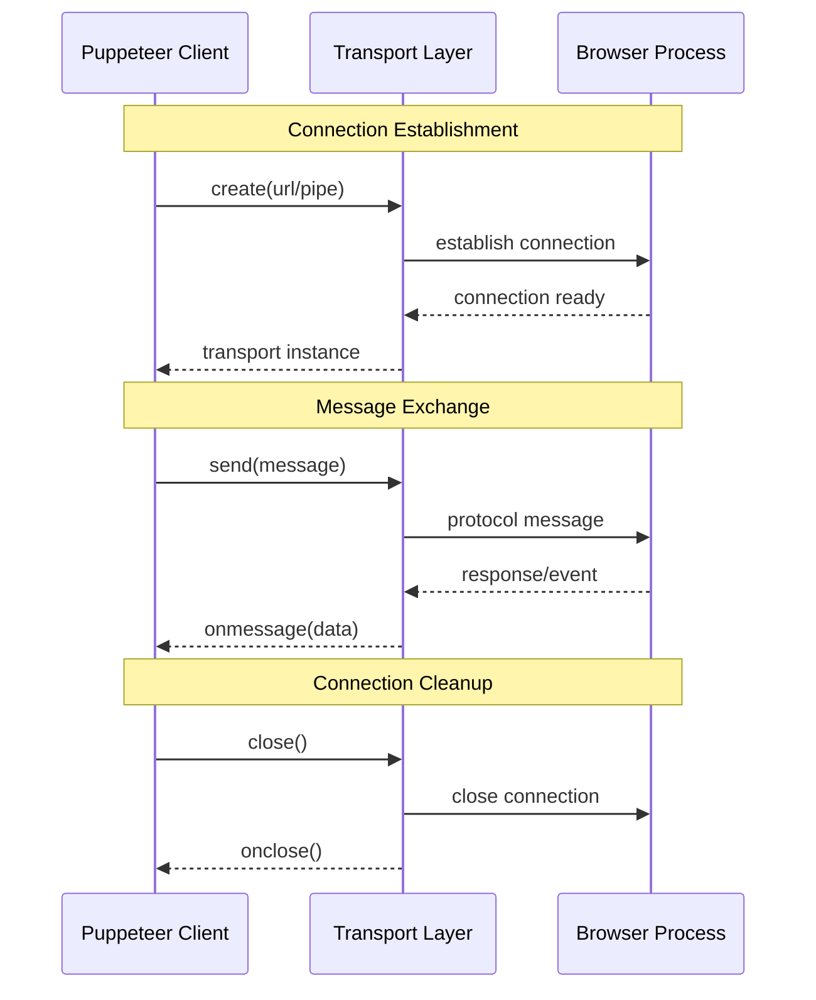
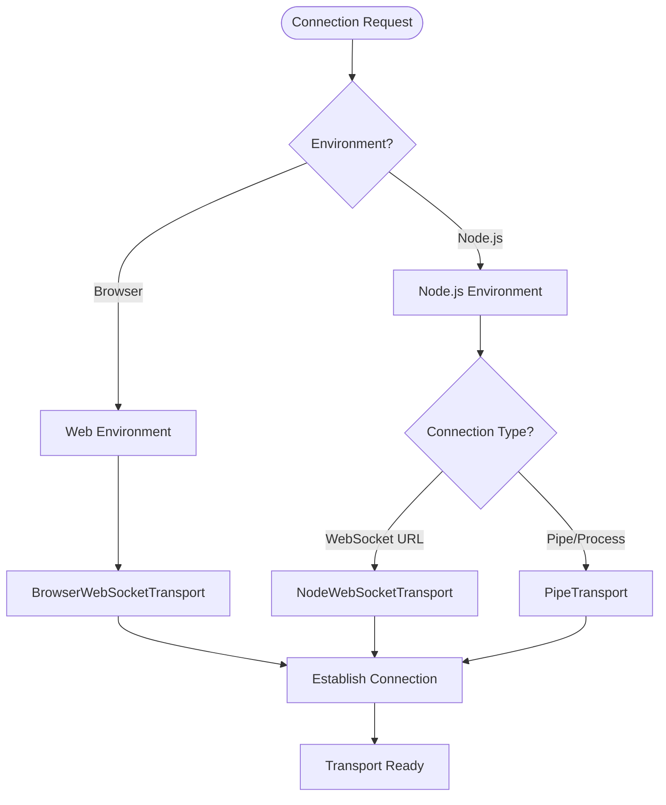

# Transport Layer Module

## Overview

The Transport Layer module provides the foundational communication infrastructure for Puppeteer's browser automation capabilities. It implements multiple transport mechanisms to establish and maintain connections between the Puppeteer client and browser instances, supporting both WebSocket-based and pipe-based communication protocols.

## Purpose

This module serves as the critical communication bridge that enables:
- **Protocol Communication**: Facilitating Chrome DevTools Protocol (CDP) and WebDriver BiDi message exchange
- **Cross-Platform Support**: Providing transport implementations for both browser and Node.js environments
- **Connection Management**: Handling connection lifecycle, message routing, and error recovery
- **Performance Optimization**: Implementing efficient message serialization and transport mechanisms

## Architecture Overview

The transport layer follows a strategy pattern design, implementing a common `ConnectionTransport` interface with specialized implementations for different environments and protocols.



## Core Components

### ConnectionTransport Interface
The foundational interface that defines the contract for all transport implementations:
- **Message Handling**: Standardized send/receive operations
- **Connection Lifecycle**: Open, close, and error handling
- **Event-Driven Architecture**: Callback-based message and connection events

### Transport Implementations

#### BrowserWebSocketTransport
- **Environment**: Browser/Web contexts
- **Protocol**: WebSocket API
- **Use Case**: In-browser automation scenarios
- **Features**: Native WebSocket integration, automatic error handling

#### NodeWebSocketTransport  
- **Environment**: Node.js runtime
- **Protocol**: WebSocket with enhanced configuration
- **Use Case**: Server-side browser automation
- **Features**: Custom headers, payload limits, compression settings, User-Agent identification

#### PipeTransport
- **Environment**: Node.js with local browser processes
- **Protocol**: Named pipes/stdin-stdout communication
- **Use Case**: Direct browser process communication
- **Features**: Buffer management, message framing, stream-based communication

## Data Flow Architecture



## Integration with Other Modules

The transport layer serves as a foundational component for several other modules:

### CDP Implementation
- **Relationship**: [CDP Implementation](cdp_implementation.md) uses transport layer for Chrome DevTools Protocol communication
- **Components**: Connection, CdpCDPSession rely on transport implementations
- **Data Flow**: CDP commands and events flow through transport layer

### BiDi Implementation  
- **Relationship**: [BiDi Implementation](bidi_implementation.md) leverages transport for WebDriver BiDi protocol
- **Components**: BidiConnection uses transport layer for BiDi message exchange
- **Protocol Support**: WebSocket-based BiDi communication

### Common Utilities
- **Relationship**: [Common Utilities](common_utilities.md) provides the ConnectionTransport interface
- **Shared Infrastructure**: EventEmitter, Configuration, and TimeoutSettings integration
- **Cross-Module Dependencies**: Transport layer implements common utility interfaces

## Transport Selection Strategy



## Key Features

### Message Framing and Protocol Support
- **WebSocket Transports**: JSON message serialization with automatic framing
- **Pipe Transport**: Null-terminated message framing for stream-based communication
- **Error Handling**: Graceful error recovery and connection state management

### Performance Optimizations
- **Buffer Management**: Efficient message buffering and dispatch in PipeTransport
- **Payload Limits**: Configurable message size limits (256MB default for NodeWebSocketTransport)
- **Compression**: Optional message compression support in WebSocket transports

### Cross-Platform Compatibility
- **Browser Support**: Native WebSocket API integration for web environments
- **Node.js Support**: Enhanced WebSocket library with additional configuration options
- **Process Communication**: Direct pipe-based communication for local browser processes

## Error Handling and Resilience

The transport layer implements robust error handling mechanisms:
- **Silent Error Handling**: Non-critical errors are silently ignored to prevent disruption
- **Connection State Management**: Proper cleanup and state tracking
- **Event-Driven Recovery**: Callback-based error notification for upper layers

## Usage Patterns

### WebSocket Transport Creation
```typescript
// Browser environment
const transport = await BrowserWebSocketTransport.create(wsUrl);

// Node.js environment with custom headers
const transport = await NodeWebSocketTransport.create(wsUrl, {
  'Custom-Header': 'value'
});
```

### Pipe Transport Setup
```typescript
// Direct process communication
const transport = new PipeTransport(writeStream, readStream);
```

## Future Considerations

The transport layer is designed to be extensible for future protocol and transport needs:
- **Protocol Evolution**: Support for emerging browser automation protocols
- **Transport Mechanisms**: Additional transport types (HTTP/2, gRPC, etc.)
- **Performance Enhancements**: Advanced compression and serialization optimizations
- **Security Features**: Enhanced authentication and encryption support

---

*This documentation provides a comprehensive overview of the transport layer module. For detailed implementation specifics of related modules, refer to their respective documentation files.*