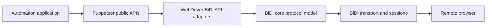
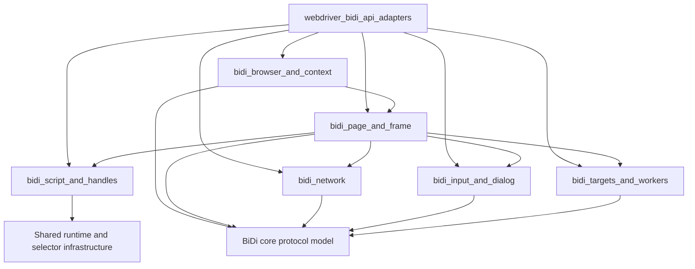
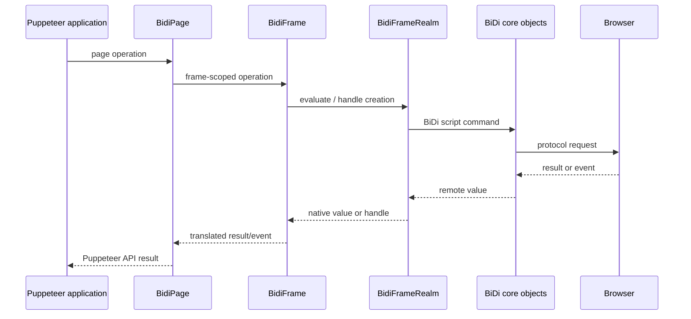

# WebDriver BiDi API Adapters

## Purpose

The `webdriver_bidi_api_adapters` module translates WebDriver BiDi protocol objects and events into Puppeteer’s protocol-neutral automation APIs. It provides the BiDi-backed implementations for browser contexts, pages, frames, realms, handles, network requests, input devices, dialogs, targets, and workers.

The adapters sit between Puppeteer’s public API and the BiDi core protocol model:

They preserve Puppeteer object identity, lifecycle events, error behavior, and common abstractions while delegating protocol commands and state management to the BiDi core and transport layers.

## Architecture

### Adapter responsibilities

| Area | Main adapters | Responsibility |
| --- | --- | --- |
| Browser and contexts | `BidiBrowser`, `BidiBrowserContext` | Session ownership, user contexts, pages, cookies, permissions, and target aggregation |
| Pages and frames | `BidiPage`, `BidiFrame` | Navigation, lifecycle events, page operations, frames, workers, screenshots, PDFs, and CDP compatibility |
| Scripts and handles | `BidiRealm`, `BidiFrameRealm`, `BidiWorkerRealm`, `BidiJSHandle`, `BidiElementHandle` | Value serialization, evaluation, realms, remote object identity, and element operations |
| Network | `BidiHTTPRequest`, `BidiHTTPResponse` | Request/response events, interception, authentication, bodies, headers, timing, and redirects |
| Input and dialogs | `BidiKeyboard`, `BidiMouse`, `BidiTouchscreen`, `BidiDialog` | BiDi action sources, touch state, keyboard/mouse input, and user-prompt handling |
| Targets and workers | `BidiBrowserTarget`, `BidiPageTarget`, `BidiFrameTarget`, `BidiWorkerTarget`, `BidiWebWorker` | Puppeteer target classification, ownership, page façades, and worker evaluation |

### Page execution and event flow

Lifecycle ownership flows downward from browser and contexts to pages, frames, and workers. Protocol events flow upward and are translated into Puppeteer events such as frame navigation, requests, responses, target creation, worker creation, dialogs, and page closure.

## Core component documentation

Detailed documentation for each adapter component:

- [BiDi Browser and Context](/home/anhnh/CodeWiki-journal/results/generation/puppeteer/bidi_browser_and_context.md)
- [BiDi Page and Frame](/home/anhnh/CodeWiki-journal/results/generation/puppeteer/bidi_page_and_frame.md)
- [BiDi Script and Handles](/home/anhnh/CodeWiki-journal/results/generation/puppeteer/bidi_script_and_handles.md)
- [BiDi Network](/home/anhnh/CodeWiki-journal/results/generation/puppeteer/bidi_network.md)
- [BiDi Input and Dialog](/home/anhnh/CodeWiki-journal/results/generation/puppeteer/bidi_input_and_dialog.md)
- [BiDi Targets and Workers](/home/anhnh/CodeWiki-journal/results/generation/puppeteer/bidi_targets_and_workers.md)

Related contracts and infrastructure:

- [Protocol-neutral public automation API](/home/anhnh/CodeWiki-journal/results/generation/puppeteer/protocol_neutral_public_automation_api.md)
- [Protocol transport and sessions](/home/anhnh/CodeWiki-journal/results/generation/puppeteer/protocol_transport_and_sessions.md)
- [BiDi transport and CDP bridge](/home/anhnh/CodeWiki-journal/results/generation/puppeteer/bidi_transport_and_cdp_bridge.md)
- WebDriver BiDi core protocol implementation: `packages/puppeteer-core/src/bidi/core`
- Adapter entry point: `packages/puppeteer-core/src/bidi/bidi.ts`