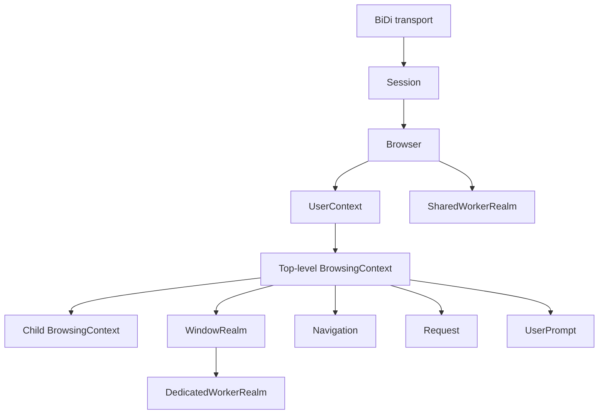
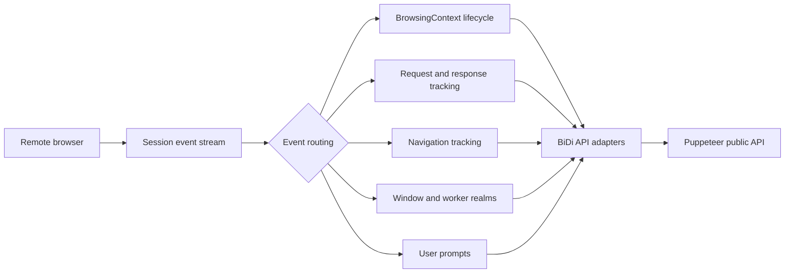

# WebDriver BiDi Core Protocol Model

## Purpose

`webdriver_bidi_core_protocol_model` is Puppeteer’s internal, object-oriented model of WebDriver BiDi protocol resources. It sits above the BiDi transport layer and converts flat protocol commands and session-wide events into lifecycle-aware objects.

The module provides:

- Session and browser ownership
- User-context and browsing-context hierarchies
- Navigation and network request tracking
- Window, dedicated-worker, and shared-worker realms
- User-prompt lifecycle and handling
- Event filtering, command scoping, and disposal propagation

It follows WebDriver BiDi semantics while remaining independent of Puppeteer’s public API requirements. Public BiDi adapters wrap these core objects for application-facing APIs.

## Repository structure

```text
packages/puppeteer-core/src/bidi/core/
├── Browser.ts
├── BrowsingContext.ts
├── Connection.ts
├── Navigation.ts
├── Realm.ts
├── Request.ts
├── Session.ts
├── UserContext.ts
├── UserPrompt.ts
├── core.ts
└── README.md
```

## Architecture

The primary ownership hierarchy is:



Protocol events enter through `Session` and are routed to the appropriate context, request, navigation, realm, or prompt object:



All core objects use shared event-emitter and disposal infrastructure. Commands are scoped through the owning session and reject calls after the associated object has been disposed.

## Core components

| Component | Responsibility |
|---|---|
| `Session` | Creates, owns, and ends a BiDi session; forwards commands and exposes events. |
| `Browser` | Synchronizes user contexts and browsing contexts; manages browser-wide scripts and shared workers. |
| `UserContext` | Models an isolated browser profile, including storage, permissions, and top-level contexts. |
| `BrowsingContext` | Models tabs, windows, and frames; routes navigation, network, input, lifecycle, realm, and prompt events. |
| `Navigation` | Correlates navigation-start, request, redirect, completion, and failure events. |
| `Request` | Tracks request metadata, redirects, authentication, interception, responses, and response bodies. |
| `Realm` | Provides script evaluation and handle-management operations for windows and workers. |
| `UserPrompt` | Models an opened alert, confirm, or prompt and handles its closure or resolution. |

## Component documentation

- [BiDi core session and context model](/home/anhnh/CodeWiki-journal/results/generation/puppeteer/bidi_core_session_and_context_model.md)
- [BiDi core navigation, network, and realms](/home/anhnh/CodeWiki-journal/results/generation/puppeteer/bidi_core_navigation_network_and_realms.md)
- [BiDi core user prompts](/home/anhnh/CodeWiki-journal/results/generation/puppeteer/bidi_core_user_prompts.md)

Related integration documentation:

- [Protocol transport and session infrastructure](protocol_transport_and_session_infrastructure.md)
- [BiDi transport and CDP bridge](bidi_transport_and_cdp_bridge.md)
- [WebDriver BiDi API adapters](webdriver_bidi_api_adapters.md)