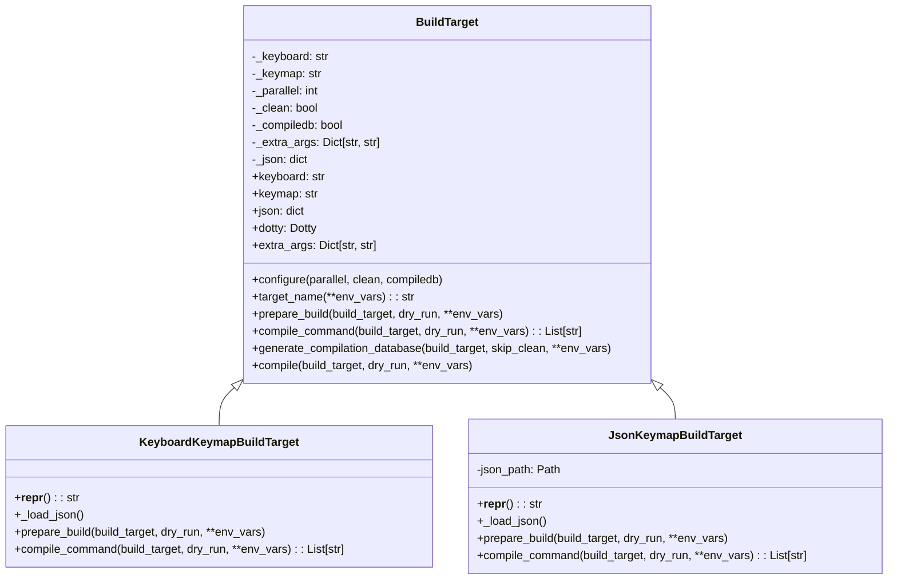
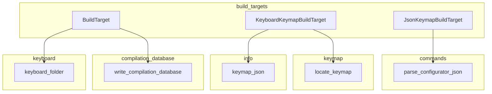
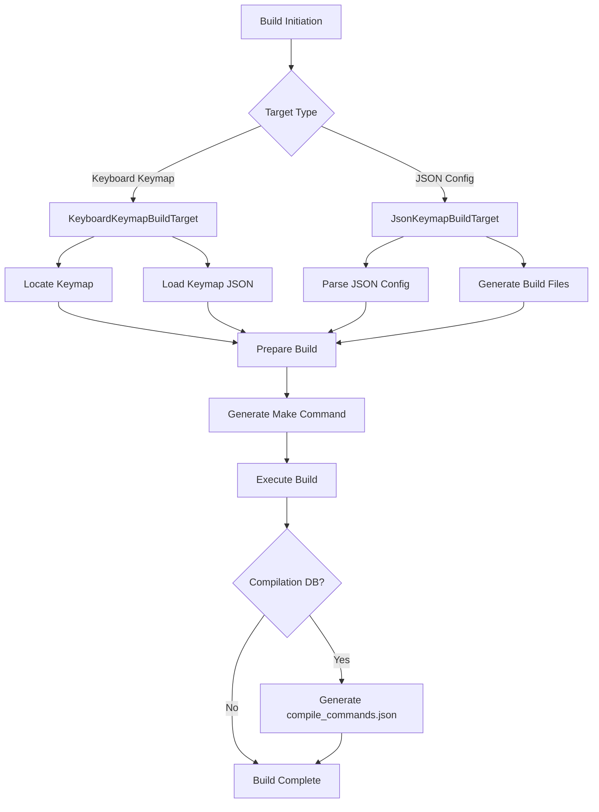
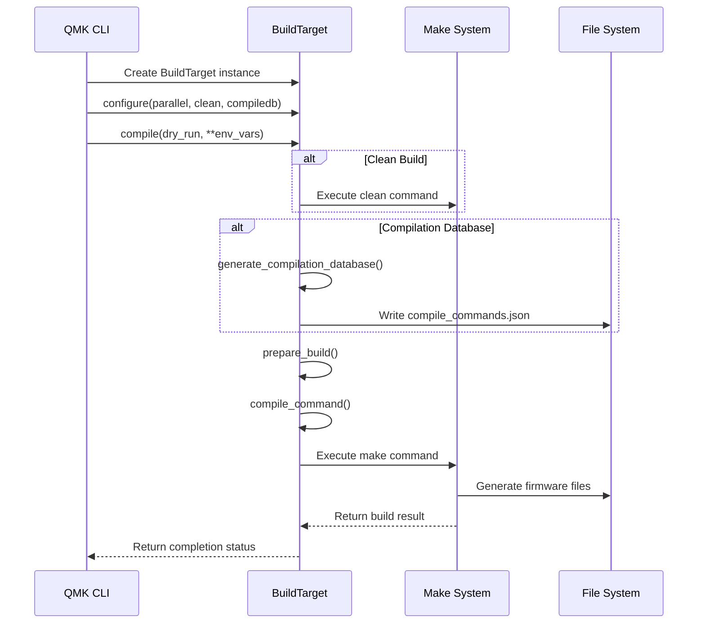

# Build Targets Module Documentation

## Introduction

The `build_targets` module is a core component of the QMK (Quantum Mechanical Keyboard) build system, providing a structured approach to managing keyboard firmware compilation targets. This module abstracts the complexity of building firmware for different keyboard configurations, handling both traditional keymap-based builds and JSON configuration-based builds.

The module serves as the primary interface between QMK's command-line tools and the underlying build system, managing build preparation, compilation commands, and target configuration for the diverse ecosystem of QMK-supported keyboards.

## Architecture Overview

The build_targets module implements a class hierarchy centered around the `BuildTarget` base class, with specialized implementations for different build scenarios:



## Component Relationships

The build_targets module interacts with several other QMK modules to provide comprehensive build functionality:



## Core Components

### BuildTarget (Base Class)

The `BuildTarget` class serves as the foundation for all build target types, providing common functionality and defining the interface that specialized implementations must follow.

**Key Responsibilities:**
- Target identification and naming
- Build configuration management
- Compilation command generation
- Build preparation and execution
- Compilation database generation

**Core Properties:**
- `keyboard`: The resolved keyboard identifier
- `keymap`: The keymap name
- `json`: Configuration data as a dictionary
- `dotty`: Dotty dictionary wrapper for nested access
- `extra_args`: Additional build arguments

**Key Methods:**
- `configure()`: Sets build options (parallel jobs, clean, compilation database)
- `target_name()`: Generates the target filename with modifiers
- `compile()`: Executes the build process
- `generate_compilation_database()`: Creates compilation database for IDE integration

### KeyboardKeymapBuildTarget

Specialized implementation for building keyboards using traditional keymap directories containing `keymap.c` or `keymap.json` files.

**Key Features:**
- Loads keymap configuration from existing keymap directories
- Supports both QMK firmware and userspace keymap locations
- Handles keyboard aliases and layout resolution
- Integrates with QMK's keymap discovery system

**Build Process:**
1. Locates the keymap using QMK's keymap resolution system
2. Loads keymap JSON configuration if available
3. Configures make arguments for the build system
4. Handles userspace keymap path overrides when necessary

### JsonKeymapBuildTarget

Implementation for building from JSON configuration files, typically exported from QMK Configurator or created manually.

**Key Features:**
- Parses QMK Configurator JSON exports
- Generates intermediate build files
- Manages temporary build directories
- Supports stdin input for JSON data

**Build Process:**
1. Parses and validates JSON configuration
2. Creates intermediate output directory structure
3. Generates `keymap.json` in the build directory
4. Configures make arguments to use generated files

## Data Flow Architecture



## Build Process Flow

The build process follows a systematic approach to ensure consistent and reliable firmware compilation:



## Integration with QMK Ecosystem

The build_targets module integrates deeply with QMK's broader ecosystem:

### Keyboard Resolution
- Uses [keyboard](keyboard.md) module's `keyboard_folder()` function to resolve keyboard aliases and determine actual keyboard paths
- Handles keyboard inheritance and DEFAULT_FOLDER resolution

### Keymap Discovery
- Leverages [keymap](keymap.md) module's `locate_keymap()` function to find keymap files across QMK firmware and userspace directories
- Supports community layouts as fallback options
- Handles both `keymap.c` and `keymap.json` formats

### Configuration Management
- Integrates with [info](info.md) module's `keymap_json()` function to merge keyboard and keymap configurations
- Supports configuration inheritance from multiple sources (info.json, keymap.json, config.h, rules.mk)

### Build System Integration
- Generates appropriate make commands for QMK's build system
- Handles parallel compilation settings
- Manages build output directories and file naming conventions

## Advanced Features

### Target Filename Modifiers
The module supports dynamic target naming based on environment variables:
- `FORCE_LAYOUT`: Specifies an alternative layout
- `CONVERT_TO`: Indicates target microcontroller conversion

### Userspace Support
Full integration with QMK Userspace feature:
- Searches for keymaps in userspace directories
- Handles path overrides for userspace keymaps
- Copies compilation database to userspace when available

### Parallel Build Management
Configurable parallel compilation:
- Automatic detection of optimal parallel job count
- Integration with make's parallel build capabilities
- Configurable through CLI options

### Compilation Database Generation
IDE integration support through compilation databases:
- Generates `compile_commands.json` for language servers
- Supports both QMK firmware and userspace locations
- Optional generation during build process

## Error Handling and Validation

The module implements comprehensive error handling:
- Keyboard validation through `qmk.path.is_keyboard()`
- Keymap existence verification
- JSON schema validation for configurator exports
- Graceful handling of missing files and directories

## Performance Considerations

- **Lazy Loading**: JSON configuration loaded only when accessed
- **Caching**: Target names and build arguments cached to avoid recomputation
- **Incremental Builds**: File modification detection to avoid unnecessary rebuilds
- **Parallel Processing**: Support for parallel compilation where possible

## Usage Examples

### Basic Keyboard Build
```python
target = KeyboardKeymapBuildTarget("clueboard/california", "default")
target.configure(parallel=4, clean=True)
target.compile()
```

### JSON Configuration Build
```python
target = JsonKeymapBuildTarget("keymap_export.json")
target.configure(compiledb=True)
target.compile()
```

### Advanced Build with Custom Arguments
```python
target = KeyboardKeymapBuildTarget("planck/rev6", "custom")
target.extra_args = {"CONVERT_TO": "promicro", "FORCE_LAYOUT": "ortho_4x12"}
target.compile()
```

## Dependencies

The build_targets module relies on several external and internal dependencies:

### External Dependencies
- `dotty_dict`: For nested dictionary access
- `milc`: For CLI interaction and logging
- `pathlib`: For path manipulation
- `json`: For JSON parsing and serialization

### Internal Dependencies
- [keyboard](keyboard.md): Keyboard resolution and validation
- [keymap](keymap.md): Keymap location and discovery
- [info](info.md): Configuration information retrieval
- [commands](commands.md): Command execution utilities
- [constants](constants.md): QMK path and configuration constants
- [compilation_database](compilation_database.md): Compilation database generation

## Future Considerations

The modular design of the build_targets system allows for future extensions:
- Additional target types for specialized build scenarios
- Enhanced userspace integration
- Support for new configuration formats
- Improved IDE integration capabilities
- Advanced build optimization features